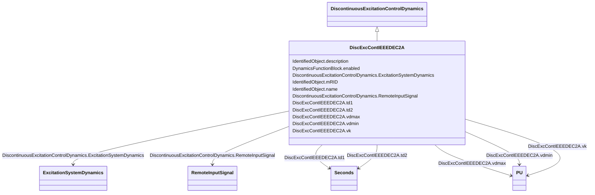

# DiscExcContIEEEDEC2A

_IEEE type DEC2A model for discontinuous excitation control. This system provides transient excitation boosting via an open-loop control as initiated by a trigger signal generated remotely._

_Reference: IEEE 421.5-2005 12.3._

**URI**: [cim:DiscExcContIEEEDEC2A](http://iec.ch/TC57/CIM100#DiscExcContIEEEDEC2A) 
**Type**: Class

## Inheritance
* [IdentifiedObject](IdentifiedObject.md)
    * [DynamicsFunctionBlock](DynamicsFunctionBlock.md)
        * [DiscontinuousExcitationControlDynamics](DiscontinuousExcitationControlDynamics.md)
            * **DiscExcContIEEEDEC2A**

## Attributes

| Name | URI | Cardinality and Range | Description | Inheritance |
| ---  | --- | --- | --- | --- |
| vk | [cim:DiscExcContIEEEDEC2A.vk](http://iec.ch/TC57/CIM100#DiscExcContIEEEDEC2A.vk) | 1..1    [PU](PU.md)  | Discontinuous controller input reference (<i>V</i><i>K</i>) | direct |
| td1 | [cim:DiscExcContIEEEDEC2A.td1](http://iec.ch/TC57/CIM100#DiscExcContIEEEDEC2A.td1) | 1..1    [Seconds](Seconds.md)  | Discontinuous controller time constant (<i>T</i><i>D1</i>) (&gt;= ... | direct |
| td2 | [cim:DiscExcContIEEEDEC2A.td2](http://iec.ch/TC57/CIM100#DiscExcContIEEEDEC2A.td2) | 1..1    [Seconds](Seconds.md)  | Discontinuous controller washout time constant (<i>T</i><i>D2</i>)... | direct |
| vdmin | [cim:DiscExcContIEEEDEC2A.vdmin](http://iec.ch/TC57/CIM100#DiscExcContIEEEDEC2A.vdmin) | 1..1    [PU](PU.md)  | Limiter (<i>V</i><i>DMIN</i>) (&lt; DiscExcContIEEEDEC2A | direct |
| vdmax | [cim:DiscExcContIEEEDEC2A.vdmax](http://iec.ch/TC57/CIM100#DiscExcContIEEEDEC2A.vdmax) | 1..1    [PU](PU.md)  | Limiter (<i>V</i><i>DMAX</i>) (&gt; DiscExcContIEEEDEC2A | direct |
| RemoteInputSignal | [cim:DiscontinuousExcitationControlDynamics.RemoteInputSignal](http://iec.ch/TC57/CIM100#DiscontinuousExcitationControlDynamics.RemoteInputSignal) | 0..1    [RemoteInputSignal](RemoteInputSignal.md)  | Remote input signal used by this discontinuous excitation control system mode... | [DiscontinuousExcitationControlDynamics](DiscontinuousExcitationControlDynamics.md) |
| ExcitationSystemDynamics | [cim:DiscontinuousExcitationControlDynamics.ExcitationSystemDynamics](http://iec.ch/TC57/CIM100#DiscontinuousExcitationControlDynamics.ExcitationSystemDynamics) | 1..1    [ExcitationSystemDynamics](ExcitationSystemDynamics.md)  | Excitation system model with which this discontinuous excitation control mode... | [DiscontinuousExcitationControlDynamics](DiscontinuousExcitationControlDynamics.md) |
| enabled | [cim:DynamicsFunctionBlock.enabled](http://iec.ch/TC57/CIM100#DynamicsFunctionBlock.enabled) | 1..1    boolean  | Function block used indicator | [DynamicsFunctionBlock](DynamicsFunctionBlock.md) |
| description | [cim:IdentifiedObject.description](http://iec.ch/TC57/CIM100#IdentifiedObject.description) | 0..1    string  | The description is a free human readable text describing or naming the object | [IdentifiedObject](IdentifiedObject.md) |
| mRID | [cim:IdentifiedObject.mRID](http://iec.ch/TC57/CIM100#IdentifiedObject.mRID) | 1..1    string  | Master resource identifier issued by a model authority | [IdentifiedObject](IdentifiedObject.md) |
| name | [cim:IdentifiedObject.name](http://iec.ch/TC57/CIM100#IdentifiedObject.name) | 0..1    string  | The name is any free human readable and possibly non unique text naming the o... | [IdentifiedObject](IdentifiedObject.md) |

## Identifier and Mapping Information

### Schema Source

* from schema: http://iec.ch/TC57/ns/CIM/Dynamics-EU#Package_DynamicsProfile

## Mappings

| Mapping Type | Mapped Value |
| ---  | ---  |
| self | cim:DiscExcContIEEEDEC2A |
| native | this:DiscExcContIEEEDEC2A |

