# DynamicsFunctionBlock

_Abstract parent class for all Dynamics function blocks._

**URI**: [cim:DynamicsFunctionBlock](http://iec.ch/TC57/CIM100#DynamicsFunctionBlock) 
**Type**: Class

```mermaid
 classDiagram
    class DynamicsFunctionBlock
    click DynamicsFunctionBlock href "../DynamicsFunctionBlock"
      IdentifiedObject <|-- DynamicsFunctionBlock
        click IdentifiedObject href "../IdentifiedObject"
      

      DynamicsFunctionBlock <|-- RotatingMachineDynamics
        click RotatingMachineDynamics href "../RotatingMachineDynamics"
      DynamicsFunctionBlock <|-- CrossCompoundTurbineGovernorDynamics
        click CrossCompoundTurbineGovernorDynamics href "../CrossCompoundTurbineGovernorDynamics"
      DynamicsFunctionBlock <|-- TurbineGovernorDynamics
        click TurbineGovernorDynamics href "../TurbineGovernorDynamics"
      DynamicsFunctionBlock <|-- TurbineLoadControllerDynamics
        click TurbineLoadControllerDynamics href "../TurbineLoadControllerDynamics"
      DynamicsFunctionBlock <|-- MechanicalLoadDynamics
        click MechanicalLoadDynamics href "../MechanicalLoadDynamics"
      DynamicsFunctionBlock <|-- ExcitationSystemDynamics
        click ExcitationSystemDynamics href "../ExcitationSystemDynamics"
      DynamicsFunctionBlock <|-- OverexcitationLimiterDynamics
        click OverexcitationLimiterDynamics href "../OverexcitationLimiterDynamics"
      DynamicsFunctionBlock <|-- UnderexcitationLimiterDynamics
        click UnderexcitationLimiterDynamics href "../UnderexcitationLimiterDynamics"
      DynamicsFunctionBlock <|-- PowerSystemStabilizerDynamics
        click PowerSystemStabilizerDynamics href "../PowerSystemStabilizerDynamics"
      DynamicsFunctionBlock <|-- DiscontinuousExcitationControlDynamics
        click DiscontinuousExcitationControlDynamics href "../DiscontinuousExcitationControlDynamics"
      DynamicsFunctionBlock <|-- PFVArControllerType1Dynamics
        click PFVArControllerType1Dynamics href "../PFVArControllerType1Dynamics"
      DynamicsFunctionBlock <|-- VoltageAdjusterDynamics
        click VoltageAdjusterDynamics href "../VoltageAdjusterDynamics"
      DynamicsFunctionBlock <|-- PFVArControllerType2Dynamics
        click PFVArControllerType2Dynamics href "../PFVArControllerType2Dynamics"
      DynamicsFunctionBlock <|-- VoltageCompensatorDynamics
        click VoltageCompensatorDynamics href "../VoltageCompensatorDynamics"
      DynamicsFunctionBlock <|-- WindPlantDynamics
        click WindPlantDynamics href "../WindPlantDynamics"
      DynamicsFunctionBlock <|-- WindTurbineType1or2Dynamics
        click WindTurbineType1or2Dynamics href "../WindTurbineType1or2Dynamics"
      DynamicsFunctionBlock <|-- WindTurbineType3or4Dynamics
        click WindTurbineType3or4Dynamics href "../WindTurbineType3or4Dynamics"
      DynamicsFunctionBlock <|-- HVDCDynamics
        click HVDCDynamics href "../HVDCDynamics"
      DynamicsFunctionBlock <|-- StaticVarCompensatorDynamics
        click StaticVarCompensatorDynamics href "../StaticVarCompensatorDynamics"
      
      
      DynamicsFunctionBlock : IdentifiedObject.description
        
      DynamicsFunctionBlock : DynamicsFunctionBlock.enabled
        
      DynamicsFunctionBlock : IdentifiedObject.mRID
        
      DynamicsFunctionBlock : IdentifiedObject.name
        
      
```

## Inheritance
* [IdentifiedObject](IdentifiedObject.md)
    * **DynamicsFunctionBlock**
        * [RotatingMachineDynamics](RotatingMachineDynamics.md)
        * [CrossCompoundTurbineGovernorDynamics](CrossCompoundTurbineGovernorDynamics.md)
        * [TurbineGovernorDynamics](TurbineGovernorDynamics.md)
        * [TurbineLoadControllerDynamics](TurbineLoadControllerDynamics.md)
        * [MechanicalLoadDynamics](MechanicalLoadDynamics.md)
        * [ExcitationSystemDynamics](ExcitationSystemDynamics.md)
        * [OverexcitationLimiterDynamics](OverexcitationLimiterDynamics.md)
        * [UnderexcitationLimiterDynamics](UnderexcitationLimiterDynamics.md)
        * [PowerSystemStabilizerDynamics](PowerSystemStabilizerDynamics.md)
        * [DiscontinuousExcitationControlDynamics](DiscontinuousExcitationControlDynamics.md)
        * [PFVArControllerType1Dynamics](PFVArControllerType1Dynamics.md)
        * [VoltageAdjusterDynamics](VoltageAdjusterDynamics.md)
        * [PFVArControllerType2Dynamics](PFVArControllerType2Dynamics.md)
        * [VoltageCompensatorDynamics](VoltageCompensatorDynamics.md)
        * [WindPlantDynamics](WindPlantDynamics.md)
        * [WindTurbineType1or2Dynamics](WindTurbineType1or2Dynamics.md)
        * [WindTurbineType3or4Dynamics](WindTurbineType3or4Dynamics.md)
        * [HVDCDynamics](HVDCDynamics.md)
        * [StaticVarCompensatorDynamics](StaticVarCompensatorDynamics.md)

## Attributes

| Name | URI | Cardinality and Range | Description | Inheritance |
| ---  | --- | --- | --- | --- |
| enabled | [cim:DynamicsFunctionBlock.enabled](http://iec.ch/TC57/CIM100#DynamicsFunctionBlock.enabled) | 1    boolean  | Function block used indicator | direct |
| description | [cim:IdentifiedObject.description](http://iec.ch/TC57/CIM100#IdentifiedObject.description) | 0..1    string  | The description is a free human readable text describing or naming the object | [IdentifiedObject](IdentifiedObject.md) |
| mRID | [cim:IdentifiedObject.mRID](http://iec.ch/TC57/CIM100#IdentifiedObject.mRID) | 1    string  | Master resource identifier issued by a model authority | [IdentifiedObject](IdentifiedObject.md) |
| name | [cim:IdentifiedObject.name](http://iec.ch/TC57/CIM100#IdentifiedObject.name) | 0..1    string  | The name is any free human readable and possibly non unique text naming the o... | [IdentifiedObject](IdentifiedObject.md) |

## Identifier and Mapping Information

### Schema Source

* from schema: http://iec.ch/TC57/ns/CIM/Dynamics-EU#Package_DynamicsProfile

## Mappings

| Mapping Type | Mapped Value |
| ---  | ---  |
| self | cim:DynamicsFunctionBlock |
| native | this:DynamicsFunctionBlock |

