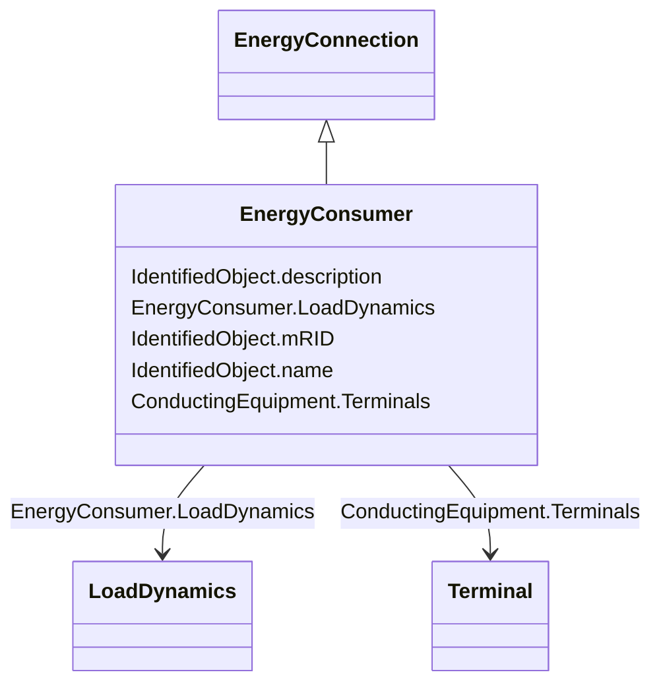

# EnergyConsumer

_Generic user of energy - a  point of consumption on the power system model._

_EnergyConsumer.pfixed, .qfixed, .pfixedPct and .qfixedPct have meaning only if there is no LoadResponseCharacteristic associated with EnergyConsumer or if LoadResponseCharacteristic.exponentModel is set to False._

**URI**: [cim:EnergyConsumer](http://iec.ch/TC57/CIM100#EnergyConsumer) 
**Type**: Class

## Inheritance
* [IdentifiedObject](IdentifiedObject.md)
    * [PowerSystemResource](PowerSystemResource.md)
        * [Equipment](Equipment.md)
            * [ConductingEquipment](ConductingEquipment.md)
                * [EnergyConnection](EnergyConnection.md)
                    * **EnergyConsumer**

## Attributes

| Name | URI | Cardinality and Range | Description | Inheritance |
| ---  | --- | --- | --- | --- |
| LoadDynamics | [cim:EnergyConsumer.LoadDynamics](http://iec.ch/TC57/CIM100#EnergyConsumer.LoadDynamics) | 0..1    [LoadDynamics](LoadDynamics.md)  | Load dynamics model used to describe dynamic behaviour of this energy consume... | direct |
| Terminals | [cim:ConductingEquipment.Terminals](http://iec.ch/TC57/CIM100#ConductingEquipment.Terminals) | 0..*    [Terminal](Terminal.md)  | Conducting equipment have terminals that may be connected to other conducting... | [ConductingEquipment](ConductingEquipment.md) |
| description | [cim:IdentifiedObject.description](http://iec.ch/TC57/CIM100#IdentifiedObject.description) | 0..1    string  | The description is a free human readable text describing or naming the object | [IdentifiedObject](IdentifiedObject.md) |
| mRID | [cim:IdentifiedObject.mRID](http://iec.ch/TC57/CIM100#IdentifiedObject.mRID) | 1..1    string  | Master resource identifier issued by a model authority | [IdentifiedObject](IdentifiedObject.md) |
| name | [cim:IdentifiedObject.name](http://iec.ch/TC57/CIM100#IdentifiedObject.name) | 0..1    string  | The name is any free human readable and possibly non unique text naming the o... | [IdentifiedObject](IdentifiedObject.md) |

## Usages

| used by | used in | type | used |
| ---  | --- | --- | --- |
| [LoadUserDefined](LoadUserDefined.md) | EnergyConsumer | range | [EnergyConsumer](EnergyConsumer.md) |
| [LoadComposite](LoadComposite.md) | EnergyConsumer | range | [EnergyConsumer](EnergyConsumer.md) |
| [LoadGenericNonLinear](LoadGenericNonLinear.md) | EnergyConsumer | range | [EnergyConsumer](EnergyConsumer.md) |
| [LoadDynamics](LoadDynamics.md) | EnergyConsumer | range | [EnergyConsumer](EnergyConsumer.md) |
| [LoadAggregate](LoadAggregate.md) | EnergyConsumer | range | [EnergyConsumer](EnergyConsumer.md) |

## Identifier and Mapping Information

### Schema Source

* from schema: http://iec.ch/TC57/ns/CIM/Dynamics-EU#Package_DynamicsProfile

## Mappings

| Mapping Type | Mapped Value |
| ---  | ---  |
| self | cim:EnergyConsumer |
| native | this:EnergyConsumer |

