# ExcAC5A

_Modified IEEE AC5A alternator-supplied rectifier excitation system with different minimum controller output._

**URI**: [cim:ExcAC5A](http://iec.ch/TC57/CIM100#ExcAC5A) 
**Type**: Class

```mermaid
 classDiagram
    class ExcAC5A
      ExcitationSystemDynamics <|-- ExcAC5A
      
      ExcAC5A : ExcAC5A.a
        
      ExcAC5A : IdentifiedObject.description
        
      ExcAC5A : ExcitationSystemDynamics.DiscontinuousExcitationControlDynamics
        
          ExcAC5A --> DiscontinuousExcitationControlDynamics : ExcitationSystemDynamics.DiscontinuousExcitationControlDynamics
        
      ExcAC5A : ExcAC5A.efd1
        
          ExcAC5A --> PU : ExcAC5A.efd1
        
      ExcAC5A : ExcAC5A.efd2
        
          ExcAC5A --> PU : ExcAC5A.efd2
        
      ExcAC5A : DynamicsFunctionBlock.enabled
        
      ExcAC5A : ExcAC5A.ka
        
          ExcAC5A --> PU : ExcAC5A.ka
        
      ExcAC5A : ExcAC5A.ke
        
          ExcAC5A --> PU : ExcAC5A.ke
        
      ExcAC5A : ExcAC5A.kf
        
          ExcAC5A --> PU : ExcAC5A.kf
        
      ExcAC5A : ExcAC5A.ks
        
          ExcAC5A --> PU : ExcAC5A.ks
        
      ExcAC5A : IdentifiedObject.mRID
        
      ExcAC5A : IdentifiedObject.name
        
      ExcAC5A : ExcitationSystemDynamics.OverexcitationLimiterDynamics
        
          ExcAC5A --> OverexcitationLimiterDynamics : ExcitationSystemDynamics.OverexcitationLimiterDynamics
        
      ExcAC5A : ExcitationSystemDynamics.PFVArControllerType1Dynamics
        
          ExcAC5A --> PFVArControllerType1Dynamics : ExcitationSystemDynamics.PFVArControllerType1Dynamics
        
      ExcAC5A : ExcitationSystemDynamics.PFVArControllerType2Dynamics
        
          ExcAC5A --> PFVArControllerType2Dynamics : ExcitationSystemDynamics.PFVArControllerType2Dynamics
        
      ExcAC5A : ExcitationSystemDynamics.PowerSystemStabilizerDynamics
        
          ExcAC5A --> PowerSystemStabilizerDynamics : ExcitationSystemDynamics.PowerSystemStabilizerDynamics
        
      ExcAC5A : ExcAC5A.seefd1
        
      ExcAC5A : ExcAC5A.seefd2
        
      ExcAC5A : ExcitationSystemDynamics.SynchronousMachineDynamics
        
          ExcAC5A --> SynchronousMachineDynamics : ExcitationSystemDynamics.SynchronousMachineDynamics
        
      ExcAC5A : ExcAC5A.ta
        
          ExcAC5A --> Seconds : ExcAC5A.ta
        
      ExcAC5A : ExcAC5A.tb
        
          ExcAC5A --> Seconds : ExcAC5A.tb
        
      ExcAC5A : ExcAC5A.tc
        
          ExcAC5A --> Seconds : ExcAC5A.tc
        
      ExcAC5A : ExcAC5A.te
        
          ExcAC5A --> Seconds : ExcAC5A.te
        
      ExcAC5A : ExcAC5A.tf1
        
          ExcAC5A --> Seconds : ExcAC5A.tf1
        
      ExcAC5A : ExcAC5A.tf2
        
          ExcAC5A --> Seconds : ExcAC5A.tf2
        
      ExcAC5A : ExcAC5A.tf3
        
          ExcAC5A --> Seconds : ExcAC5A.tf3
        
      ExcAC5A : ExcitationSystemDynamics.UnderexcitationLimiterDynamics
        
          ExcAC5A --> UnderexcitationLimiterDynamics : ExcitationSystemDynamics.UnderexcitationLimiterDynamics
        
      ExcAC5A : ExcitationSystemDynamics.VoltageCompensatorDynamics
        
          ExcAC5A --> VoltageCompensatorDynamics : ExcitationSystemDynamics.VoltageCompensatorDynamics
        
      ExcAC5A : ExcAC5A.vrmax
        
          ExcAC5A --> PU : ExcAC5A.vrmax
        
      ExcAC5A : ExcAC5A.vrmin
        
          ExcAC5A --> PU : ExcAC5A.vrmin
        
      
```

## Inheritance
* [IdentifiedObject](IdentifiedObject.md)
    * [DynamicsFunctionBlock](DynamicsFunctionBlock.md)
        * [ExcitationSystemDynamics](ExcitationSystemDynamics.md)
            * **ExcAC5A**

## Attributes

| Name | URI | Cardinality and Range | Description | Inheritance |
| ---  | --- | --- | --- | --- |
| ka | [cim:ExcAC5A.ka](http://iec.ch/TC57/CIM100#ExcAC5A.ka) | 1..1    [PU](PU.md)  | Voltage regulator gain (<i>Ka</i>) (&gt; 0) | direct |
| ks | [cim:ExcAC5A.ks](http://iec.ch/TC57/CIM100#ExcAC5A.ks) | 1..1    [PU](PU.md)  | Coefficient to allow different usage of the model-speed coefficient (<i>Ks</i... | direct |
| tb | [cim:ExcAC5A.tb](http://iec.ch/TC57/CIM100#ExcAC5A.tb) | 1..1    [Seconds](Seconds.md)  | Voltage regulator time constant (<i>Tb</i>) (&gt;= 0) | direct |
| tc | [cim:ExcAC5A.tc](http://iec.ch/TC57/CIM100#ExcAC5A.tc) | 1..1    [Seconds](Seconds.md)  | Voltage regulator time constant (<i>Tc</i>) (&gt;= 0) | direct |
| ta | [cim:ExcAC5A.ta](http://iec.ch/TC57/CIM100#ExcAC5A.ta) | 1..1    [Seconds](Seconds.md)  | Voltage regulator time constant (<i>Ta</i>) (&gt; 0) | direct |
| vrmax | [cim:ExcAC5A.vrmax](http://iec.ch/TC57/CIM100#ExcAC5A.vrmax) | 1..1    [PU](PU.md)  | Maximum voltage regulator output (<i>Vrmax</i>) (&gt; 0) | direct |
| vrmin | [cim:ExcAC5A.vrmin](http://iec.ch/TC57/CIM100#ExcAC5A.vrmin) | 1..1    [PU](PU.md)  | Minimum voltage regulator output (<i>Vrmin</i>) (&lt; 0) | direct |
| ke | [cim:ExcAC5A.ke](http://iec.ch/TC57/CIM100#ExcAC5A.ke) | 1..1    [PU](PU.md)  | Exciter constant related to self-excited field (<i>Ke</i>) | direct |
| te | [cim:ExcAC5A.te](http://iec.ch/TC57/CIM100#ExcAC5A.te) | 1..1    [Seconds](Seconds.md)  | Exciter time constant, integration rate associated with exciter control (<i>T... | direct |
| kf | [cim:ExcAC5A.kf](http://iec.ch/TC57/CIM100#ExcAC5A.kf) | 1..1    [PU](PU.md)  | Excitation control system stabilizer gains (<i>Kf</i>) (&gt;= 0) | direct |
| tf1 | [cim:ExcAC5A.tf1](http://iec.ch/TC57/CIM100#ExcAC5A.tf1) | 1..1    [Seconds](Seconds.md)  | Excitation control system stabilizer time constant (<i>Tf1</i>) (&gt; 0) | direct |
| tf2 | [cim:ExcAC5A.tf2](http://iec.ch/TC57/CIM100#ExcAC5A.tf2) | 1..1    [Seconds](Seconds.md)  | Excitation control system stabilizer time constant (<i>Tf2</i>) (&gt;= 0) | direct |
| tf3 | [cim:ExcAC5A.tf3](http://iec.ch/TC57/CIM100#ExcAC5A.tf3) | 1..1    [Seconds](Seconds.md)  | Excitation control system stabilizer time constant (<i>Tf3</i>) (&gt;= 0) | direct |
| efd1 | [cim:ExcAC5A.efd1](http://iec.ch/TC57/CIM100#ExcAC5A.efd1) | 1..1    [PU](PU.md)  | Exciter voltage at which exciter saturation is defined (<i>Efd1</i>) (&gt; 0) | direct |
| seefd1 | [cim:ExcAC5A.seefd1](http://iec.ch/TC57/CIM100#ExcAC5A.seefd1) | 1..1    float  | Exciter saturation function value at the corresponding exciter voltage, <i>Ef... | direct |
| efd2 | [cim:ExcAC5A.efd2](http://iec.ch/TC57/CIM100#ExcAC5A.efd2) | 1..1    [PU](PU.md)  | Exciter voltage at which exciter saturation is defined (<i>Efd2</i>) (&gt; 0) | direct |
| seefd2 | [cim:ExcAC5A.seefd2](http://iec.ch/TC57/CIM100#ExcAC5A.seefd2) | 1..1    float  | Exciter saturation function value at the corresponding exciter voltage, <i>Ef... | direct |
| a | [cim:ExcAC5A.a](http://iec.ch/TC57/CIM100#ExcAC5A.a) | 1..1    float  | Coefficient to allow different usage of the model (<i>a</i>) | direct |
| SynchronousMachineDynamics | [cim:ExcitationSystemDynamics.SynchronousMachineDynamics](http://iec.ch/TC57/CIM100#ExcitationSystemDynamics.SynchronousMachineDynamics) | 1..1    [SynchronousMachineDynamics](SynchronousMachineDynamics.md)  | Synchronous machine model with which this excitation system model is associat... | [ExcitationSystemDynamics](ExcitationSystemDynamics.md) |
| VoltageCompensatorDynamics | [cim:ExcitationSystemDynamics.VoltageCompensatorDynamics](http://iec.ch/TC57/CIM100#ExcitationSystemDynamics.VoltageCompensatorDynamics) | 1..1    [VoltageCompensatorDynamics](VoltageCompensatorDynamics.md)  | Voltage compensator model associated with this excitation system model | [ExcitationSystemDynamics](ExcitationSystemDynamics.md) |
| OverexcitationLimiterDynamics | [cim:ExcitationSystemDynamics.OverexcitationLimiterDynamics](http://iec.ch/TC57/CIM100#ExcitationSystemDynamics.OverexcitationLimiterDynamics) | 0..1    [OverexcitationLimiterDynamics](OverexcitationLimiterDynamics.md)  | Overexcitation limiter model associated with this excitation system model | [ExcitationSystemDynamics](ExcitationSystemDynamics.md) |
| PFVArControllerType2Dynamics | [cim:ExcitationSystemDynamics.PFVArControllerType2Dynamics](http://iec.ch/TC57/CIM100#ExcitationSystemDynamics.PFVArControllerType2Dynamics) | 0..1    [PFVArControllerType2Dynamics](PFVArControllerType2Dynamics.md)  | Power factor or VAr controller type 2 model associated with this excitation s... | [ExcitationSystemDynamics](ExcitationSystemDynamics.md) |
| DiscontinuousExcitationControlDynamics | [cim:ExcitationSystemDynamics.DiscontinuousExcitationControlDynamics](http://iec.ch/TC57/CIM100#ExcitationSystemDynamics.DiscontinuousExcitationControlDynamics) | 0..1    [DiscontinuousExcitationControlDynamics](DiscontinuousExcitationControlDynamics.md)  | Discontinuous excitation control model associated with this excitation system... | [ExcitationSystemDynamics](ExcitationSystemDynamics.md) |
| PowerSystemStabilizerDynamics | [cim:ExcitationSystemDynamics.PowerSystemStabilizerDynamics](http://iec.ch/TC57/CIM100#ExcitationSystemDynamics.PowerSystemStabilizerDynamics) | 0..1    [PowerSystemStabilizerDynamics](PowerSystemStabilizerDynamics.md)  | Power system stabilizer model associated with this excitation system model | [ExcitationSystemDynamics](ExcitationSystemDynamics.md) |
| UnderexcitationLimiterDynamics | [cim:ExcitationSystemDynamics.UnderexcitationLimiterDynamics](http://iec.ch/TC57/CIM100#ExcitationSystemDynamics.UnderexcitationLimiterDynamics) | 0..1    [UnderexcitationLimiterDynamics](UnderexcitationLimiterDynamics.md)  | Undrexcitation limiter model associated with this excitation system model | [ExcitationSystemDynamics](ExcitationSystemDynamics.md) |
| PFVArControllerType1Dynamics | [cim:ExcitationSystemDynamics.PFVArControllerType1Dynamics](http://iec.ch/TC57/CIM100#ExcitationSystemDynamics.PFVArControllerType1Dynamics) | 0..1    [PFVArControllerType1Dynamics](PFVArControllerType1Dynamics.md)  | Power factor or VAr controller type 1 model associated with this excitation s... | [ExcitationSystemDynamics](ExcitationSystemDynamics.md) |
| enabled | [cim:DynamicsFunctionBlock.enabled](http://iec.ch/TC57/CIM100#DynamicsFunctionBlock.enabled) | 1..1    boolean  | Function block used indicator | [DynamicsFunctionBlock](DynamicsFunctionBlock.md) |
| description | [cim:IdentifiedObject.description](http://iec.ch/TC57/CIM100#IdentifiedObject.description) | 0..1    string  | The description is a free human readable text describing or naming the object | [IdentifiedObject](IdentifiedObject.md) |
| mRID | [cim:IdentifiedObject.mRID](http://iec.ch/TC57/CIM100#IdentifiedObject.mRID) | 1..1    string  | Master resource identifier issued by a model authority | [IdentifiedObject](IdentifiedObject.md) |
| name | [cim:IdentifiedObject.name](http://iec.ch/TC57/CIM100#IdentifiedObject.name) | 0..1    string  | The name is any free human readable and possibly non unique text naming the o... | [IdentifiedObject](IdentifiedObject.md) |

## Identifier and Mapping Information

### Schema Source

* from schema: http://iec.ch/TC57/ns/CIM/Dynamics-EU#Package_DynamicsProfile

## Mappings

| Mapping Type | Mapped Value |
| ---  | ---  |
| self | cim:ExcAC5A |
| native | this:ExcAC5A |

