# ExcAC8B

_Modified IEEE AC8B alternator-supplied rectifier excitation system with speed input and input limiter._

**URI**: [cim:ExcAC8B](http://iec.ch/TC57/CIM100#ExcAC8B) 
**Type**: Class

```mermaid
 classDiagram
    class ExcAC8B
      ExcitationSystemDynamics <|-- ExcAC8B
      
      ExcAC8B : IdentifiedObject.description
        
      ExcAC8B : ExcitationSystemDynamics.DiscontinuousExcitationControlDynamics
        
          ExcAC8B --> DiscontinuousExcitationControlDynamics : ExcitationSystemDynamics.DiscontinuousExcitationControlDynamics
        
      ExcAC8B : DynamicsFunctionBlock.enabled
        
      ExcAC8B : ExcAC8B.inlim
        
      ExcAC8B : ExcAC8B.ka
        
          ExcAC8B --> PU : ExcAC8B.ka
        
      ExcAC8B : ExcAC8B.kc
        
          ExcAC8B --> PU : ExcAC8B.kc
        
      ExcAC8B : ExcAC8B.kd
        
          ExcAC8B --> PU : ExcAC8B.kd
        
      ExcAC8B : ExcAC8B.kdr
        
          ExcAC8B --> PU : ExcAC8B.kdr
        
      ExcAC8B : ExcAC8B.ke
        
          ExcAC8B --> PU : ExcAC8B.ke
        
      ExcAC8B : ExcAC8B.kir
        
          ExcAC8B --> PU : ExcAC8B.kir
        
      ExcAC8B : ExcAC8B.kpr
        
          ExcAC8B --> PU : ExcAC8B.kpr
        
      ExcAC8B : ExcAC8B.ks
        
          ExcAC8B --> PU : ExcAC8B.ks
        
      ExcAC8B : IdentifiedObject.mRID
        
      ExcAC8B : IdentifiedObject.name
        
      ExcAC8B : ExcitationSystemDynamics.OverexcitationLimiterDynamics
        
          ExcAC8B --> OverexcitationLimiterDynamics : ExcitationSystemDynamics.OverexcitationLimiterDynamics
        
      ExcAC8B : ExcitationSystemDynamics.PFVArControllerType1Dynamics
        
          ExcAC8B --> PFVArControllerType1Dynamics : ExcitationSystemDynamics.PFVArControllerType1Dynamics
        
      ExcAC8B : ExcitationSystemDynamics.PFVArControllerType2Dynamics
        
          ExcAC8B --> PFVArControllerType2Dynamics : ExcitationSystemDynamics.PFVArControllerType2Dynamics
        
      ExcAC8B : ExcAC8B.pidlim
        
      ExcAC8B : ExcitationSystemDynamics.PowerSystemStabilizerDynamics
        
          ExcAC8B --> PowerSystemStabilizerDynamics : ExcitationSystemDynamics.PowerSystemStabilizerDynamics
        
      ExcAC8B : ExcAC8B.seve1
        
      ExcAC8B : ExcAC8B.seve2
        
      ExcAC8B : ExcitationSystemDynamics.SynchronousMachineDynamics
        
          ExcAC8B --> SynchronousMachineDynamics : ExcitationSystemDynamics.SynchronousMachineDynamics
        
      ExcAC8B : ExcAC8B.ta
        
          ExcAC8B --> Seconds : ExcAC8B.ta
        
      ExcAC8B : ExcAC8B.tdr
        
          ExcAC8B --> Seconds : ExcAC8B.tdr
        
      ExcAC8B : ExcAC8B.te
        
          ExcAC8B --> Seconds : ExcAC8B.te
        
      ExcAC8B : ExcAC8B.telim
        
      ExcAC8B : ExcitationSystemDynamics.UnderexcitationLimiterDynamics
        
          ExcAC8B --> UnderexcitationLimiterDynamics : ExcitationSystemDynamics.UnderexcitationLimiterDynamics
        
      ExcAC8B : ExcAC8B.ve1
        
          ExcAC8B --> PU : ExcAC8B.ve1
        
      ExcAC8B : ExcAC8B.ve2
        
          ExcAC8B --> PU : ExcAC8B.ve2
        
      ExcAC8B : ExcAC8B.vemin
        
          ExcAC8B --> PU : ExcAC8B.vemin
        
      ExcAC8B : ExcAC8B.vfemax
        
          ExcAC8B --> PU : ExcAC8B.vfemax
        
      ExcAC8B : ExcAC8B.vimax
        
          ExcAC8B --> PU : ExcAC8B.vimax
        
      ExcAC8B : ExcAC8B.vimin
        
          ExcAC8B --> PU : ExcAC8B.vimin
        
      ExcAC8B : ExcitationSystemDynamics.VoltageCompensatorDynamics
        
          ExcAC8B --> VoltageCompensatorDynamics : ExcitationSystemDynamics.VoltageCompensatorDynamics
        
      ExcAC8B : ExcAC8B.vpidmax
        
          ExcAC8B --> PU : ExcAC8B.vpidmax
        
      ExcAC8B : ExcAC8B.vpidmin
        
          ExcAC8B --> PU : ExcAC8B.vpidmin
        
      ExcAC8B : ExcAC8B.vrmax
        
          ExcAC8B --> PU : ExcAC8B.vrmax
        
      ExcAC8B : ExcAC8B.vrmin
        
          ExcAC8B --> PU : ExcAC8B.vrmin
        
      ExcAC8B : ExcAC8B.vtmult
        
      
```

## Inheritance
* [IdentifiedObject](IdentifiedObject.md)
    * [DynamicsFunctionBlock](DynamicsFunctionBlock.md)
        * [ExcitationSystemDynamics](ExcitationSystemDynamics.md)
            * **ExcAC8B**

## Attributes

| Name | URI | Cardinality and Range | Description | Inheritance |
| ---  | --- | --- | --- | --- |
| inlim | [cim:ExcAC8B.inlim](http://iec.ch/TC57/CIM100#ExcAC8B.inlim) | 1..1    boolean  | Input limiter indicator | direct |
| ka | [cim:ExcAC8B.ka](http://iec.ch/TC57/CIM100#ExcAC8B.ka) | 1..1    [PU](PU.md)  | Voltage regulator gain (<i>Ka</i>) (&gt; 0) | direct |
| kc | [cim:ExcAC8B.kc](http://iec.ch/TC57/CIM100#ExcAC8B.kc) | 1..1    [PU](PU.md)  | Rectifier loading factor proportional to commutating reactance (<i>Kc</i>) (&... | direct |
| kd | [cim:ExcAC8B.kd](http://iec.ch/TC57/CIM100#ExcAC8B.kd) | 1..1    [PU](PU.md)  | Demagnetizing factor, a function of exciter alternator reactances (<i>Kd</i>)... | direct |
| kdr | [cim:ExcAC8B.kdr](http://iec.ch/TC57/CIM100#ExcAC8B.kdr) | 1..1    [PU](PU.md)  | Voltage regulator derivative gain (<i>Kdr</i>) (&gt;= 0) | direct |
| ke | [cim:ExcAC8B.ke](http://iec.ch/TC57/CIM100#ExcAC8B.ke) | 1..1    [PU](PU.md)  | Exciter constant related to self-excited field (<i>Ke</i>) | direct |
| kir | [cim:ExcAC8B.kir](http://iec.ch/TC57/CIM100#ExcAC8B.kir) | 1..1    [PU](PU.md)  | Voltage regulator integral gain (<i>Kir</i>) (&gt;= 0) | direct |
| kpr | [cim:ExcAC8B.kpr](http://iec.ch/TC57/CIM100#ExcAC8B.kpr) | 1..1    [PU](PU.md)  | Voltage regulator proportional gain (<i>Kpr</i>) (&gt; 0 if ExcAC8B | direct |
| ks | [cim:ExcAC8B.ks](http://iec.ch/TC57/CIM100#ExcAC8B.ks) | 1..1    [PU](PU.md)  | Coefficient to allow different usage of the model-speed coefficient (<i>Ks</i... | direct |
| pidlim | [cim:ExcAC8B.pidlim](http://iec.ch/TC57/CIM100#ExcAC8B.pidlim) | 1..1    boolean  | PID limiter indicator | direct |
| seve1 | [cim:ExcAC8B.seve1](http://iec.ch/TC57/CIM100#ExcAC8B.seve1) | 1..1    float  | Exciter saturation function value at the corresponding exciter voltage, <i>Ve... | direct |
| seve2 | [cim:ExcAC8B.seve2](http://iec.ch/TC57/CIM100#ExcAC8B.seve2) | 1..1    float  | Exciter saturation function value at the corresponding exciter voltage, <i>Ve... | direct |
| ta | [cim:ExcAC8B.ta](http://iec.ch/TC57/CIM100#ExcAC8B.ta) | 1..1    [Seconds](Seconds.md)  | Voltage regulator time constant (<i>Ta</i>) (&gt;= 0) | direct |
| tdr | [cim:ExcAC8B.tdr](http://iec.ch/TC57/CIM100#ExcAC8B.tdr) | 1..1    [Seconds](Seconds.md)  | Lag time constant (<i>Tdr</i>) (&gt; 0 if ExcAC8B | direct |
| te | [cim:ExcAC8B.te](http://iec.ch/TC57/CIM100#ExcAC8B.te) | 1..1    [Seconds](Seconds.md)  | Exciter time constant, integration rate associated with exciter control (<i>T... | direct |
| telim | [cim:ExcAC8B.telim](http://iec.ch/TC57/CIM100#ExcAC8B.telim) | 1..1    boolean  | Selector for the limiter on the block (<i>1/sTe</i>) | direct |
| ve1 | [cim:ExcAC8B.ve1](http://iec.ch/TC57/CIM100#ExcAC8B.ve1) | 1..1    [PU](PU.md)  | Exciter alternator output voltages back of commutating reactance at which sat... | direct |
| ve2 | [cim:ExcAC8B.ve2](http://iec.ch/TC57/CIM100#ExcAC8B.ve2) | 1..1    [PU](PU.md)  | Exciter alternator output voltages back of commutating reactance at which sat... | direct |
| vemin | [cim:ExcAC8B.vemin](http://iec.ch/TC57/CIM100#ExcAC8B.vemin) | 1..1    [PU](PU.md)  | Minimum exciter voltage output (<i>Vemin</i>) (&lt;= 0) | direct |
| vfemax | [cim:ExcAC8B.vfemax](http://iec.ch/TC57/CIM100#ExcAC8B.vfemax) | 1..1    [PU](PU.md)  | Exciter field current limit reference (<i>Vfemax</i>) | direct |
| vimax | [cim:ExcAC8B.vimax](http://iec.ch/TC57/CIM100#ExcAC8B.vimax) | 1..1    [PU](PU.md)  | Input signal maximum (<i>Vimax</i>) (&gt; ExcAC8B | direct |
| vimin | [cim:ExcAC8B.vimin](http://iec.ch/TC57/CIM100#ExcAC8B.vimin) | 1..1    [PU](PU.md)  | Input signal minimum (<i>Vimin</i>) (&lt; ExcAC8B | direct |
| vpidmax | [cim:ExcAC8B.vpidmax](http://iec.ch/TC57/CIM100#ExcAC8B.vpidmax) | 1..1    [PU](PU.md)  | PID maximum controller output (<i>Vpidmax</i>) (&gt; ExcAC8B | direct |
| vpidmin | [cim:ExcAC8B.vpidmin](http://iec.ch/TC57/CIM100#ExcAC8B.vpidmin) | 1..1    [PU](PU.md)  | PID minimum controller output (<i>Vpidmin</i>) (&lt; ExcAC8B | direct |
| vrmax | [cim:ExcAC8B.vrmax](http://iec.ch/TC57/CIM100#ExcAC8B.vrmax) | 1..1    [PU](PU.md)  | Maximum voltage regulator output (<i>Vrmax</i>) (&gt; 0) | direct |
| vrmin | [cim:ExcAC8B.vrmin](http://iec.ch/TC57/CIM100#ExcAC8B.vrmin) | 1..1    [PU](PU.md)  | Minimum voltage regulator output (<i>Vrmin</i>) (&lt; 0) | direct |
| vtmult | [cim:ExcAC8B.vtmult](http://iec.ch/TC57/CIM100#ExcAC8B.vtmult) | 1..1    boolean  | Multiply by generator's terminal voltage indicator | direct |
| SynchronousMachineDynamics | [cim:ExcitationSystemDynamics.SynchronousMachineDynamics](http://iec.ch/TC57/CIM100#ExcitationSystemDynamics.SynchronousMachineDynamics) | 1..1    [SynchronousMachineDynamics](SynchronousMachineDynamics.md)  | Synchronous machine model with which this excitation system model is associat... | [ExcitationSystemDynamics](ExcitationSystemDynamics.md) |
| VoltageCompensatorDynamics | [cim:ExcitationSystemDynamics.VoltageCompensatorDynamics](http://iec.ch/TC57/CIM100#ExcitationSystemDynamics.VoltageCompensatorDynamics) | 1..1    [VoltageCompensatorDynamics](VoltageCompensatorDynamics.md)  | Voltage compensator model associated with this excitation system model | [ExcitationSystemDynamics](ExcitationSystemDynamics.md) |
| OverexcitationLimiterDynamics | [cim:ExcitationSystemDynamics.OverexcitationLimiterDynamics](http://iec.ch/TC57/CIM100#ExcitationSystemDynamics.OverexcitationLimiterDynamics) | 0..1    [OverexcitationLimiterDynamics](OverexcitationLimiterDynamics.md)  | Overexcitation limiter model associated with this excitation system model | [ExcitationSystemDynamics](ExcitationSystemDynamics.md) |
| PFVArControllerType2Dynamics | [cim:ExcitationSystemDynamics.PFVArControllerType2Dynamics](http://iec.ch/TC57/CIM100#ExcitationSystemDynamics.PFVArControllerType2Dynamics) | 0..1    [PFVArControllerType2Dynamics](PFVArControllerType2Dynamics.md)  | Power factor or VAr controller type 2 model associated with this excitation s... | [ExcitationSystemDynamics](ExcitationSystemDynamics.md) |
| DiscontinuousExcitationControlDynamics | [cim:ExcitationSystemDynamics.DiscontinuousExcitationControlDynamics](http://iec.ch/TC57/CIM100#ExcitationSystemDynamics.DiscontinuousExcitationControlDynamics) | 0..1    [DiscontinuousExcitationControlDynamics](DiscontinuousExcitationControlDynamics.md)  | Discontinuous excitation control model associated with this excitation system... | [ExcitationSystemDynamics](ExcitationSystemDynamics.md) |
| PowerSystemStabilizerDynamics | [cim:ExcitationSystemDynamics.PowerSystemStabilizerDynamics](http://iec.ch/TC57/CIM100#ExcitationSystemDynamics.PowerSystemStabilizerDynamics) | 0..1    [PowerSystemStabilizerDynamics](PowerSystemStabilizerDynamics.md)  | Power system stabilizer model associated with this excitation system model | [ExcitationSystemDynamics](ExcitationSystemDynamics.md) |
| UnderexcitationLimiterDynamics | [cim:ExcitationSystemDynamics.UnderexcitationLimiterDynamics](http://iec.ch/TC57/CIM100#ExcitationSystemDynamics.UnderexcitationLimiterDynamics) | 0..1    [UnderexcitationLimiterDynamics](UnderexcitationLimiterDynamics.md)  | Undrexcitation limiter model associated with this excitation system model | [ExcitationSystemDynamics](ExcitationSystemDynamics.md) |
| PFVArControllerType1Dynamics | [cim:ExcitationSystemDynamics.PFVArControllerType1Dynamics](http://iec.ch/TC57/CIM100#ExcitationSystemDynamics.PFVArControllerType1Dynamics) | 0..1    [PFVArControllerType1Dynamics](PFVArControllerType1Dynamics.md)  | Power factor or VAr controller type 1 model associated with this excitation s... | [ExcitationSystemDynamics](ExcitationSystemDynamics.md) |
| enabled | [cim:DynamicsFunctionBlock.enabled](http://iec.ch/TC57/CIM100#DynamicsFunctionBlock.enabled) | 1..1    boolean  | Function block used indicator | [DynamicsFunctionBlock](DynamicsFunctionBlock.md) |
| description | [cim:IdentifiedObject.description](http://iec.ch/TC57/CIM100#IdentifiedObject.description) | 0..1    string  | The description is a free human readable text describing or naming the object | [IdentifiedObject](IdentifiedObject.md) |
| mRID | [cim:IdentifiedObject.mRID](http://iec.ch/TC57/CIM100#IdentifiedObject.mRID) | 1..1    string  | Master resource identifier issued by a model authority | [IdentifiedObject](IdentifiedObject.md) |
| name | [cim:IdentifiedObject.name](http://iec.ch/TC57/CIM100#IdentifiedObject.name) | 0..1    string  | The name is any free human readable and possibly non unique text naming the o... | [IdentifiedObject](IdentifiedObject.md) |

## Identifier and Mapping Information

### Schema Source

* from schema: http://iec.ch/TC57/ns/CIM/Dynamics-EU#Package_DynamicsProfile

## Mappings

| Mapping Type | Mapped Value |
| ---  | ---  |
| self | cim:ExcAC8B |
| native | this:ExcAC8B |

