# ExcAVR4

_Italian excitation system. It represents a static exciter and electric voltage regulator._

**URI**: [cim:ExcAVR4](http://iec.ch/TC57/CIM100#ExcAVR4) 
**Type**: Class

```mermaid
 classDiagram
    class ExcAVR4
      ExcitationSystemDynamics <|-- ExcAVR4
      
      ExcAVR4 : IdentifiedObject.description
        
      ExcAVR4 : ExcitationSystemDynamics.DiscontinuousExcitationControlDynamics
        
          ExcAVR4 --> DiscontinuousExcitationControlDynamics : ExcitationSystemDynamics.DiscontinuousExcitationControlDynamics
        
      ExcAVR4 : DynamicsFunctionBlock.enabled
        
      ExcAVR4 : ExcAVR4.imul
        
      ExcAVR4 : ExcAVR4.ka
        
      ExcAVR4 : ExcAVR4.ke
        
      ExcAVR4 : ExcAVR4.kif
        
      ExcAVR4 : IdentifiedObject.mRID
        
      ExcAVR4 : IdentifiedObject.name
        
      ExcAVR4 : ExcitationSystemDynamics.OverexcitationLimiterDynamics
        
          ExcAVR4 --> OverexcitationLimiterDynamics : ExcitationSystemDynamics.OverexcitationLimiterDynamics
        
      ExcAVR4 : ExcitationSystemDynamics.PFVArControllerType1Dynamics
        
          ExcAVR4 --> PFVArControllerType1Dynamics : ExcitationSystemDynamics.PFVArControllerType1Dynamics
        
      ExcAVR4 : ExcitationSystemDynamics.PFVArControllerType2Dynamics
        
          ExcAVR4 --> PFVArControllerType2Dynamics : ExcitationSystemDynamics.PFVArControllerType2Dynamics
        
      ExcAVR4 : ExcitationSystemDynamics.PowerSystemStabilizerDynamics
        
          ExcAVR4 --> PowerSystemStabilizerDynamics : ExcitationSystemDynamics.PowerSystemStabilizerDynamics
        
      ExcAVR4 : ExcitationSystemDynamics.SynchronousMachineDynamics
        
          ExcAVR4 --> SynchronousMachineDynamics : ExcitationSystemDynamics.SynchronousMachineDynamics
        
      ExcAVR4 : ExcAVR4.t1
        
          ExcAVR4 --> Seconds : ExcAVR4.t1
        
      ExcAVR4 : ExcAVR4.t1if
        
          ExcAVR4 --> Seconds : ExcAVR4.t1if
        
      ExcAVR4 : ExcAVR4.t2
        
          ExcAVR4 --> Seconds : ExcAVR4.t2
        
      ExcAVR4 : ExcAVR4.t3
        
          ExcAVR4 --> Seconds : ExcAVR4.t3
        
      ExcAVR4 : ExcAVR4.t4
        
          ExcAVR4 --> Seconds : ExcAVR4.t4
        
      ExcAVR4 : ExcAVR4.tif
        
          ExcAVR4 --> Seconds : ExcAVR4.tif
        
      ExcAVR4 : ExcitationSystemDynamics.UnderexcitationLimiterDynamics
        
          ExcAVR4 --> UnderexcitationLimiterDynamics : ExcitationSystemDynamics.UnderexcitationLimiterDynamics
        
      ExcAVR4 : ExcAVR4.vfmn
        
          ExcAVR4 --> PU : ExcAVR4.vfmn
        
      ExcAVR4 : ExcAVR4.vfmx
        
          ExcAVR4 --> PU : ExcAVR4.vfmx
        
      ExcAVR4 : ExcitationSystemDynamics.VoltageCompensatorDynamics
        
          ExcAVR4 --> VoltageCompensatorDynamics : ExcitationSystemDynamics.VoltageCompensatorDynamics
        
      ExcAVR4 : ExcAVR4.vrmn
        
          ExcAVR4 --> PU : ExcAVR4.vrmn
        
      ExcAVR4 : ExcAVR4.vrmx
        
          ExcAVR4 --> PU : ExcAVR4.vrmx
        
      
```

## Inheritance
* [IdentifiedObject](IdentifiedObject.md)
    * [DynamicsFunctionBlock](DynamicsFunctionBlock.md)
        * [ExcitationSystemDynamics](ExcitationSystemDynamics.md)
            * **ExcAVR4**

## Attributes

| Name | URI | Cardinality and Range | Description | Inheritance |
| ---  | --- | --- | --- | --- |
| ka | [cim:ExcAVR4.ka](http://iec.ch/TC57/CIM100#ExcAVR4.ka) | 1..1    float  | AVR gain (<i>K</i><i>A</i>) | direct |
| vrmn | [cim:ExcAVR4.vrmn](http://iec.ch/TC57/CIM100#ExcAVR4.vrmn) | 1..1    [PU](PU.md)  | Minimum AVR output (<i>V</i><i>RMN</i>) | direct |
| vrmx | [cim:ExcAVR4.vrmx](http://iec.ch/TC57/CIM100#ExcAVR4.vrmx) | 1..1    [PU](PU.md)  | Maximum AVR output (<i>V</i><i>RMX</i>) | direct |
| t1 | [cim:ExcAVR4.t1](http://iec.ch/TC57/CIM100#ExcAVR4.t1) | 1..1    [Seconds](Seconds.md)  | AVR time constant (<i>T</i><i>1</i>) (&gt;= 0) | direct |
| t2 | [cim:ExcAVR4.t2](http://iec.ch/TC57/CIM100#ExcAVR4.t2) | 1..1    [Seconds](Seconds.md)  | AVR time constant (<i>T</i><i>2</i>) (&gt;= 0) | direct |
| t3 | [cim:ExcAVR4.t3](http://iec.ch/TC57/CIM100#ExcAVR4.t3) | 1..1    [Seconds](Seconds.md)  | AVR time constant (<i>T</i><i>3</i>) (&gt;= 0) | direct |
| t4 | [cim:ExcAVR4.t4](http://iec.ch/TC57/CIM100#ExcAVR4.t4) | 1..1    [Seconds](Seconds.md)  | AVR time constant (<i>T</i><i>4</i>) (&gt;= 0) | direct |
| ke | [cim:ExcAVR4.ke](http://iec.ch/TC57/CIM100#ExcAVR4.ke) | 1..1    float  | Exciter gain (<i>K</i><i>E</i><i>)</i> | direct |
| vfmx | [cim:ExcAVR4.vfmx](http://iec.ch/TC57/CIM100#ExcAVR4.vfmx) | 1..1    [PU](PU.md)  | Maximum exciter output (<i>V</i><i>FMX</i>) | direct |
| vfmn | [cim:ExcAVR4.vfmn](http://iec.ch/TC57/CIM100#ExcAVR4.vfmn) | 1..1    [PU](PU.md)  | Minimum exciter output (<i>V</i><i>FMN</i>) | direct |
| kif | [cim:ExcAVR4.kif](http://iec.ch/TC57/CIM100#ExcAVR4.kif) | 1..1    float  | Exciter internal reactance (<i>K</i><i>IF</i>) | direct |
| tif | [cim:ExcAVR4.tif](http://iec.ch/TC57/CIM100#ExcAVR4.tif) | 1..1    [Seconds](Seconds.md)  | Exciter current feedback time constant (<i>T</i><i>IF</i>) (&gt;= ... | direct |
| t1if | [cim:ExcAVR4.t1if](http://iec.ch/TC57/CIM100#ExcAVR4.t1if) | 1..1    [Seconds](Seconds.md)  | Exciter current feedback time constant (<i>T</i><i>1IF</i>) (&gt;=... | direct |
| imul | [cim:ExcAVR4.imul](http://iec.ch/TC57/CIM100#ExcAVR4.imul) | 1..1    boolean  | AVR output voltage dependency selector (<i>I</i><i>MUL</i>) | direct |
| SynchronousMachineDynamics | [cim:ExcitationSystemDynamics.SynchronousMachineDynamics](http://iec.ch/TC57/CIM100#ExcitationSystemDynamics.SynchronousMachineDynamics) | 1..1    [SynchronousMachineDynamics](SynchronousMachineDynamics.md)  | Synchronous machine model with which this excitation system model is associat... | [ExcitationSystemDynamics](ExcitationSystemDynamics.md) |
| VoltageCompensatorDynamics | [cim:ExcitationSystemDynamics.VoltageCompensatorDynamics](http://iec.ch/TC57/CIM100#ExcitationSystemDynamics.VoltageCompensatorDynamics) | 1..1    [VoltageCompensatorDynamics](VoltageCompensatorDynamics.md)  | Voltage compensator model associated with this excitation system model | [ExcitationSystemDynamics](ExcitationSystemDynamics.md) |
| OverexcitationLimiterDynamics | [cim:ExcitationSystemDynamics.OverexcitationLimiterDynamics](http://iec.ch/TC57/CIM100#ExcitationSystemDynamics.OverexcitationLimiterDynamics) | 0..1    [OverexcitationLimiterDynamics](OverexcitationLimiterDynamics.md)  | Overexcitation limiter model associated with this excitation system model | [ExcitationSystemDynamics](ExcitationSystemDynamics.md) |
| PFVArControllerType2Dynamics | [cim:ExcitationSystemDynamics.PFVArControllerType2Dynamics](http://iec.ch/TC57/CIM100#ExcitationSystemDynamics.PFVArControllerType2Dynamics) | 0..1    [PFVArControllerType2Dynamics](PFVArControllerType2Dynamics.md)  | Power factor or VAr controller type 2 model associated with this excitation s... | [ExcitationSystemDynamics](ExcitationSystemDynamics.md) |
| DiscontinuousExcitationControlDynamics | [cim:ExcitationSystemDynamics.DiscontinuousExcitationControlDynamics](http://iec.ch/TC57/CIM100#ExcitationSystemDynamics.DiscontinuousExcitationControlDynamics) | 0..1    [DiscontinuousExcitationControlDynamics](DiscontinuousExcitationControlDynamics.md)  | Discontinuous excitation control model associated with this excitation system... | [ExcitationSystemDynamics](ExcitationSystemDynamics.md) |
| PowerSystemStabilizerDynamics | [cim:ExcitationSystemDynamics.PowerSystemStabilizerDynamics](http://iec.ch/TC57/CIM100#ExcitationSystemDynamics.PowerSystemStabilizerDynamics) | 0..1    [PowerSystemStabilizerDynamics](PowerSystemStabilizerDynamics.md)  | Power system stabilizer model associated with this excitation system model | [ExcitationSystemDynamics](ExcitationSystemDynamics.md) |
| UnderexcitationLimiterDynamics | [cim:ExcitationSystemDynamics.UnderexcitationLimiterDynamics](http://iec.ch/TC57/CIM100#ExcitationSystemDynamics.UnderexcitationLimiterDynamics) | 0..1    [UnderexcitationLimiterDynamics](UnderexcitationLimiterDynamics.md)  | Undrexcitation limiter model associated with this excitation system model | [ExcitationSystemDynamics](ExcitationSystemDynamics.md) |
| PFVArControllerType1Dynamics | [cim:ExcitationSystemDynamics.PFVArControllerType1Dynamics](http://iec.ch/TC57/CIM100#ExcitationSystemDynamics.PFVArControllerType1Dynamics) | 0..1    [PFVArControllerType1Dynamics](PFVArControllerType1Dynamics.md)  | Power factor or VAr controller type 1 model associated with this excitation s... | [ExcitationSystemDynamics](ExcitationSystemDynamics.md) |
| enabled | [cim:DynamicsFunctionBlock.enabled](http://iec.ch/TC57/CIM100#DynamicsFunctionBlock.enabled) | 1..1    boolean  | Function block used indicator | [DynamicsFunctionBlock](DynamicsFunctionBlock.md) |
| description | [cim:IdentifiedObject.description](http://iec.ch/TC57/CIM100#IdentifiedObject.description) | 0..1    string  | The description is a free human readable text describing or naming the object | [IdentifiedObject](IdentifiedObject.md) |
| mRID | [cim:IdentifiedObject.mRID](http://iec.ch/TC57/CIM100#IdentifiedObject.mRID) | 1..1    string  | Master resource identifier issued by a model authority | [IdentifiedObject](IdentifiedObject.md) |
| name | [cim:IdentifiedObject.name](http://iec.ch/TC57/CIM100#IdentifiedObject.name) | 0..1    string  | The name is any free human readable and possibly non unique text naming the o... | [IdentifiedObject](IdentifiedObject.md) |

## Identifier and Mapping Information

### Schema Source

* from schema: http://iec.ch/TC57/ns/CIM/Dynamics-EU#Package_DynamicsProfile

## Mappings

| Mapping Type | Mapped Value |
| ---  | ---  |
| self | cim:ExcAVR4 |
| native | this:ExcAVR4 |

