# ExcAVR7

_IVO excitation system._

**URI**: [cim:ExcAVR7](http://iec.ch/TC57/CIM100#ExcAVR7) 
**Type**: Class

```mermaid
 classDiagram
    class ExcAVR7
      ExcitationSystemDynamics <|-- ExcAVR7
      
      ExcAVR7 : ExcAVR7.a1
        
          ExcAVR7 --> PU : ExcAVR7.a1
        
      ExcAVR7 : ExcAVR7.a2
        
          ExcAVR7 --> PU : ExcAVR7.a2
        
      ExcAVR7 : ExcAVR7.a3
        
          ExcAVR7 --> PU : ExcAVR7.a3
        
      ExcAVR7 : ExcAVR7.a4
        
          ExcAVR7 --> PU : ExcAVR7.a4
        
      ExcAVR7 : ExcAVR7.a5
        
          ExcAVR7 --> PU : ExcAVR7.a5
        
      ExcAVR7 : ExcAVR7.a6
        
          ExcAVR7 --> PU : ExcAVR7.a6
        
      ExcAVR7 : IdentifiedObject.description
        
      ExcAVR7 : ExcitationSystemDynamics.DiscontinuousExcitationControlDynamics
        
          ExcAVR7 --> DiscontinuousExcitationControlDynamics : ExcitationSystemDynamics.DiscontinuousExcitationControlDynamics
        
      ExcAVR7 : DynamicsFunctionBlock.enabled
        
      ExcAVR7 : ExcAVR7.k1
        
          ExcAVR7 --> PU : ExcAVR7.k1
        
      ExcAVR7 : ExcAVR7.k3
        
          ExcAVR7 --> PU : ExcAVR7.k3
        
      ExcAVR7 : ExcAVR7.k5
        
          ExcAVR7 --> PU : ExcAVR7.k5
        
      ExcAVR7 : IdentifiedObject.mRID
        
      ExcAVR7 : IdentifiedObject.name
        
      ExcAVR7 : ExcitationSystemDynamics.OverexcitationLimiterDynamics
        
          ExcAVR7 --> OverexcitationLimiterDynamics : ExcitationSystemDynamics.OverexcitationLimiterDynamics
        
      ExcAVR7 : ExcitationSystemDynamics.PFVArControllerType1Dynamics
        
          ExcAVR7 --> PFVArControllerType1Dynamics : ExcitationSystemDynamics.PFVArControllerType1Dynamics
        
      ExcAVR7 : ExcitationSystemDynamics.PFVArControllerType2Dynamics
        
          ExcAVR7 --> PFVArControllerType2Dynamics : ExcitationSystemDynamics.PFVArControllerType2Dynamics
        
      ExcAVR7 : ExcitationSystemDynamics.PowerSystemStabilizerDynamics
        
          ExcAVR7 --> PowerSystemStabilizerDynamics : ExcitationSystemDynamics.PowerSystemStabilizerDynamics
        
      ExcAVR7 : ExcitationSystemDynamics.SynchronousMachineDynamics
        
          ExcAVR7 --> SynchronousMachineDynamics : ExcitationSystemDynamics.SynchronousMachineDynamics
        
      ExcAVR7 : ExcAVR7.t1
        
          ExcAVR7 --> Seconds : ExcAVR7.t1
        
      ExcAVR7 : ExcAVR7.t2
        
          ExcAVR7 --> Seconds : ExcAVR7.t2
        
      ExcAVR7 : ExcAVR7.t3
        
          ExcAVR7 --> Seconds : ExcAVR7.t3
        
      ExcAVR7 : ExcAVR7.t4
        
          ExcAVR7 --> Seconds : ExcAVR7.t4
        
      ExcAVR7 : ExcAVR7.t5
        
          ExcAVR7 --> Seconds : ExcAVR7.t5
        
      ExcAVR7 : ExcAVR7.t6
        
          ExcAVR7 --> Seconds : ExcAVR7.t6
        
      ExcAVR7 : ExcitationSystemDynamics.UnderexcitationLimiterDynamics
        
          ExcAVR7 --> UnderexcitationLimiterDynamics : ExcitationSystemDynamics.UnderexcitationLimiterDynamics
        
      ExcAVR7 : ExcAVR7.vmax1
        
          ExcAVR7 --> PU : ExcAVR7.vmax1
        
      ExcAVR7 : ExcAVR7.vmax3
        
          ExcAVR7 --> PU : ExcAVR7.vmax3
        
      ExcAVR7 : ExcAVR7.vmax5
        
          ExcAVR7 --> PU : ExcAVR7.vmax5
        
      ExcAVR7 : ExcAVR7.vmin1
        
          ExcAVR7 --> PU : ExcAVR7.vmin1
        
      ExcAVR7 : ExcAVR7.vmin3
        
          ExcAVR7 --> PU : ExcAVR7.vmin3
        
      ExcAVR7 : ExcAVR7.vmin5
        
          ExcAVR7 --> PU : ExcAVR7.vmin5
        
      ExcAVR7 : ExcitationSystemDynamics.VoltageCompensatorDynamics
        
          ExcAVR7 --> VoltageCompensatorDynamics : ExcitationSystemDynamics.VoltageCompensatorDynamics
        
      
```

## Inheritance
* [IdentifiedObject](IdentifiedObject.md)
    * [DynamicsFunctionBlock](DynamicsFunctionBlock.md)
        * [ExcitationSystemDynamics](ExcitationSystemDynamics.md)
            * **ExcAVR7**

## Attributes

| Name | URI | Cardinality and Range | Description | Inheritance |
| ---  | --- | --- | --- | --- |
| k1 | [cim:ExcAVR7.k1](http://iec.ch/TC57/CIM100#ExcAVR7.k1) | 1..1    [PU](PU.md)  | Gain (<i>K</i><i>1</i>) | direct |
| a1 | [cim:ExcAVR7.a1](http://iec.ch/TC57/CIM100#ExcAVR7.a1) | 1..1    [PU](PU.md)  | Lead coefficient (<i>A</i><i>1</i>) | direct |
| a2 | [cim:ExcAVR7.a2](http://iec.ch/TC57/CIM100#ExcAVR7.a2) | 1..1    [PU](PU.md)  | Lag coefficient (<i>A</i><i>2</i>) | direct |
| t1 | [cim:ExcAVR7.t1](http://iec.ch/TC57/CIM100#ExcAVR7.t1) | 1..1    [Seconds](Seconds.md)  | Lead time constant (<i>T</i><i>1</i>) (&gt;= 0) | direct |
| t2 | [cim:ExcAVR7.t2](http://iec.ch/TC57/CIM100#ExcAVR7.t2) | 1..1    [Seconds](Seconds.md)  | Lag time constant (<i>T</i><i>2</i>) (&gt;= 0) | direct |
| vmax1 | [cim:ExcAVR7.vmax1](http://iec.ch/TC57/CIM100#ExcAVR7.vmax1) | 1..1    [PU](PU.md)  | Lead-lag maximum limit (<i>Vmax1</i>) (&gt; ExcAVR7 | direct |
| vmin1 | [cim:ExcAVR7.vmin1](http://iec.ch/TC57/CIM100#ExcAVR7.vmin1) | 1..1    [PU](PU.md)  | Lead-lag minimum limit (<i>Vmin1</i>) (&lt; ExcAVR7 | direct |
| k3 | [cim:ExcAVR7.k3](http://iec.ch/TC57/CIM100#ExcAVR7.k3) | 1..1    [PU](PU.md)  | Gain (<i>K</i><i>3</i>) | direct |
| a3 | [cim:ExcAVR7.a3](http://iec.ch/TC57/CIM100#ExcAVR7.a3) | 1..1    [PU](PU.md)  | Lead coefficient (<i>A</i><i>3</i>) | direct |
| a4 | [cim:ExcAVR7.a4](http://iec.ch/TC57/CIM100#ExcAVR7.a4) | 1..1    [PU](PU.md)  | Lag coefficient (<i>A</i><i>4</i>) | direct |
| t3 | [cim:ExcAVR7.t3](http://iec.ch/TC57/CIM100#ExcAVR7.t3) | 1..1    [Seconds](Seconds.md)  | Lead time constant (<i>T</i><i>3</i>) (&gt;= 0) | direct |
| t4 | [cim:ExcAVR7.t4](http://iec.ch/TC57/CIM100#ExcAVR7.t4) | 1..1    [Seconds](Seconds.md)  | Lag time constant (<i>T</i><i>4</i>) (&gt;= 0) | direct |
| vmax3 | [cim:ExcAVR7.vmax3](http://iec.ch/TC57/CIM100#ExcAVR7.vmax3) | 1..1    [PU](PU.md)  | Lead-lag maximum limit (<i>Vmax3</i>) (&gt; ExcAVR7 | direct |
| vmin3 | [cim:ExcAVR7.vmin3](http://iec.ch/TC57/CIM100#ExcAVR7.vmin3) | 1..1    [PU](PU.md)  | Lead-lag minimum limit (<i>Vmin3</i>) (&lt; ExcAVR7 | direct |
| k5 | [cim:ExcAVR7.k5](http://iec.ch/TC57/CIM100#ExcAVR7.k5) | 1..1    [PU](PU.md)  | Gain (<i>K</i><i>5</i>) | direct |
| a5 | [cim:ExcAVR7.a5](http://iec.ch/TC57/CIM100#ExcAVR7.a5) | 1..1    [PU](PU.md)  | Lead coefficient (<i>A</i><i>5</i>) | direct |
| a6 | [cim:ExcAVR7.a6](http://iec.ch/TC57/CIM100#ExcAVR7.a6) | 1..1    [PU](PU.md)  | Lag coefficient (<i>A</i><i>6</i>) | direct |
| t5 | [cim:ExcAVR7.t5](http://iec.ch/TC57/CIM100#ExcAVR7.t5) | 1..1    [Seconds](Seconds.md)  | Lead time constant (<i>T</i><i>5</i>) (&gt;= 0) | direct |
| t6 | [cim:ExcAVR7.t6](http://iec.ch/TC57/CIM100#ExcAVR7.t6) | 1..1    [Seconds](Seconds.md)  | Lag time constant (<i>T</i><i>6</i>) (&gt;= 0) | direct |
| vmax5 | [cim:ExcAVR7.vmax5](http://iec.ch/TC57/CIM100#ExcAVR7.vmax5) | 1..1    [PU](PU.md)  | Lead-lag maximum limit (<i>Vmax5</i>) (&gt; ExcAVR7 | direct |
| vmin5 | [cim:ExcAVR7.vmin5](http://iec.ch/TC57/CIM100#ExcAVR7.vmin5) | 1..1    [PU](PU.md)  | Lead-lag minimum limit (<i>Vmin5</i>) (&lt; ExcAVR7 | direct |
| SynchronousMachineDynamics | [cim:ExcitationSystemDynamics.SynchronousMachineDynamics](http://iec.ch/TC57/CIM100#ExcitationSystemDynamics.SynchronousMachineDynamics) | 1..1    [SynchronousMachineDynamics](SynchronousMachineDynamics.md)  | Synchronous machine model with which this excitation system model is associat... | [ExcitationSystemDynamics](ExcitationSystemDynamics.md) |
| VoltageCompensatorDynamics | [cim:ExcitationSystemDynamics.VoltageCompensatorDynamics](http://iec.ch/TC57/CIM100#ExcitationSystemDynamics.VoltageCompensatorDynamics) | 1..1    [VoltageCompensatorDynamics](VoltageCompensatorDynamics.md)  | Voltage compensator model associated with this excitation system model | [ExcitationSystemDynamics](ExcitationSystemDynamics.md) |
| OverexcitationLimiterDynamics | [cim:ExcitationSystemDynamics.OverexcitationLimiterDynamics](http://iec.ch/TC57/CIM100#ExcitationSystemDynamics.OverexcitationLimiterDynamics) | 0..1    [OverexcitationLimiterDynamics](OverexcitationLimiterDynamics.md)  | Overexcitation limiter model associated with this excitation system model | [ExcitationSystemDynamics](ExcitationSystemDynamics.md) |
| PFVArControllerType2Dynamics | [cim:ExcitationSystemDynamics.PFVArControllerType2Dynamics](http://iec.ch/TC57/CIM100#ExcitationSystemDynamics.PFVArControllerType2Dynamics) | 0..1    [PFVArControllerType2Dynamics](PFVArControllerType2Dynamics.md)  | Power factor or VAr controller type 2 model associated with this excitation s... | [ExcitationSystemDynamics](ExcitationSystemDynamics.md) |
| DiscontinuousExcitationControlDynamics | [cim:ExcitationSystemDynamics.DiscontinuousExcitationControlDynamics](http://iec.ch/TC57/CIM100#ExcitationSystemDynamics.DiscontinuousExcitationControlDynamics) | 0..1    [DiscontinuousExcitationControlDynamics](DiscontinuousExcitationControlDynamics.md)  | Discontinuous excitation control model associated with this excitation system... | [ExcitationSystemDynamics](ExcitationSystemDynamics.md) |
| PowerSystemStabilizerDynamics | [cim:ExcitationSystemDynamics.PowerSystemStabilizerDynamics](http://iec.ch/TC57/CIM100#ExcitationSystemDynamics.PowerSystemStabilizerDynamics) | 0..1    [PowerSystemStabilizerDynamics](PowerSystemStabilizerDynamics.md)  | Power system stabilizer model associated with this excitation system model | [ExcitationSystemDynamics](ExcitationSystemDynamics.md) |
| UnderexcitationLimiterDynamics | [cim:ExcitationSystemDynamics.UnderexcitationLimiterDynamics](http://iec.ch/TC57/CIM100#ExcitationSystemDynamics.UnderexcitationLimiterDynamics) | 0..1    [UnderexcitationLimiterDynamics](UnderexcitationLimiterDynamics.md)  | Undrexcitation limiter model associated with this excitation system model | [ExcitationSystemDynamics](ExcitationSystemDynamics.md) |
| PFVArControllerType1Dynamics | [cim:ExcitationSystemDynamics.PFVArControllerType1Dynamics](http://iec.ch/TC57/CIM100#ExcitationSystemDynamics.PFVArControllerType1Dynamics) | 0..1    [PFVArControllerType1Dynamics](PFVArControllerType1Dynamics.md)  | Power factor or VAr controller type 1 model associated with this excitation s... | [ExcitationSystemDynamics](ExcitationSystemDynamics.md) |
| enabled | [cim:DynamicsFunctionBlock.enabled](http://iec.ch/TC57/CIM100#DynamicsFunctionBlock.enabled) | 1..1    boolean  | Function block used indicator | [DynamicsFunctionBlock](DynamicsFunctionBlock.md) |
| description | [cim:IdentifiedObject.description](http://iec.ch/TC57/CIM100#IdentifiedObject.description) | 0..1    string  | The description is a free human readable text describing or naming the object | [IdentifiedObject](IdentifiedObject.md) |
| mRID | [cim:IdentifiedObject.mRID](http://iec.ch/TC57/CIM100#IdentifiedObject.mRID) | 1..1    string  | Master resource identifier issued by a model authority | [IdentifiedObject](IdentifiedObject.md) |
| name | [cim:IdentifiedObject.name](http://iec.ch/TC57/CIM100#IdentifiedObject.name) | 0..1    string  | The name is any free human readable and possibly non unique text naming the o... | [IdentifiedObject](IdentifiedObject.md) |

## Identifier and Mapping Information

### Schema Source

* from schema: http://iec.ch/TC57/ns/CIM/Dynamics-EU#Package_DynamicsProfile

## Mappings

| Mapping Type | Mapped Value |
| ---  | ---  |
| self | cim:ExcAVR7 |
| native | this:ExcAVR7 |

