# ExcBBC

_Transformer fed static excitation system (static with ABB regulator). This model represents a static excitation system in which a gated thyristor bridge fed by a transformer at the main generator terminals feeds the main generator directly._

**URI**: [cim:ExcBBC](http://iec.ch/TC57/CIM100#ExcBBC) 
**Type**: Class

```mermaid
 classDiagram
    class ExcBBC
    click ExcBBC href "../ExcBBC"
      ExcitationSystemDynamics <|-- ExcBBC
        click ExcitationSystemDynamics href "../ExcitationSystemDynamics"
      
      ExcBBC : IdentifiedObject.description
        
      ExcBBC : ExcitationSystemDynamics.DiscontinuousExcitationControlDynamics
        
          ExcBBC --> DiscontinuousExcitationControlDynamics : ExcitationSystemDynamics.DiscontinuousExcitationControlDynamics
          click DiscontinuousExcitationControlDynamics href "../DiscontinuousExcitationControlDynamics"
        
      ExcBBC : ExcBBC.efdmax
        
          ExcBBC --> PU : ExcBBC.efdmax
          click PU href "../PU"
        
      ExcBBC : ExcBBC.efdmin
        
          ExcBBC --> PU : ExcBBC.efdmin
          click PU href "../PU"
        
      ExcBBC : DynamicsFunctionBlock.enabled
        
      ExcBBC : ExcBBC.k
        
          ExcBBC --> PU : ExcBBC.k
          click PU href "../PU"
        
      ExcBBC : IdentifiedObject.mRID
        
      ExcBBC : IdentifiedObject.name
        
      ExcBBC : ExcitationSystemDynamics.OverexcitationLimiterDynamics
        
          ExcBBC --> OverexcitationLimiterDynamics : ExcitationSystemDynamics.OverexcitationLimiterDynamics
          click OverexcitationLimiterDynamics href "../OverexcitationLimiterDynamics"
        
      ExcBBC : ExcitationSystemDynamics.PFVArControllerType1Dynamics
        
          ExcBBC --> PFVArControllerType1Dynamics : ExcitationSystemDynamics.PFVArControllerType1Dynamics
          click PFVArControllerType1Dynamics href "../PFVArControllerType1Dynamics"
        
      ExcBBC : ExcitationSystemDynamics.PFVArControllerType2Dynamics
        
          ExcBBC --> PFVArControllerType2Dynamics : ExcitationSystemDynamics.PFVArControllerType2Dynamics
          click PFVArControllerType2Dynamics href "../PFVArControllerType2Dynamics"
        
      ExcBBC : ExcitationSystemDynamics.PowerSystemStabilizerDynamics
        
          ExcBBC --> PowerSystemStabilizerDynamics : ExcitationSystemDynamics.PowerSystemStabilizerDynamics
          click PowerSystemStabilizerDynamics href "../PowerSystemStabilizerDynamics"
        
      ExcBBC : ExcBBC.switch
        
      ExcBBC : ExcitationSystemDynamics.SynchronousMachineDynamics
        
          ExcBBC --> SynchronousMachineDynamics : ExcitationSystemDynamics.SynchronousMachineDynamics
          click SynchronousMachineDynamics href "../SynchronousMachineDynamics"
        
      ExcBBC : ExcBBC.t1
        
          ExcBBC --> Seconds : ExcBBC.t1
          click Seconds href "../Seconds"
        
      ExcBBC : ExcBBC.t2
        
          ExcBBC --> Seconds : ExcBBC.t2
          click Seconds href "../Seconds"
        
      ExcBBC : ExcBBC.t3
        
          ExcBBC --> Seconds : ExcBBC.t3
          click Seconds href "../Seconds"
        
      ExcBBC : ExcBBC.t4
        
          ExcBBC --> Seconds : ExcBBC.t4
          click Seconds href "../Seconds"
        
      ExcBBC : ExcitationSystemDynamics.UnderexcitationLimiterDynamics
        
          ExcBBC --> UnderexcitationLimiterDynamics : ExcitationSystemDynamics.UnderexcitationLimiterDynamics
          click UnderexcitationLimiterDynamics href "../UnderexcitationLimiterDynamics"
        
      ExcBBC : ExcitationSystemDynamics.VoltageCompensatorDynamics
        
          ExcBBC --> VoltageCompensatorDynamics : ExcitationSystemDynamics.VoltageCompensatorDynamics
          click VoltageCompensatorDynamics href "../VoltageCompensatorDynamics"
        
      ExcBBC : ExcBBC.vrmax
        
          ExcBBC --> PU : ExcBBC.vrmax
          click PU href "../PU"
        
      ExcBBC : ExcBBC.vrmin
        
          ExcBBC --> PU : ExcBBC.vrmin
          click PU href "../PU"
        
      ExcBBC : ExcBBC.xe
        
          ExcBBC --> PU : ExcBBC.xe
          click PU href "../PU"
        
      
```

## Inheritance
* [IdentifiedObject](IdentifiedObject.md)
    * [DynamicsFunctionBlock](DynamicsFunctionBlock.md)
        * [ExcitationSystemDynamics](ExcitationSystemDynamics.md)
            * **ExcBBC**

## Attributes

| Name | URI | Cardinality and Range | Description | Inheritance |
| ---  | --- | --- | --- | --- |
| t1 | [cim:ExcBBC.t1](http://iec.ch/TC57/CIM100#ExcBBC.t1) | 1    [Seconds](Seconds.md)  | Controller time constant (<i>T1</i>) (&gt;= 0) | direct |
| t2 | [cim:ExcBBC.t2](http://iec.ch/TC57/CIM100#ExcBBC.t2) | 1    [Seconds](Seconds.md)  | Controller time constant (<i>T2</i>) (&gt;= 0) | direct |
| t3 | [cim:ExcBBC.t3](http://iec.ch/TC57/CIM100#ExcBBC.t3) | 1    [Seconds](Seconds.md)  | Lead/lag time constant (<i>T3</i>) (&gt;= 0) | direct |
| t4 | [cim:ExcBBC.t4](http://iec.ch/TC57/CIM100#ExcBBC.t4) | 1    [Seconds](Seconds.md)  | Lead/lag time constant (<i>T4</i>) (&gt;= 0) | direct |
| k | [cim:ExcBBC.k](http://iec.ch/TC57/CIM100#ExcBBC.k) | 1    [PU](PU.md)  | Steady state gain (<i>K</i>) (not = 0) | direct |
| vrmin | [cim:ExcBBC.vrmin](http://iec.ch/TC57/CIM100#ExcBBC.vrmin) | 1    [PU](PU.md)  | Minimum control element output (<i>Vrmin</i>) (&lt; ExcBBC | direct |
| vrmax | [cim:ExcBBC.vrmax](http://iec.ch/TC57/CIM100#ExcBBC.vrmax) | 1    [PU](PU.md)  | Maximum control element output (<i>Vrmax</i>) (&gt; ExcBBC | direct |
| efdmin | [cim:ExcBBC.efdmin](http://iec.ch/TC57/CIM100#ExcBBC.efdmin) | 1    [PU](PU.md)  | Minimum open circuit exciter voltage (<i>Efdmin</i>) (&lt; ExcBBC | direct |
| efdmax | [cim:ExcBBC.efdmax](http://iec.ch/TC57/CIM100#ExcBBC.efdmax) | 1    [PU](PU.md)  | Maximum open circuit exciter voltage (<i>Efdmax</i>) (&gt; ExcBBC | direct |
| xe | [cim:ExcBBC.xe](http://iec.ch/TC57/CIM100#ExcBBC.xe) | 1    [PU](PU.md)  | Effective excitation transformer reactance (<i>Xe</i>) (&gt;= 0) | direct |
| switch | [cim:ExcBBC.switch](http://iec.ch/TC57/CIM100#ExcBBC.switch) | 1    boolean  | Supplementary signal routing selector (<i>switch</i>) | direct |
| SynchronousMachineDynamics | [cim:ExcitationSystemDynamics.SynchronousMachineDynamics](http://iec.ch/TC57/CIM100#ExcitationSystemDynamics.SynchronousMachineDynamics) | 1    [SynchronousMachineDynamics](SynchronousMachineDynamics.md)  | Synchronous machine model with which this excitation system model is associat... | [ExcitationSystemDynamics](ExcitationSystemDynamics.md) |
| VoltageCompensatorDynamics | [cim:ExcitationSystemDynamics.VoltageCompensatorDynamics](http://iec.ch/TC57/CIM100#ExcitationSystemDynamics.VoltageCompensatorDynamics) | 1    [VoltageCompensatorDynamics](VoltageCompensatorDynamics.md)  | Voltage compensator model associated with this excitation system model | [ExcitationSystemDynamics](ExcitationSystemDynamics.md) |
| OverexcitationLimiterDynamics | [cim:ExcitationSystemDynamics.OverexcitationLimiterDynamics](http://iec.ch/TC57/CIM100#ExcitationSystemDynamics.OverexcitationLimiterDynamics) | 0..1    [OverexcitationLimiterDynamics](OverexcitationLimiterDynamics.md)  | Overexcitation limiter model associated with this excitation system model | [ExcitationSystemDynamics](ExcitationSystemDynamics.md) |
| PFVArControllerType2Dynamics | [cim:ExcitationSystemDynamics.PFVArControllerType2Dynamics](http://iec.ch/TC57/CIM100#ExcitationSystemDynamics.PFVArControllerType2Dynamics) | 0..1    [PFVArControllerType2Dynamics](PFVArControllerType2Dynamics.md)  | Power factor or VAr controller type 2 model associated with this excitation s... | [ExcitationSystemDynamics](ExcitationSystemDynamics.md) |
| DiscontinuousExcitationControlDynamics | [cim:ExcitationSystemDynamics.DiscontinuousExcitationControlDynamics](http://iec.ch/TC57/CIM100#ExcitationSystemDynamics.DiscontinuousExcitationControlDynamics) | 0..1    [DiscontinuousExcitationControlDynamics](DiscontinuousExcitationControlDynamics.md)  | Discontinuous excitation control model associated with this excitation system... | [ExcitationSystemDynamics](ExcitationSystemDynamics.md) |
| PowerSystemStabilizerDynamics | [cim:ExcitationSystemDynamics.PowerSystemStabilizerDynamics](http://iec.ch/TC57/CIM100#ExcitationSystemDynamics.PowerSystemStabilizerDynamics) | 0..1    [PowerSystemStabilizerDynamics](PowerSystemStabilizerDynamics.md)  | Power system stabilizer model associated with this excitation system model | [ExcitationSystemDynamics](ExcitationSystemDynamics.md) |
| UnderexcitationLimiterDynamics | [cim:ExcitationSystemDynamics.UnderexcitationLimiterDynamics](http://iec.ch/TC57/CIM100#ExcitationSystemDynamics.UnderexcitationLimiterDynamics) | 0..1    [UnderexcitationLimiterDynamics](UnderexcitationLimiterDynamics.md)  | Undrexcitation limiter model associated with this excitation system model | [ExcitationSystemDynamics](ExcitationSystemDynamics.md) |
| PFVArControllerType1Dynamics | [cim:ExcitationSystemDynamics.PFVArControllerType1Dynamics](http://iec.ch/TC57/CIM100#ExcitationSystemDynamics.PFVArControllerType1Dynamics) | 0..1    [PFVArControllerType1Dynamics](PFVArControllerType1Dynamics.md)  | Power factor or VAr controller type 1 model associated with this excitation s... | [ExcitationSystemDynamics](ExcitationSystemDynamics.md) |
| enabled | [cim:DynamicsFunctionBlock.enabled](http://iec.ch/TC57/CIM100#DynamicsFunctionBlock.enabled) | 1    boolean  | Function block used indicator | [DynamicsFunctionBlock](DynamicsFunctionBlock.md) |
| description | [cim:IdentifiedObject.description](http://iec.ch/TC57/CIM100#IdentifiedObject.description) | 0..1    string  | The description is a free human readable text describing or naming the object | [IdentifiedObject](IdentifiedObject.md) |
| mRID | [cim:IdentifiedObject.mRID](http://iec.ch/TC57/CIM100#IdentifiedObject.mRID) | 1    string  | Master resource identifier issued by a model authority | [IdentifiedObject](IdentifiedObject.md) |
| name | [cim:IdentifiedObject.name](http://iec.ch/TC57/CIM100#IdentifiedObject.name) | 0..1    string  | The name is any free human readable and possibly non unique text naming the o... | [IdentifiedObject](IdentifiedObject.md) |

## Identifier and Mapping Information

### Schema Source

* from schema: http://iec.ch/TC57/ns/CIM/Dynamics-EU#Package_DynamicsProfile

## Mappings

| Mapping Type | Mapped Value |
| ---  | ---  |
| self | cim:ExcBBC |
| native | this:ExcBBC |

