# ExcDC2A

_Modified IEEE DC2A direct current commutator exciter with speed input, one more leg block in feedback loop and without underexcitation limiters (UEL) inputs.  DC type 2 excitation system model with added speed multiplier, added lead-lag, and voltage-dependent limits._

**URI**: [cim:ExcDC2A](http://iec.ch/TC57/CIM100#ExcDC2A) 
**Type**: Class

```mermaid
 classDiagram
    class ExcDC2A
    click ExcDC2A href "../ExcDC2A"
      ExcitationSystemDynamics <|-- ExcDC2A
        click ExcitationSystemDynamics href "../ExcitationSystemDynamics"
      
      ExcDC2A : IdentifiedObject.description
        
      ExcDC2A : ExcitationSystemDynamics.DiscontinuousExcitationControlDynamics
        
          ExcDC2A --> DiscontinuousExcitationControlDynamics : ExcitationSystemDynamics.DiscontinuousExcitationControlDynamics
          click DiscontinuousExcitationControlDynamics href "../DiscontinuousExcitationControlDynamics"
        
      ExcDC2A : ExcDC2A.efd1
        
          ExcDC2A --> PU : ExcDC2A.efd1
          click PU href "../PU"
        
      ExcDC2A : ExcDC2A.efd2
        
          ExcDC2A --> PU : ExcDC2A.efd2
          click PU href "../PU"
        
      ExcDC2A : DynamicsFunctionBlock.enabled
        
      ExcDC2A : ExcDC2A.exclim
        
      ExcDC2A : ExcDC2A.ka
        
          ExcDC2A --> PU : ExcDC2A.ka
          click PU href "../PU"
        
      ExcDC2A : ExcDC2A.ke
        
          ExcDC2A --> PU : ExcDC2A.ke
          click PU href "../PU"
        
      ExcDC2A : ExcDC2A.kf
        
          ExcDC2A --> PU : ExcDC2A.kf
          click PU href "../PU"
        
      ExcDC2A : ExcDC2A.ks
        
          ExcDC2A --> PU : ExcDC2A.ks
          click PU href "../PU"
        
      ExcDC2A : IdentifiedObject.mRID
        
      ExcDC2A : IdentifiedObject.name
        
      ExcDC2A : ExcitationSystemDynamics.OverexcitationLimiterDynamics
        
          ExcDC2A --> OverexcitationLimiterDynamics : ExcitationSystemDynamics.OverexcitationLimiterDynamics
          click OverexcitationLimiterDynamics href "../OverexcitationLimiterDynamics"
        
      ExcDC2A : ExcitationSystemDynamics.PFVArControllerType1Dynamics
        
          ExcDC2A --> PFVArControllerType1Dynamics : ExcitationSystemDynamics.PFVArControllerType1Dynamics
          click PFVArControllerType1Dynamics href "../PFVArControllerType1Dynamics"
        
      ExcDC2A : ExcitationSystemDynamics.PFVArControllerType2Dynamics
        
          ExcDC2A --> PFVArControllerType2Dynamics : ExcitationSystemDynamics.PFVArControllerType2Dynamics
          click PFVArControllerType2Dynamics href "../PFVArControllerType2Dynamics"
        
      ExcDC2A : ExcitationSystemDynamics.PowerSystemStabilizerDynamics
        
          ExcDC2A --> PowerSystemStabilizerDynamics : ExcitationSystemDynamics.PowerSystemStabilizerDynamics
          click PowerSystemStabilizerDynamics href "../PowerSystemStabilizerDynamics"
        
      ExcDC2A : ExcDC2A.seefd1
        
      ExcDC2A : ExcDC2A.seefd2
        
      ExcDC2A : ExcitationSystemDynamics.SynchronousMachineDynamics
        
          ExcDC2A --> SynchronousMachineDynamics : ExcitationSystemDynamics.SynchronousMachineDynamics
          click SynchronousMachineDynamics href "../SynchronousMachineDynamics"
        
      ExcDC2A : ExcDC2A.ta
        
          ExcDC2A --> Seconds : ExcDC2A.ta
          click Seconds href "../Seconds"
        
      ExcDC2A : ExcDC2A.tb
        
          ExcDC2A --> Seconds : ExcDC2A.tb
          click Seconds href "../Seconds"
        
      ExcDC2A : ExcDC2A.tc
        
          ExcDC2A --> Seconds : ExcDC2A.tc
          click Seconds href "../Seconds"
        
      ExcDC2A : ExcDC2A.te
        
          ExcDC2A --> Seconds : ExcDC2A.te
          click Seconds href "../Seconds"
        
      ExcDC2A : ExcDC2A.tf
        
          ExcDC2A --> Seconds : ExcDC2A.tf
          click Seconds href "../Seconds"
        
      ExcDC2A : ExcDC2A.tf1
        
          ExcDC2A --> Seconds : ExcDC2A.tf1
          click Seconds href "../Seconds"
        
      ExcDC2A : ExcitationSystemDynamics.UnderexcitationLimiterDynamics
        
          ExcDC2A --> UnderexcitationLimiterDynamics : ExcitationSystemDynamics.UnderexcitationLimiterDynamics
          click UnderexcitationLimiterDynamics href "../UnderexcitationLimiterDynamics"
        
      ExcDC2A : ExcitationSystemDynamics.VoltageCompensatorDynamics
        
          ExcDC2A --> VoltageCompensatorDynamics : ExcitationSystemDynamics.VoltageCompensatorDynamics
          click VoltageCompensatorDynamics href "../VoltageCompensatorDynamics"
        
      ExcDC2A : ExcDC2A.vrmax
        
          ExcDC2A --> PU : ExcDC2A.vrmax
          click PU href "../PU"
        
      ExcDC2A : ExcDC2A.vrmin
        
          ExcDC2A --> PU : ExcDC2A.vrmin
          click PU href "../PU"
        
      ExcDC2A : ExcDC2A.vtlim
        
      
```

## Inheritance
* [IdentifiedObject](IdentifiedObject.md)
    * [DynamicsFunctionBlock](DynamicsFunctionBlock.md)
        * [ExcitationSystemDynamics](ExcitationSystemDynamics.md)
            * **ExcDC2A**

## Attributes

| Name | URI | Cardinality and Range | Description | Inheritance |
| ---  | --- | --- | --- | --- |
| ka | [cim:ExcDC2A.ka](http://iec.ch/TC57/CIM100#ExcDC2A.ka) | 1    [PU](PU.md)  | Voltage regulator gain (<i>Ka</i>) (&gt; 0) | direct |
| ks | [cim:ExcDC2A.ks](http://iec.ch/TC57/CIM100#ExcDC2A.ks) | 1    [PU](PU.md)  | Coefficient to allow different usage of the model-speed coefficient (<i>Ks</i... | direct |
| ta | [cim:ExcDC2A.ta](http://iec.ch/TC57/CIM100#ExcDC2A.ta) | 1    [Seconds](Seconds.md)  | Voltage regulator time constant (<i>Ta</i>) (&gt; 0) | direct |
| tb | [cim:ExcDC2A.tb](http://iec.ch/TC57/CIM100#ExcDC2A.tb) | 1    [Seconds](Seconds.md)  | Voltage regulator time constant (<i>Tb</i>) (&gt;= 0) | direct |
| tc | [cim:ExcDC2A.tc](http://iec.ch/TC57/CIM100#ExcDC2A.tc) | 1    [Seconds](Seconds.md)  | Voltage regulator time constant (<i>Tc</i>) (&gt;= 0) | direct |
| vrmax | [cim:ExcDC2A.vrmax](http://iec.ch/TC57/CIM100#ExcDC2A.vrmax) | 1    [PU](PU.md)  | Maximum voltage regulator output (<i>Vrmax</i>) (&gt; ExcDC2A | direct |
| vrmin | [cim:ExcDC2A.vrmin](http://iec.ch/TC57/CIM100#ExcDC2A.vrmin) | 1    [PU](PU.md)  | Minimum voltage regulator output (<i>Vrmin</i>) (&lt; 0 and &lt; ExcDC2A | direct |
| ke | [cim:ExcDC2A.ke](http://iec.ch/TC57/CIM100#ExcDC2A.ke) | 1    [PU](PU.md)  | Exciter constant related to self-excited field (<i>Ke</i>) | direct |
| te | [cim:ExcDC2A.te](http://iec.ch/TC57/CIM100#ExcDC2A.te) | 1    [Seconds](Seconds.md)  | Exciter time constant, integration rate associated with exciter control (<i>T... | direct |
| kf | [cim:ExcDC2A.kf](http://iec.ch/TC57/CIM100#ExcDC2A.kf) | 1    [PU](PU.md)  | Excitation control system stabilizer gain (<i>Kf</i>) (&gt;= 0) | direct |
| tf | [cim:ExcDC2A.tf](http://iec.ch/TC57/CIM100#ExcDC2A.tf) | 1    [Seconds](Seconds.md)  | Excitation control system stabilizer time constant (<i>Tf</i>) (&gt; 0) | direct |
| tf1 | [cim:ExcDC2A.tf1](http://iec.ch/TC57/CIM100#ExcDC2A.tf1) | 1    [Seconds](Seconds.md)  | Excitation control system stabilizer time constant (<i>Tf1</i>) (&gt;= 0) | direct |
| efd1 | [cim:ExcDC2A.efd1](http://iec.ch/TC57/CIM100#ExcDC2A.efd1) | 1    [PU](PU.md)  | Exciter voltage at which exciter saturation is defined (<i>Efd</i><i>1</... | direct |
| seefd1 | [cim:ExcDC2A.seefd1](http://iec.ch/TC57/CIM100#ExcDC2A.seefd1) | 1    float  | Exciter saturation function value at the corresponding exciter voltage, <i>Ef... | direct |
| efd2 | [cim:ExcDC2A.efd2](http://iec.ch/TC57/CIM100#ExcDC2A.efd2) | 1    [PU](PU.md)  | Exciter voltage at which exciter saturation is defined (<i>Efd</i><i>2</... | direct |
| seefd2 | [cim:ExcDC2A.seefd2](http://iec.ch/TC57/CIM100#ExcDC2A.seefd2) | 1    float  | Exciter saturation function value at the corresponding exciter voltage, <i>Ef... | direct |
| exclim | [cim:ExcDC2A.exclim](http://iec.ch/TC57/CIM100#ExcDC2A.exclim) | 1    boolean  | (<i>exclim</i>) | direct |
| vtlim | [cim:ExcDC2A.vtlim](http://iec.ch/TC57/CIM100#ExcDC2A.vtlim) | 1    boolean  | (<i>Vtlim</i>) | direct |
| SynchronousMachineDynamics | [cim:ExcitationSystemDynamics.SynchronousMachineDynamics](http://iec.ch/TC57/CIM100#ExcitationSystemDynamics.SynchronousMachineDynamics) | 1    [SynchronousMachineDynamics](SynchronousMachineDynamics.md)  | Synchronous machine model with which this excitation system model is associat... | [ExcitationSystemDynamics](ExcitationSystemDynamics.md) |
| VoltageCompensatorDynamics | [cim:ExcitationSystemDynamics.VoltageCompensatorDynamics](http://iec.ch/TC57/CIM100#ExcitationSystemDynamics.VoltageCompensatorDynamics) | 1    [VoltageCompensatorDynamics](VoltageCompensatorDynamics.md)  | Voltage compensator model associated with this excitation system model | [ExcitationSystemDynamics](ExcitationSystemDynamics.md) |
| OverexcitationLimiterDynamics | [cim:ExcitationSystemDynamics.OverexcitationLimiterDynamics](http://iec.ch/TC57/CIM100#ExcitationSystemDynamics.OverexcitationLimiterDynamics) | 0..1    [OverexcitationLimiterDynamics](OverexcitationLimiterDynamics.md)  | Overexcitation limiter model associated with this excitation system model | [ExcitationSystemDynamics](ExcitationSystemDynamics.md) |
| PFVArControllerType2Dynamics | [cim:ExcitationSystemDynamics.PFVArControllerType2Dynamics](http://iec.ch/TC57/CIM100#ExcitationSystemDynamics.PFVArControllerType2Dynamics) | 0..1    [PFVArControllerType2Dynamics](PFVArControllerType2Dynamics.md)  | Power factor or VAr controller type 2 model associated with this excitation s... | [ExcitationSystemDynamics](ExcitationSystemDynamics.md) |
| DiscontinuousExcitationControlDynamics | [cim:ExcitationSystemDynamics.DiscontinuousExcitationControlDynamics](http://iec.ch/TC57/CIM100#ExcitationSystemDynamics.DiscontinuousExcitationControlDynamics) | 0..1    [DiscontinuousExcitationControlDynamics](DiscontinuousExcitationControlDynamics.md)  | Discontinuous excitation control model associated with this excitation system... | [ExcitationSystemDynamics](ExcitationSystemDynamics.md) |
| PowerSystemStabilizerDynamics | [cim:ExcitationSystemDynamics.PowerSystemStabilizerDynamics](http://iec.ch/TC57/CIM100#ExcitationSystemDynamics.PowerSystemStabilizerDynamics) | 0..1    [PowerSystemStabilizerDynamics](PowerSystemStabilizerDynamics.md)  | Power system stabilizer model associated with this excitation system model | [ExcitationSystemDynamics](ExcitationSystemDynamics.md) |
| UnderexcitationLimiterDynamics | [cim:ExcitationSystemDynamics.UnderexcitationLimiterDynamics](http://iec.ch/TC57/CIM100#ExcitationSystemDynamics.UnderexcitationLimiterDynamics) | 0..1    [UnderexcitationLimiterDynamics](UnderexcitationLimiterDynamics.md)  | Undrexcitation limiter model associated with this excitation system model | [ExcitationSystemDynamics](ExcitationSystemDynamics.md) |
| PFVArControllerType1Dynamics | [cim:ExcitationSystemDynamics.PFVArControllerType1Dynamics](http://iec.ch/TC57/CIM100#ExcitationSystemDynamics.PFVArControllerType1Dynamics) | 0..1    [PFVArControllerType1Dynamics](PFVArControllerType1Dynamics.md)  | Power factor or VAr controller type 1 model associated with this excitation s... | [ExcitationSystemDynamics](ExcitationSystemDynamics.md) |
| enabled | [cim:DynamicsFunctionBlock.enabled](http://iec.ch/TC57/CIM100#DynamicsFunctionBlock.enabled) | 1    boolean  | Function block used indicator | [DynamicsFunctionBlock](DynamicsFunctionBlock.md) |
| description | [cim:IdentifiedObject.description](http://iec.ch/TC57/CIM100#IdentifiedObject.description) | 0..1    string  | The description is a free human readable text describing or naming the object | [IdentifiedObject](IdentifiedObject.md) |
| mRID | [cim:IdentifiedObject.mRID](http://iec.ch/TC57/CIM100#IdentifiedObject.mRID) | 1    string  | Master resource identifier issued by a model authority | [IdentifiedObject](IdentifiedObject.md) |
| name | [cim:IdentifiedObject.name](http://iec.ch/TC57/CIM100#IdentifiedObject.name) | 0..1    string  | The name is any free human readable and possibly non unique text naming the o... | [IdentifiedObject](IdentifiedObject.md) |

## Identifier and Mapping Information

### Schema Source

* from schema: http://iec.ch/TC57/ns/CIM/Dynamics-EU#Package_DynamicsProfile

## Mappings

| Mapping Type | Mapped Value |
| ---  | ---  |
| self | cim:ExcDC2A |
| native | this:ExcDC2A |

