# ExcDC3A

_Modified IEEE DC3A direct current commutator exciter with speed input, and deadband.  DC old type 4._

**URI**: [cim:ExcDC3A](http://iec.ch/TC57/CIM100#ExcDC3A) 
**Type**: Class

```mermaid
 classDiagram
    class ExcDC3A
      ExcitationSystemDynamics <|-- ExcDC3A
      
      ExcDC3A : IdentifiedObject.description
        
      ExcDC3A : ExcitationSystemDynamics.DiscontinuousExcitationControlDynamics
        
          ExcDC3A --> DiscontinuousExcitationControlDynamics : ExcitationSystemDynamics.DiscontinuousExcitationControlDynamics
        
      ExcDC3A : ExcDC3A.efd1
        
          ExcDC3A --> PU : ExcDC3A.efd1
        
      ExcDC3A : ExcDC3A.efd2
        
          ExcDC3A --> PU : ExcDC3A.efd2
        
      ExcDC3A : ExcDC3A.efdlim
        
      ExcDC3A : ExcDC3A.efdmax
        
          ExcDC3A --> PU : ExcDC3A.efdmax
        
      ExcDC3A : ExcDC3A.efdmin
        
          ExcDC3A --> PU : ExcDC3A.efdmin
        
      ExcDC3A : DynamicsFunctionBlock.enabled
        
      ExcDC3A : ExcDC3A.exclim
        
      ExcDC3A : ExcDC3A.ke
        
          ExcDC3A --> PU : ExcDC3A.ke
        
      ExcDC3A : ExcDC3A.kr
        
          ExcDC3A --> PU : ExcDC3A.kr
        
      ExcDC3A : ExcDC3A.ks
        
          ExcDC3A --> PU : ExcDC3A.ks
        
      ExcDC3A : ExcDC3A.kv
        
          ExcDC3A --> PU : ExcDC3A.kv
        
      ExcDC3A : IdentifiedObject.mRID
        
      ExcDC3A : IdentifiedObject.name
        
      ExcDC3A : ExcitationSystemDynamics.OverexcitationLimiterDynamics
        
          ExcDC3A --> OverexcitationLimiterDynamics : ExcitationSystemDynamics.OverexcitationLimiterDynamics
        
      ExcDC3A : ExcitationSystemDynamics.PFVArControllerType1Dynamics
        
          ExcDC3A --> PFVArControllerType1Dynamics : ExcitationSystemDynamics.PFVArControllerType1Dynamics
        
      ExcDC3A : ExcitationSystemDynamics.PFVArControllerType2Dynamics
        
          ExcDC3A --> PFVArControllerType2Dynamics : ExcitationSystemDynamics.PFVArControllerType2Dynamics
        
      ExcDC3A : ExcitationSystemDynamics.PowerSystemStabilizerDynamics
        
          ExcDC3A --> PowerSystemStabilizerDynamics : ExcitationSystemDynamics.PowerSystemStabilizerDynamics
        
      ExcDC3A : ExcDC3A.seefd1
        
      ExcDC3A : ExcDC3A.seefd2
        
      ExcDC3A : ExcitationSystemDynamics.SynchronousMachineDynamics
        
          ExcDC3A --> SynchronousMachineDynamics : ExcitationSystemDynamics.SynchronousMachineDynamics
        
      ExcDC3A : ExcDC3A.te
        
          ExcDC3A --> Seconds : ExcDC3A.te
        
      ExcDC3A : ExcDC3A.trh
        
          ExcDC3A --> Seconds : ExcDC3A.trh
        
      ExcDC3A : ExcitationSystemDynamics.UnderexcitationLimiterDynamics
        
          ExcDC3A --> UnderexcitationLimiterDynamics : ExcitationSystemDynamics.UnderexcitationLimiterDynamics
        
      ExcDC3A : ExcitationSystemDynamics.VoltageCompensatorDynamics
        
          ExcDC3A --> VoltageCompensatorDynamics : ExcitationSystemDynamics.VoltageCompensatorDynamics
        
      ExcDC3A : ExcDC3A.vrmax
        
          ExcDC3A --> PU : ExcDC3A.vrmax
        
      ExcDC3A : ExcDC3A.vrmin
        
          ExcDC3A --> PU : ExcDC3A.vrmin
        
      
```

## Inheritance
* [IdentifiedObject](IdentifiedObject.md)
    * [DynamicsFunctionBlock](DynamicsFunctionBlock.md)
        * [ExcitationSystemDynamics](ExcitationSystemDynamics.md)
            * **ExcDC3A**

## Attributes

| Name | URI | Cardinality and Range | Description | Inheritance |
| ---  | --- | --- | --- | --- |
| trh | [cim:ExcDC3A.trh](http://iec.ch/TC57/CIM100#ExcDC3A.trh) | 1..1    [Seconds](Seconds.md)  | Rheostat travel time (<i>Trh</i>) (&gt; 0) | direct |
| ks | [cim:ExcDC3A.ks](http://iec.ch/TC57/CIM100#ExcDC3A.ks) | 1..1    [PU](PU.md)  | Coefficient to allow different usage of the model-speed coefficient (<i>Ks</i... | direct |
| kr | [cim:ExcDC3A.kr](http://iec.ch/TC57/CIM100#ExcDC3A.kr) | 1..1    [PU](PU.md)  | Deadband (<i>Kr</i>) | direct |
| kv | [cim:ExcDC3A.kv](http://iec.ch/TC57/CIM100#ExcDC3A.kv) | 1..1    [PU](PU.md)  | Fast raise/lower contact setting (<i>Kv</i>) (&gt; 0) | direct |
| vrmax | [cim:ExcDC3A.vrmax](http://iec.ch/TC57/CIM100#ExcDC3A.vrmax) | 1..1    [PU](PU.md)  | Maximum voltage regulator output (<i>Vrmax</i>) (&gt; 0) | direct |
| vrmin | [cim:ExcDC3A.vrmin](http://iec.ch/TC57/CIM100#ExcDC3A.vrmin) | 1..1    [PU](PU.md)  | Minimum voltage regulator output (<i>Vrmin</i>) (&lt;= 0) | direct |
| te | [cim:ExcDC3A.te](http://iec.ch/TC57/CIM100#ExcDC3A.te) | 1..1    [Seconds](Seconds.md)  | Exciter time constant, integration rate associated with exciter control (<i>T... | direct |
| ke | [cim:ExcDC3A.ke](http://iec.ch/TC57/CIM100#ExcDC3A.ke) | 1..1    [PU](PU.md)  | Exciter constant related to self-excited field (<i>Ke</i>) | direct |
| efd1 | [cim:ExcDC3A.efd1](http://iec.ch/TC57/CIM100#ExcDC3A.efd1) | 1..1    [PU](PU.md)  | Exciter voltage at which exciter saturation is defined (<i>Efd</i><i>1</... | direct |
| seefd1 | [cim:ExcDC3A.seefd1](http://iec.ch/TC57/CIM100#ExcDC3A.seefd1) | 1..1    float  | Exciter saturation function value at the corresponding exciter voltage, <i>Ef... | direct |
| efd2 | [cim:ExcDC3A.efd2](http://iec.ch/TC57/CIM100#ExcDC3A.efd2) | 1..1    [PU](PU.md)  | Exciter voltage at which exciter saturation is defined (<i>Efd</i><i>2</... | direct |
| seefd2 | [cim:ExcDC3A.seefd2](http://iec.ch/TC57/CIM100#ExcDC3A.seefd2) | 1..1    float  | Exciter saturation function value at the corresponding exciter voltage, <i>Ef... | direct |
| exclim | [cim:ExcDC3A.exclim](http://iec.ch/TC57/CIM100#ExcDC3A.exclim) | 1..1    boolean  | (<i>exclim</i>) | direct |
| efdmax | [cim:ExcDC3A.efdmax](http://iec.ch/TC57/CIM100#ExcDC3A.efdmax) | 1..1    [PU](PU.md)  | Maximum voltage exciter output limiter (<i>Efdmax</i>) (&gt; ExcDC3A | direct |
| efdmin | [cim:ExcDC3A.efdmin](http://iec.ch/TC57/CIM100#ExcDC3A.efdmin) | 1..1    [PU](PU.md)  | Minimum voltage exciter output limiter (<i>Efdmin</i>) (&lt; ExcDC3A | direct |
| efdlim | [cim:ExcDC3A.efdlim](http://iec.ch/TC57/CIM100#ExcDC3A.efdlim) | 1..1    boolean  | (<i>Efdlim</i>) | direct |
| SynchronousMachineDynamics | [cim:ExcitationSystemDynamics.SynchronousMachineDynamics](http://iec.ch/TC57/CIM100#ExcitationSystemDynamics.SynchronousMachineDynamics) | 1..1    [SynchronousMachineDynamics](SynchronousMachineDynamics.md)  | Synchronous machine model with which this excitation system model is associat... | [ExcitationSystemDynamics](ExcitationSystemDynamics.md) |
| VoltageCompensatorDynamics | [cim:ExcitationSystemDynamics.VoltageCompensatorDynamics](http://iec.ch/TC57/CIM100#ExcitationSystemDynamics.VoltageCompensatorDynamics) | 1..1    [VoltageCompensatorDynamics](VoltageCompensatorDynamics.md)  | Voltage compensator model associated with this excitation system model | [ExcitationSystemDynamics](ExcitationSystemDynamics.md) |
| OverexcitationLimiterDynamics | [cim:ExcitationSystemDynamics.OverexcitationLimiterDynamics](http://iec.ch/TC57/CIM100#ExcitationSystemDynamics.OverexcitationLimiterDynamics) | 0..1    [OverexcitationLimiterDynamics](OverexcitationLimiterDynamics.md)  | Overexcitation limiter model associated with this excitation system model | [ExcitationSystemDynamics](ExcitationSystemDynamics.md) |
| PFVArControllerType2Dynamics | [cim:ExcitationSystemDynamics.PFVArControllerType2Dynamics](http://iec.ch/TC57/CIM100#ExcitationSystemDynamics.PFVArControllerType2Dynamics) | 0..1    [PFVArControllerType2Dynamics](PFVArControllerType2Dynamics.md)  | Power factor or VAr controller type 2 model associated with this excitation s... | [ExcitationSystemDynamics](ExcitationSystemDynamics.md) |
| DiscontinuousExcitationControlDynamics | [cim:ExcitationSystemDynamics.DiscontinuousExcitationControlDynamics](http://iec.ch/TC57/CIM100#ExcitationSystemDynamics.DiscontinuousExcitationControlDynamics) | 0..1    [DiscontinuousExcitationControlDynamics](DiscontinuousExcitationControlDynamics.md)  | Discontinuous excitation control model associated with this excitation system... | [ExcitationSystemDynamics](ExcitationSystemDynamics.md) |
| PowerSystemStabilizerDynamics | [cim:ExcitationSystemDynamics.PowerSystemStabilizerDynamics](http://iec.ch/TC57/CIM100#ExcitationSystemDynamics.PowerSystemStabilizerDynamics) | 0..1    [PowerSystemStabilizerDynamics](PowerSystemStabilizerDynamics.md)  | Power system stabilizer model associated with this excitation system model | [ExcitationSystemDynamics](ExcitationSystemDynamics.md) |
| UnderexcitationLimiterDynamics | [cim:ExcitationSystemDynamics.UnderexcitationLimiterDynamics](http://iec.ch/TC57/CIM100#ExcitationSystemDynamics.UnderexcitationLimiterDynamics) | 0..1    [UnderexcitationLimiterDynamics](UnderexcitationLimiterDynamics.md)  | Undrexcitation limiter model associated with this excitation system model | [ExcitationSystemDynamics](ExcitationSystemDynamics.md) |
| PFVArControllerType1Dynamics | [cim:ExcitationSystemDynamics.PFVArControllerType1Dynamics](http://iec.ch/TC57/CIM100#ExcitationSystemDynamics.PFVArControllerType1Dynamics) | 0..1    [PFVArControllerType1Dynamics](PFVArControllerType1Dynamics.md)  | Power factor or VAr controller type 1 model associated with this excitation s... | [ExcitationSystemDynamics](ExcitationSystemDynamics.md) |
| enabled | [cim:DynamicsFunctionBlock.enabled](http://iec.ch/TC57/CIM100#DynamicsFunctionBlock.enabled) | 1..1    boolean  | Function block used indicator | [DynamicsFunctionBlock](DynamicsFunctionBlock.md) |
| description | [cim:IdentifiedObject.description](http://iec.ch/TC57/CIM100#IdentifiedObject.description) | 0..1    string  | The description is a free human readable text describing or naming the object | [IdentifiedObject](IdentifiedObject.md) |
| mRID | [cim:IdentifiedObject.mRID](http://iec.ch/TC57/CIM100#IdentifiedObject.mRID) | 1..1    string  | Master resource identifier issued by a model authority | [IdentifiedObject](IdentifiedObject.md) |
| name | [cim:IdentifiedObject.name](http://iec.ch/TC57/CIM100#IdentifiedObject.name) | 0..1    string  | The name is any free human readable and possibly non unique text naming the o... | [IdentifiedObject](IdentifiedObject.md) |

## Identifier and Mapping Information

### Schema Source

* from schema: http://iec.ch/TC57/ns/CIM/Dynamics-EU#Package_DynamicsProfile

## Mappings

| Mapping Type | Mapped Value |
| ---  | ---  |
| self | cim:ExcDC3A |
| native | this:ExcDC3A |

