# ExcDC3A1

_Modified old IEEE type 3 excitation system._

**URI**: [cim:ExcDC3A1](http://iec.ch/TC57/CIM100#ExcDC3A1) 
**Type**: Class

```mermaid
 classDiagram
    class ExcDC3A1
    click ExcDC3A1 href "../ExcDC3A1"
      ExcitationSystemDynamics <|-- ExcDC3A1
        click ExcitationSystemDynamics href "../ExcitationSystemDynamics"
      
      ExcDC3A1 : IdentifiedObject.description
        
      ExcDC3A1 : ExcitationSystemDynamics.DiscontinuousExcitationControlDynamics
        
          ExcDC3A1 --> DiscontinuousExcitationControlDynamics : ExcitationSystemDynamics.DiscontinuousExcitationControlDynamics
          click DiscontinuousExcitationControlDynamics href "../DiscontinuousExcitationControlDynamics"
        
      ExcDC3A1 : DynamicsFunctionBlock.enabled
        
      ExcDC3A1 : ExcDC3A1.exclim
        
      ExcDC3A1 : ExcDC3A1.ka
        
          ExcDC3A1 --> PU : ExcDC3A1.ka
          click PU href "../PU"
        
      ExcDC3A1 : ExcDC3A1.ke
        
          ExcDC3A1 --> PU : ExcDC3A1.ke
          click PU href "../PU"
        
      ExcDC3A1 : ExcDC3A1.kf
        
          ExcDC3A1 --> PU : ExcDC3A1.kf
          click PU href "../PU"
        
      ExcDC3A1 : ExcDC3A1.ki
        
          ExcDC3A1 --> PU : ExcDC3A1.ki
          click PU href "../PU"
        
      ExcDC3A1 : ExcDC3A1.kp
        
          ExcDC3A1 --> PU : ExcDC3A1.kp
          click PU href "../PU"
        
      ExcDC3A1 : IdentifiedObject.mRID
        
      ExcDC3A1 : IdentifiedObject.name
        
      ExcDC3A1 : ExcitationSystemDynamics.OverexcitationLimiterDynamics
        
          ExcDC3A1 --> OverexcitationLimiterDynamics : ExcitationSystemDynamics.OverexcitationLimiterDynamics
          click OverexcitationLimiterDynamics href "../OverexcitationLimiterDynamics"
        
      ExcDC3A1 : ExcitationSystemDynamics.PFVArControllerType1Dynamics
        
          ExcDC3A1 --> PFVArControllerType1Dynamics : ExcitationSystemDynamics.PFVArControllerType1Dynamics
          click PFVArControllerType1Dynamics href "../PFVArControllerType1Dynamics"
        
      ExcDC3A1 : ExcitationSystemDynamics.PFVArControllerType2Dynamics
        
          ExcDC3A1 --> PFVArControllerType2Dynamics : ExcitationSystemDynamics.PFVArControllerType2Dynamics
          click PFVArControllerType2Dynamics href "../PFVArControllerType2Dynamics"
        
      ExcDC3A1 : ExcitationSystemDynamics.PowerSystemStabilizerDynamics
        
          ExcDC3A1 --> PowerSystemStabilizerDynamics : ExcitationSystemDynamics.PowerSystemStabilizerDynamics
          click PowerSystemStabilizerDynamics href "../PowerSystemStabilizerDynamics"
        
      ExcDC3A1 : ExcitationSystemDynamics.SynchronousMachineDynamics
        
          ExcDC3A1 --> SynchronousMachineDynamics : ExcitationSystemDynamics.SynchronousMachineDynamics
          click SynchronousMachineDynamics href "../SynchronousMachineDynamics"
        
      ExcDC3A1 : ExcDC3A1.ta
        
          ExcDC3A1 --> Seconds : ExcDC3A1.ta
          click Seconds href "../Seconds"
        
      ExcDC3A1 : ExcDC3A1.te
        
          ExcDC3A1 --> Seconds : ExcDC3A1.te
          click Seconds href "../Seconds"
        
      ExcDC3A1 : ExcDC3A1.tf
        
          ExcDC3A1 --> Seconds : ExcDC3A1.tf
          click Seconds href "../Seconds"
        
      ExcDC3A1 : ExcitationSystemDynamics.UnderexcitationLimiterDynamics
        
          ExcDC3A1 --> UnderexcitationLimiterDynamics : ExcitationSystemDynamics.UnderexcitationLimiterDynamics
          click UnderexcitationLimiterDynamics href "../UnderexcitationLimiterDynamics"
        
      ExcDC3A1 : ExcDC3A1.vb1max
        
          ExcDC3A1 --> PU : ExcDC3A1.vb1max
          click PU href "../PU"
        
      ExcDC3A1 : ExcDC3A1.vblim
        
      ExcDC3A1 : ExcDC3A1.vbmax
        
          ExcDC3A1 --> PU : ExcDC3A1.vbmax
          click PU href "../PU"
        
      ExcDC3A1 : ExcitationSystemDynamics.VoltageCompensatorDynamics
        
          ExcDC3A1 --> VoltageCompensatorDynamics : ExcitationSystemDynamics.VoltageCompensatorDynamics
          click VoltageCompensatorDynamics href "../VoltageCompensatorDynamics"
        
      ExcDC3A1 : ExcDC3A1.vrmax
        
          ExcDC3A1 --> PU : ExcDC3A1.vrmax
          click PU href "../PU"
        
      ExcDC3A1 : ExcDC3A1.vrmin
        
          ExcDC3A1 --> PU : ExcDC3A1.vrmin
          click PU href "../PU"
        
      
```

## Inheritance
* [IdentifiedObject](IdentifiedObject.md)
    * [DynamicsFunctionBlock](DynamicsFunctionBlock.md)
        * [ExcitationSystemDynamics](ExcitationSystemDynamics.md)
            * **ExcDC3A1**

## Attributes

| Name | URI | Cardinality and Range | Description | Inheritance |
| ---  | --- | --- | --- | --- |
| ka | [cim:ExcDC3A1.ka](http://iec.ch/TC57/CIM100#ExcDC3A1.ka) | 1    [PU](PU.md)  | Voltage regulator gain (<i>Ka</i>) (&gt; 0) | direct |
| ta | [cim:ExcDC3A1.ta](http://iec.ch/TC57/CIM100#ExcDC3A1.ta) | 1    [Seconds](Seconds.md)  | Voltage regulator time constant (<i>Ta</i>) (&gt; 0) | direct |
| vrmax | [cim:ExcDC3A1.vrmax](http://iec.ch/TC57/CIM100#ExcDC3A1.vrmax) | 1    [PU](PU.md)  | Maximum voltage regulator output (<i>Vrmax</i>) (&gt; ExcDC3A1 | direct |
| vrmin | [cim:ExcDC3A1.vrmin](http://iec.ch/TC57/CIM100#ExcDC3A1.vrmin) | 1    [PU](PU.md)  | Minimum voltage regulator output (<i>Vrmin</i>) (&lt; 0 and &lt; ExcDC3A1 | direct |
| te | [cim:ExcDC3A1.te](http://iec.ch/TC57/CIM100#ExcDC3A1.te) | 1    [Seconds](Seconds.md)  | Exciter time constant, integration rate associated with exciter control (<i>T... | direct |
| kf | [cim:ExcDC3A1.kf](http://iec.ch/TC57/CIM100#ExcDC3A1.kf) | 1    [PU](PU.md)  | Excitation control system stabilizer gain (<i>Kf</i>) (&gt;= 0) | direct |
| tf | [cim:ExcDC3A1.tf](http://iec.ch/TC57/CIM100#ExcDC3A1.tf) | 1    [Seconds](Seconds.md)  | Excitation control system stabilizer time constant (<i>Tf</i>) (&gt;= 0) | direct |
| kp | [cim:ExcDC3A1.kp](http://iec.ch/TC57/CIM100#ExcDC3A1.kp) | 1    [PU](PU.md)  | Potential circuit gain coefficient (<i>Kp</i>) (&gt;= 0) | direct |
| ki | [cim:ExcDC3A1.ki](http://iec.ch/TC57/CIM100#ExcDC3A1.ki) | 1    [PU](PU.md)  | Potential circuit gain coefficient (<i>Ki</i>) (&gt;= 0) | direct |
| vbmax | [cim:ExcDC3A1.vbmax](http://iec.ch/TC57/CIM100#ExcDC3A1.vbmax) | 1    [PU](PU.md)  | Available exciter voltage limiter (<i>Vbmax</i>) (&gt; 0) | direct |
| exclim | [cim:ExcDC3A1.exclim](http://iec.ch/TC57/CIM100#ExcDC3A1.exclim) | 1    boolean  | (<i>exclim</i>) | direct |
| ke | [cim:ExcDC3A1.ke](http://iec.ch/TC57/CIM100#ExcDC3A1.ke) | 1    [PU](PU.md)  | Exciter constant related to self-excited field (<i>Ke</i>) | direct |
| vb1max | [cim:ExcDC3A1.vb1max](http://iec.ch/TC57/CIM100#ExcDC3A1.vb1max) | 1    [PU](PU.md)  | Available exciter voltage limiter (<i>Vb1max</i>) (&gt; 0) | direct |
| vblim | [cim:ExcDC3A1.vblim](http://iec.ch/TC57/CIM100#ExcDC3A1.vblim) | 1    boolean  | Vb limiter indicator | direct |
| SynchronousMachineDynamics | [cim:ExcitationSystemDynamics.SynchronousMachineDynamics](http://iec.ch/TC57/CIM100#ExcitationSystemDynamics.SynchronousMachineDynamics) | 1    [SynchronousMachineDynamics](SynchronousMachineDynamics.md)  | Synchronous machine model with which this excitation system model is associat... | [ExcitationSystemDynamics](ExcitationSystemDynamics.md) |
| VoltageCompensatorDynamics | [cim:ExcitationSystemDynamics.VoltageCompensatorDynamics](http://iec.ch/TC57/CIM100#ExcitationSystemDynamics.VoltageCompensatorDynamics) | 1    [VoltageCompensatorDynamics](VoltageCompensatorDynamics.md)  | Voltage compensator model associated with this excitation system model | [ExcitationSystemDynamics](ExcitationSystemDynamics.md) |
| OverexcitationLimiterDynamics | [cim:ExcitationSystemDynamics.OverexcitationLimiterDynamics](http://iec.ch/TC57/CIM100#ExcitationSystemDynamics.OverexcitationLimiterDynamics) | 0..1    [OverexcitationLimiterDynamics](OverexcitationLimiterDynamics.md)  | Overexcitation limiter model associated with this excitation system model | [ExcitationSystemDynamics](ExcitationSystemDynamics.md) |
| PFVArControllerType2Dynamics | [cim:ExcitationSystemDynamics.PFVArControllerType2Dynamics](http://iec.ch/TC57/CIM100#ExcitationSystemDynamics.PFVArControllerType2Dynamics) | 0..1    [PFVArControllerType2Dynamics](PFVArControllerType2Dynamics.md)  | Power factor or VAr controller type 2 model associated with this excitation s... | [ExcitationSystemDynamics](ExcitationSystemDynamics.md) |
| DiscontinuousExcitationControlDynamics | [cim:ExcitationSystemDynamics.DiscontinuousExcitationControlDynamics](http://iec.ch/TC57/CIM100#ExcitationSystemDynamics.DiscontinuousExcitationControlDynamics) | 0..1    [DiscontinuousExcitationControlDynamics](DiscontinuousExcitationControlDynamics.md)  | Discontinuous excitation control model associated with this excitation system... | [ExcitationSystemDynamics](ExcitationSystemDynamics.md) |
| PowerSystemStabilizerDynamics | [cim:ExcitationSystemDynamics.PowerSystemStabilizerDynamics](http://iec.ch/TC57/CIM100#ExcitationSystemDynamics.PowerSystemStabilizerDynamics) | 0..1    [PowerSystemStabilizerDynamics](PowerSystemStabilizerDynamics.md)  | Power system stabilizer model associated with this excitation system model | [ExcitationSystemDynamics](ExcitationSystemDynamics.md) |
| UnderexcitationLimiterDynamics | [cim:ExcitationSystemDynamics.UnderexcitationLimiterDynamics](http://iec.ch/TC57/CIM100#ExcitationSystemDynamics.UnderexcitationLimiterDynamics) | 0..1    [UnderexcitationLimiterDynamics](UnderexcitationLimiterDynamics.md)  | Undrexcitation limiter model associated with this excitation system model | [ExcitationSystemDynamics](ExcitationSystemDynamics.md) |
| PFVArControllerType1Dynamics | [cim:ExcitationSystemDynamics.PFVArControllerType1Dynamics](http://iec.ch/TC57/CIM100#ExcitationSystemDynamics.PFVArControllerType1Dynamics) | 0..1    [PFVArControllerType1Dynamics](PFVArControllerType1Dynamics.md)  | Power factor or VAr controller type 1 model associated with this excitation s... | [ExcitationSystemDynamics](ExcitationSystemDynamics.md) |
| enabled | [cim:DynamicsFunctionBlock.enabled](http://iec.ch/TC57/CIM100#DynamicsFunctionBlock.enabled) | 1    boolean  | Function block used indicator | [DynamicsFunctionBlock](DynamicsFunctionBlock.md) |
| description | [cim:IdentifiedObject.description](http://iec.ch/TC57/CIM100#IdentifiedObject.description) | 0..1    string  | The description is a free human readable text describing or naming the object | [IdentifiedObject](IdentifiedObject.md) |
| mRID | [cim:IdentifiedObject.mRID](http://iec.ch/TC57/CIM100#IdentifiedObject.mRID) | 1    string  | Master resource identifier issued by a model authority | [IdentifiedObject](IdentifiedObject.md) |
| name | [cim:IdentifiedObject.name](http://iec.ch/TC57/CIM100#IdentifiedObject.name) | 0..1    string  | The name is any free human readable and possibly non unique text naming the o... | [IdentifiedObject](IdentifiedObject.md) |

## Identifier and Mapping Information

### Schema Source

* from schema: http://iec.ch/TC57/ns/CIM/Dynamics-EU#Package_DynamicsProfile

## Mappings

| Mapping Type | Mapped Value |
| ---  | ---  |
| self | cim:ExcDC3A1 |
| native | this:ExcDC3A1 |

