# ExcELIN1

_Static PI transformer fed excitation system ELIN (VATECH) - simplified model.  This model represents an all-static excitation system. A PI voltage controller establishes a desired field current set point for a proportional current controller. The integrator of the PI controller has a follow-up input to match its signal to the present field current.  A power system stabilizer with power input is included in the model._

**URI**: [cim:ExcELIN1](http://iec.ch/TC57/CIM100#ExcELIN1) 
**Type**: Class

```mermaid
 classDiagram
    class ExcELIN1
    click ExcELIN1 href "../ExcELIN1"
      ExcitationSystemDynamics <|-- ExcELIN1
        click ExcitationSystemDynamics href "../ExcitationSystemDynamics"
      
      ExcELIN1 : IdentifiedObject.description
        
      ExcELIN1 : ExcitationSystemDynamics.DiscontinuousExcitationControlDynamics
        
          ExcELIN1 --> DiscontinuousExcitationControlDynamics : ExcitationSystemDynamics.DiscontinuousExcitationControlDynamics
          click DiscontinuousExcitationControlDynamics href "../DiscontinuousExcitationControlDynamics"
        
      ExcELIN1 : ExcELIN1.dpnf
        
          ExcELIN1 --> PU : ExcELIN1.dpnf
          click PU href "../PU"
        
      ExcELIN1 : ExcELIN1.efmax
        
          ExcELIN1 --> PU : ExcELIN1.efmax
          click PU href "../PU"
        
      ExcELIN1 : ExcELIN1.efmin
        
          ExcELIN1 --> PU : ExcELIN1.efmin
          click PU href "../PU"
        
      ExcELIN1 : DynamicsFunctionBlock.enabled
        
      ExcELIN1 : ExcELIN1.ks1
        
          ExcELIN1 --> PU : ExcELIN1.ks1
          click PU href "../PU"
        
      ExcELIN1 : ExcELIN1.ks2
        
          ExcELIN1 --> PU : ExcELIN1.ks2
          click PU href "../PU"
        
      ExcELIN1 : IdentifiedObject.mRID
        
      ExcELIN1 : IdentifiedObject.name
        
      ExcELIN1 : ExcitationSystemDynamics.OverexcitationLimiterDynamics
        
          ExcELIN1 --> OverexcitationLimiterDynamics : ExcitationSystemDynamics.OverexcitationLimiterDynamics
          click OverexcitationLimiterDynamics href "../OverexcitationLimiterDynamics"
        
      ExcELIN1 : ExcitationSystemDynamics.PFVArControllerType1Dynamics
        
          ExcELIN1 --> PFVArControllerType1Dynamics : ExcitationSystemDynamics.PFVArControllerType1Dynamics
          click PFVArControllerType1Dynamics href "../PFVArControllerType1Dynamics"
        
      ExcELIN1 : ExcitationSystemDynamics.PFVArControllerType2Dynamics
        
          ExcELIN1 --> PFVArControllerType2Dynamics : ExcitationSystemDynamics.PFVArControllerType2Dynamics
          click PFVArControllerType2Dynamics href "../PFVArControllerType2Dynamics"
        
      ExcELIN1 : ExcitationSystemDynamics.PowerSystemStabilizerDynamics
        
          ExcELIN1 --> PowerSystemStabilizerDynamics : ExcitationSystemDynamics.PowerSystemStabilizerDynamics
          click PowerSystemStabilizerDynamics href "../PowerSystemStabilizerDynamics"
        
      ExcELIN1 : ExcELIN1.smax
        
          ExcELIN1 --> PU : ExcELIN1.smax
          click PU href "../PU"
        
      ExcELIN1 : ExcitationSystemDynamics.SynchronousMachineDynamics
        
          ExcELIN1 --> SynchronousMachineDynamics : ExcitationSystemDynamics.SynchronousMachineDynamics
          click SynchronousMachineDynamics href "../SynchronousMachineDynamics"
        
      ExcELIN1 : ExcELIN1.tfi
        
          ExcELIN1 --> Seconds : ExcELIN1.tfi
          click Seconds href "../Seconds"
        
      ExcELIN1 : ExcELIN1.tnu
        
          ExcELIN1 --> Seconds : ExcELIN1.tnu
          click Seconds href "../Seconds"
        
      ExcELIN1 : ExcELIN1.ts1
        
          ExcELIN1 --> Seconds : ExcELIN1.ts1
          click Seconds href "../Seconds"
        
      ExcELIN1 : ExcELIN1.ts2
        
          ExcELIN1 --> Seconds : ExcELIN1.ts2
          click Seconds href "../Seconds"
        
      ExcELIN1 : ExcELIN1.tsw
        
          ExcELIN1 --> Seconds : ExcELIN1.tsw
          click Seconds href "../Seconds"
        
      ExcELIN1 : ExcitationSystemDynamics.UnderexcitationLimiterDynamics
        
          ExcELIN1 --> UnderexcitationLimiterDynamics : ExcitationSystemDynamics.UnderexcitationLimiterDynamics
          click UnderexcitationLimiterDynamics href "../UnderexcitationLimiterDynamics"
        
      ExcELIN1 : ExcitationSystemDynamics.VoltageCompensatorDynamics
        
          ExcELIN1 --> VoltageCompensatorDynamics : ExcitationSystemDynamics.VoltageCompensatorDynamics
          click VoltageCompensatorDynamics href "../VoltageCompensatorDynamics"
        
      ExcELIN1 : ExcELIN1.vpi
        
          ExcELIN1 --> PU : ExcELIN1.vpi
          click PU href "../PU"
        
      ExcELIN1 : ExcELIN1.vpnf
        
          ExcELIN1 --> PU : ExcELIN1.vpnf
          click PU href "../PU"
        
      ExcELIN1 : ExcELIN1.vpu
        
          ExcELIN1 --> PU : ExcELIN1.vpu
          click PU href "../PU"
        
      ExcELIN1 : ExcELIN1.xe
        
          ExcELIN1 --> PU : ExcELIN1.xe
          click PU href "../PU"
        
      
```

## Inheritance
* [IdentifiedObject](IdentifiedObject.md)
    * [DynamicsFunctionBlock](DynamicsFunctionBlock.md)
        * [ExcitationSystemDynamics](ExcitationSystemDynamics.md)
            * **ExcELIN1**

## Attributes

| Name | URI | Cardinality and Range | Description | Inheritance |
| ---  | --- | --- | --- | --- |
| tfi | [cim:ExcELIN1.tfi](http://iec.ch/TC57/CIM100#ExcELIN1.tfi) | 1    [Seconds](Seconds.md)  | Current transducer time constant (<i>Tfi</i>) (&gt;= 0) | direct |
| tnu | [cim:ExcELIN1.tnu](http://iec.ch/TC57/CIM100#ExcELIN1.tnu) | 1    [Seconds](Seconds.md)  | Controller reset time constant (<i>Tnu</i>) (&gt;= 0) | direct |
| vpu | [cim:ExcELIN1.vpu](http://iec.ch/TC57/CIM100#ExcELIN1.vpu) | 1    [PU](PU.md)  | Voltage controller proportional gain (<i>Vpu</i>) | direct |
| vpi | [cim:ExcELIN1.vpi](http://iec.ch/TC57/CIM100#ExcELIN1.vpi) | 1    [PU](PU.md)  | Current controller gain (<i>Vpi</i>) | direct |
| vpnf | [cim:ExcELIN1.vpnf](http://iec.ch/TC57/CIM100#ExcELIN1.vpnf) | 1    [PU](PU.md)  | Controller follow up gain (<i>Vpnf</i>) | direct |
| dpnf | [cim:ExcELIN1.dpnf](http://iec.ch/TC57/CIM100#ExcELIN1.dpnf) | 1    [PU](PU.md)  | Controller follow up deadband (<i>Dpnf</i>) | direct |
| tsw | [cim:ExcELIN1.tsw](http://iec.ch/TC57/CIM100#ExcELIN1.tsw) | 1    [Seconds](Seconds.md)  | Stabilizer parameters (<i>Tsw</i>) (&gt;= 0) | direct |
| efmin | [cim:ExcELIN1.efmin](http://iec.ch/TC57/CIM100#ExcELIN1.efmin) | 1    [PU](PU.md)  | Minimum open circuit excitation voltage (<i>Efmin</i>) (&lt; ExcELIN1 | direct |
| efmax | [cim:ExcELIN1.efmax](http://iec.ch/TC57/CIM100#ExcELIN1.efmax) | 1    [PU](PU.md)  | Maximum open circuit excitation voltage (<i>Efmax</i>) (&gt; ExcELIN1 | direct |
| xe | [cim:ExcELIN1.xe](http://iec.ch/TC57/CIM100#ExcELIN1.xe) | 1    [PU](PU.md)  | Excitation transformer effective reactance (<i>Xe</i>) (&gt;= 0) | direct |
| ks1 | [cim:ExcELIN1.ks1](http://iec.ch/TC57/CIM100#ExcELIN1.ks1) | 1    [PU](PU.md)  | Stabilizer gain 1 (<i>Ks1</i>) | direct |
| ks2 | [cim:ExcELIN1.ks2](http://iec.ch/TC57/CIM100#ExcELIN1.ks2) | 1    [PU](PU.md)  | Stabilizer gain 2 (<i>Ks2</i>) | direct |
| ts1 | [cim:ExcELIN1.ts1](http://iec.ch/TC57/CIM100#ExcELIN1.ts1) | 1    [Seconds](Seconds.md)  | Stabilizer phase lag time constant (<i>Ts1</i>) (&gt;= 0) | direct |
| ts2 | [cim:ExcELIN1.ts2](http://iec.ch/TC57/CIM100#ExcELIN1.ts2) | 1    [Seconds](Seconds.md)  | Stabilizer filter time constant (<i>Ts2</i>) (&gt;= 0) | direct |
| smax | [cim:ExcELIN1.smax](http://iec.ch/TC57/CIM100#ExcELIN1.smax) | 1    [PU](PU.md)  | Stabilizer limit output (<i>smax</i>) | direct |
| SynchronousMachineDynamics | [cim:ExcitationSystemDynamics.SynchronousMachineDynamics](http://iec.ch/TC57/CIM100#ExcitationSystemDynamics.SynchronousMachineDynamics) | 1    [SynchronousMachineDynamics](SynchronousMachineDynamics.md)  | Synchronous machine model with which this excitation system model is associat... | [ExcitationSystemDynamics](ExcitationSystemDynamics.md) |
| VoltageCompensatorDynamics | [cim:ExcitationSystemDynamics.VoltageCompensatorDynamics](http://iec.ch/TC57/CIM100#ExcitationSystemDynamics.VoltageCompensatorDynamics) | 1    [VoltageCompensatorDynamics](VoltageCompensatorDynamics.md)  | Voltage compensator model associated with this excitation system model | [ExcitationSystemDynamics](ExcitationSystemDynamics.md) |
| OverexcitationLimiterDynamics | [cim:ExcitationSystemDynamics.OverexcitationLimiterDynamics](http://iec.ch/TC57/CIM100#ExcitationSystemDynamics.OverexcitationLimiterDynamics) | 0..1    [OverexcitationLimiterDynamics](OverexcitationLimiterDynamics.md)  | Overexcitation limiter model associated with this excitation system model | [ExcitationSystemDynamics](ExcitationSystemDynamics.md) |
| PFVArControllerType2Dynamics | [cim:ExcitationSystemDynamics.PFVArControllerType2Dynamics](http://iec.ch/TC57/CIM100#ExcitationSystemDynamics.PFVArControllerType2Dynamics) | 0..1    [PFVArControllerType2Dynamics](PFVArControllerType2Dynamics.md)  | Power factor or VAr controller type 2 model associated with this excitation s... | [ExcitationSystemDynamics](ExcitationSystemDynamics.md) |
| DiscontinuousExcitationControlDynamics | [cim:ExcitationSystemDynamics.DiscontinuousExcitationControlDynamics](http://iec.ch/TC57/CIM100#ExcitationSystemDynamics.DiscontinuousExcitationControlDynamics) | 0..1    [DiscontinuousExcitationControlDynamics](DiscontinuousExcitationControlDynamics.md)  | Discontinuous excitation control model associated with this excitation system... | [ExcitationSystemDynamics](ExcitationSystemDynamics.md) |
| PowerSystemStabilizerDynamics | [cim:ExcitationSystemDynamics.PowerSystemStabilizerDynamics](http://iec.ch/TC57/CIM100#ExcitationSystemDynamics.PowerSystemStabilizerDynamics) | 0..1    [PowerSystemStabilizerDynamics](PowerSystemStabilizerDynamics.md)  | Power system stabilizer model associated with this excitation system model | [ExcitationSystemDynamics](ExcitationSystemDynamics.md) |
| UnderexcitationLimiterDynamics | [cim:ExcitationSystemDynamics.UnderexcitationLimiterDynamics](http://iec.ch/TC57/CIM100#ExcitationSystemDynamics.UnderexcitationLimiterDynamics) | 0..1    [UnderexcitationLimiterDynamics](UnderexcitationLimiterDynamics.md)  | Undrexcitation limiter model associated with this excitation system model | [ExcitationSystemDynamics](ExcitationSystemDynamics.md) |
| PFVArControllerType1Dynamics | [cim:ExcitationSystemDynamics.PFVArControllerType1Dynamics](http://iec.ch/TC57/CIM100#ExcitationSystemDynamics.PFVArControllerType1Dynamics) | 0..1    [PFVArControllerType1Dynamics](PFVArControllerType1Dynamics.md)  | Power factor or VAr controller type 1 model associated with this excitation s... | [ExcitationSystemDynamics](ExcitationSystemDynamics.md) |
| enabled | [cim:DynamicsFunctionBlock.enabled](http://iec.ch/TC57/CIM100#DynamicsFunctionBlock.enabled) | 1    boolean  | Function block used indicator | [DynamicsFunctionBlock](DynamicsFunctionBlock.md) |
| description | [cim:IdentifiedObject.description](http://iec.ch/TC57/CIM100#IdentifiedObject.description) | 0..1    string  | The description is a free human readable text describing or naming the object | [IdentifiedObject](IdentifiedObject.md) |
| mRID | [cim:IdentifiedObject.mRID](http://iec.ch/TC57/CIM100#IdentifiedObject.mRID) | 1    string  | Master resource identifier issued by a model authority | [IdentifiedObject](IdentifiedObject.md) |
| name | [cim:IdentifiedObject.name](http://iec.ch/TC57/CIM100#IdentifiedObject.name) | 0..1    string  | The name is any free human readable and possibly non unique text naming the o... | [IdentifiedObject](IdentifiedObject.md) |

## Identifier and Mapping Information

### Schema Source

* from schema: http://iec.ch/TC57/ns/CIM/Dynamics-EU#Package_DynamicsProfile

## Mappings

| Mapping Type | Mapped Value |
| ---  | ---  |
| self | cim:ExcELIN1 |
| native | this:ExcELIN1 |

