# ExcELIN2

_Detailed excitation system ELIN (VATECH).  This model represents an all-static excitation system. A PI voltage controller establishes a desired field current set point for a proportional current controller. The integrator of the PI controller has a follow-up input to match its signal to the present field current.  Power system stabilizer models used in conjunction with this excitation system model: PssELIN2, PssIEEE2B, Pss2B._

**URI**: [cim:ExcELIN2](http://iec.ch/TC57/CIM100#ExcELIN2) 
**Type**: Class

```mermaid
 classDiagram
    class ExcELIN2
    click ExcELIN2 href "../ExcELIN2"
      ExcitationSystemDynamics <|-- ExcELIN2
        click ExcitationSystemDynamics href "../ExcitationSystemDynamics"
      
      ExcELIN2 : IdentifiedObject.description
        
      ExcELIN2 : ExcitationSystemDynamics.DiscontinuousExcitationControlDynamics
        
          ExcELIN2 --> DiscontinuousExcitationControlDynamics : ExcitationSystemDynamics.DiscontinuousExcitationControlDynamics
          click DiscontinuousExcitationControlDynamics href "../DiscontinuousExcitationControlDynamics"
        
      ExcELIN2 : ExcELIN2.efdbas
        
          ExcELIN2 --> PU : ExcELIN2.efdbas
          click PU href "../PU"
        
      ExcELIN2 : DynamicsFunctionBlock.enabled
        
      ExcELIN2 : ExcELIN2.iefmax
        
          ExcELIN2 --> PU : ExcELIN2.iefmax
          click PU href "../PU"
        
      ExcELIN2 : ExcELIN2.iefmax2
        
          ExcELIN2 --> PU : ExcELIN2.iefmax2
          click PU href "../PU"
        
      ExcELIN2 : ExcELIN2.iefmin
        
          ExcELIN2 --> PU : ExcELIN2.iefmin
          click PU href "../PU"
        
      ExcELIN2 : ExcELIN2.k1
        
          ExcELIN2 --> PU : ExcELIN2.k1
          click PU href "../PU"
        
      ExcELIN2 : ExcELIN2.k1ec
        
          ExcELIN2 --> PU : ExcELIN2.k1ec
          click PU href "../PU"
        
      ExcELIN2 : ExcELIN2.k2
        
          ExcELIN2 --> PU : ExcELIN2.k2
          click PU href "../PU"
        
      ExcELIN2 : ExcELIN2.k3
        
          ExcELIN2 --> PU : ExcELIN2.k3
          click PU href "../PU"
        
      ExcELIN2 : ExcELIN2.k4
        
          ExcELIN2 --> PU : ExcELIN2.k4
          click PU href "../PU"
        
      ExcELIN2 : ExcELIN2.kd1
        
          ExcELIN2 --> PU : ExcELIN2.kd1
          click PU href "../PU"
        
      ExcELIN2 : ExcELIN2.ke2
        
          ExcELIN2 --> PU : ExcELIN2.ke2
          click PU href "../PU"
        
      ExcELIN2 : ExcELIN2.ketb
        
          ExcELIN2 --> PU : ExcELIN2.ketb
          click PU href "../PU"
        
      ExcELIN2 : IdentifiedObject.mRID
        
      ExcELIN2 : IdentifiedObject.name
        
      ExcELIN2 : ExcitationSystemDynamics.OverexcitationLimiterDynamics
        
          ExcELIN2 --> OverexcitationLimiterDynamics : ExcitationSystemDynamics.OverexcitationLimiterDynamics
          click OverexcitationLimiterDynamics href "../OverexcitationLimiterDynamics"
        
      ExcELIN2 : ExcitationSystemDynamics.PFVArControllerType1Dynamics
        
          ExcELIN2 --> PFVArControllerType1Dynamics : ExcitationSystemDynamics.PFVArControllerType1Dynamics
          click PFVArControllerType1Dynamics href "../PFVArControllerType1Dynamics"
        
      ExcELIN2 : ExcitationSystemDynamics.PFVArControllerType2Dynamics
        
          ExcELIN2 --> PFVArControllerType2Dynamics : ExcitationSystemDynamics.PFVArControllerType2Dynamics
          click PFVArControllerType2Dynamics href "../PFVArControllerType2Dynamics"
        
      ExcELIN2 : ExcELIN2.pid1max
        
          ExcELIN2 --> PU : ExcELIN2.pid1max
          click PU href "../PU"
        
      ExcELIN2 : ExcitationSystemDynamics.PowerSystemStabilizerDynamics
        
          ExcELIN2 --> PowerSystemStabilizerDynamics : ExcitationSystemDynamics.PowerSystemStabilizerDynamics
          click PowerSystemStabilizerDynamics href "../PowerSystemStabilizerDynamics"
        
      ExcELIN2 : ExcELIN2.seve1
        
          ExcELIN2 --> PU : ExcELIN2.seve1
          click PU href "../PU"
        
      ExcELIN2 : ExcELIN2.seve2
        
          ExcELIN2 --> PU : ExcELIN2.seve2
          click PU href "../PU"
        
      ExcELIN2 : ExcitationSystemDynamics.SynchronousMachineDynamics
        
          ExcELIN2 --> SynchronousMachineDynamics : ExcitationSystemDynamics.SynchronousMachineDynamics
          click SynchronousMachineDynamics href "../SynchronousMachineDynamics"
        
      ExcELIN2 : ExcELIN2.tb1
        
          ExcELIN2 --> Seconds : ExcELIN2.tb1
          click Seconds href "../Seconds"
        
      ExcELIN2 : ExcELIN2.te
        
          ExcELIN2 --> Seconds : ExcELIN2.te
          click Seconds href "../Seconds"
        
      ExcELIN2 : ExcELIN2.te2
        
          ExcELIN2 --> Seconds : ExcELIN2.te2
          click Seconds href "../Seconds"
        
      ExcELIN2 : ExcELIN2.ti1
        
          ExcELIN2 --> PU : ExcELIN2.ti1
          click PU href "../PU"
        
      ExcELIN2 : ExcELIN2.ti3
        
          ExcELIN2 --> Seconds : ExcELIN2.ti3
          click Seconds href "../Seconds"
        
      ExcELIN2 : ExcELIN2.ti4
        
          ExcELIN2 --> Seconds : ExcELIN2.ti4
          click Seconds href "../Seconds"
        
      ExcELIN2 : ExcELIN2.tr4
        
          ExcELIN2 --> Seconds : ExcELIN2.tr4
          click Seconds href "../Seconds"
        
      ExcELIN2 : ExcitationSystemDynamics.UnderexcitationLimiterDynamics
        
          ExcELIN2 --> UnderexcitationLimiterDynamics : ExcitationSystemDynamics.UnderexcitationLimiterDynamics
          click UnderexcitationLimiterDynamics href "../UnderexcitationLimiterDynamics"
        
      ExcELIN2 : ExcELIN2.upmax
        
          ExcELIN2 --> PU : ExcELIN2.upmax
          click PU href "../PU"
        
      ExcELIN2 : ExcELIN2.upmin
        
          ExcELIN2 --> PU : ExcELIN2.upmin
          click PU href "../PU"
        
      ExcELIN2 : ExcELIN2.ve1
        
          ExcELIN2 --> PU : ExcELIN2.ve1
          click PU href "../PU"
        
      ExcELIN2 : ExcELIN2.ve2
        
          ExcELIN2 --> PU : ExcELIN2.ve2
          click PU href "../PU"
        
      ExcELIN2 : ExcitationSystemDynamics.VoltageCompensatorDynamics
        
          ExcELIN2 --> VoltageCompensatorDynamics : ExcitationSystemDynamics.VoltageCompensatorDynamics
          click VoltageCompensatorDynamics href "../VoltageCompensatorDynamics"
        
      ExcELIN2 : ExcELIN2.xp
        
          ExcELIN2 --> PU : ExcELIN2.xp
          click PU href "../PU"
        
      
```

## Inheritance
* [IdentifiedObject](IdentifiedObject.md)
    * [DynamicsFunctionBlock](DynamicsFunctionBlock.md)
        * [ExcitationSystemDynamics](ExcitationSystemDynamics.md)
            * **ExcELIN2**

## Attributes

| Name | URI | Cardinality and Range | Description | Inheritance |
| ---  | --- | --- | --- | --- |
| k1 | [cim:ExcELIN2.k1](http://iec.ch/TC57/CIM100#ExcELIN2.k1) | 1    [PU](PU.md)  | Voltage regulator input gain (<i>K1</i>) | direct |
| k1ec | [cim:ExcELIN2.k1ec](http://iec.ch/TC57/CIM100#ExcELIN2.k1ec) | 1    [PU](PU.md)  | Voltage regulator input limit (<i>K1ec</i>) | direct |
| kd1 | [cim:ExcELIN2.kd1](http://iec.ch/TC57/CIM100#ExcELIN2.kd1) | 1    [PU](PU.md)  | Voltage controller derivative gain (<i>Kd1</i>) | direct |
| tb1 | [cim:ExcELIN2.tb1](http://iec.ch/TC57/CIM100#ExcELIN2.tb1) | 1    [Seconds](Seconds.md)  | Voltage controller derivative washout time constant (<i>Tb1</i>) (&gt;= 0) | direct |
| pid1max | [cim:ExcELIN2.pid1max](http://iec.ch/TC57/CIM100#ExcELIN2.pid1max) | 1    [PU](PU.md)  | Controller follow up gain (<i>PID1max</i>) | direct |
| ti1 | [cim:ExcELIN2.ti1](http://iec.ch/TC57/CIM100#ExcELIN2.ti1) | 1    [PU](PU.md)  | Controller follow up deadband (<i>Ti1</i>) | direct |
| iefmax2 | [cim:ExcELIN2.iefmax2](http://iec.ch/TC57/CIM100#ExcELIN2.iefmax2) | 1    [PU](PU.md)  | Minimum open circuit excitation voltage (<i>I</i><i>efmax2</i>) | direct |
| k2 | [cim:ExcELIN2.k2](http://iec.ch/TC57/CIM100#ExcELIN2.k2) | 1    [PU](PU.md)  | Gain (<i>K2</i>) | direct |
| ketb | [cim:ExcELIN2.ketb](http://iec.ch/TC57/CIM100#ExcELIN2.ketb) | 1    [PU](PU.md)  | Gain (<i>Ketb</i>) | direct |
| upmax | [cim:ExcELIN2.upmax](http://iec.ch/TC57/CIM100#ExcELIN2.upmax) | 1    [PU](PU.md)  | Limiter (<i>Upmax</i>) (&gt; ExcELIN2 | direct |
| upmin | [cim:ExcELIN2.upmin](http://iec.ch/TC57/CIM100#ExcELIN2.upmin) | 1    [PU](PU.md)  | Limiter (<i>Upmin</i>) (&lt; ExcELIN2 | direct |
| te | [cim:ExcELIN2.te](http://iec.ch/TC57/CIM100#ExcELIN2.te) | 1    [Seconds](Seconds.md)  | Time constant (<i>Te</i>) (&gt;= 0) | direct |
| xp | [cim:ExcELIN2.xp](http://iec.ch/TC57/CIM100#ExcELIN2.xp) | 1    [PU](PU.md)  | Excitation transformer effective reactance (<i>Xp</i>) | direct |
| te2 | [cim:ExcELIN2.te2](http://iec.ch/TC57/CIM100#ExcELIN2.te2) | 1    [Seconds](Seconds.md)  | Time Constant (<i>T</i><i>e2</i>) (&gt;= 0) | direct |
| ke2 | [cim:ExcELIN2.ke2](http://iec.ch/TC57/CIM100#ExcELIN2.ke2) | 1    [PU](PU.md)  | Gain (<i>Ke2</i>) | direct |
| ve1 | [cim:ExcELIN2.ve1](http://iec.ch/TC57/CIM100#ExcELIN2.ve1) | 1    [PU](PU.md)  | Exciter alternator output voltages back of commutating reactance at which sat... | direct |
| seve1 | [cim:ExcELIN2.seve1](http://iec.ch/TC57/CIM100#ExcELIN2.seve1) | 1    [PU](PU.md)  | Exciter saturation function value at the corresponding exciter voltage, <i>Ve... | direct |
| ve2 | [cim:ExcELIN2.ve2](http://iec.ch/TC57/CIM100#ExcELIN2.ve2) | 1    [PU](PU.md)  | Exciter alternator output voltages back of commutating reactance at which sat... | direct |
| seve2 | [cim:ExcELIN2.seve2](http://iec.ch/TC57/CIM100#ExcELIN2.seve2) | 1    [PU](PU.md)  | Exciter saturation function value at the corresponding exciter voltage, <i>Ve... | direct |
| tr4 | [cim:ExcELIN2.tr4](http://iec.ch/TC57/CIM100#ExcELIN2.tr4) | 1    [Seconds](Seconds.md)  | Time constant (<i>T</i><i>r4</i>) (&gt;= 0) | direct |
| k3 | [cim:ExcELIN2.k3](http://iec.ch/TC57/CIM100#ExcELIN2.k3) | 1    [PU](PU.md)  | Gain (<i>K3</i>) | direct |
| ti3 | [cim:ExcELIN2.ti3](http://iec.ch/TC57/CIM100#ExcELIN2.ti3) | 1    [Seconds](Seconds.md)  | Time constant (<i>T</i><i>i3</i>) (&gt;= 0) | direct |
| k4 | [cim:ExcELIN2.k4](http://iec.ch/TC57/CIM100#ExcELIN2.k4) | 1    [PU](PU.md)  | Gain (<i>K4</i>) | direct |
| ti4 | [cim:ExcELIN2.ti4](http://iec.ch/TC57/CIM100#ExcELIN2.ti4) | 1    [Seconds](Seconds.md)  | Time constant (<i>T</i><i>i4</i>) (&gt;= 0) | direct |
| iefmax | [cim:ExcELIN2.iefmax](http://iec.ch/TC57/CIM100#ExcELIN2.iefmax) | 1    [PU](PU.md)  | Limiter (<i>I</i><i>efmax</i>) (&gt; ExcELIN2 | direct |
| iefmin | [cim:ExcELIN2.iefmin](http://iec.ch/TC57/CIM100#ExcELIN2.iefmin) | 1    [PU](PU.md)  | Limiter (<i>I</i><i>efmin</i>) (&lt; ExcELIN2 | direct |
| efdbas | [cim:ExcELIN2.efdbas](http://iec.ch/TC57/CIM100#ExcELIN2.efdbas) | 1    [PU](PU.md)  | Gain (<i>Efdbas</i>) | direct |
| SynchronousMachineDynamics | [cim:ExcitationSystemDynamics.SynchronousMachineDynamics](http://iec.ch/TC57/CIM100#ExcitationSystemDynamics.SynchronousMachineDynamics) | 1    [SynchronousMachineDynamics](SynchronousMachineDynamics.md)  | Synchronous machine model with which this excitation system model is associat... | [ExcitationSystemDynamics](ExcitationSystemDynamics.md) |
| VoltageCompensatorDynamics | [cim:ExcitationSystemDynamics.VoltageCompensatorDynamics](http://iec.ch/TC57/CIM100#ExcitationSystemDynamics.VoltageCompensatorDynamics) | 1    [VoltageCompensatorDynamics](VoltageCompensatorDynamics.md)  | Voltage compensator model associated with this excitation system model | [ExcitationSystemDynamics](ExcitationSystemDynamics.md) |
| OverexcitationLimiterDynamics | [cim:ExcitationSystemDynamics.OverexcitationLimiterDynamics](http://iec.ch/TC57/CIM100#ExcitationSystemDynamics.OverexcitationLimiterDynamics) | 0..1    [OverexcitationLimiterDynamics](OverexcitationLimiterDynamics.md)  | Overexcitation limiter model associated with this excitation system model | [ExcitationSystemDynamics](ExcitationSystemDynamics.md) |
| PFVArControllerType2Dynamics | [cim:ExcitationSystemDynamics.PFVArControllerType2Dynamics](http://iec.ch/TC57/CIM100#ExcitationSystemDynamics.PFVArControllerType2Dynamics) | 0..1    [PFVArControllerType2Dynamics](PFVArControllerType2Dynamics.md)  | Power factor or VAr controller type 2 model associated with this excitation s... | [ExcitationSystemDynamics](ExcitationSystemDynamics.md) |
| DiscontinuousExcitationControlDynamics | [cim:ExcitationSystemDynamics.DiscontinuousExcitationControlDynamics](http://iec.ch/TC57/CIM100#ExcitationSystemDynamics.DiscontinuousExcitationControlDynamics) | 0..1    [DiscontinuousExcitationControlDynamics](DiscontinuousExcitationControlDynamics.md)  | Discontinuous excitation control model associated with this excitation system... | [ExcitationSystemDynamics](ExcitationSystemDynamics.md) |
| PowerSystemStabilizerDynamics | [cim:ExcitationSystemDynamics.PowerSystemStabilizerDynamics](http://iec.ch/TC57/CIM100#ExcitationSystemDynamics.PowerSystemStabilizerDynamics) | 0..1    [PowerSystemStabilizerDynamics](PowerSystemStabilizerDynamics.md)  | Power system stabilizer model associated with this excitation system model | [ExcitationSystemDynamics](ExcitationSystemDynamics.md) |
| UnderexcitationLimiterDynamics | [cim:ExcitationSystemDynamics.UnderexcitationLimiterDynamics](http://iec.ch/TC57/CIM100#ExcitationSystemDynamics.UnderexcitationLimiterDynamics) | 0..1    [UnderexcitationLimiterDynamics](UnderexcitationLimiterDynamics.md)  | Undrexcitation limiter model associated with this excitation system model | [ExcitationSystemDynamics](ExcitationSystemDynamics.md) |
| PFVArControllerType1Dynamics | [cim:ExcitationSystemDynamics.PFVArControllerType1Dynamics](http://iec.ch/TC57/CIM100#ExcitationSystemDynamics.PFVArControllerType1Dynamics) | 0..1    [PFVArControllerType1Dynamics](PFVArControllerType1Dynamics.md)  | Power factor or VAr controller type 1 model associated with this excitation s... | [ExcitationSystemDynamics](ExcitationSystemDynamics.md) |
| enabled | [cim:DynamicsFunctionBlock.enabled](http://iec.ch/TC57/CIM100#DynamicsFunctionBlock.enabled) | 1    boolean  | Function block used indicator | [DynamicsFunctionBlock](DynamicsFunctionBlock.md) |
| description | [cim:IdentifiedObject.description](http://iec.ch/TC57/CIM100#IdentifiedObject.description) | 0..1    string  | The description is a free human readable text describing or naming the object | [IdentifiedObject](IdentifiedObject.md) |
| mRID | [cim:IdentifiedObject.mRID](http://iec.ch/TC57/CIM100#IdentifiedObject.mRID) | 1    string  | Master resource identifier issued by a model authority | [IdentifiedObject](IdentifiedObject.md) |
| name | [cim:IdentifiedObject.name](http://iec.ch/TC57/CIM100#IdentifiedObject.name) | 0..1    string  | The name is any free human readable and possibly non unique text naming the o... | [IdentifiedObject](IdentifiedObject.md) |

## Identifier and Mapping Information

### Schema Source

* from schema: http://iec.ch/TC57/ns/CIM/Dynamics-EU#Package_DynamicsProfile

## Mappings

| Mapping Type | Mapped Value |
| ---  | ---  |
| self | cim:ExcELIN2 |
| native | this:ExcELIN2 |

