# ExcHU

_Hungarian excitation system, with built-in voltage transducer._

**URI**: [cim:ExcHU](http://iec.ch/TC57/CIM100#ExcHU) 
**Type**: Class

```mermaid
 classDiagram
    class ExcHU
      ExcitationSystemDynamics <|-- ExcHU
      
      ExcHU : ExcHU.ae
        
          ExcHU --> PU : ExcHU.ae
        
      ExcHU : ExcHU.ai
        
          ExcHU --> PU : ExcHU.ai
        
      ExcHU : ExcHU.atr
        
          ExcHU --> PU : ExcHU.atr
        
      ExcHU : IdentifiedObject.description
        
      ExcHU : ExcitationSystemDynamics.DiscontinuousExcitationControlDynamics
        
          ExcHU --> DiscontinuousExcitationControlDynamics : ExcitationSystemDynamics.DiscontinuousExcitationControlDynamics
        
      ExcHU : ExcHU.emax
        
          ExcHU --> PU : ExcHU.emax
        
      ExcHU : ExcHU.emin
        
          ExcHU --> PU : ExcHU.emin
        
      ExcHU : DynamicsFunctionBlock.enabled
        
      ExcHU : ExcHU.imax
        
          ExcHU --> PU : ExcHU.imax
        
      ExcHU : ExcHU.imin
        
          ExcHU --> PU : ExcHU.imin
        
      ExcHU : ExcHU.ke
        
      ExcHU : ExcHU.ki
        
      ExcHU : IdentifiedObject.mRID
        
      ExcHU : IdentifiedObject.name
        
      ExcHU : ExcitationSystemDynamics.OverexcitationLimiterDynamics
        
          ExcHU --> OverexcitationLimiterDynamics : ExcitationSystemDynamics.OverexcitationLimiterDynamics
        
      ExcHU : ExcitationSystemDynamics.PFVArControllerType1Dynamics
        
          ExcHU --> PFVArControllerType1Dynamics : ExcitationSystemDynamics.PFVArControllerType1Dynamics
        
      ExcHU : ExcitationSystemDynamics.PFVArControllerType2Dynamics
        
          ExcHU --> PFVArControllerType2Dynamics : ExcitationSystemDynamics.PFVArControllerType2Dynamics
        
      ExcHU : ExcitationSystemDynamics.PowerSystemStabilizerDynamics
        
          ExcHU --> PowerSystemStabilizerDynamics : ExcitationSystemDynamics.PowerSystemStabilizerDynamics
        
      ExcHU : ExcitationSystemDynamics.SynchronousMachineDynamics
        
          ExcHU --> SynchronousMachineDynamics : ExcitationSystemDynamics.SynchronousMachineDynamics
        
      ExcHU : ExcHU.te
        
          ExcHU --> Seconds : ExcHU.te
        
      ExcHU : ExcHU.ti
        
          ExcHU --> Seconds : ExcHU.ti
        
      ExcHU : ExcHU.tr
        
          ExcHU --> Seconds : ExcHU.tr
        
      ExcHU : ExcitationSystemDynamics.UnderexcitationLimiterDynamics
        
          ExcHU --> UnderexcitationLimiterDynamics : ExcitationSystemDynamics.UnderexcitationLimiterDynamics
        
      ExcHU : ExcitationSystemDynamics.VoltageCompensatorDynamics
        
          ExcHU --> VoltageCompensatorDynamics : ExcitationSystemDynamics.VoltageCompensatorDynamics
        
      
```

## Inheritance
* [IdentifiedObject](IdentifiedObject.md)
    * [DynamicsFunctionBlock](DynamicsFunctionBlock.md)
        * [ExcitationSystemDynamics](ExcitationSystemDynamics.md)
            * **ExcHU**

## Attributes

| Name | URI | Cardinality and Range | Description | Inheritance |
| ---  | --- | --- | --- | --- |
| tr | [cim:ExcHU.tr](http://iec.ch/TC57/CIM100#ExcHU.tr) | 1..1    [Seconds](Seconds.md)  | Filter time constant (<i>Tr</i>) (&gt;= 0) | direct |
| te | [cim:ExcHU.te](http://iec.ch/TC57/CIM100#ExcHU.te) | 1..1    [Seconds](Seconds.md)  | Major loop PI tag integration time constant (<i>Te</i>) (&gt;= 0) | direct |
| imin | [cim:ExcHU.imin](http://iec.ch/TC57/CIM100#ExcHU.imin) | 1..1    [PU](PU.md)  | Major loop PI tag output signal lower limit (<i>Imin</i>) (&lt; ExcHU | direct |
| imax | [cim:ExcHU.imax](http://iec.ch/TC57/CIM100#ExcHU.imax) | 1..1    [PU](PU.md)  | Major loop PI tag output signal upper limit (<i>Imax</i>) (&gt; ExcHU | direct |
| ae | [cim:ExcHU.ae](http://iec.ch/TC57/CIM100#ExcHU.ae) | 1..1    [PU](PU.md)  | Major loop PI tag gain factor (<i>Ae</i>) | direct |
| emin | [cim:ExcHU.emin](http://iec.ch/TC57/CIM100#ExcHU.emin) | 1..1    [PU](PU.md)  | Field voltage control signal lower limit on AVR base (<i>Emin</i>) (&lt; ExcH... | direct |
| emax | [cim:ExcHU.emax](http://iec.ch/TC57/CIM100#ExcHU.emax) | 1..1    [PU](PU.md)  | Field voltage control signal upper limit on AVR base (<i>Emax</i>) (&gt; ExcH... | direct |
| ki | [cim:ExcHU.ki](http://iec.ch/TC57/CIM100#ExcHU.ki) | 1..1    float  | Current base conversion constant (<i>Ki</i>) | direct |
| ai | [cim:ExcHU.ai](http://iec.ch/TC57/CIM100#ExcHU.ai) | 1..1    [PU](PU.md)  | Minor loop PI tag gain factor (<i>Ai</i>) | direct |
| ti | [cim:ExcHU.ti](http://iec.ch/TC57/CIM100#ExcHU.ti) | 1..1    [Seconds](Seconds.md)  | Minor loop PI control tag integration time constant (<i>Ti</i>) (&gt;= 0) | direct |
| atr | [cim:ExcHU.atr](http://iec.ch/TC57/CIM100#ExcHU.atr) | 1..1    [PU](PU.md)  | AVR constant (<i>Atr</i>) | direct |
| ke | [cim:ExcHU.ke](http://iec.ch/TC57/CIM100#ExcHU.ke) | 1..1    float  | Voltage base conversion constant (<i>Ke</i>) | direct |
| SynchronousMachineDynamics | [cim:ExcitationSystemDynamics.SynchronousMachineDynamics](http://iec.ch/TC57/CIM100#ExcitationSystemDynamics.SynchronousMachineDynamics) | 1..1    [SynchronousMachineDynamics](SynchronousMachineDynamics.md)  | Synchronous machine model with which this excitation system model is associat... | [ExcitationSystemDynamics](ExcitationSystemDynamics.md) |
| VoltageCompensatorDynamics | [cim:ExcitationSystemDynamics.VoltageCompensatorDynamics](http://iec.ch/TC57/CIM100#ExcitationSystemDynamics.VoltageCompensatorDynamics) | 1..1    [VoltageCompensatorDynamics](VoltageCompensatorDynamics.md)  | Voltage compensator model associated with this excitation system model | [ExcitationSystemDynamics](ExcitationSystemDynamics.md) |
| OverexcitationLimiterDynamics | [cim:ExcitationSystemDynamics.OverexcitationLimiterDynamics](http://iec.ch/TC57/CIM100#ExcitationSystemDynamics.OverexcitationLimiterDynamics) | 0..1    [OverexcitationLimiterDynamics](OverexcitationLimiterDynamics.md)  | Overexcitation limiter model associated with this excitation system model | [ExcitationSystemDynamics](ExcitationSystemDynamics.md) |
| PFVArControllerType2Dynamics | [cim:ExcitationSystemDynamics.PFVArControllerType2Dynamics](http://iec.ch/TC57/CIM100#ExcitationSystemDynamics.PFVArControllerType2Dynamics) | 0..1    [PFVArControllerType2Dynamics](PFVArControllerType2Dynamics.md)  | Power factor or VAr controller type 2 model associated with this excitation s... | [ExcitationSystemDynamics](ExcitationSystemDynamics.md) |
| DiscontinuousExcitationControlDynamics | [cim:ExcitationSystemDynamics.DiscontinuousExcitationControlDynamics](http://iec.ch/TC57/CIM100#ExcitationSystemDynamics.DiscontinuousExcitationControlDynamics) | 0..1    [DiscontinuousExcitationControlDynamics](DiscontinuousExcitationControlDynamics.md)  | Discontinuous excitation control model associated with this excitation system... | [ExcitationSystemDynamics](ExcitationSystemDynamics.md) |
| PowerSystemStabilizerDynamics | [cim:ExcitationSystemDynamics.PowerSystemStabilizerDynamics](http://iec.ch/TC57/CIM100#ExcitationSystemDynamics.PowerSystemStabilizerDynamics) | 0..1    [PowerSystemStabilizerDynamics](PowerSystemStabilizerDynamics.md)  | Power system stabilizer model associated with this excitation system model | [ExcitationSystemDynamics](ExcitationSystemDynamics.md) |
| UnderexcitationLimiterDynamics | [cim:ExcitationSystemDynamics.UnderexcitationLimiterDynamics](http://iec.ch/TC57/CIM100#ExcitationSystemDynamics.UnderexcitationLimiterDynamics) | 0..1    [UnderexcitationLimiterDynamics](UnderexcitationLimiterDynamics.md)  | Undrexcitation limiter model associated with this excitation system model | [ExcitationSystemDynamics](ExcitationSystemDynamics.md) |
| PFVArControllerType1Dynamics | [cim:ExcitationSystemDynamics.PFVArControllerType1Dynamics](http://iec.ch/TC57/CIM100#ExcitationSystemDynamics.PFVArControllerType1Dynamics) | 0..1    [PFVArControllerType1Dynamics](PFVArControllerType1Dynamics.md)  | Power factor or VAr controller type 1 model associated with this excitation s... | [ExcitationSystemDynamics](ExcitationSystemDynamics.md) |
| enabled | [cim:DynamicsFunctionBlock.enabled](http://iec.ch/TC57/CIM100#DynamicsFunctionBlock.enabled) | 1..1    boolean  | Function block used indicator | [DynamicsFunctionBlock](DynamicsFunctionBlock.md) |
| description | [cim:IdentifiedObject.description](http://iec.ch/TC57/CIM100#IdentifiedObject.description) | 0..1    string  | The description is a free human readable text describing or naming the object | [IdentifiedObject](IdentifiedObject.md) |
| mRID | [cim:IdentifiedObject.mRID](http://iec.ch/TC57/CIM100#IdentifiedObject.mRID) | 1..1    string  | Master resource identifier issued by a model authority | [IdentifiedObject](IdentifiedObject.md) |
| name | [cim:IdentifiedObject.name](http://iec.ch/TC57/CIM100#IdentifiedObject.name) | 0..1    string  | The name is any free human readable and possibly non unique text naming the o... | [IdentifiedObject](IdentifiedObject.md) |

## Identifier and Mapping Information

### Schema Source

* from schema: http://iec.ch/TC57/ns/CIM/Dynamics-EU#Package_DynamicsProfile

## Mappings

| Mapping Type | Mapped Value |
| ---  | ---  |
| self | cim:ExcHU |
| native | this:ExcHU |

