# ExcIEEEAC1A

_IEEE 421.5-2005 type AC1A model. The model represents the field-controlled alternator-rectifier excitation systems designated type AC1A. These excitation systems consist of an alternator main exciter with non-controlled rectifiers._

_Reference: IEEE 421.5-2005, 6.1._

**URI**: [cim:ExcIEEEAC1A](http://iec.ch/TC57/CIM100#ExcIEEEAC1A) 
**Type**: Class

```mermaid
 classDiagram
    class ExcIEEEAC1A
    click ExcIEEEAC1A href "../ExcIEEEAC1A"
      ExcitationSystemDynamics <|-- ExcIEEEAC1A
        click ExcitationSystemDynamics href "../ExcitationSystemDynamics"
      
      ExcIEEEAC1A : IdentifiedObject.description
        
      ExcIEEEAC1A : ExcitationSystemDynamics.DiscontinuousExcitationControlDynamics
        
          ExcIEEEAC1A --> DiscontinuousExcitationControlDynamics : ExcitationSystemDynamics.DiscontinuousExcitationControlDynamics
          click DiscontinuousExcitationControlDynamics href "../DiscontinuousExcitationControlDynamics"
        
      ExcIEEEAC1A : DynamicsFunctionBlock.enabled
        
      ExcIEEEAC1A : ExcIEEEAC1A.ka
        
          ExcIEEEAC1A --> PU : ExcIEEEAC1A.ka
          click PU href "../PU"
        
      ExcIEEEAC1A : ExcIEEEAC1A.kc
        
          ExcIEEEAC1A --> PU : ExcIEEEAC1A.kc
          click PU href "../PU"
        
      ExcIEEEAC1A : ExcIEEEAC1A.kd
        
          ExcIEEEAC1A --> PU : ExcIEEEAC1A.kd
          click PU href "../PU"
        
      ExcIEEEAC1A : ExcIEEEAC1A.ke
        
          ExcIEEEAC1A --> PU : ExcIEEEAC1A.ke
          click PU href "../PU"
        
      ExcIEEEAC1A : ExcIEEEAC1A.kf
        
          ExcIEEEAC1A --> PU : ExcIEEEAC1A.kf
          click PU href "../PU"
        
      ExcIEEEAC1A : IdentifiedObject.mRID
        
      ExcIEEEAC1A : IdentifiedObject.name
        
      ExcIEEEAC1A : ExcitationSystemDynamics.OverexcitationLimiterDynamics
        
          ExcIEEEAC1A --> OverexcitationLimiterDynamics : ExcitationSystemDynamics.OverexcitationLimiterDynamics
          click OverexcitationLimiterDynamics href "../OverexcitationLimiterDynamics"
        
      ExcIEEEAC1A : ExcitationSystemDynamics.PFVArControllerType1Dynamics
        
          ExcIEEEAC1A --> PFVArControllerType1Dynamics : ExcitationSystemDynamics.PFVArControllerType1Dynamics
          click PFVArControllerType1Dynamics href "../PFVArControllerType1Dynamics"
        
      ExcIEEEAC1A : ExcitationSystemDynamics.PFVArControllerType2Dynamics
        
          ExcIEEEAC1A --> PFVArControllerType2Dynamics : ExcitationSystemDynamics.PFVArControllerType2Dynamics
          click PFVArControllerType2Dynamics href "../PFVArControllerType2Dynamics"
        
      ExcIEEEAC1A : ExcitationSystemDynamics.PowerSystemStabilizerDynamics
        
          ExcIEEEAC1A --> PowerSystemStabilizerDynamics : ExcitationSystemDynamics.PowerSystemStabilizerDynamics
          click PowerSystemStabilizerDynamics href "../PowerSystemStabilizerDynamics"
        
      ExcIEEEAC1A : ExcIEEEAC1A.seve1
        
      ExcIEEEAC1A : ExcIEEEAC1A.seve2
        
      ExcIEEEAC1A : ExcitationSystemDynamics.SynchronousMachineDynamics
        
          ExcIEEEAC1A --> SynchronousMachineDynamics : ExcitationSystemDynamics.SynchronousMachineDynamics
          click SynchronousMachineDynamics href "../SynchronousMachineDynamics"
        
      ExcIEEEAC1A : ExcIEEEAC1A.ta
        
          ExcIEEEAC1A --> Seconds : ExcIEEEAC1A.ta
          click Seconds href "../Seconds"
        
      ExcIEEEAC1A : ExcIEEEAC1A.tb
        
          ExcIEEEAC1A --> Seconds : ExcIEEEAC1A.tb
          click Seconds href "../Seconds"
        
      ExcIEEEAC1A : ExcIEEEAC1A.tc
        
          ExcIEEEAC1A --> Seconds : ExcIEEEAC1A.tc
          click Seconds href "../Seconds"
        
      ExcIEEEAC1A : ExcIEEEAC1A.te
        
          ExcIEEEAC1A --> Seconds : ExcIEEEAC1A.te
          click Seconds href "../Seconds"
        
      ExcIEEEAC1A : ExcIEEEAC1A.tf
        
          ExcIEEEAC1A --> Seconds : ExcIEEEAC1A.tf
          click Seconds href "../Seconds"
        
      ExcIEEEAC1A : ExcitationSystemDynamics.UnderexcitationLimiterDynamics
        
          ExcIEEEAC1A --> UnderexcitationLimiterDynamics : ExcitationSystemDynamics.UnderexcitationLimiterDynamics
          click UnderexcitationLimiterDynamics href "../UnderexcitationLimiterDynamics"
        
      ExcIEEEAC1A : ExcIEEEAC1A.vamax
        
          ExcIEEEAC1A --> PU : ExcIEEEAC1A.vamax
          click PU href "../PU"
        
      ExcIEEEAC1A : ExcIEEEAC1A.vamin
        
          ExcIEEEAC1A --> PU : ExcIEEEAC1A.vamin
          click PU href "../PU"
        
      ExcIEEEAC1A : ExcIEEEAC1A.ve1
        
          ExcIEEEAC1A --> PU : ExcIEEEAC1A.ve1
          click PU href "../PU"
        
      ExcIEEEAC1A : ExcIEEEAC1A.ve2
        
          ExcIEEEAC1A --> PU : ExcIEEEAC1A.ve2
          click PU href "../PU"
        
      ExcIEEEAC1A : ExcitationSystemDynamics.VoltageCompensatorDynamics
        
          ExcIEEEAC1A --> VoltageCompensatorDynamics : ExcitationSystemDynamics.VoltageCompensatorDynamics
          click VoltageCompensatorDynamics href "../VoltageCompensatorDynamics"
        
      ExcIEEEAC1A : ExcIEEEAC1A.vrmax
        
          ExcIEEEAC1A --> PU : ExcIEEEAC1A.vrmax
          click PU href "../PU"
        
      ExcIEEEAC1A : ExcIEEEAC1A.vrmin
        
          ExcIEEEAC1A --> PU : ExcIEEEAC1A.vrmin
          click PU href "../PU"
        
      
```

## Inheritance
* [IdentifiedObject](IdentifiedObject.md)
    * [DynamicsFunctionBlock](DynamicsFunctionBlock.md)
        * [ExcitationSystemDynamics](ExcitationSystemDynamics.md)
            * **ExcIEEEAC1A**

## Attributes

| Name | URI | Cardinality and Range | Description | Inheritance |
| ---  | --- | --- | --- | --- |
| tb | [cim:ExcIEEEAC1A.tb](http://iec.ch/TC57/CIM100#ExcIEEEAC1A.tb) | 1    [Seconds](Seconds.md)  | Voltage regulator time constant (<i>T</i><i>B</i>) (&gt;= 0) | direct |
| tc | [cim:ExcIEEEAC1A.tc](http://iec.ch/TC57/CIM100#ExcIEEEAC1A.tc) | 1    [Seconds](Seconds.md)  | Voltage regulator time constant (<i>T</i><i>C</i>) (&gt;= 0) | direct |
| ka | [cim:ExcIEEEAC1A.ka](http://iec.ch/TC57/CIM100#ExcIEEEAC1A.ka) | 1    [PU](PU.md)  | Voltage regulator gain (<i>K</i><i>A</i>) (&gt; 0) | direct |
| ta | [cim:ExcIEEEAC1A.ta](http://iec.ch/TC57/CIM100#ExcIEEEAC1A.ta) | 1    [Seconds](Seconds.md)  | Voltage regulator time constant (<i>T</i><i>A</i>) (&gt; 0) | direct |
| vamax | [cim:ExcIEEEAC1A.vamax](http://iec.ch/TC57/CIM100#ExcIEEEAC1A.vamax) | 1    [PU](PU.md)  | Maximum voltage regulator output (<i>V</i><i>AMAX</i>) (&gt; 0) | direct |
| vamin | [cim:ExcIEEEAC1A.vamin](http://iec.ch/TC57/CIM100#ExcIEEEAC1A.vamin) | 1    [PU](PU.md)  | Minimum voltage regulator output (<i>V</i><i>AMIN</i>) (&lt; 0) | direct |
| te | [cim:ExcIEEEAC1A.te](http://iec.ch/TC57/CIM100#ExcIEEEAC1A.te) | 1    [Seconds](Seconds.md)  | Exciter time constant, integration rate associated with exciter control (<i>T... | direct |
| kf | [cim:ExcIEEEAC1A.kf](http://iec.ch/TC57/CIM100#ExcIEEEAC1A.kf) | 1    [PU](PU.md)  | Excitation control system stabilizer gains (<i>K</i><i>F</i>) (&gt... | direct |
| tf | [cim:ExcIEEEAC1A.tf](http://iec.ch/TC57/CIM100#ExcIEEEAC1A.tf) | 1    [Seconds](Seconds.md)  | Excitation control system stabilizer time constant (<i>T</i><i>F</... | direct |
| kc | [cim:ExcIEEEAC1A.kc](http://iec.ch/TC57/CIM100#ExcIEEEAC1A.kc) | 1    [PU](PU.md)  | Rectifier loading factor proportional to commutating reactance (<i>K</i><i><s... | direct |
| kd | [cim:ExcIEEEAC1A.kd](http://iec.ch/TC57/CIM100#ExcIEEEAC1A.kd) | 1    [PU](PU.md)  | Demagnetizing factor, a function of exciter alternator reactances (<i>K</i><i... | direct |
| ke | [cim:ExcIEEEAC1A.ke](http://iec.ch/TC57/CIM100#ExcIEEEAC1A.ke) | 1    [PU](PU.md)  | Exciter constant related to self-excited field (<i>K</i><i>E</i>) | direct |
| ve1 | [cim:ExcIEEEAC1A.ve1](http://iec.ch/TC57/CIM100#ExcIEEEAC1A.ve1) | 1    [PU](PU.md)  | Exciter alternator output voltages back of commutating reactance at which sat... | direct |
| seve1 | [cim:ExcIEEEAC1A.seve1](http://iec.ch/TC57/CIM100#ExcIEEEAC1A.seve1) | 1    float  | Exciter saturation function value at the corresponding exciter voltage, <i>V<... | direct |
| ve2 | [cim:ExcIEEEAC1A.ve2](http://iec.ch/TC57/CIM100#ExcIEEEAC1A.ve2) | 1    [PU](PU.md)  | Exciter alternator output voltages back of commutating reactance at which sat... | direct |
| seve2 | [cim:ExcIEEEAC1A.seve2](http://iec.ch/TC57/CIM100#ExcIEEEAC1A.seve2) | 1    float  | Exciter saturation function value at the corresponding exciter voltage, <i>V<... | direct |
| vrmax | [cim:ExcIEEEAC1A.vrmax](http://iec.ch/TC57/CIM100#ExcIEEEAC1A.vrmax) | 1    [PU](PU.md)  | Maximum voltage regulator outputs (<i>V</i><i>RMAX</i>) (&gt; 0) | direct |
| vrmin | [cim:ExcIEEEAC1A.vrmin](http://iec.ch/TC57/CIM100#ExcIEEEAC1A.vrmin) | 1    [PU](PU.md)  | Minimum voltage regulator outputs (<i>V</i><i>RMIN</i>) (&lt; 0) | direct |
| SynchronousMachineDynamics | [cim:ExcitationSystemDynamics.SynchronousMachineDynamics](http://iec.ch/TC57/CIM100#ExcitationSystemDynamics.SynchronousMachineDynamics) | 1    [SynchronousMachineDynamics](SynchronousMachineDynamics.md)  | Synchronous machine model with which this excitation system model is associat... | [ExcitationSystemDynamics](ExcitationSystemDynamics.md) |
| VoltageCompensatorDynamics | [cim:ExcitationSystemDynamics.VoltageCompensatorDynamics](http://iec.ch/TC57/CIM100#ExcitationSystemDynamics.VoltageCompensatorDynamics) | 1    [VoltageCompensatorDynamics](VoltageCompensatorDynamics.md)  | Voltage compensator model associated with this excitation system model | [ExcitationSystemDynamics](ExcitationSystemDynamics.md) |
| OverexcitationLimiterDynamics | [cim:ExcitationSystemDynamics.OverexcitationLimiterDynamics](http://iec.ch/TC57/CIM100#ExcitationSystemDynamics.OverexcitationLimiterDynamics) | 0..1    [OverexcitationLimiterDynamics](OverexcitationLimiterDynamics.md)  | Overexcitation limiter model associated with this excitation system model | [ExcitationSystemDynamics](ExcitationSystemDynamics.md) |
| PFVArControllerType2Dynamics | [cim:ExcitationSystemDynamics.PFVArControllerType2Dynamics](http://iec.ch/TC57/CIM100#ExcitationSystemDynamics.PFVArControllerType2Dynamics) | 0..1    [PFVArControllerType2Dynamics](PFVArControllerType2Dynamics.md)  | Power factor or VAr controller type 2 model associated with this excitation s... | [ExcitationSystemDynamics](ExcitationSystemDynamics.md) |
| DiscontinuousExcitationControlDynamics | [cim:ExcitationSystemDynamics.DiscontinuousExcitationControlDynamics](http://iec.ch/TC57/CIM100#ExcitationSystemDynamics.DiscontinuousExcitationControlDynamics) | 0..1    [DiscontinuousExcitationControlDynamics](DiscontinuousExcitationControlDynamics.md)  | Discontinuous excitation control model associated with this excitation system... | [ExcitationSystemDynamics](ExcitationSystemDynamics.md) |
| PowerSystemStabilizerDynamics | [cim:ExcitationSystemDynamics.PowerSystemStabilizerDynamics](http://iec.ch/TC57/CIM100#ExcitationSystemDynamics.PowerSystemStabilizerDynamics) | 0..1    [PowerSystemStabilizerDynamics](PowerSystemStabilizerDynamics.md)  | Power system stabilizer model associated with this excitation system model | [ExcitationSystemDynamics](ExcitationSystemDynamics.md) |
| UnderexcitationLimiterDynamics | [cim:ExcitationSystemDynamics.UnderexcitationLimiterDynamics](http://iec.ch/TC57/CIM100#ExcitationSystemDynamics.UnderexcitationLimiterDynamics) | 0..1    [UnderexcitationLimiterDynamics](UnderexcitationLimiterDynamics.md)  | Undrexcitation limiter model associated with this excitation system model | [ExcitationSystemDynamics](ExcitationSystemDynamics.md) |
| PFVArControllerType1Dynamics | [cim:ExcitationSystemDynamics.PFVArControllerType1Dynamics](http://iec.ch/TC57/CIM100#ExcitationSystemDynamics.PFVArControllerType1Dynamics) | 0..1    [PFVArControllerType1Dynamics](PFVArControllerType1Dynamics.md)  | Power factor or VAr controller type 1 model associated with this excitation s... | [ExcitationSystemDynamics](ExcitationSystemDynamics.md) |
| enabled | [cim:DynamicsFunctionBlock.enabled](http://iec.ch/TC57/CIM100#DynamicsFunctionBlock.enabled) | 1    boolean  | Function block used indicator | [DynamicsFunctionBlock](DynamicsFunctionBlock.md) |
| description | [cim:IdentifiedObject.description](http://iec.ch/TC57/CIM100#IdentifiedObject.description) | 0..1    string  | The description is a free human readable text describing or naming the object | [IdentifiedObject](IdentifiedObject.md) |
| mRID | [cim:IdentifiedObject.mRID](http://iec.ch/TC57/CIM100#IdentifiedObject.mRID) | 1    string  | Master resource identifier issued by a model authority | [IdentifiedObject](IdentifiedObject.md) |
| name | [cim:IdentifiedObject.name](http://iec.ch/TC57/CIM100#IdentifiedObject.name) | 0..1    string  | The name is any free human readable and possibly non unique text naming the o... | [IdentifiedObject](IdentifiedObject.md) |

## Identifier and Mapping Information

### Schema Source

* from schema: http://iec.ch/TC57/ns/CIM/Dynamics-EU#Package_DynamicsProfile

## Mappings

| Mapping Type | Mapped Value |
| ---  | ---  |
| self | cim:ExcIEEEAC1A |
| native | this:ExcIEEEAC1A |

