# ExcIEEEAC3A

_IEEE 421.5-2005 type AC3A model. The model represents the field-controlled alternator-rectifier excitation systems designated type AC3A. These excitation systems include an alternator main exciter with non-controlled rectifiers. The exciter employs self-excitation, and the voltage regulator power is derived from the exciter output voltage.  Therefore, this system has an additional nonlinearity, simulated by the use of a multiplier whose inputs are the voltage regulator command signal, <i>Va</i>, and the exciter output voltage, <i>Efd</i>, times <i>K</i><i>R</i>.  This model is applicable to excitation systems employing static voltage regulators._

_Reference: IEEE 421.5-2005, 6.3._

**URI**: [cim:ExcIEEEAC3A](http://iec.ch/TC57/CIM100#ExcIEEEAC3A) 
**Type**: Class

```mermaid
 classDiagram
    class ExcIEEEAC3A
      ExcitationSystemDynamics <|-- ExcIEEEAC3A
      
      ExcIEEEAC3A : IdentifiedObject.description
        
      ExcIEEEAC3A : ExcitationSystemDynamics.DiscontinuousExcitationControlDynamics
        
          ExcIEEEAC3A --> DiscontinuousExcitationControlDynamics : ExcitationSystemDynamics.DiscontinuousExcitationControlDynamics
        
      ExcIEEEAC3A : ExcIEEEAC3A.efdn
        
          ExcIEEEAC3A --> PU : ExcIEEEAC3A.efdn
        
      ExcIEEEAC3A : DynamicsFunctionBlock.enabled
        
      ExcIEEEAC3A : ExcIEEEAC3A.ka
        
          ExcIEEEAC3A --> PU : ExcIEEEAC3A.ka
        
      ExcIEEEAC3A : ExcIEEEAC3A.kc
        
          ExcIEEEAC3A --> PU : ExcIEEEAC3A.kc
        
      ExcIEEEAC3A : ExcIEEEAC3A.kd
        
          ExcIEEEAC3A --> PU : ExcIEEEAC3A.kd
        
      ExcIEEEAC3A : ExcIEEEAC3A.ke
        
          ExcIEEEAC3A --> PU : ExcIEEEAC3A.ke
        
      ExcIEEEAC3A : ExcIEEEAC3A.kf
        
          ExcIEEEAC3A --> PU : ExcIEEEAC3A.kf
        
      ExcIEEEAC3A : ExcIEEEAC3A.kn
        
          ExcIEEEAC3A --> PU : ExcIEEEAC3A.kn
        
      ExcIEEEAC3A : ExcIEEEAC3A.kr
        
          ExcIEEEAC3A --> PU : ExcIEEEAC3A.kr
        
      ExcIEEEAC3A : IdentifiedObject.mRID
        
      ExcIEEEAC3A : IdentifiedObject.name
        
      ExcIEEEAC3A : ExcitationSystemDynamics.OverexcitationLimiterDynamics
        
          ExcIEEEAC3A --> OverexcitationLimiterDynamics : ExcitationSystemDynamics.OverexcitationLimiterDynamics
        
      ExcIEEEAC3A : ExcitationSystemDynamics.PFVArControllerType1Dynamics
        
          ExcIEEEAC3A --> PFVArControllerType1Dynamics : ExcitationSystemDynamics.PFVArControllerType1Dynamics
        
      ExcIEEEAC3A : ExcitationSystemDynamics.PFVArControllerType2Dynamics
        
          ExcIEEEAC3A --> PFVArControllerType2Dynamics : ExcitationSystemDynamics.PFVArControllerType2Dynamics
        
      ExcIEEEAC3A : ExcitationSystemDynamics.PowerSystemStabilizerDynamics
        
          ExcIEEEAC3A --> PowerSystemStabilizerDynamics : ExcitationSystemDynamics.PowerSystemStabilizerDynamics
        
      ExcIEEEAC3A : ExcIEEEAC3A.seve1
        
      ExcIEEEAC3A : ExcIEEEAC3A.seve2
        
      ExcIEEEAC3A : ExcitationSystemDynamics.SynchronousMachineDynamics
        
          ExcIEEEAC3A --> SynchronousMachineDynamics : ExcitationSystemDynamics.SynchronousMachineDynamics
        
      ExcIEEEAC3A : ExcIEEEAC3A.ta
        
          ExcIEEEAC3A --> Seconds : ExcIEEEAC3A.ta
        
      ExcIEEEAC3A : ExcIEEEAC3A.tb
        
          ExcIEEEAC3A --> Seconds : ExcIEEEAC3A.tb
        
      ExcIEEEAC3A : ExcIEEEAC3A.tc
        
          ExcIEEEAC3A --> Seconds : ExcIEEEAC3A.tc
        
      ExcIEEEAC3A : ExcIEEEAC3A.te
        
          ExcIEEEAC3A --> Seconds : ExcIEEEAC3A.te
        
      ExcIEEEAC3A : ExcIEEEAC3A.tf
        
          ExcIEEEAC3A --> Seconds : ExcIEEEAC3A.tf
        
      ExcIEEEAC3A : ExcitationSystemDynamics.UnderexcitationLimiterDynamics
        
          ExcIEEEAC3A --> UnderexcitationLimiterDynamics : ExcitationSystemDynamics.UnderexcitationLimiterDynamics
        
      ExcIEEEAC3A : ExcIEEEAC3A.vamax
        
          ExcIEEEAC3A --> PU : ExcIEEEAC3A.vamax
        
      ExcIEEEAC3A : ExcIEEEAC3A.vamin
        
          ExcIEEEAC3A --> PU : ExcIEEEAC3A.vamin
        
      ExcIEEEAC3A : ExcIEEEAC3A.ve1
        
          ExcIEEEAC3A --> PU : ExcIEEEAC3A.ve1
        
      ExcIEEEAC3A : ExcIEEEAC3A.ve2
        
          ExcIEEEAC3A --> PU : ExcIEEEAC3A.ve2
        
      ExcIEEEAC3A : ExcIEEEAC3A.vemin
        
          ExcIEEEAC3A --> PU : ExcIEEEAC3A.vemin
        
      ExcIEEEAC3A : ExcIEEEAC3A.vfemax
        
          ExcIEEEAC3A --> PU : ExcIEEEAC3A.vfemax
        
      ExcIEEEAC3A : ExcitationSystemDynamics.VoltageCompensatorDynamics
        
          ExcIEEEAC3A --> VoltageCompensatorDynamics : ExcitationSystemDynamics.VoltageCompensatorDynamics
        
      
```

## Inheritance
* [IdentifiedObject](IdentifiedObject.md)
    * [DynamicsFunctionBlock](DynamicsFunctionBlock.md)
        * [ExcitationSystemDynamics](ExcitationSystemDynamics.md)
            * **ExcIEEEAC3A**

## Attributes

| Name | URI | Cardinality and Range | Description | Inheritance |
| ---  | --- | --- | --- | --- |
| tb | [cim:ExcIEEEAC3A.tb](http://iec.ch/TC57/CIM100#ExcIEEEAC3A.tb) | 1..1    [Seconds](Seconds.md)  | Voltage regulator time constant (<i>T</i><i>B</i>) (&gt;= 0) | direct |
| tc | [cim:ExcIEEEAC3A.tc](http://iec.ch/TC57/CIM100#ExcIEEEAC3A.tc) | 1..1    [Seconds](Seconds.md)  | Voltage regulator time constant (<i>T</i><i>C</i>) (&gt;= 0) | direct |
| ka | [cim:ExcIEEEAC3A.ka](http://iec.ch/TC57/CIM100#ExcIEEEAC3A.ka) | 1..1    [PU](PU.md)  | Voltage regulator gain (<i>K</i><i>A</i>) (&gt; 0) | direct |
| ta | [cim:ExcIEEEAC3A.ta](http://iec.ch/TC57/CIM100#ExcIEEEAC3A.ta) | 1..1    [Seconds](Seconds.md)  | Voltage regulator time constant (<i>T</i><i>A</i>) (&gt; 0) | direct |
| vamax | [cim:ExcIEEEAC3A.vamax](http://iec.ch/TC57/CIM100#ExcIEEEAC3A.vamax) | 1..1    [PU](PU.md)  | Maximum voltage regulator output (<i>V</i><i>AMAX</i>) (&gt; 0) | direct |
| vamin | [cim:ExcIEEEAC3A.vamin](http://iec.ch/TC57/CIM100#ExcIEEEAC3A.vamin) | 1..1    [PU](PU.md)  | Minimum voltage regulator output (<i>V</i><i>AMIN</i>) (&lt; 0) | direct |
| te | [cim:ExcIEEEAC3A.te](http://iec.ch/TC57/CIM100#ExcIEEEAC3A.te) | 1..1    [Seconds](Seconds.md)  | Exciter time constant, integration rate associated with exciter control (<i>T... | direct |
| vemin | [cim:ExcIEEEAC3A.vemin](http://iec.ch/TC57/CIM100#ExcIEEEAC3A.vemin) | 1..1    [PU](PU.md)  | Minimum exciter voltage output (<i>V</i><i>EMIN</i>) (&lt;= 0) | direct |
| kr | [cim:ExcIEEEAC3A.kr](http://iec.ch/TC57/CIM100#ExcIEEEAC3A.kr) | 1..1    [PU](PU.md)  | Constant associated with regulator and alternator field power supply (<i>K</i... | direct |
| kf | [cim:ExcIEEEAC3A.kf](http://iec.ch/TC57/CIM100#ExcIEEEAC3A.kf) | 1..1    [PU](PU.md)  | Excitation control system stabilizer gains (<i>K</i><i>F</i>) (&gt... | direct |
| tf | [cim:ExcIEEEAC3A.tf](http://iec.ch/TC57/CIM100#ExcIEEEAC3A.tf) | 1..1    [Seconds](Seconds.md)  | Excitation control system stabilizer time constant (<i>T</i><i>F</... | direct |
| kn | [cim:ExcIEEEAC3A.kn](http://iec.ch/TC57/CIM100#ExcIEEEAC3A.kn) | 1..1    [PU](PU.md)  | Excitation control system stabilizer gain (<i>K</i><i>N</i>) (&gt;... | direct |
| efdn | [cim:ExcIEEEAC3A.efdn](http://iec.ch/TC57/CIM100#ExcIEEEAC3A.efdn) | 1..1    [PU](PU.md)  | Value of <i>Efd </i>at which feedback gain changes (<i>E</i><i>FDN... | direct |
| kc | [cim:ExcIEEEAC3A.kc](http://iec.ch/TC57/CIM100#ExcIEEEAC3A.kc) | 1..1    [PU](PU.md)  | Rectifier loading factor proportional to commutating reactance (<i>K</i><i><s... | direct |
| kd | [cim:ExcIEEEAC3A.kd](http://iec.ch/TC57/CIM100#ExcIEEEAC3A.kd) | 1..1    [PU](PU.md)  | Demagnetizing factor, a function of exciter alternator reactances (<i>K</i><i... | direct |
| ke | [cim:ExcIEEEAC3A.ke](http://iec.ch/TC57/CIM100#ExcIEEEAC3A.ke) | 1..1    [PU](PU.md)  | Exciter constant related to self-excited field (<i>K</i><i>E</i>) | direct |
| vfemax | [cim:ExcIEEEAC3A.vfemax](http://iec.ch/TC57/CIM100#ExcIEEEAC3A.vfemax) | 1..1    [PU](PU.md)  | Exciter field current limit reference (<i>V</i><i>FEMAX</i>) (&gt;... | direct |
| ve1 | [cim:ExcIEEEAC3A.ve1](http://iec.ch/TC57/CIM100#ExcIEEEAC3A.ve1) | 1..1    [PU](PU.md)  | Exciter alternator output voltages back of commutating reactance at which sat... | direct |
| seve1 | [cim:ExcIEEEAC3A.seve1](http://iec.ch/TC57/CIM100#ExcIEEEAC3A.seve1) | 1..1    float  | Exciter saturation function value at the corresponding exciter voltage, <i>V<... | direct |
| ve2 | [cim:ExcIEEEAC3A.ve2](http://iec.ch/TC57/CIM100#ExcIEEEAC3A.ve2) | 1..1    [PU](PU.md)  | Exciter alternator output voltages back of commutating reactance at which sat... | direct |
| seve2 | [cim:ExcIEEEAC3A.seve2](http://iec.ch/TC57/CIM100#ExcIEEEAC3A.seve2) | 1..1    float  | Exciter saturation function value at the corresponding exciter voltage, <i>V<... | direct |
| SynchronousMachineDynamics | [cim:ExcitationSystemDynamics.SynchronousMachineDynamics](http://iec.ch/TC57/CIM100#ExcitationSystemDynamics.SynchronousMachineDynamics) | 1..1    [SynchronousMachineDynamics](SynchronousMachineDynamics.md)  | Synchronous machine model with which this excitation system model is associat... | [ExcitationSystemDynamics](ExcitationSystemDynamics.md) |
| VoltageCompensatorDynamics | [cim:ExcitationSystemDynamics.VoltageCompensatorDynamics](http://iec.ch/TC57/CIM100#ExcitationSystemDynamics.VoltageCompensatorDynamics) | 1..1    [VoltageCompensatorDynamics](VoltageCompensatorDynamics.md)  | Voltage compensator model associated with this excitation system model | [ExcitationSystemDynamics](ExcitationSystemDynamics.md) |
| OverexcitationLimiterDynamics | [cim:ExcitationSystemDynamics.OverexcitationLimiterDynamics](http://iec.ch/TC57/CIM100#ExcitationSystemDynamics.OverexcitationLimiterDynamics) | 0..1    [OverexcitationLimiterDynamics](OverexcitationLimiterDynamics.md)  | Overexcitation limiter model associated with this excitation system model | [ExcitationSystemDynamics](ExcitationSystemDynamics.md) |
| PFVArControllerType2Dynamics | [cim:ExcitationSystemDynamics.PFVArControllerType2Dynamics](http://iec.ch/TC57/CIM100#ExcitationSystemDynamics.PFVArControllerType2Dynamics) | 0..1    [PFVArControllerType2Dynamics](PFVArControllerType2Dynamics.md)  | Power factor or VAr controller type 2 model associated with this excitation s... | [ExcitationSystemDynamics](ExcitationSystemDynamics.md) |
| DiscontinuousExcitationControlDynamics | [cim:ExcitationSystemDynamics.DiscontinuousExcitationControlDynamics](http://iec.ch/TC57/CIM100#ExcitationSystemDynamics.DiscontinuousExcitationControlDynamics) | 0..1    [DiscontinuousExcitationControlDynamics](DiscontinuousExcitationControlDynamics.md)  | Discontinuous excitation control model associated with this excitation system... | [ExcitationSystemDynamics](ExcitationSystemDynamics.md) |
| PowerSystemStabilizerDynamics | [cim:ExcitationSystemDynamics.PowerSystemStabilizerDynamics](http://iec.ch/TC57/CIM100#ExcitationSystemDynamics.PowerSystemStabilizerDynamics) | 0..1    [PowerSystemStabilizerDynamics](PowerSystemStabilizerDynamics.md)  | Power system stabilizer model associated with this excitation system model | [ExcitationSystemDynamics](ExcitationSystemDynamics.md) |
| UnderexcitationLimiterDynamics | [cim:ExcitationSystemDynamics.UnderexcitationLimiterDynamics](http://iec.ch/TC57/CIM100#ExcitationSystemDynamics.UnderexcitationLimiterDynamics) | 0..1    [UnderexcitationLimiterDynamics](UnderexcitationLimiterDynamics.md)  | Undrexcitation limiter model associated with this excitation system model | [ExcitationSystemDynamics](ExcitationSystemDynamics.md) |
| PFVArControllerType1Dynamics | [cim:ExcitationSystemDynamics.PFVArControllerType1Dynamics](http://iec.ch/TC57/CIM100#ExcitationSystemDynamics.PFVArControllerType1Dynamics) | 0..1    [PFVArControllerType1Dynamics](PFVArControllerType1Dynamics.md)  | Power factor or VAr controller type 1 model associated with this excitation s... | [ExcitationSystemDynamics](ExcitationSystemDynamics.md) |
| enabled | [cim:DynamicsFunctionBlock.enabled](http://iec.ch/TC57/CIM100#DynamicsFunctionBlock.enabled) | 1..1    boolean  | Function block used indicator | [DynamicsFunctionBlock](DynamicsFunctionBlock.md) |
| description | [cim:IdentifiedObject.description](http://iec.ch/TC57/CIM100#IdentifiedObject.description) | 0..1    string  | The description is a free human readable text describing or naming the object | [IdentifiedObject](IdentifiedObject.md) |
| mRID | [cim:IdentifiedObject.mRID](http://iec.ch/TC57/CIM100#IdentifiedObject.mRID) | 1..1    string  | Master resource identifier issued by a model authority | [IdentifiedObject](IdentifiedObject.md) |
| name | [cim:IdentifiedObject.name](http://iec.ch/TC57/CIM100#IdentifiedObject.name) | 0..1    string  | The name is any free human readable and possibly non unique text naming the o... | [IdentifiedObject](IdentifiedObject.md) |

## Identifier and Mapping Information

### Schema Source

* from schema: http://iec.ch/TC57/ns/CIM/Dynamics-EU#Package_DynamicsProfile

## Mappings

| Mapping Type | Mapped Value |
| ---  | ---  |
| self | cim:ExcIEEEAC3A |
| native | this:ExcIEEEAC3A |

