# ExcIEEEAC4A

_IEEE 421.5-2005 type AC4A model. The model represents type AC4A alternator-supplied controlled-rectifier excitation system which is quite different from the other types of AC systems. This high initial response excitation system utilizes a full thyristor bridge in the exciter output circuit.  The voltage regulator controls the firing of the thyristor bridges. The exciter alternator uses an independent voltage regulator to control its output voltage to a constant value. These effects are not modelled; however, transient loading effects on the exciter alternator are included._

_Reference: IEEE 421.5-2005, 6.4._

**URI**: [cim:ExcIEEEAC4A](http://iec.ch/TC57/CIM100#ExcIEEEAC4A) 
**Type**: Class

```mermaid
 classDiagram
    class ExcIEEEAC4A
    click ExcIEEEAC4A href "../ExcIEEEAC4A"
      ExcitationSystemDynamics <|-- ExcIEEEAC4A
        click ExcitationSystemDynamics href "../ExcitationSystemDynamics"
      
      ExcIEEEAC4A : IdentifiedObject.description
        
      ExcIEEEAC4A : ExcitationSystemDynamics.DiscontinuousExcitationControlDynamics
        
          ExcIEEEAC4A --> DiscontinuousExcitationControlDynamics : ExcitationSystemDynamics.DiscontinuousExcitationControlDynamics
          click DiscontinuousExcitationControlDynamics href "../DiscontinuousExcitationControlDynamics"
        
      ExcIEEEAC4A : DynamicsFunctionBlock.enabled
        
      ExcIEEEAC4A : ExcIEEEAC4A.ka
        
          ExcIEEEAC4A --> PU : ExcIEEEAC4A.ka
          click PU href "../PU"
        
      ExcIEEEAC4A : ExcIEEEAC4A.kc
        
          ExcIEEEAC4A --> PU : ExcIEEEAC4A.kc
          click PU href "../PU"
        
      ExcIEEEAC4A : IdentifiedObject.mRID
        
      ExcIEEEAC4A : IdentifiedObject.name
        
      ExcIEEEAC4A : ExcitationSystemDynamics.OverexcitationLimiterDynamics
        
          ExcIEEEAC4A --> OverexcitationLimiterDynamics : ExcitationSystemDynamics.OverexcitationLimiterDynamics
          click OverexcitationLimiterDynamics href "../OverexcitationLimiterDynamics"
        
      ExcIEEEAC4A : ExcitationSystemDynamics.PFVArControllerType1Dynamics
        
          ExcIEEEAC4A --> PFVArControllerType1Dynamics : ExcitationSystemDynamics.PFVArControllerType1Dynamics
          click PFVArControllerType1Dynamics href "../PFVArControllerType1Dynamics"
        
      ExcIEEEAC4A : ExcitationSystemDynamics.PFVArControllerType2Dynamics
        
          ExcIEEEAC4A --> PFVArControllerType2Dynamics : ExcitationSystemDynamics.PFVArControllerType2Dynamics
          click PFVArControllerType2Dynamics href "../PFVArControllerType2Dynamics"
        
      ExcIEEEAC4A : ExcitationSystemDynamics.PowerSystemStabilizerDynamics
        
          ExcIEEEAC4A --> PowerSystemStabilizerDynamics : ExcitationSystemDynamics.PowerSystemStabilizerDynamics
          click PowerSystemStabilizerDynamics href "../PowerSystemStabilizerDynamics"
        
      ExcIEEEAC4A : ExcitationSystemDynamics.SynchronousMachineDynamics
        
          ExcIEEEAC4A --> SynchronousMachineDynamics : ExcitationSystemDynamics.SynchronousMachineDynamics
          click SynchronousMachineDynamics href "../SynchronousMachineDynamics"
        
      ExcIEEEAC4A : ExcIEEEAC4A.ta
        
          ExcIEEEAC4A --> Seconds : ExcIEEEAC4A.ta
          click Seconds href "../Seconds"
        
      ExcIEEEAC4A : ExcIEEEAC4A.tb
        
          ExcIEEEAC4A --> Seconds : ExcIEEEAC4A.tb
          click Seconds href "../Seconds"
        
      ExcIEEEAC4A : ExcIEEEAC4A.tc
        
          ExcIEEEAC4A --> Seconds : ExcIEEEAC4A.tc
          click Seconds href "../Seconds"
        
      ExcIEEEAC4A : ExcitationSystemDynamics.UnderexcitationLimiterDynamics
        
          ExcIEEEAC4A --> UnderexcitationLimiterDynamics : ExcitationSystemDynamics.UnderexcitationLimiterDynamics
          click UnderexcitationLimiterDynamics href "../UnderexcitationLimiterDynamics"
        
      ExcIEEEAC4A : ExcIEEEAC4A.vimax
        
          ExcIEEEAC4A --> PU : ExcIEEEAC4A.vimax
          click PU href "../PU"
        
      ExcIEEEAC4A : ExcIEEEAC4A.vimin
        
          ExcIEEEAC4A --> PU : ExcIEEEAC4A.vimin
          click PU href "../PU"
        
      ExcIEEEAC4A : ExcitationSystemDynamics.VoltageCompensatorDynamics
        
          ExcIEEEAC4A --> VoltageCompensatorDynamics : ExcitationSystemDynamics.VoltageCompensatorDynamics
          click VoltageCompensatorDynamics href "../VoltageCompensatorDynamics"
        
      ExcIEEEAC4A : ExcIEEEAC4A.vrmax
        
          ExcIEEEAC4A --> PU : ExcIEEEAC4A.vrmax
          click PU href "../PU"
        
      ExcIEEEAC4A : ExcIEEEAC4A.vrmin
        
          ExcIEEEAC4A --> PU : ExcIEEEAC4A.vrmin
          click PU href "../PU"
        
      
```

## Inheritance
* [IdentifiedObject](IdentifiedObject.md)
    * [DynamicsFunctionBlock](DynamicsFunctionBlock.md)
        * [ExcitationSystemDynamics](ExcitationSystemDynamics.md)
            * **ExcIEEEAC4A**

## Attributes

| Name | URI | Cardinality and Range | Description | Inheritance |
| ---  | --- | --- | --- | --- |
| vimax | [cim:ExcIEEEAC4A.vimax](http://iec.ch/TC57/CIM100#ExcIEEEAC4A.vimax) | 1    [PU](PU.md)  | Maximum voltage regulator input limit (<i>V</i><i>IMAX</i>) (&gt; ... | direct |
| vimin | [cim:ExcIEEEAC4A.vimin](http://iec.ch/TC57/CIM100#ExcIEEEAC4A.vimin) | 1    [PU](PU.md)  | Minimum voltage regulator input limit (<i>V</i><i>IMIN</i>) (&lt; ... | direct |
| tc | [cim:ExcIEEEAC4A.tc](http://iec.ch/TC57/CIM100#ExcIEEEAC4A.tc) | 1    [Seconds](Seconds.md)  | Voltage regulator time constant (<i>T</i><i>C</i>) (&gt;= 0) | direct |
| tb | [cim:ExcIEEEAC4A.tb](http://iec.ch/TC57/CIM100#ExcIEEEAC4A.tb) | 1    [Seconds](Seconds.md)  | Voltage regulator time constant (<i>T</i><i>B</i>) (&gt;= 0) | direct |
| ka | [cim:ExcIEEEAC4A.ka](http://iec.ch/TC57/CIM100#ExcIEEEAC4A.ka) | 1    [PU](PU.md)  | Voltage regulator gain (<i>K</i><i>A</i>) (&gt; 0) | direct |
| ta | [cim:ExcIEEEAC4A.ta](http://iec.ch/TC57/CIM100#ExcIEEEAC4A.ta) | 1    [Seconds](Seconds.md)  | Voltage regulator time constant (<i>T</i><i>A</i>) (&gt; 0) | direct |
| vrmax | [cim:ExcIEEEAC4A.vrmax](http://iec.ch/TC57/CIM100#ExcIEEEAC4A.vrmax) | 1    [PU](PU.md)  | Maximum voltage regulator output (<i>V</i><i>RMAX</i>) (&gt; 0) | direct |
| vrmin | [cim:ExcIEEEAC4A.vrmin](http://iec.ch/TC57/CIM100#ExcIEEEAC4A.vrmin) | 1    [PU](PU.md)  | Minimum voltage regulator output (<i>V</i><i>RMIN</i>) (&lt; 0) | direct |
| kc | [cim:ExcIEEEAC4A.kc](http://iec.ch/TC57/CIM100#ExcIEEEAC4A.kc) | 1    [PU](PU.md)  | Rectifier loading factor proportional to commutating reactance (<i>K</i><i><s... | direct |
| SynchronousMachineDynamics | [cim:ExcitationSystemDynamics.SynchronousMachineDynamics](http://iec.ch/TC57/CIM100#ExcitationSystemDynamics.SynchronousMachineDynamics) | 1    [SynchronousMachineDynamics](SynchronousMachineDynamics.md)  | Synchronous machine model with which this excitation system model is associat... | [ExcitationSystemDynamics](ExcitationSystemDynamics.md) |
| VoltageCompensatorDynamics | [cim:ExcitationSystemDynamics.VoltageCompensatorDynamics](http://iec.ch/TC57/CIM100#ExcitationSystemDynamics.VoltageCompensatorDynamics) | 1    [VoltageCompensatorDynamics](VoltageCompensatorDynamics.md)  | Voltage compensator model associated with this excitation system model | [ExcitationSystemDynamics](ExcitationSystemDynamics.md) |
| OverexcitationLimiterDynamics | [cim:ExcitationSystemDynamics.OverexcitationLimiterDynamics](http://iec.ch/TC57/CIM100#ExcitationSystemDynamics.OverexcitationLimiterDynamics) | 0..1    [OverexcitationLimiterDynamics](OverexcitationLimiterDynamics.md)  | Overexcitation limiter model associated with this excitation system model | [ExcitationSystemDynamics](ExcitationSystemDynamics.md) |
| PFVArControllerType2Dynamics | [cim:ExcitationSystemDynamics.PFVArControllerType2Dynamics](http://iec.ch/TC57/CIM100#ExcitationSystemDynamics.PFVArControllerType2Dynamics) | 0..1    [PFVArControllerType2Dynamics](PFVArControllerType2Dynamics.md)  | Power factor or VAr controller type 2 model associated with this excitation s... | [ExcitationSystemDynamics](ExcitationSystemDynamics.md) |
| DiscontinuousExcitationControlDynamics | [cim:ExcitationSystemDynamics.DiscontinuousExcitationControlDynamics](http://iec.ch/TC57/CIM100#ExcitationSystemDynamics.DiscontinuousExcitationControlDynamics) | 0..1    [DiscontinuousExcitationControlDynamics](DiscontinuousExcitationControlDynamics.md)  | Discontinuous excitation control model associated with this excitation system... | [ExcitationSystemDynamics](ExcitationSystemDynamics.md) |
| PowerSystemStabilizerDynamics | [cim:ExcitationSystemDynamics.PowerSystemStabilizerDynamics](http://iec.ch/TC57/CIM100#ExcitationSystemDynamics.PowerSystemStabilizerDynamics) | 0..1    [PowerSystemStabilizerDynamics](PowerSystemStabilizerDynamics.md)  | Power system stabilizer model associated with this excitation system model | [ExcitationSystemDynamics](ExcitationSystemDynamics.md) |
| UnderexcitationLimiterDynamics | [cim:ExcitationSystemDynamics.UnderexcitationLimiterDynamics](http://iec.ch/TC57/CIM100#ExcitationSystemDynamics.UnderexcitationLimiterDynamics) | 0..1    [UnderexcitationLimiterDynamics](UnderexcitationLimiterDynamics.md)  | Undrexcitation limiter model associated with this excitation system model | [ExcitationSystemDynamics](ExcitationSystemDynamics.md) |
| PFVArControllerType1Dynamics | [cim:ExcitationSystemDynamics.PFVArControllerType1Dynamics](http://iec.ch/TC57/CIM100#ExcitationSystemDynamics.PFVArControllerType1Dynamics) | 0..1    [PFVArControllerType1Dynamics](PFVArControllerType1Dynamics.md)  | Power factor or VAr controller type 1 model associated with this excitation s... | [ExcitationSystemDynamics](ExcitationSystemDynamics.md) |
| enabled | [cim:DynamicsFunctionBlock.enabled](http://iec.ch/TC57/CIM100#DynamicsFunctionBlock.enabled) | 1    boolean  | Function block used indicator | [DynamicsFunctionBlock](DynamicsFunctionBlock.md) |
| description | [cim:IdentifiedObject.description](http://iec.ch/TC57/CIM100#IdentifiedObject.description) | 0..1    string  | The description is a free human readable text describing or naming the object | [IdentifiedObject](IdentifiedObject.md) |
| mRID | [cim:IdentifiedObject.mRID](http://iec.ch/TC57/CIM100#IdentifiedObject.mRID) | 1    string  | Master resource identifier issued by a model authority | [IdentifiedObject](IdentifiedObject.md) |
| name | [cim:IdentifiedObject.name](http://iec.ch/TC57/CIM100#IdentifiedObject.name) | 0..1    string  | The name is any free human readable and possibly non unique text naming the o... | [IdentifiedObject](IdentifiedObject.md) |

## Identifier and Mapping Information

### Schema Source

* from schema: http://iec.ch/TC57/ns/CIM/Dynamics-EU#Package_DynamicsProfile

## Mappings

| Mapping Type | Mapped Value |
| ---  | ---  |
| self | cim:ExcIEEEAC4A |
| native | this:ExcIEEEAC4A |

