# ExcIEEEAC5A

_IEEE 421.5-2005 type AC5A model. The model represents a simplified model for brushless excitation systems. The regulator is supplied from a source, such as a permanent magnet generator, which is not affected by system disturbances.  Unlike other AC models, this model uses loaded rather than open circuit exciter saturation data in the same way as it is used for the DC models.  Because the model has been widely implemented by the industry, it is sometimes used to represent other types of systems when either detailed data for them are not available or simplified models are required._

_Reference: IEEE 421.5-2005, 6.5._

**URI**: [cim:ExcIEEEAC5A](http://iec.ch/TC57/CIM100#ExcIEEEAC5A) 
**Type**: Class

```mermaid
 classDiagram
    class ExcIEEEAC5A
      ExcitationSystemDynamics <|-- ExcIEEEAC5A
      
      ExcIEEEAC5A : IdentifiedObject.description
        
      ExcIEEEAC5A : ExcitationSystemDynamics.DiscontinuousExcitationControlDynamics
        
          ExcIEEEAC5A --> DiscontinuousExcitationControlDynamics : ExcitationSystemDynamics.DiscontinuousExcitationControlDynamics
        
      ExcIEEEAC5A : ExcIEEEAC5A.efd1
        
          ExcIEEEAC5A --> PU : ExcIEEEAC5A.efd1
        
      ExcIEEEAC5A : ExcIEEEAC5A.efd2
        
          ExcIEEEAC5A --> PU : ExcIEEEAC5A.efd2
        
      ExcIEEEAC5A : DynamicsFunctionBlock.enabled
        
      ExcIEEEAC5A : ExcIEEEAC5A.ka
        
          ExcIEEEAC5A --> PU : ExcIEEEAC5A.ka
        
      ExcIEEEAC5A : ExcIEEEAC5A.ke
        
          ExcIEEEAC5A --> PU : ExcIEEEAC5A.ke
        
      ExcIEEEAC5A : ExcIEEEAC5A.kf
        
          ExcIEEEAC5A --> PU : ExcIEEEAC5A.kf
        
      ExcIEEEAC5A : IdentifiedObject.mRID
        
      ExcIEEEAC5A : IdentifiedObject.name
        
      ExcIEEEAC5A : ExcitationSystemDynamics.OverexcitationLimiterDynamics
        
          ExcIEEEAC5A --> OverexcitationLimiterDynamics : ExcitationSystemDynamics.OverexcitationLimiterDynamics
        
      ExcIEEEAC5A : ExcitationSystemDynamics.PFVArControllerType1Dynamics
        
          ExcIEEEAC5A --> PFVArControllerType1Dynamics : ExcitationSystemDynamics.PFVArControllerType1Dynamics
        
      ExcIEEEAC5A : ExcitationSystemDynamics.PFVArControllerType2Dynamics
        
          ExcIEEEAC5A --> PFVArControllerType2Dynamics : ExcitationSystemDynamics.PFVArControllerType2Dynamics
        
      ExcIEEEAC5A : ExcitationSystemDynamics.PowerSystemStabilizerDynamics
        
          ExcIEEEAC5A --> PowerSystemStabilizerDynamics : ExcitationSystemDynamics.PowerSystemStabilizerDynamics
        
      ExcIEEEAC5A : ExcIEEEAC5A.seefd1
        
      ExcIEEEAC5A : ExcIEEEAC5A.seefd2
        
      ExcIEEEAC5A : ExcitationSystemDynamics.SynchronousMachineDynamics
        
          ExcIEEEAC5A --> SynchronousMachineDynamics : ExcitationSystemDynamics.SynchronousMachineDynamics
        
      ExcIEEEAC5A : ExcIEEEAC5A.ta
        
          ExcIEEEAC5A --> Seconds : ExcIEEEAC5A.ta
        
      ExcIEEEAC5A : ExcIEEEAC5A.te
        
          ExcIEEEAC5A --> Seconds : ExcIEEEAC5A.te
        
      ExcIEEEAC5A : ExcIEEEAC5A.tf1
        
          ExcIEEEAC5A --> Seconds : ExcIEEEAC5A.tf1
        
      ExcIEEEAC5A : ExcIEEEAC5A.tf2
        
          ExcIEEEAC5A --> Seconds : ExcIEEEAC5A.tf2
        
      ExcIEEEAC5A : ExcIEEEAC5A.tf3
        
          ExcIEEEAC5A --> Seconds : ExcIEEEAC5A.tf3
        
      ExcIEEEAC5A : ExcitationSystemDynamics.UnderexcitationLimiterDynamics
        
          ExcIEEEAC5A --> UnderexcitationLimiterDynamics : ExcitationSystemDynamics.UnderexcitationLimiterDynamics
        
      ExcIEEEAC5A : ExcitationSystemDynamics.VoltageCompensatorDynamics
        
          ExcIEEEAC5A --> VoltageCompensatorDynamics : ExcitationSystemDynamics.VoltageCompensatorDynamics
        
      ExcIEEEAC5A : ExcIEEEAC5A.vrmax
        
          ExcIEEEAC5A --> PU : ExcIEEEAC5A.vrmax
        
      ExcIEEEAC5A : ExcIEEEAC5A.vrmin
        
          ExcIEEEAC5A --> PU : ExcIEEEAC5A.vrmin
        
      
```

## Inheritance
* [IdentifiedObject](IdentifiedObject.md)
    * [DynamicsFunctionBlock](DynamicsFunctionBlock.md)
        * [ExcitationSystemDynamics](ExcitationSystemDynamics.md)
            * **ExcIEEEAC5A**

## Attributes

| Name | URI | Cardinality and Range | Description | Inheritance |
| ---  | --- | --- | --- | --- |
| ka | [cim:ExcIEEEAC5A.ka](http://iec.ch/TC57/CIM100#ExcIEEEAC5A.ka) | 1..1    [PU](PU.md)  | Voltage regulator gain (<i>K</i><i>A</i>) (&gt; 0) | direct |
| ta | [cim:ExcIEEEAC5A.ta](http://iec.ch/TC57/CIM100#ExcIEEEAC5A.ta) | 1..1    [Seconds](Seconds.md)  | Voltage regulator time constant (<i>T</i><i>A</i>) (&gt; 0) | direct |
| vrmax | [cim:ExcIEEEAC5A.vrmax](http://iec.ch/TC57/CIM100#ExcIEEEAC5A.vrmax) | 1..1    [PU](PU.md)  | Maximum voltage regulator output (<i>V</i><i>RMAX</i>) (&gt; 0) | direct |
| vrmin | [cim:ExcIEEEAC5A.vrmin](http://iec.ch/TC57/CIM100#ExcIEEEAC5A.vrmin) | 1..1    [PU](PU.md)  | Minimum voltage regulator output (<i>V</i><i>RMIN</i>) (&lt; 0) | direct |
| ke | [cim:ExcIEEEAC5A.ke](http://iec.ch/TC57/CIM100#ExcIEEEAC5A.ke) | 1..1    [PU](PU.md)  | Exciter constant related to self-excited field (<i>K</i><i>E</i>) | direct |
| te | [cim:ExcIEEEAC5A.te](http://iec.ch/TC57/CIM100#ExcIEEEAC5A.te) | 1..1    [Seconds](Seconds.md)  | Exciter time constant, integration rate associated with exciter control (<i>T... | direct |
| kf | [cim:ExcIEEEAC5A.kf](http://iec.ch/TC57/CIM100#ExcIEEEAC5A.kf) | 1..1    [PU](PU.md)  | Excitation control system stabilizer gains (<i>K</i><i>F</i>) (&gt... | direct |
| tf1 | [cim:ExcIEEEAC5A.tf1](http://iec.ch/TC57/CIM100#ExcIEEEAC5A.tf1) | 1..1    [Seconds](Seconds.md)  | Excitation control system stabilizer time constant (<i>T</i><i>F1<... | direct |
| tf2 | [cim:ExcIEEEAC5A.tf2](http://iec.ch/TC57/CIM100#ExcIEEEAC5A.tf2) | 1..1    [Seconds](Seconds.md)  | Excitation control system stabilizer time constant (<i>T</i><i>F2<... | direct |
| tf3 | [cim:ExcIEEEAC5A.tf3](http://iec.ch/TC57/CIM100#ExcIEEEAC5A.tf3) | 1..1    [Seconds](Seconds.md)  | Excitation control system stabilizer time constant (<i>T</i><i>F3<... | direct |
| efd1 | [cim:ExcIEEEAC5A.efd1](http://iec.ch/TC57/CIM100#ExcIEEEAC5A.efd1) | 1..1    [PU](PU.md)  | Exciter voltage at which exciter saturation is defined (<i>E</i><i>FD1</... | direct |
| seefd1 | [cim:ExcIEEEAC5A.seefd1](http://iec.ch/TC57/CIM100#ExcIEEEAC5A.seefd1) | 1..1    float  | Exciter saturation function value at the corresponding exciter voltage, <i>E<... | direct |
| efd2 | [cim:ExcIEEEAC5A.efd2](http://iec.ch/TC57/CIM100#ExcIEEEAC5A.efd2) | 1..1    [PU](PU.md)  | Exciter voltage at which exciter saturation is defined (<i>E</i><i>FD2</... | direct |
| seefd2 | [cim:ExcIEEEAC5A.seefd2](http://iec.ch/TC57/CIM100#ExcIEEEAC5A.seefd2) | 1..1    float  | Exciter saturation function value at the corresponding exciter voltage, <i>E<... | direct |
| SynchronousMachineDynamics | [cim:ExcitationSystemDynamics.SynchronousMachineDynamics](http://iec.ch/TC57/CIM100#ExcitationSystemDynamics.SynchronousMachineDynamics) | 1..1    [SynchronousMachineDynamics](SynchronousMachineDynamics.md)  | Synchronous machine model with which this excitation system model is associat... | [ExcitationSystemDynamics](ExcitationSystemDynamics.md) |
| VoltageCompensatorDynamics | [cim:ExcitationSystemDynamics.VoltageCompensatorDynamics](http://iec.ch/TC57/CIM100#ExcitationSystemDynamics.VoltageCompensatorDynamics) | 1..1    [VoltageCompensatorDynamics](VoltageCompensatorDynamics.md)  | Voltage compensator model associated with this excitation system model | [ExcitationSystemDynamics](ExcitationSystemDynamics.md) |
| OverexcitationLimiterDynamics | [cim:ExcitationSystemDynamics.OverexcitationLimiterDynamics](http://iec.ch/TC57/CIM100#ExcitationSystemDynamics.OverexcitationLimiterDynamics) | 0..1    [OverexcitationLimiterDynamics](OverexcitationLimiterDynamics.md)  | Overexcitation limiter model associated with this excitation system model | [ExcitationSystemDynamics](ExcitationSystemDynamics.md) |
| PFVArControllerType2Dynamics | [cim:ExcitationSystemDynamics.PFVArControllerType2Dynamics](http://iec.ch/TC57/CIM100#ExcitationSystemDynamics.PFVArControllerType2Dynamics) | 0..1    [PFVArControllerType2Dynamics](PFVArControllerType2Dynamics.md)  | Power factor or VAr controller type 2 model associated with this excitation s... | [ExcitationSystemDynamics](ExcitationSystemDynamics.md) |
| DiscontinuousExcitationControlDynamics | [cim:ExcitationSystemDynamics.DiscontinuousExcitationControlDynamics](http://iec.ch/TC57/CIM100#ExcitationSystemDynamics.DiscontinuousExcitationControlDynamics) | 0..1    [DiscontinuousExcitationControlDynamics](DiscontinuousExcitationControlDynamics.md)  | Discontinuous excitation control model associated with this excitation system... | [ExcitationSystemDynamics](ExcitationSystemDynamics.md) |
| PowerSystemStabilizerDynamics | [cim:ExcitationSystemDynamics.PowerSystemStabilizerDynamics](http://iec.ch/TC57/CIM100#ExcitationSystemDynamics.PowerSystemStabilizerDynamics) | 0..1    [PowerSystemStabilizerDynamics](PowerSystemStabilizerDynamics.md)  | Power system stabilizer model associated with this excitation system model | [ExcitationSystemDynamics](ExcitationSystemDynamics.md) |
| UnderexcitationLimiterDynamics | [cim:ExcitationSystemDynamics.UnderexcitationLimiterDynamics](http://iec.ch/TC57/CIM100#ExcitationSystemDynamics.UnderexcitationLimiterDynamics) | 0..1    [UnderexcitationLimiterDynamics](UnderexcitationLimiterDynamics.md)  | Undrexcitation limiter model associated with this excitation system model | [ExcitationSystemDynamics](ExcitationSystemDynamics.md) |
| PFVArControllerType1Dynamics | [cim:ExcitationSystemDynamics.PFVArControllerType1Dynamics](http://iec.ch/TC57/CIM100#ExcitationSystemDynamics.PFVArControllerType1Dynamics) | 0..1    [PFVArControllerType1Dynamics](PFVArControllerType1Dynamics.md)  | Power factor or VAr controller type 1 model associated with this excitation s... | [ExcitationSystemDynamics](ExcitationSystemDynamics.md) |
| enabled | [cim:DynamicsFunctionBlock.enabled](http://iec.ch/TC57/CIM100#DynamicsFunctionBlock.enabled) | 1..1    boolean  | Function block used indicator | [DynamicsFunctionBlock](DynamicsFunctionBlock.md) |
| description | [cim:IdentifiedObject.description](http://iec.ch/TC57/CIM100#IdentifiedObject.description) | 0..1    string  | The description is a free human readable text describing or naming the object | [IdentifiedObject](IdentifiedObject.md) |
| mRID | [cim:IdentifiedObject.mRID](http://iec.ch/TC57/CIM100#IdentifiedObject.mRID) | 1..1    string  | Master resource identifier issued by a model authority | [IdentifiedObject](IdentifiedObject.md) |
| name | [cim:IdentifiedObject.name](http://iec.ch/TC57/CIM100#IdentifiedObject.name) | 0..1    string  | The name is any free human readable and possibly non unique text naming the o... | [IdentifiedObject](IdentifiedObject.md) |

## Identifier and Mapping Information

### Schema Source

* from schema: http://iec.ch/TC57/ns/CIM/Dynamics-EU#Package_DynamicsProfile

## Mappings

| Mapping Type | Mapped Value |
| ---  | ---  |
| self | cim:ExcIEEEAC5A |
| native | this:ExcIEEEAC5A |

