# ExcIEEEAC7B

_IEEE 421.5-2005 type AC7B model. The model represents excitation systems which consist of an AC alternator with either stationary or rotating rectifiers to produce the DC field requirements. It is an upgrade to earlier AC excitation systems, which replace only the controls but retain the AC alternator and diode rectifier bridge._

_Reference: IEEE 421.5-2005, 6.7. Note, however, that in IEEE 421.5-2005, the [1 / <i>sT</i><i>E</i>] block is shown as [1 / (1 + <i>sT</i><i>E</i>)], which is incorrect._

**URI**: [cim:ExcIEEEAC7B](http://iec.ch/TC57/CIM100#ExcIEEEAC7B) 
**Type**: Class

```mermaid
 classDiagram
    class ExcIEEEAC7B
    click ExcIEEEAC7B href "../ExcIEEEAC7B"
      ExcitationSystemDynamics <|-- ExcIEEEAC7B
        click ExcitationSystemDynamics href "../ExcitationSystemDynamics"
      
      ExcIEEEAC7B : IdentifiedObject.description
        
      ExcIEEEAC7B : ExcitationSystemDynamics.DiscontinuousExcitationControlDynamics
        
          ExcIEEEAC7B --> DiscontinuousExcitationControlDynamics : ExcitationSystemDynamics.DiscontinuousExcitationControlDynamics
          click DiscontinuousExcitationControlDynamics href "../DiscontinuousExcitationControlDynamics"
        
      ExcIEEEAC7B : DynamicsFunctionBlock.enabled
        
      ExcIEEEAC7B : ExcIEEEAC7B.kc
        
          ExcIEEEAC7B --> PU : ExcIEEEAC7B.kc
          click PU href "../PU"
        
      ExcIEEEAC7B : ExcIEEEAC7B.kd
        
          ExcIEEEAC7B --> PU : ExcIEEEAC7B.kd
          click PU href "../PU"
        
      ExcIEEEAC7B : ExcIEEEAC7B.kdr
        
          ExcIEEEAC7B --> PU : ExcIEEEAC7B.kdr
          click PU href "../PU"
        
      ExcIEEEAC7B : ExcIEEEAC7B.ke
        
          ExcIEEEAC7B --> PU : ExcIEEEAC7B.ke
          click PU href "../PU"
        
      ExcIEEEAC7B : ExcIEEEAC7B.kf1
        
          ExcIEEEAC7B --> PU : ExcIEEEAC7B.kf1
          click PU href "../PU"
        
      ExcIEEEAC7B : ExcIEEEAC7B.kf2
        
          ExcIEEEAC7B --> PU : ExcIEEEAC7B.kf2
          click PU href "../PU"
        
      ExcIEEEAC7B : ExcIEEEAC7B.kf3
        
          ExcIEEEAC7B --> PU : ExcIEEEAC7B.kf3
          click PU href "../PU"
        
      ExcIEEEAC7B : ExcIEEEAC7B.kia
        
          ExcIEEEAC7B --> PU : ExcIEEEAC7B.kia
          click PU href "../PU"
        
      ExcIEEEAC7B : ExcIEEEAC7B.kir
        
          ExcIEEEAC7B --> PU : ExcIEEEAC7B.kir
          click PU href "../PU"
        
      ExcIEEEAC7B : ExcIEEEAC7B.kl
        
          ExcIEEEAC7B --> PU : ExcIEEEAC7B.kl
          click PU href "../PU"
        
      ExcIEEEAC7B : ExcIEEEAC7B.kp
        
          ExcIEEEAC7B --> PU : ExcIEEEAC7B.kp
          click PU href "../PU"
        
      ExcIEEEAC7B : ExcIEEEAC7B.kpa
        
          ExcIEEEAC7B --> PU : ExcIEEEAC7B.kpa
          click PU href "../PU"
        
      ExcIEEEAC7B : ExcIEEEAC7B.kpr
        
          ExcIEEEAC7B --> PU : ExcIEEEAC7B.kpr
          click PU href "../PU"
        
      ExcIEEEAC7B : IdentifiedObject.mRID
        
      ExcIEEEAC7B : IdentifiedObject.name
        
      ExcIEEEAC7B : ExcitationSystemDynamics.OverexcitationLimiterDynamics
        
          ExcIEEEAC7B --> OverexcitationLimiterDynamics : ExcitationSystemDynamics.OverexcitationLimiterDynamics
          click OverexcitationLimiterDynamics href "../OverexcitationLimiterDynamics"
        
      ExcIEEEAC7B : ExcitationSystemDynamics.PFVArControllerType1Dynamics
        
          ExcIEEEAC7B --> PFVArControllerType1Dynamics : ExcitationSystemDynamics.PFVArControllerType1Dynamics
          click PFVArControllerType1Dynamics href "../PFVArControllerType1Dynamics"
        
      ExcIEEEAC7B : ExcitationSystemDynamics.PFVArControllerType2Dynamics
        
          ExcIEEEAC7B --> PFVArControllerType2Dynamics : ExcitationSystemDynamics.PFVArControllerType2Dynamics
          click PFVArControllerType2Dynamics href "../PFVArControllerType2Dynamics"
        
      ExcIEEEAC7B : ExcitationSystemDynamics.PowerSystemStabilizerDynamics
        
          ExcIEEEAC7B --> PowerSystemStabilizerDynamics : ExcitationSystemDynamics.PowerSystemStabilizerDynamics
          click PowerSystemStabilizerDynamics href "../PowerSystemStabilizerDynamics"
        
      ExcIEEEAC7B : ExcIEEEAC7B.seve1
        
      ExcIEEEAC7B : ExcIEEEAC7B.seve2
        
      ExcIEEEAC7B : ExcitationSystemDynamics.SynchronousMachineDynamics
        
          ExcIEEEAC7B --> SynchronousMachineDynamics : ExcitationSystemDynamics.SynchronousMachineDynamics
          click SynchronousMachineDynamics href "../SynchronousMachineDynamics"
        
      ExcIEEEAC7B : ExcIEEEAC7B.tdr
        
          ExcIEEEAC7B --> Seconds : ExcIEEEAC7B.tdr
          click Seconds href "../Seconds"
        
      ExcIEEEAC7B : ExcIEEEAC7B.te
        
          ExcIEEEAC7B --> Seconds : ExcIEEEAC7B.te
          click Seconds href "../Seconds"
        
      ExcIEEEAC7B : ExcIEEEAC7B.tf
        
          ExcIEEEAC7B --> Seconds : ExcIEEEAC7B.tf
          click Seconds href "../Seconds"
        
      ExcIEEEAC7B : ExcitationSystemDynamics.UnderexcitationLimiterDynamics
        
          ExcIEEEAC7B --> UnderexcitationLimiterDynamics : ExcitationSystemDynamics.UnderexcitationLimiterDynamics
          click UnderexcitationLimiterDynamics href "../UnderexcitationLimiterDynamics"
        
      ExcIEEEAC7B : ExcIEEEAC7B.vamax
        
          ExcIEEEAC7B --> PU : ExcIEEEAC7B.vamax
          click PU href "../PU"
        
      ExcIEEEAC7B : ExcIEEEAC7B.vamin
        
          ExcIEEEAC7B --> PU : ExcIEEEAC7B.vamin
          click PU href "../PU"
        
      ExcIEEEAC7B : ExcIEEEAC7B.ve1
        
          ExcIEEEAC7B --> PU : ExcIEEEAC7B.ve1
          click PU href "../PU"
        
      ExcIEEEAC7B : ExcIEEEAC7B.ve2
        
          ExcIEEEAC7B --> PU : ExcIEEEAC7B.ve2
          click PU href "../PU"
        
      ExcIEEEAC7B : ExcIEEEAC7B.vemin
        
          ExcIEEEAC7B --> PU : ExcIEEEAC7B.vemin
          click PU href "../PU"
        
      ExcIEEEAC7B : ExcIEEEAC7B.vfemax
        
          ExcIEEEAC7B --> PU : ExcIEEEAC7B.vfemax
          click PU href "../PU"
        
      ExcIEEEAC7B : ExcitationSystemDynamics.VoltageCompensatorDynamics
        
          ExcIEEEAC7B --> VoltageCompensatorDynamics : ExcitationSystemDynamics.VoltageCompensatorDynamics
          click VoltageCompensatorDynamics href "../VoltageCompensatorDynamics"
        
      ExcIEEEAC7B : ExcIEEEAC7B.vrmax
        
          ExcIEEEAC7B --> PU : ExcIEEEAC7B.vrmax
          click PU href "../PU"
        
      ExcIEEEAC7B : ExcIEEEAC7B.vrmin
        
          ExcIEEEAC7B --> PU : ExcIEEEAC7B.vrmin
          click PU href "../PU"
        
      
```

## Inheritance
* [IdentifiedObject](IdentifiedObject.md)
    * [DynamicsFunctionBlock](DynamicsFunctionBlock.md)
        * [ExcitationSystemDynamics](ExcitationSystemDynamics.md)
            * **ExcIEEEAC7B**

## Attributes

| Name | URI | Cardinality and Range | Description | Inheritance |
| ---  | --- | --- | --- | --- |
| kpr | [cim:ExcIEEEAC7B.kpr](http://iec.ch/TC57/CIM100#ExcIEEEAC7B.kpr) | 1    [PU](PU.md)  | Voltage regulator proportional gain (<i>K</i><i>PR</i>) (&gt; 0 if... | direct |
| kir | [cim:ExcIEEEAC7B.kir](http://iec.ch/TC57/CIM100#ExcIEEEAC7B.kir) | 1    [PU](PU.md)  | Voltage regulator integral gain (<i>K</i><i>IR</i>) (&gt;= 0) | direct |
| kdr | [cim:ExcIEEEAC7B.kdr](http://iec.ch/TC57/CIM100#ExcIEEEAC7B.kdr) | 1    [PU](PU.md)  | Voltage regulator derivative gain (<i>K</i><i>DR</i>) (&gt;= 0) | direct |
| tdr | [cim:ExcIEEEAC7B.tdr](http://iec.ch/TC57/CIM100#ExcIEEEAC7B.tdr) | 1    [Seconds](Seconds.md)  | Lag time constant (<i>T</i><i>DR</i>) (&gt;= 0) | direct |
| vrmax | [cim:ExcIEEEAC7B.vrmax](http://iec.ch/TC57/CIM100#ExcIEEEAC7B.vrmax) | 1    [PU](PU.md)  | Maximum voltage regulator output (<i>V</i><i>RMAX</i>) (&gt; 0) | direct |
| vrmin | [cim:ExcIEEEAC7B.vrmin](http://iec.ch/TC57/CIM100#ExcIEEEAC7B.vrmin) | 1    [PU](PU.md)  | Minimum voltage regulator output (<i>V</i><i>RMIN</i>) (&lt; 0) | direct |
| kpa | [cim:ExcIEEEAC7B.kpa](http://iec.ch/TC57/CIM100#ExcIEEEAC7B.kpa) | 1    [PU](PU.md)  | Voltage regulator proportional gain (<i>K</i><i>PA</i>) (&gt; 0 if... | direct |
| kia | [cim:ExcIEEEAC7B.kia](http://iec.ch/TC57/CIM100#ExcIEEEAC7B.kia) | 1    [PU](PU.md)  | Voltage regulator integral gain (<i>K</i><i>IA</i>) (&gt;= 0) | direct |
| vamax | [cim:ExcIEEEAC7B.vamax](http://iec.ch/TC57/CIM100#ExcIEEEAC7B.vamax) | 1    [PU](PU.md)  | Maximum voltage regulator output (<i>V</i><i>AMAX</i>) (&gt; 0) | direct |
| vamin | [cim:ExcIEEEAC7B.vamin](http://iec.ch/TC57/CIM100#ExcIEEEAC7B.vamin) | 1    [PU](PU.md)  | Minimum voltage regulator output (<i>V</i><i>AMIN</i>) (&lt; 0) | direct |
| kp | [cim:ExcIEEEAC7B.kp](http://iec.ch/TC57/CIM100#ExcIEEEAC7B.kp) | 1    [PU](PU.md)  | Potential circuit gain coefficient (<i>K</i><i>P</i>) (&gt; 0) | direct |
| kl | [cim:ExcIEEEAC7B.kl](http://iec.ch/TC57/CIM100#ExcIEEEAC7B.kl) | 1    [PU](PU.md)  | Exciter field voltage lower limit parameter (<i>K</i><i>L</i>) | direct |
| te | [cim:ExcIEEEAC7B.te](http://iec.ch/TC57/CIM100#ExcIEEEAC7B.te) | 1    [Seconds](Seconds.md)  | Exciter time constant, integration rate associated with exciter control (<i>T... | direct |
| vfemax | [cim:ExcIEEEAC7B.vfemax](http://iec.ch/TC57/CIM100#ExcIEEEAC7B.vfemax) | 1    [PU](PU.md)  | Exciter field current limit reference (<i>V</i><i>FEMAX</i>) | direct |
| vemin | [cim:ExcIEEEAC7B.vemin](http://iec.ch/TC57/CIM100#ExcIEEEAC7B.vemin) | 1    [PU](PU.md)  | Minimum exciter voltage output (<i>V</i><i>EMIN</i>) (&lt;= 0) | direct |
| ke | [cim:ExcIEEEAC7B.ke](http://iec.ch/TC57/CIM100#ExcIEEEAC7B.ke) | 1    [PU](PU.md)  | Exciter constant related to self-excited field (<i>K</i><i>E</i>) | direct |
| kc | [cim:ExcIEEEAC7B.kc](http://iec.ch/TC57/CIM100#ExcIEEEAC7B.kc) | 1    [PU](PU.md)  | Rectifier loading factor proportional to commutating reactance (<i>K</i><i><s... | direct |
| kd | [cim:ExcIEEEAC7B.kd](http://iec.ch/TC57/CIM100#ExcIEEEAC7B.kd) | 1    [PU](PU.md)  | Demagnetizing factor, a function of exciter alternator reactances (<i>K</i><i... | direct |
| kf1 | [cim:ExcIEEEAC7B.kf1](http://iec.ch/TC57/CIM100#ExcIEEEAC7B.kf1) | 1    [PU](PU.md)  | Excitation control system stabilizer gain (<i>K</i><i>F1</i>) (&gt... | direct |
| kf2 | [cim:ExcIEEEAC7B.kf2](http://iec.ch/TC57/CIM100#ExcIEEEAC7B.kf2) | 1    [PU](PU.md)  | Excitation control system stabilizer gain (<i>K</i><i>F2</i>) (&gt... | direct |
| kf3 | [cim:ExcIEEEAC7B.kf3](http://iec.ch/TC57/CIM100#ExcIEEEAC7B.kf3) | 1    [PU](PU.md)  | Excitation control system stabilizer gain (<i>K</i><i>F3</i>) (&gt... | direct |
| tf | [cim:ExcIEEEAC7B.tf](http://iec.ch/TC57/CIM100#ExcIEEEAC7B.tf) | 1    [Seconds](Seconds.md)  | Excitation control system stabilizer time constant (<i>T</i><i>F</... | direct |
| ve1 | [cim:ExcIEEEAC7B.ve1](http://iec.ch/TC57/CIM100#ExcIEEEAC7B.ve1) | 1    [PU](PU.md)  | Exciter alternator output voltages back of commutating reactance at which sat... | direct |
| seve1 | [cim:ExcIEEEAC7B.seve1](http://iec.ch/TC57/CIM100#ExcIEEEAC7B.seve1) | 1    float  | Exciter saturation function value at the corresponding exciter voltage, <i>V<... | direct |
| ve2 | [cim:ExcIEEEAC7B.ve2](http://iec.ch/TC57/CIM100#ExcIEEEAC7B.ve2) | 1    [PU](PU.md)  | Exciter alternator output voltages back of commutating reactance at which sat... | direct |
| seve2 | [cim:ExcIEEEAC7B.seve2](http://iec.ch/TC57/CIM100#ExcIEEEAC7B.seve2) | 1    float  | Exciter saturation function value at the corresponding exciter voltage, <i>V<... | direct |
| SynchronousMachineDynamics | [cim:ExcitationSystemDynamics.SynchronousMachineDynamics](http://iec.ch/TC57/CIM100#ExcitationSystemDynamics.SynchronousMachineDynamics) | 1    [SynchronousMachineDynamics](SynchronousMachineDynamics.md)  | Synchronous machine model with which this excitation system model is associat... | [ExcitationSystemDynamics](ExcitationSystemDynamics.md) |
| VoltageCompensatorDynamics | [cim:ExcitationSystemDynamics.VoltageCompensatorDynamics](http://iec.ch/TC57/CIM100#ExcitationSystemDynamics.VoltageCompensatorDynamics) | 1    [VoltageCompensatorDynamics](VoltageCompensatorDynamics.md)  | Voltage compensator model associated with this excitation system model | [ExcitationSystemDynamics](ExcitationSystemDynamics.md) |
| OverexcitationLimiterDynamics | [cim:ExcitationSystemDynamics.OverexcitationLimiterDynamics](http://iec.ch/TC57/CIM100#ExcitationSystemDynamics.OverexcitationLimiterDynamics) | 0..1    [OverexcitationLimiterDynamics](OverexcitationLimiterDynamics.md)  | Overexcitation limiter model associated with this excitation system model | [ExcitationSystemDynamics](ExcitationSystemDynamics.md) |
| PFVArControllerType2Dynamics | [cim:ExcitationSystemDynamics.PFVArControllerType2Dynamics](http://iec.ch/TC57/CIM100#ExcitationSystemDynamics.PFVArControllerType2Dynamics) | 0..1    [PFVArControllerType2Dynamics](PFVArControllerType2Dynamics.md)  | Power factor or VAr controller type 2 model associated with this excitation s... | [ExcitationSystemDynamics](ExcitationSystemDynamics.md) |
| DiscontinuousExcitationControlDynamics | [cim:ExcitationSystemDynamics.DiscontinuousExcitationControlDynamics](http://iec.ch/TC57/CIM100#ExcitationSystemDynamics.DiscontinuousExcitationControlDynamics) | 0..1    [DiscontinuousExcitationControlDynamics](DiscontinuousExcitationControlDynamics.md)  | Discontinuous excitation control model associated with this excitation system... | [ExcitationSystemDynamics](ExcitationSystemDynamics.md) |
| PowerSystemStabilizerDynamics | [cim:ExcitationSystemDynamics.PowerSystemStabilizerDynamics](http://iec.ch/TC57/CIM100#ExcitationSystemDynamics.PowerSystemStabilizerDynamics) | 0..1    [PowerSystemStabilizerDynamics](PowerSystemStabilizerDynamics.md)  | Power system stabilizer model associated with this excitation system model | [ExcitationSystemDynamics](ExcitationSystemDynamics.md) |
| UnderexcitationLimiterDynamics | [cim:ExcitationSystemDynamics.UnderexcitationLimiterDynamics](http://iec.ch/TC57/CIM100#ExcitationSystemDynamics.UnderexcitationLimiterDynamics) | 0..1    [UnderexcitationLimiterDynamics](UnderexcitationLimiterDynamics.md)  | Undrexcitation limiter model associated with this excitation system model | [ExcitationSystemDynamics](ExcitationSystemDynamics.md) |
| PFVArControllerType1Dynamics | [cim:ExcitationSystemDynamics.PFVArControllerType1Dynamics](http://iec.ch/TC57/CIM100#ExcitationSystemDynamics.PFVArControllerType1Dynamics) | 0..1    [PFVArControllerType1Dynamics](PFVArControllerType1Dynamics.md)  | Power factor or VAr controller type 1 model associated with this excitation s... | [ExcitationSystemDynamics](ExcitationSystemDynamics.md) |
| enabled | [cim:DynamicsFunctionBlock.enabled](http://iec.ch/TC57/CIM100#DynamicsFunctionBlock.enabled) | 1    boolean  | Function block used indicator | [DynamicsFunctionBlock](DynamicsFunctionBlock.md) |
| description | [cim:IdentifiedObject.description](http://iec.ch/TC57/CIM100#IdentifiedObject.description) | 0..1    string  | The description is a free human readable text describing or naming the object | [IdentifiedObject](IdentifiedObject.md) |
| mRID | [cim:IdentifiedObject.mRID](http://iec.ch/TC57/CIM100#IdentifiedObject.mRID) | 1    string  | Master resource identifier issued by a model authority | [IdentifiedObject](IdentifiedObject.md) |
| name | [cim:IdentifiedObject.name](http://iec.ch/TC57/CIM100#IdentifiedObject.name) | 0..1    string  | The name is any free human readable and possibly non unique text naming the o... | [IdentifiedObject](IdentifiedObject.md) |

## Identifier and Mapping Information

### Schema Source

* from schema: http://iec.ch/TC57/ns/CIM/Dynamics-EU#Package_DynamicsProfile

## Mappings

| Mapping Type | Mapped Value |
| ---  | ---  |
| self | cim:ExcIEEEAC7B |
| native | this:ExcIEEEAC7B |

