# ExcIEEEAC8B

_IEEE 421.5-2005 type AC8B model. This model represents a PID voltage regulator with either a brushless exciter or DC exciter. The AVR in this model consists of PID control, with separate constants for the proportional (<i>K</i><i>PR</i>), integral (<i>K</i><i>IR</i>), and derivative (<i>K</i><i>DR</i>) gains. The representation of the brushless exciter (<i>T</i><i>E</i>, <i>K</i><i>E</i>, <i>S</i><i>E</i>, <i>K</i><i>C</i>, <i>K</i><i>D</i>) is similar to the model type AC2A. The type AC8B model can be used to represent static voltage regulators applied to brushless excitation systems. Digitally based voltage regulators feeding DC rotating main exciters can be represented with the AC type AC8B model with the parameters <i>K</i><i>C</i> and <i>K</i><i>D</i> set to 0.  For thyristor power stages fed from the generator terminals, the limits <i>V</i><i>RMAX</i> and <i>V</i><i>RMIN</i><i> </i>should be a function of terminal voltage: V<i>T</i> x <i>V</i><i>RMAX</i> and <i>V</i><i>T</i> x <i>V</i><i>RMIN</i>._

_Reference: IEEE 421.5-2005, 6.8._

**URI**: [cim:ExcIEEEAC8B](http://iec.ch/TC57/CIM100#ExcIEEEAC8B) 
**Type**: Class

```mermaid
 classDiagram
    class ExcIEEEAC8B
    click ExcIEEEAC8B href "../ExcIEEEAC8B"
      ExcitationSystemDynamics <|-- ExcIEEEAC8B
        click ExcitationSystemDynamics href "../ExcitationSystemDynamics"
      
      ExcIEEEAC8B : IdentifiedObject.description
        
      ExcIEEEAC8B : ExcitationSystemDynamics.DiscontinuousExcitationControlDynamics
        
          ExcIEEEAC8B --> DiscontinuousExcitationControlDynamics : ExcitationSystemDynamics.DiscontinuousExcitationControlDynamics
          click DiscontinuousExcitationControlDynamics href "../DiscontinuousExcitationControlDynamics"
        
      ExcIEEEAC8B : DynamicsFunctionBlock.enabled
        
      ExcIEEEAC8B : ExcIEEEAC8B.ka
        
          ExcIEEEAC8B --> PU : ExcIEEEAC8B.ka
          click PU href "../PU"
        
      ExcIEEEAC8B : ExcIEEEAC8B.kc
        
          ExcIEEEAC8B --> PU : ExcIEEEAC8B.kc
          click PU href "../PU"
        
      ExcIEEEAC8B : ExcIEEEAC8B.kd
        
          ExcIEEEAC8B --> PU : ExcIEEEAC8B.kd
          click PU href "../PU"
        
      ExcIEEEAC8B : ExcIEEEAC8B.kdr
        
          ExcIEEEAC8B --> PU : ExcIEEEAC8B.kdr
          click PU href "../PU"
        
      ExcIEEEAC8B : ExcIEEEAC8B.ke
        
          ExcIEEEAC8B --> PU : ExcIEEEAC8B.ke
          click PU href "../PU"
        
      ExcIEEEAC8B : ExcIEEEAC8B.kir
        
          ExcIEEEAC8B --> PU : ExcIEEEAC8B.kir
          click PU href "../PU"
        
      ExcIEEEAC8B : ExcIEEEAC8B.kpr
        
          ExcIEEEAC8B --> PU : ExcIEEEAC8B.kpr
          click PU href "../PU"
        
      ExcIEEEAC8B : IdentifiedObject.mRID
        
      ExcIEEEAC8B : IdentifiedObject.name
        
      ExcIEEEAC8B : ExcitationSystemDynamics.OverexcitationLimiterDynamics
        
          ExcIEEEAC8B --> OverexcitationLimiterDynamics : ExcitationSystemDynamics.OverexcitationLimiterDynamics
          click OverexcitationLimiterDynamics href "../OverexcitationLimiterDynamics"
        
      ExcIEEEAC8B : ExcitationSystemDynamics.PFVArControllerType1Dynamics
        
          ExcIEEEAC8B --> PFVArControllerType1Dynamics : ExcitationSystemDynamics.PFVArControllerType1Dynamics
          click PFVArControllerType1Dynamics href "../PFVArControllerType1Dynamics"
        
      ExcIEEEAC8B : ExcitationSystemDynamics.PFVArControllerType2Dynamics
        
          ExcIEEEAC8B --> PFVArControllerType2Dynamics : ExcitationSystemDynamics.PFVArControllerType2Dynamics
          click PFVArControllerType2Dynamics href "../PFVArControllerType2Dynamics"
        
      ExcIEEEAC8B : ExcitationSystemDynamics.PowerSystemStabilizerDynamics
        
          ExcIEEEAC8B --> PowerSystemStabilizerDynamics : ExcitationSystemDynamics.PowerSystemStabilizerDynamics
          click PowerSystemStabilizerDynamics href "../PowerSystemStabilizerDynamics"
        
      ExcIEEEAC8B : ExcIEEEAC8B.seve1
        
      ExcIEEEAC8B : ExcIEEEAC8B.seve2
        
      ExcIEEEAC8B : ExcitationSystemDynamics.SynchronousMachineDynamics
        
          ExcIEEEAC8B --> SynchronousMachineDynamics : ExcitationSystemDynamics.SynchronousMachineDynamics
          click SynchronousMachineDynamics href "../SynchronousMachineDynamics"
        
      ExcIEEEAC8B : ExcIEEEAC8B.ta
        
          ExcIEEEAC8B --> Seconds : ExcIEEEAC8B.ta
          click Seconds href "../Seconds"
        
      ExcIEEEAC8B : ExcIEEEAC8B.tdr
        
          ExcIEEEAC8B --> Seconds : ExcIEEEAC8B.tdr
          click Seconds href "../Seconds"
        
      ExcIEEEAC8B : ExcIEEEAC8B.te
        
          ExcIEEEAC8B --> Seconds : ExcIEEEAC8B.te
          click Seconds href "../Seconds"
        
      ExcIEEEAC8B : ExcitationSystemDynamics.UnderexcitationLimiterDynamics
        
          ExcIEEEAC8B --> UnderexcitationLimiterDynamics : ExcitationSystemDynamics.UnderexcitationLimiterDynamics
          click UnderexcitationLimiterDynamics href "../UnderexcitationLimiterDynamics"
        
      ExcIEEEAC8B : ExcIEEEAC8B.ve1
        
          ExcIEEEAC8B --> PU : ExcIEEEAC8B.ve1
          click PU href "../PU"
        
      ExcIEEEAC8B : ExcIEEEAC8B.ve2
        
          ExcIEEEAC8B --> PU : ExcIEEEAC8B.ve2
          click PU href "../PU"
        
      ExcIEEEAC8B : ExcIEEEAC8B.vemin
        
          ExcIEEEAC8B --> PU : ExcIEEEAC8B.vemin
          click PU href "../PU"
        
      ExcIEEEAC8B : ExcIEEEAC8B.vfemax
        
          ExcIEEEAC8B --> PU : ExcIEEEAC8B.vfemax
          click PU href "../PU"
        
      ExcIEEEAC8B : ExcitationSystemDynamics.VoltageCompensatorDynamics
        
          ExcIEEEAC8B --> VoltageCompensatorDynamics : ExcitationSystemDynamics.VoltageCompensatorDynamics
          click VoltageCompensatorDynamics href "../VoltageCompensatorDynamics"
        
      ExcIEEEAC8B : ExcIEEEAC8B.vrmax
        
          ExcIEEEAC8B --> PU : ExcIEEEAC8B.vrmax
          click PU href "../PU"
        
      ExcIEEEAC8B : ExcIEEEAC8B.vrmin
        
          ExcIEEEAC8B --> PU : ExcIEEEAC8B.vrmin
          click PU href "../PU"
        
      
```

## Inheritance
* [IdentifiedObject](IdentifiedObject.md)
    * [DynamicsFunctionBlock](DynamicsFunctionBlock.md)
        * [ExcitationSystemDynamics](ExcitationSystemDynamics.md)
            * **ExcIEEEAC8B**

## Attributes

| Name | URI | Cardinality and Range | Description | Inheritance |
| ---  | --- | --- | --- | --- |
| kpr | [cim:ExcIEEEAC8B.kpr](http://iec.ch/TC57/CIM100#ExcIEEEAC8B.kpr) | 1    [PU](PU.md)  | Voltage regulator proportional gain (<i>K</i><i>PR</i>) (&gt; 0 if... | direct |
| kir | [cim:ExcIEEEAC8B.kir](http://iec.ch/TC57/CIM100#ExcIEEEAC8B.kir) | 1    [PU](PU.md)  | Voltage regulator integral gain (<i>K</i><i>IR</i>) (&gt;= 0) | direct |
| kdr | [cim:ExcIEEEAC8B.kdr](http://iec.ch/TC57/CIM100#ExcIEEEAC8B.kdr) | 1    [PU](PU.md)  | Voltage regulator derivative gain (<i>K</i><i>DR</i>) (&gt;= 0) | direct |
| tdr | [cim:ExcIEEEAC8B.tdr](http://iec.ch/TC57/CIM100#ExcIEEEAC8B.tdr) | 1    [Seconds](Seconds.md)  | Lag time constant (<i>T</i><i>DR</i>) (&gt; 0) | direct |
| vrmax | [cim:ExcIEEEAC8B.vrmax](http://iec.ch/TC57/CIM100#ExcIEEEAC8B.vrmax) | 1    [PU](PU.md)  | Maximum voltage regulator output (<i>V</i><i>RMAX</i>) (&gt; 0) | direct |
| vrmin | [cim:ExcIEEEAC8B.vrmin](http://iec.ch/TC57/CIM100#ExcIEEEAC8B.vrmin) | 1    [PU](PU.md)  | Minimum voltage regulator output (<i>V</i><i>RMIN</i>) (&lt;= 0) | direct |
| ka | [cim:ExcIEEEAC8B.ka](http://iec.ch/TC57/CIM100#ExcIEEEAC8B.ka) | 1    [PU](PU.md)  | Voltage regulator gain (<i>K</i><i>A</i>) (&gt; 0) | direct |
| ta | [cim:ExcIEEEAC8B.ta](http://iec.ch/TC57/CIM100#ExcIEEEAC8B.ta) | 1    [Seconds](Seconds.md)  | Voltage regulator time constant (<i>T</i><i>A</i>) (&gt;= 0) | direct |
| te | [cim:ExcIEEEAC8B.te](http://iec.ch/TC57/CIM100#ExcIEEEAC8B.te) | 1    [Seconds](Seconds.md)  | Exciter time constant, integration rate associated with exciter control (<i>T... | direct |
| vfemax | [cim:ExcIEEEAC8B.vfemax](http://iec.ch/TC57/CIM100#ExcIEEEAC8B.vfemax) | 1    [PU](PU.md)  | Exciter field current limit reference (<i>V</i><i>FEMAX</i>) | direct |
| vemin | [cim:ExcIEEEAC8B.vemin](http://iec.ch/TC57/CIM100#ExcIEEEAC8B.vemin) | 1    [PU](PU.md)  | Minimum exciter voltage output (<i>V</i><i>EMIN</i>) (&lt;= 0) | direct |
| ke | [cim:ExcIEEEAC8B.ke](http://iec.ch/TC57/CIM100#ExcIEEEAC8B.ke) | 1    [PU](PU.md)  | Exciter constant related to self-excited field (<i>K</i><i>E</i>) | direct |
| kc | [cim:ExcIEEEAC8B.kc](http://iec.ch/TC57/CIM100#ExcIEEEAC8B.kc) | 1    [PU](PU.md)  | Rectifier loading factor proportional to commutating reactance (<i>K</i><i><s... | direct |
| kd | [cim:ExcIEEEAC8B.kd](http://iec.ch/TC57/CIM100#ExcIEEEAC8B.kd) | 1    [PU](PU.md)  | Demagnetizing factor, a function of exciter alternator reactances (<i>K</i><i... | direct |
| ve1 | [cim:ExcIEEEAC8B.ve1](http://iec.ch/TC57/CIM100#ExcIEEEAC8B.ve1) | 1    [PU](PU.md)  | Exciter alternator output voltages back of commutating reactance at which sat... | direct |
| seve1 | [cim:ExcIEEEAC8B.seve1](http://iec.ch/TC57/CIM100#ExcIEEEAC8B.seve1) | 1    float  | Exciter saturation function value at the corresponding exciter voltage, <i>V<... | direct |
| ve2 | [cim:ExcIEEEAC8B.ve2](http://iec.ch/TC57/CIM100#ExcIEEEAC8B.ve2) | 1    [PU](PU.md)  | Exciter alternator output voltages back of commutating reactance at which sat... | direct |
| seve2 | [cim:ExcIEEEAC8B.seve2](http://iec.ch/TC57/CIM100#ExcIEEEAC8B.seve2) | 1    float  | Exciter saturation function value at the corresponding exciter voltage, <i>V<... | direct |
| SynchronousMachineDynamics | [cim:ExcitationSystemDynamics.SynchronousMachineDynamics](http://iec.ch/TC57/CIM100#ExcitationSystemDynamics.SynchronousMachineDynamics) | 1    [SynchronousMachineDynamics](SynchronousMachineDynamics.md)  | Synchronous machine model with which this excitation system model is associat... | [ExcitationSystemDynamics](ExcitationSystemDynamics.md) |
| VoltageCompensatorDynamics | [cim:ExcitationSystemDynamics.VoltageCompensatorDynamics](http://iec.ch/TC57/CIM100#ExcitationSystemDynamics.VoltageCompensatorDynamics) | 1    [VoltageCompensatorDynamics](VoltageCompensatorDynamics.md)  | Voltage compensator model associated with this excitation system model | [ExcitationSystemDynamics](ExcitationSystemDynamics.md) |
| OverexcitationLimiterDynamics | [cim:ExcitationSystemDynamics.OverexcitationLimiterDynamics](http://iec.ch/TC57/CIM100#ExcitationSystemDynamics.OverexcitationLimiterDynamics) | 0..1    [OverexcitationLimiterDynamics](OverexcitationLimiterDynamics.md)  | Overexcitation limiter model associated with this excitation system model | [ExcitationSystemDynamics](ExcitationSystemDynamics.md) |
| PFVArControllerType2Dynamics | [cim:ExcitationSystemDynamics.PFVArControllerType2Dynamics](http://iec.ch/TC57/CIM100#ExcitationSystemDynamics.PFVArControllerType2Dynamics) | 0..1    [PFVArControllerType2Dynamics](PFVArControllerType2Dynamics.md)  | Power factor or VAr controller type 2 model associated with this excitation s... | [ExcitationSystemDynamics](ExcitationSystemDynamics.md) |
| DiscontinuousExcitationControlDynamics | [cim:ExcitationSystemDynamics.DiscontinuousExcitationControlDynamics](http://iec.ch/TC57/CIM100#ExcitationSystemDynamics.DiscontinuousExcitationControlDynamics) | 0..1    [DiscontinuousExcitationControlDynamics](DiscontinuousExcitationControlDynamics.md)  | Discontinuous excitation control model associated with this excitation system... | [ExcitationSystemDynamics](ExcitationSystemDynamics.md) |
| PowerSystemStabilizerDynamics | [cim:ExcitationSystemDynamics.PowerSystemStabilizerDynamics](http://iec.ch/TC57/CIM100#ExcitationSystemDynamics.PowerSystemStabilizerDynamics) | 0..1    [PowerSystemStabilizerDynamics](PowerSystemStabilizerDynamics.md)  | Power system stabilizer model associated with this excitation system model | [ExcitationSystemDynamics](ExcitationSystemDynamics.md) |
| UnderexcitationLimiterDynamics | [cim:ExcitationSystemDynamics.UnderexcitationLimiterDynamics](http://iec.ch/TC57/CIM100#ExcitationSystemDynamics.UnderexcitationLimiterDynamics) | 0..1    [UnderexcitationLimiterDynamics](UnderexcitationLimiterDynamics.md)  | Undrexcitation limiter model associated with this excitation system model | [ExcitationSystemDynamics](ExcitationSystemDynamics.md) |
| PFVArControllerType1Dynamics | [cim:ExcitationSystemDynamics.PFVArControllerType1Dynamics](http://iec.ch/TC57/CIM100#ExcitationSystemDynamics.PFVArControllerType1Dynamics) | 0..1    [PFVArControllerType1Dynamics](PFVArControllerType1Dynamics.md)  | Power factor or VAr controller type 1 model associated with this excitation s... | [ExcitationSystemDynamics](ExcitationSystemDynamics.md) |
| enabled | [cim:DynamicsFunctionBlock.enabled](http://iec.ch/TC57/CIM100#DynamicsFunctionBlock.enabled) | 1    boolean  | Function block used indicator | [DynamicsFunctionBlock](DynamicsFunctionBlock.md) |
| description | [cim:IdentifiedObject.description](http://iec.ch/TC57/CIM100#IdentifiedObject.description) | 0..1    string  | The description is a free human readable text describing or naming the object | [IdentifiedObject](IdentifiedObject.md) |
| mRID | [cim:IdentifiedObject.mRID](http://iec.ch/TC57/CIM100#IdentifiedObject.mRID) | 1    string  | Master resource identifier issued by a model authority | [IdentifiedObject](IdentifiedObject.md) |
| name | [cim:IdentifiedObject.name](http://iec.ch/TC57/CIM100#IdentifiedObject.name) | 0..1    string  | The name is any free human readable and possibly non unique text naming the o... | [IdentifiedObject](IdentifiedObject.md) |

## Identifier and Mapping Information

### Schema Source

* from schema: http://iec.ch/TC57/ns/CIM/Dynamics-EU#Package_DynamicsProfile

## Mappings

| Mapping Type | Mapped Value |
| ---  | ---  |
| self | cim:ExcIEEEAC8B |
| native | this:ExcIEEEAC8B |

