# ExcIEEEDC1A

_IEEE 421.5-2005 type DC1A model. This model represents field-controlled DC commutator exciters with continuously acting voltage regulators (especially the direct-acting rheostatic, rotating amplifier, and magnetic amplifier types).  Because this model has been widely implemented by the industry, it is sometimes used to represent other types of systems when detailed data for them are not available or when a simplified model is required._

_Reference: IEEE 421.5-2005, 5.1._

**URI**: [cim:ExcIEEEDC1A](http://iec.ch/TC57/CIM100#ExcIEEEDC1A) 
**Type**: Class

```mermaid
 classDiagram
    class ExcIEEEDC1A
    click ExcIEEEDC1A href "../ExcIEEEDC1A"
      ExcitationSystemDynamics <|-- ExcIEEEDC1A
        click ExcitationSystemDynamics href "../ExcitationSystemDynamics"
      
      ExcIEEEDC1A : IdentifiedObject.description
        
      ExcIEEEDC1A : ExcitationSystemDynamics.DiscontinuousExcitationControlDynamics
        
          ExcIEEEDC1A --> DiscontinuousExcitationControlDynamics : ExcitationSystemDynamics.DiscontinuousExcitationControlDynamics
          click DiscontinuousExcitationControlDynamics href "../DiscontinuousExcitationControlDynamics"
        
      ExcIEEEDC1A : ExcIEEEDC1A.efd1
        
          ExcIEEEDC1A --> PU : ExcIEEEDC1A.efd1
          click PU href "../PU"
        
      ExcIEEEDC1A : ExcIEEEDC1A.efd2
        
          ExcIEEEDC1A --> PU : ExcIEEEDC1A.efd2
          click PU href "../PU"
        
      ExcIEEEDC1A : DynamicsFunctionBlock.enabled
        
      ExcIEEEDC1A : ExcIEEEDC1A.exclim
        
      ExcIEEEDC1A : ExcIEEEDC1A.ka
        
          ExcIEEEDC1A --> PU : ExcIEEEDC1A.ka
          click PU href "../PU"
        
      ExcIEEEDC1A : ExcIEEEDC1A.ke
        
          ExcIEEEDC1A --> PU : ExcIEEEDC1A.ke
          click PU href "../PU"
        
      ExcIEEEDC1A : ExcIEEEDC1A.kf
        
          ExcIEEEDC1A --> PU : ExcIEEEDC1A.kf
          click PU href "../PU"
        
      ExcIEEEDC1A : IdentifiedObject.mRID
        
      ExcIEEEDC1A : IdentifiedObject.name
        
      ExcIEEEDC1A : ExcitationSystemDynamics.OverexcitationLimiterDynamics
        
          ExcIEEEDC1A --> OverexcitationLimiterDynamics : ExcitationSystemDynamics.OverexcitationLimiterDynamics
          click OverexcitationLimiterDynamics href "../OverexcitationLimiterDynamics"
        
      ExcIEEEDC1A : ExcitationSystemDynamics.PFVArControllerType1Dynamics
        
          ExcIEEEDC1A --> PFVArControllerType1Dynamics : ExcitationSystemDynamics.PFVArControllerType1Dynamics
          click PFVArControllerType1Dynamics href "../PFVArControllerType1Dynamics"
        
      ExcIEEEDC1A : ExcitationSystemDynamics.PFVArControllerType2Dynamics
        
          ExcIEEEDC1A --> PFVArControllerType2Dynamics : ExcitationSystemDynamics.PFVArControllerType2Dynamics
          click PFVArControllerType2Dynamics href "../PFVArControllerType2Dynamics"
        
      ExcIEEEDC1A : ExcitationSystemDynamics.PowerSystemStabilizerDynamics
        
          ExcIEEEDC1A --> PowerSystemStabilizerDynamics : ExcitationSystemDynamics.PowerSystemStabilizerDynamics
          click PowerSystemStabilizerDynamics href "../PowerSystemStabilizerDynamics"
        
      ExcIEEEDC1A : ExcIEEEDC1A.seefd1
        
      ExcIEEEDC1A : ExcIEEEDC1A.seefd2
        
      ExcIEEEDC1A : ExcitationSystemDynamics.SynchronousMachineDynamics
        
          ExcIEEEDC1A --> SynchronousMachineDynamics : ExcitationSystemDynamics.SynchronousMachineDynamics
          click SynchronousMachineDynamics href "../SynchronousMachineDynamics"
        
      ExcIEEEDC1A : ExcIEEEDC1A.ta
        
          ExcIEEEDC1A --> Seconds : ExcIEEEDC1A.ta
          click Seconds href "../Seconds"
        
      ExcIEEEDC1A : ExcIEEEDC1A.tb
        
          ExcIEEEDC1A --> Seconds : ExcIEEEDC1A.tb
          click Seconds href "../Seconds"
        
      ExcIEEEDC1A : ExcIEEEDC1A.tc
        
          ExcIEEEDC1A --> Seconds : ExcIEEEDC1A.tc
          click Seconds href "../Seconds"
        
      ExcIEEEDC1A : ExcIEEEDC1A.te
        
          ExcIEEEDC1A --> Seconds : ExcIEEEDC1A.te
          click Seconds href "../Seconds"
        
      ExcIEEEDC1A : ExcIEEEDC1A.tf
        
          ExcIEEEDC1A --> Seconds : ExcIEEEDC1A.tf
          click Seconds href "../Seconds"
        
      ExcIEEEDC1A : ExcIEEEDC1A.uelin
        
      ExcIEEEDC1A : ExcitationSystemDynamics.UnderexcitationLimiterDynamics
        
          ExcIEEEDC1A --> UnderexcitationLimiterDynamics : ExcitationSystemDynamics.UnderexcitationLimiterDynamics
          click UnderexcitationLimiterDynamics href "../UnderexcitationLimiterDynamics"
        
      ExcIEEEDC1A : ExcitationSystemDynamics.VoltageCompensatorDynamics
        
          ExcIEEEDC1A --> VoltageCompensatorDynamics : ExcitationSystemDynamics.VoltageCompensatorDynamics
          click VoltageCompensatorDynamics href "../VoltageCompensatorDynamics"
        
      ExcIEEEDC1A : ExcIEEEDC1A.vrmax
        
          ExcIEEEDC1A --> PU : ExcIEEEDC1A.vrmax
          click PU href "../PU"
        
      ExcIEEEDC1A : ExcIEEEDC1A.vrmin
        
          ExcIEEEDC1A --> PU : ExcIEEEDC1A.vrmin
          click PU href "../PU"
        
      
```

## Inheritance
* [IdentifiedObject](IdentifiedObject.md)
    * [DynamicsFunctionBlock](DynamicsFunctionBlock.md)
        * [ExcitationSystemDynamics](ExcitationSystemDynamics.md)
            * **ExcIEEEDC1A**

## Attributes

| Name | URI | Cardinality and Range | Description | Inheritance |
| ---  | --- | --- | --- | --- |
| ka | [cim:ExcIEEEDC1A.ka](http://iec.ch/TC57/CIM100#ExcIEEEDC1A.ka) | 1    [PU](PU.md)  | Voltage regulator gain (<i>K</i><i>A</i>) (&gt; 0) | direct |
| ta | [cim:ExcIEEEDC1A.ta](http://iec.ch/TC57/CIM100#ExcIEEEDC1A.ta) | 1    [Seconds](Seconds.md)  | Voltage regulator time constant (<i>T</i><i>A</i>) (&gt; 0) | direct |
| tb | [cim:ExcIEEEDC1A.tb](http://iec.ch/TC57/CIM100#ExcIEEEDC1A.tb) | 1    [Seconds](Seconds.md)  | Voltage regulator time constant (<i>T</i><i>B</i>) (&gt;= 0) | direct |
| tc | [cim:ExcIEEEDC1A.tc](http://iec.ch/TC57/CIM100#ExcIEEEDC1A.tc) | 1    [Seconds](Seconds.md)  | Voltage regulator time constant (<i>T</i><i>C</i>) (&gt;= 0) | direct |
| vrmax | [cim:ExcIEEEDC1A.vrmax](http://iec.ch/TC57/CIM100#ExcIEEEDC1A.vrmax) | 1    [PU](PU.md)  | Maximum voltage regulator output (<i>V</i><i>RMAX</i>) (&gt; ExcIE... | direct |
| vrmin | [cim:ExcIEEEDC1A.vrmin](http://iec.ch/TC57/CIM100#ExcIEEEDC1A.vrmin) | 1    [PU](PU.md)  | Minimum voltage regulator output (<i>V</i><i>RMIN</i>) (&lt; 0 and... | direct |
| ke | [cim:ExcIEEEDC1A.ke](http://iec.ch/TC57/CIM100#ExcIEEEDC1A.ke) | 1    [PU](PU.md)  | Exciter constant related to self-excited field (<i>K</i><i>E</i>) | direct |
| te | [cim:ExcIEEEDC1A.te](http://iec.ch/TC57/CIM100#ExcIEEEDC1A.te) | 1    [Seconds](Seconds.md)  | Exciter time constant, integration rate associated with exciter control (<i>T... | direct |
| kf | [cim:ExcIEEEDC1A.kf](http://iec.ch/TC57/CIM100#ExcIEEEDC1A.kf) | 1    [PU](PU.md)  | Excitation control system stabilizer gain (<i>K</i><i>F</i>) (&gt;... | direct |
| tf | [cim:ExcIEEEDC1A.tf](http://iec.ch/TC57/CIM100#ExcIEEEDC1A.tf) | 1    [Seconds](Seconds.md)  | Excitation control system stabilizer time constant (<i>T</i><i>F</... | direct |
| efd1 | [cim:ExcIEEEDC1A.efd1](http://iec.ch/TC57/CIM100#ExcIEEEDC1A.efd1) | 1    [PU](PU.md)  | Exciter voltage at which exciter saturation is defined (<i>E</i><i>FD1</... | direct |
| seefd1 | [cim:ExcIEEEDC1A.seefd1](http://iec.ch/TC57/CIM100#ExcIEEEDC1A.seefd1) | 1    float  | Exciter saturation function value at the corresponding exciter voltage, <i>E<... | direct |
| efd2 | [cim:ExcIEEEDC1A.efd2](http://iec.ch/TC57/CIM100#ExcIEEEDC1A.efd2) | 1    [PU](PU.md)  | Exciter voltage at which exciter saturation is defined (<i>E</i><i>FD2</... | direct |
| seefd2 | [cim:ExcIEEEDC1A.seefd2](http://iec.ch/TC57/CIM100#ExcIEEEDC1A.seefd2) | 1    float  | Exciter saturation function value at the corresponding exciter voltage, <i>E<... | direct |
| uelin | [cim:ExcIEEEDC1A.uelin](http://iec.ch/TC57/CIM100#ExcIEEEDC1A.uelin) | 1    boolean  | UEL input (<i>uelin</i>) | direct |
| exclim | [cim:ExcIEEEDC1A.exclim](http://iec.ch/TC57/CIM100#ExcIEEEDC1A.exclim) | 1    boolean  | (<i>exclim</i>) | direct |
| SynchronousMachineDynamics | [cim:ExcitationSystemDynamics.SynchronousMachineDynamics](http://iec.ch/TC57/CIM100#ExcitationSystemDynamics.SynchronousMachineDynamics) | 1    [SynchronousMachineDynamics](SynchronousMachineDynamics.md)  | Synchronous machine model with which this excitation system model is associat... | [ExcitationSystemDynamics](ExcitationSystemDynamics.md) |
| VoltageCompensatorDynamics | [cim:ExcitationSystemDynamics.VoltageCompensatorDynamics](http://iec.ch/TC57/CIM100#ExcitationSystemDynamics.VoltageCompensatorDynamics) | 1    [VoltageCompensatorDynamics](VoltageCompensatorDynamics.md)  | Voltage compensator model associated with this excitation system model | [ExcitationSystemDynamics](ExcitationSystemDynamics.md) |
| OverexcitationLimiterDynamics | [cim:ExcitationSystemDynamics.OverexcitationLimiterDynamics](http://iec.ch/TC57/CIM100#ExcitationSystemDynamics.OverexcitationLimiterDynamics) | 0..1    [OverexcitationLimiterDynamics](OverexcitationLimiterDynamics.md)  | Overexcitation limiter model associated with this excitation system model | [ExcitationSystemDynamics](ExcitationSystemDynamics.md) |
| PFVArControllerType2Dynamics | [cim:ExcitationSystemDynamics.PFVArControllerType2Dynamics](http://iec.ch/TC57/CIM100#ExcitationSystemDynamics.PFVArControllerType2Dynamics) | 0..1    [PFVArControllerType2Dynamics](PFVArControllerType2Dynamics.md)  | Power factor or VAr controller type 2 model associated with this excitation s... | [ExcitationSystemDynamics](ExcitationSystemDynamics.md) |
| DiscontinuousExcitationControlDynamics | [cim:ExcitationSystemDynamics.DiscontinuousExcitationControlDynamics](http://iec.ch/TC57/CIM100#ExcitationSystemDynamics.DiscontinuousExcitationControlDynamics) | 0..1    [DiscontinuousExcitationControlDynamics](DiscontinuousExcitationControlDynamics.md)  | Discontinuous excitation control model associated with this excitation system... | [ExcitationSystemDynamics](ExcitationSystemDynamics.md) |
| PowerSystemStabilizerDynamics | [cim:ExcitationSystemDynamics.PowerSystemStabilizerDynamics](http://iec.ch/TC57/CIM100#ExcitationSystemDynamics.PowerSystemStabilizerDynamics) | 0..1    [PowerSystemStabilizerDynamics](PowerSystemStabilizerDynamics.md)  | Power system stabilizer model associated with this excitation system model | [ExcitationSystemDynamics](ExcitationSystemDynamics.md) |
| UnderexcitationLimiterDynamics | [cim:ExcitationSystemDynamics.UnderexcitationLimiterDynamics](http://iec.ch/TC57/CIM100#ExcitationSystemDynamics.UnderexcitationLimiterDynamics) | 0..1    [UnderexcitationLimiterDynamics](UnderexcitationLimiterDynamics.md)  | Undrexcitation limiter model associated with this excitation system model | [ExcitationSystemDynamics](ExcitationSystemDynamics.md) |
| PFVArControllerType1Dynamics | [cim:ExcitationSystemDynamics.PFVArControllerType1Dynamics](http://iec.ch/TC57/CIM100#ExcitationSystemDynamics.PFVArControllerType1Dynamics) | 0..1    [PFVArControllerType1Dynamics](PFVArControllerType1Dynamics.md)  | Power factor or VAr controller type 1 model associated with this excitation s... | [ExcitationSystemDynamics](ExcitationSystemDynamics.md) |
| enabled | [cim:DynamicsFunctionBlock.enabled](http://iec.ch/TC57/CIM100#DynamicsFunctionBlock.enabled) | 1    boolean  | Function block used indicator | [DynamicsFunctionBlock](DynamicsFunctionBlock.md) |
| description | [cim:IdentifiedObject.description](http://iec.ch/TC57/CIM100#IdentifiedObject.description) | 0..1    string  | The description is a free human readable text describing or naming the object | [IdentifiedObject](IdentifiedObject.md) |
| mRID | [cim:IdentifiedObject.mRID](http://iec.ch/TC57/CIM100#IdentifiedObject.mRID) | 1    string  | Master resource identifier issued by a model authority | [IdentifiedObject](IdentifiedObject.md) |
| name | [cim:IdentifiedObject.name](http://iec.ch/TC57/CIM100#IdentifiedObject.name) | 0..1    string  | The name is any free human readable and possibly non unique text naming the o... | [IdentifiedObject](IdentifiedObject.md) |

## Identifier and Mapping Information

### Schema Source

* from schema: http://iec.ch/TC57/ns/CIM/Dynamics-EU#Package_DynamicsProfile

## Mappings

| Mapping Type | Mapped Value |
| ---  | ---  |
| self | cim:ExcIEEEDC1A |
| native | this:ExcIEEEDC1A |

