# ExcIEEEDC2A

_IEEE 421.5-2005 type DC2A model. This model represents field-controlled DC commutator exciters with continuously acting voltage regulators having supplies obtained from the generator or auxiliary bus.  It differs from the type DC1A model only in the voltage regulator output limits, which are now proportional to terminal voltage <i>V</i><i>T</i>._

_It is representative of solid-state replacements for various forms of older mechanical and rotating amplifier regulating equipment connected to DC commutator exciters._

_Reference: IEEE 421.5-2005, 5.2._

**URI**: [cim:ExcIEEEDC2A](http://iec.ch/TC57/CIM100#ExcIEEEDC2A) 
**Type**: Class

```mermaid
 classDiagram
    class ExcIEEEDC2A
      ExcitationSystemDynamics <|-- ExcIEEEDC2A
      
      ExcIEEEDC2A : IdentifiedObject.description
        
      ExcIEEEDC2A : ExcitationSystemDynamics.DiscontinuousExcitationControlDynamics
        
          ExcIEEEDC2A --> DiscontinuousExcitationControlDynamics : ExcitationSystemDynamics.DiscontinuousExcitationControlDynamics
        
      ExcIEEEDC2A : ExcIEEEDC2A.efd1
        
          ExcIEEEDC2A --> PU : ExcIEEEDC2A.efd1
        
      ExcIEEEDC2A : ExcIEEEDC2A.efd2
        
          ExcIEEEDC2A --> PU : ExcIEEEDC2A.efd2
        
      ExcIEEEDC2A : DynamicsFunctionBlock.enabled
        
      ExcIEEEDC2A : ExcIEEEDC2A.exclim
        
          ExcIEEEDC2A --> PU : ExcIEEEDC2A.exclim
        
      ExcIEEEDC2A : ExcIEEEDC2A.ka
        
          ExcIEEEDC2A --> PU : ExcIEEEDC2A.ka
        
      ExcIEEEDC2A : ExcIEEEDC2A.ke
        
          ExcIEEEDC2A --> PU : ExcIEEEDC2A.ke
        
      ExcIEEEDC2A : ExcIEEEDC2A.kf
        
          ExcIEEEDC2A --> PU : ExcIEEEDC2A.kf
        
      ExcIEEEDC2A : IdentifiedObject.mRID
        
      ExcIEEEDC2A : IdentifiedObject.name
        
      ExcIEEEDC2A : ExcitationSystemDynamics.OverexcitationLimiterDynamics
        
          ExcIEEEDC2A --> OverexcitationLimiterDynamics : ExcitationSystemDynamics.OverexcitationLimiterDynamics
        
      ExcIEEEDC2A : ExcitationSystemDynamics.PFVArControllerType1Dynamics
        
          ExcIEEEDC2A --> PFVArControllerType1Dynamics : ExcitationSystemDynamics.PFVArControllerType1Dynamics
        
      ExcIEEEDC2A : ExcitationSystemDynamics.PFVArControllerType2Dynamics
        
          ExcIEEEDC2A --> PFVArControllerType2Dynamics : ExcitationSystemDynamics.PFVArControllerType2Dynamics
        
      ExcIEEEDC2A : ExcitationSystemDynamics.PowerSystemStabilizerDynamics
        
          ExcIEEEDC2A --> PowerSystemStabilizerDynamics : ExcitationSystemDynamics.PowerSystemStabilizerDynamics
        
      ExcIEEEDC2A : ExcIEEEDC2A.seefd1
        
      ExcIEEEDC2A : ExcIEEEDC2A.seefd2
        
      ExcIEEEDC2A : ExcitationSystemDynamics.SynchronousMachineDynamics
        
          ExcIEEEDC2A --> SynchronousMachineDynamics : ExcitationSystemDynamics.SynchronousMachineDynamics
        
      ExcIEEEDC2A : ExcIEEEDC2A.ta
        
          ExcIEEEDC2A --> Seconds : ExcIEEEDC2A.ta
        
      ExcIEEEDC2A : ExcIEEEDC2A.tb
        
          ExcIEEEDC2A --> Seconds : ExcIEEEDC2A.tb
        
      ExcIEEEDC2A : ExcIEEEDC2A.tc
        
          ExcIEEEDC2A --> Seconds : ExcIEEEDC2A.tc
        
      ExcIEEEDC2A : ExcIEEEDC2A.te
        
          ExcIEEEDC2A --> Seconds : ExcIEEEDC2A.te
        
      ExcIEEEDC2A : ExcIEEEDC2A.tf
        
          ExcIEEEDC2A --> Seconds : ExcIEEEDC2A.tf
        
      ExcIEEEDC2A : ExcIEEEDC2A.uelin
        
      ExcIEEEDC2A : ExcitationSystemDynamics.UnderexcitationLimiterDynamics
        
          ExcIEEEDC2A --> UnderexcitationLimiterDynamics : ExcitationSystemDynamics.UnderexcitationLimiterDynamics
        
      ExcIEEEDC2A : ExcitationSystemDynamics.VoltageCompensatorDynamics
        
          ExcIEEEDC2A --> VoltageCompensatorDynamics : ExcitationSystemDynamics.VoltageCompensatorDynamics
        
      ExcIEEEDC2A : ExcIEEEDC2A.vrmax
        
          ExcIEEEDC2A --> PU : ExcIEEEDC2A.vrmax
        
      ExcIEEEDC2A : ExcIEEEDC2A.vrmin
        
          ExcIEEEDC2A --> PU : ExcIEEEDC2A.vrmin
        
      
```

## Inheritance
* [IdentifiedObject](IdentifiedObject.md)
    * [DynamicsFunctionBlock](DynamicsFunctionBlock.md)
        * [ExcitationSystemDynamics](ExcitationSystemDynamics.md)
            * **ExcIEEEDC2A**

## Attributes

| Name | URI | Cardinality and Range | Description | Inheritance |
| ---  | --- | --- | --- | --- |
| efd1 | [cim:ExcIEEEDC2A.efd1](http://iec.ch/TC57/CIM100#ExcIEEEDC2A.efd1) | 1..1    [PU](PU.md)  | Exciter voltage at which exciter saturation is defined (<i>E</i><i>FD1</... | direct |
| efd2 | [cim:ExcIEEEDC2A.efd2](http://iec.ch/TC57/CIM100#ExcIEEEDC2A.efd2) | 1..1    [PU](PU.md)  | Exciter voltage at which exciter saturation is defined (<i>E</i><i>FD2</... | direct |
| exclim | [cim:ExcIEEEDC2A.exclim](http://iec.ch/TC57/CIM100#ExcIEEEDC2A.exclim) | 1..1    [PU](PU.md)  | (<i>exclim</i>) | direct |
| ka | [cim:ExcIEEEDC2A.ka](http://iec.ch/TC57/CIM100#ExcIEEEDC2A.ka) | 1..1    [PU](PU.md)  | Voltage regulator gain (<i>K</i><i>A</i>) (&gt; 0) | direct |
| ke | [cim:ExcIEEEDC2A.ke](http://iec.ch/TC57/CIM100#ExcIEEEDC2A.ke) | 1..1    [PU](PU.md)  | Exciter constant related to self-excited field (<i>K</i><i>E</i>) | direct |
| kf | [cim:ExcIEEEDC2A.kf](http://iec.ch/TC57/CIM100#ExcIEEEDC2A.kf) | 1..1    [PU](PU.md)  | Excitation control system stabilizer gain (<i>K</i><i>F</i>) (&gt;... | direct |
| seefd1 | [cim:ExcIEEEDC2A.seefd1](http://iec.ch/TC57/CIM100#ExcIEEEDC2A.seefd1) | 1..1    float  | Exciter saturation function value at the corresponding exciter voltage, <i>E<... | direct |
| seefd2 | [cim:ExcIEEEDC2A.seefd2](http://iec.ch/TC57/CIM100#ExcIEEEDC2A.seefd2) | 1..1    float  | Exciter saturation function value at the corresponding exciter voltage, <i>E<... | direct |
| ta | [cim:ExcIEEEDC2A.ta](http://iec.ch/TC57/CIM100#ExcIEEEDC2A.ta) | 1..1    [Seconds](Seconds.md)  | Voltage regulator time constant (<i>T</i><i>A</i>) (&gt; 0) | direct |
| tb | [cim:ExcIEEEDC2A.tb](http://iec.ch/TC57/CIM100#ExcIEEEDC2A.tb) | 1..1    [Seconds](Seconds.md)  | Voltage regulator time constant (<i>T</i><i>B</i>) (&gt;= 0) | direct |
| tc | [cim:ExcIEEEDC2A.tc](http://iec.ch/TC57/CIM100#ExcIEEEDC2A.tc) | 1..1    [Seconds](Seconds.md)  | Voltage regulator time constant (<i>T</i><i>C</i>) (&gt;= 0) | direct |
| te | [cim:ExcIEEEDC2A.te](http://iec.ch/TC57/CIM100#ExcIEEEDC2A.te) | 1..1    [Seconds](Seconds.md)  | Exciter time constant, integration rate associated with exciter control (<i>T... | direct |
| tf | [cim:ExcIEEEDC2A.tf](http://iec.ch/TC57/CIM100#ExcIEEEDC2A.tf) | 1..1    [Seconds](Seconds.md)  | Excitation control system stabilizer time constant (<i>T</i><i>F</... | direct |
| uelin | [cim:ExcIEEEDC2A.uelin](http://iec.ch/TC57/CIM100#ExcIEEEDC2A.uelin) | 1..1    boolean  | UEL input (<i>uelin</i>) | direct |
| vrmax | [cim:ExcIEEEDC2A.vrmax](http://iec.ch/TC57/CIM100#ExcIEEEDC2A.vrmax) | 1..1    [PU](PU.md)  | Maximum voltage regulator output (<i>V</i><i>RMAX</i>)(&gt; ExcIEE... | direct |
| vrmin | [cim:ExcIEEEDC2A.vrmin](http://iec.ch/TC57/CIM100#ExcIEEEDC2A.vrmin) | 1..1    [PU](PU.md)  | Minimum voltage regulator output (<i>V</i><i>RMIN</i>) (&lt; 0 and... | direct |
| SynchronousMachineDynamics | [cim:ExcitationSystemDynamics.SynchronousMachineDynamics](http://iec.ch/TC57/CIM100#ExcitationSystemDynamics.SynchronousMachineDynamics) | 1..1    [SynchronousMachineDynamics](SynchronousMachineDynamics.md)  | Synchronous machine model with which this excitation system model is associat... | [ExcitationSystemDynamics](ExcitationSystemDynamics.md) |
| VoltageCompensatorDynamics | [cim:ExcitationSystemDynamics.VoltageCompensatorDynamics](http://iec.ch/TC57/CIM100#ExcitationSystemDynamics.VoltageCompensatorDynamics) | 1..1    [VoltageCompensatorDynamics](VoltageCompensatorDynamics.md)  | Voltage compensator model associated with this excitation system model | [ExcitationSystemDynamics](ExcitationSystemDynamics.md) |
| OverexcitationLimiterDynamics | [cim:ExcitationSystemDynamics.OverexcitationLimiterDynamics](http://iec.ch/TC57/CIM100#ExcitationSystemDynamics.OverexcitationLimiterDynamics) | 0..1    [OverexcitationLimiterDynamics](OverexcitationLimiterDynamics.md)  | Overexcitation limiter model associated with this excitation system model | [ExcitationSystemDynamics](ExcitationSystemDynamics.md) |
| PFVArControllerType2Dynamics | [cim:ExcitationSystemDynamics.PFVArControllerType2Dynamics](http://iec.ch/TC57/CIM100#ExcitationSystemDynamics.PFVArControllerType2Dynamics) | 0..1    [PFVArControllerType2Dynamics](PFVArControllerType2Dynamics.md)  | Power factor or VAr controller type 2 model associated with this excitation s... | [ExcitationSystemDynamics](ExcitationSystemDynamics.md) |
| DiscontinuousExcitationControlDynamics | [cim:ExcitationSystemDynamics.DiscontinuousExcitationControlDynamics](http://iec.ch/TC57/CIM100#ExcitationSystemDynamics.DiscontinuousExcitationControlDynamics) | 0..1    [DiscontinuousExcitationControlDynamics](DiscontinuousExcitationControlDynamics.md)  | Discontinuous excitation control model associated with this excitation system... | [ExcitationSystemDynamics](ExcitationSystemDynamics.md) |
| PowerSystemStabilizerDynamics | [cim:ExcitationSystemDynamics.PowerSystemStabilizerDynamics](http://iec.ch/TC57/CIM100#ExcitationSystemDynamics.PowerSystemStabilizerDynamics) | 0..1    [PowerSystemStabilizerDynamics](PowerSystemStabilizerDynamics.md)  | Power system stabilizer model associated with this excitation system model | [ExcitationSystemDynamics](ExcitationSystemDynamics.md) |
| UnderexcitationLimiterDynamics | [cim:ExcitationSystemDynamics.UnderexcitationLimiterDynamics](http://iec.ch/TC57/CIM100#ExcitationSystemDynamics.UnderexcitationLimiterDynamics) | 0..1    [UnderexcitationLimiterDynamics](UnderexcitationLimiterDynamics.md)  | Undrexcitation limiter model associated with this excitation system model | [ExcitationSystemDynamics](ExcitationSystemDynamics.md) |
| PFVArControllerType1Dynamics | [cim:ExcitationSystemDynamics.PFVArControllerType1Dynamics](http://iec.ch/TC57/CIM100#ExcitationSystemDynamics.PFVArControllerType1Dynamics) | 0..1    [PFVArControllerType1Dynamics](PFVArControllerType1Dynamics.md)  | Power factor or VAr controller type 1 model associated with this excitation s... | [ExcitationSystemDynamics](ExcitationSystemDynamics.md) |
| enabled | [cim:DynamicsFunctionBlock.enabled](http://iec.ch/TC57/CIM100#DynamicsFunctionBlock.enabled) | 1..1    boolean  | Function block used indicator | [DynamicsFunctionBlock](DynamicsFunctionBlock.md) |
| description | [cim:IdentifiedObject.description](http://iec.ch/TC57/CIM100#IdentifiedObject.description) | 0..1    string  | The description is a free human readable text describing or naming the object | [IdentifiedObject](IdentifiedObject.md) |
| mRID | [cim:IdentifiedObject.mRID](http://iec.ch/TC57/CIM100#IdentifiedObject.mRID) | 1..1    string  | Master resource identifier issued by a model authority | [IdentifiedObject](IdentifiedObject.md) |
| name | [cim:IdentifiedObject.name](http://iec.ch/TC57/CIM100#IdentifiedObject.name) | 0..1    string  | The name is any free human readable and possibly non unique text naming the o... | [IdentifiedObject](IdentifiedObject.md) |

## Identifier and Mapping Information

### Schema Source

* from schema: http://iec.ch/TC57/ns/CIM/Dynamics-EU#Package_DynamicsProfile

## Mappings

| Mapping Type | Mapped Value |
| ---  | ---  |
| self | cim:ExcIEEEDC2A |
| native | this:ExcIEEEDC2A |

