# ExcIEEEDC3A

_IEEE 421.5-2005 type DC3A model. This model represents older systems, in particular those DC commutator exciters with non-continuously acting regulators that were commonly used before the development of the continuously acting varieties.  These systems respond at basically two different rates, depending upon the magnitude of voltage error. For small errors, adjustment is made periodically with a signal to a motor-operated rheostat. Larger errors cause resistors to be quickly shorted or inserted and a strong forcing signal applied to the exciter. Continuous motion of the motor-operated rheostat occurs for these larger error signals, even though it is bypassed by contactor action._

_Reference: IEEE 421.5-2005, 5.3._

**URI**: [cim:ExcIEEEDC3A](http://iec.ch/TC57/CIM100#ExcIEEEDC3A) 
**Type**: Class

```mermaid
 classDiagram
    class ExcIEEEDC3A
    click ExcIEEEDC3A href "../ExcIEEEDC3A"
      ExcitationSystemDynamics <|-- ExcIEEEDC3A
        click ExcitationSystemDynamics href "../ExcitationSystemDynamics"
      
      ExcIEEEDC3A : IdentifiedObject.description
        
      ExcIEEEDC3A : ExcitationSystemDynamics.DiscontinuousExcitationControlDynamics
        
          ExcIEEEDC3A --> DiscontinuousExcitationControlDynamics : ExcitationSystemDynamics.DiscontinuousExcitationControlDynamics
          click DiscontinuousExcitationControlDynamics href "../DiscontinuousExcitationControlDynamics"
        
      ExcIEEEDC3A : ExcIEEEDC3A.efd1
        
          ExcIEEEDC3A --> PU : ExcIEEEDC3A.efd1
          click PU href "../PU"
        
      ExcIEEEDC3A : ExcIEEEDC3A.efd2
        
          ExcIEEEDC3A --> PU : ExcIEEEDC3A.efd2
          click PU href "../PU"
        
      ExcIEEEDC3A : DynamicsFunctionBlock.enabled
        
      ExcIEEEDC3A : ExcIEEEDC3A.exclim
        
      ExcIEEEDC3A : ExcIEEEDC3A.ke
        
          ExcIEEEDC3A --> PU : ExcIEEEDC3A.ke
          click PU href "../PU"
        
      ExcIEEEDC3A : ExcIEEEDC3A.kv
        
          ExcIEEEDC3A --> PU : ExcIEEEDC3A.kv
          click PU href "../PU"
        
      ExcIEEEDC3A : IdentifiedObject.mRID
        
      ExcIEEEDC3A : IdentifiedObject.name
        
      ExcIEEEDC3A : ExcitationSystemDynamics.OverexcitationLimiterDynamics
        
          ExcIEEEDC3A --> OverexcitationLimiterDynamics : ExcitationSystemDynamics.OverexcitationLimiterDynamics
          click OverexcitationLimiterDynamics href "../OverexcitationLimiterDynamics"
        
      ExcIEEEDC3A : ExcitationSystemDynamics.PFVArControllerType1Dynamics
        
          ExcIEEEDC3A --> PFVArControllerType1Dynamics : ExcitationSystemDynamics.PFVArControllerType1Dynamics
          click PFVArControllerType1Dynamics href "../PFVArControllerType1Dynamics"
        
      ExcIEEEDC3A : ExcitationSystemDynamics.PFVArControllerType2Dynamics
        
          ExcIEEEDC3A --> PFVArControllerType2Dynamics : ExcitationSystemDynamics.PFVArControllerType2Dynamics
          click PFVArControllerType2Dynamics href "../PFVArControllerType2Dynamics"
        
      ExcIEEEDC3A : ExcitationSystemDynamics.PowerSystemStabilizerDynamics
        
          ExcIEEEDC3A --> PowerSystemStabilizerDynamics : ExcitationSystemDynamics.PowerSystemStabilizerDynamics
          click PowerSystemStabilizerDynamics href "../PowerSystemStabilizerDynamics"
        
      ExcIEEEDC3A : ExcIEEEDC3A.seefd1
        
      ExcIEEEDC3A : ExcIEEEDC3A.seefd2
        
      ExcIEEEDC3A : ExcitationSystemDynamics.SynchronousMachineDynamics
        
          ExcIEEEDC3A --> SynchronousMachineDynamics : ExcitationSystemDynamics.SynchronousMachineDynamics
          click SynchronousMachineDynamics href "../SynchronousMachineDynamics"
        
      ExcIEEEDC3A : ExcIEEEDC3A.te
        
          ExcIEEEDC3A --> Seconds : ExcIEEEDC3A.te
          click Seconds href "../Seconds"
        
      ExcIEEEDC3A : ExcIEEEDC3A.trh
        
          ExcIEEEDC3A --> Seconds : ExcIEEEDC3A.trh
          click Seconds href "../Seconds"
        
      ExcIEEEDC3A : ExcitationSystemDynamics.UnderexcitationLimiterDynamics
        
          ExcIEEEDC3A --> UnderexcitationLimiterDynamics : ExcitationSystemDynamics.UnderexcitationLimiterDynamics
          click UnderexcitationLimiterDynamics href "../UnderexcitationLimiterDynamics"
        
      ExcIEEEDC3A : ExcitationSystemDynamics.VoltageCompensatorDynamics
        
          ExcIEEEDC3A --> VoltageCompensatorDynamics : ExcitationSystemDynamics.VoltageCompensatorDynamics
          click VoltageCompensatorDynamics href "../VoltageCompensatorDynamics"
        
      ExcIEEEDC3A : ExcIEEEDC3A.vrmax
        
          ExcIEEEDC3A --> PU : ExcIEEEDC3A.vrmax
          click PU href "../PU"
        
      ExcIEEEDC3A : ExcIEEEDC3A.vrmin
        
          ExcIEEEDC3A --> PU : ExcIEEEDC3A.vrmin
          click PU href "../PU"
        
      
```

## Inheritance
* [IdentifiedObject](IdentifiedObject.md)
    * [DynamicsFunctionBlock](DynamicsFunctionBlock.md)
        * [ExcitationSystemDynamics](ExcitationSystemDynamics.md)
            * **ExcIEEEDC3A**

## Attributes

| Name | URI | Cardinality and Range | Description | Inheritance |
| ---  | --- | --- | --- | --- |
| trh | [cim:ExcIEEEDC3A.trh](http://iec.ch/TC57/CIM100#ExcIEEEDC3A.trh) | 1    [Seconds](Seconds.md)  | Rheostat travel time (<i>T</i><i>RH</i>) (&gt; 0) | direct |
| kv | [cim:ExcIEEEDC3A.kv](http://iec.ch/TC57/CIM100#ExcIEEEDC3A.kv) | 1    [PU](PU.md)  | Fast raise/lower contact setting (<i>K</i><i>V</i>) (&gt; 0) | direct |
| vrmax | [cim:ExcIEEEDC3A.vrmax](http://iec.ch/TC57/CIM100#ExcIEEEDC3A.vrmax) | 1    [PU](PU.md)  | Maximum voltage regulator output (<i>V</i><i>RMAX</i>) (&gt; 0) | direct |
| vrmin | [cim:ExcIEEEDC3A.vrmin](http://iec.ch/TC57/CIM100#ExcIEEEDC3A.vrmin) | 1    [PU](PU.md)  | Minimum voltage regulator output (<i>V</i><i>RMIN</i>) (&lt;= 0) | direct |
| te | [cim:ExcIEEEDC3A.te](http://iec.ch/TC57/CIM100#ExcIEEEDC3A.te) | 1    [Seconds](Seconds.md)  | Exciter time constant, integration rate associated with exciter control (<i>T... | direct |
| ke | [cim:ExcIEEEDC3A.ke](http://iec.ch/TC57/CIM100#ExcIEEEDC3A.ke) | 1    [PU](PU.md)  | Exciter constant related to self-excited field (<i>K</i><i>E</i>) | direct |
| efd1 | [cim:ExcIEEEDC3A.efd1](http://iec.ch/TC57/CIM100#ExcIEEEDC3A.efd1) | 1    [PU](PU.md)  | Exciter voltage at which exciter saturation is defined (<i>E</i><i>FD1</... | direct |
| seefd1 | [cim:ExcIEEEDC3A.seefd1](http://iec.ch/TC57/CIM100#ExcIEEEDC3A.seefd1) | 1    float  | Exciter saturation function value at the corresponding exciter voltage, <i>E<... | direct |
| efd2 | [cim:ExcIEEEDC3A.efd2](http://iec.ch/TC57/CIM100#ExcIEEEDC3A.efd2) | 1    [PU](PU.md)  | Exciter voltage at which exciter saturation is defined (<i>E</i><i>FD2</... | direct |
| seefd2 | [cim:ExcIEEEDC3A.seefd2](http://iec.ch/TC57/CIM100#ExcIEEEDC3A.seefd2) | 1    float  | Exciter saturation function value at the corresponding exciter voltage, <i>E<... | direct |
| exclim | [cim:ExcIEEEDC3A.exclim](http://iec.ch/TC57/CIM100#ExcIEEEDC3A.exclim) | 1    boolean  | (<i>exclim</i>) | direct |
| SynchronousMachineDynamics | [cim:ExcitationSystemDynamics.SynchronousMachineDynamics](http://iec.ch/TC57/CIM100#ExcitationSystemDynamics.SynchronousMachineDynamics) | 1    [SynchronousMachineDynamics](SynchronousMachineDynamics.md)  | Synchronous machine model with which this excitation system model is associat... | [ExcitationSystemDynamics](ExcitationSystemDynamics.md) |
| VoltageCompensatorDynamics | [cim:ExcitationSystemDynamics.VoltageCompensatorDynamics](http://iec.ch/TC57/CIM100#ExcitationSystemDynamics.VoltageCompensatorDynamics) | 1    [VoltageCompensatorDynamics](VoltageCompensatorDynamics.md)  | Voltage compensator model associated with this excitation system model | [ExcitationSystemDynamics](ExcitationSystemDynamics.md) |
| OverexcitationLimiterDynamics | [cim:ExcitationSystemDynamics.OverexcitationLimiterDynamics](http://iec.ch/TC57/CIM100#ExcitationSystemDynamics.OverexcitationLimiterDynamics) | 0..1    [OverexcitationLimiterDynamics](OverexcitationLimiterDynamics.md)  | Overexcitation limiter model associated with this excitation system model | [ExcitationSystemDynamics](ExcitationSystemDynamics.md) |
| PFVArControllerType2Dynamics | [cim:ExcitationSystemDynamics.PFVArControllerType2Dynamics](http://iec.ch/TC57/CIM100#ExcitationSystemDynamics.PFVArControllerType2Dynamics) | 0..1    [PFVArControllerType2Dynamics](PFVArControllerType2Dynamics.md)  | Power factor or VAr controller type 2 model associated with this excitation s... | [ExcitationSystemDynamics](ExcitationSystemDynamics.md) |
| DiscontinuousExcitationControlDynamics | [cim:ExcitationSystemDynamics.DiscontinuousExcitationControlDynamics](http://iec.ch/TC57/CIM100#ExcitationSystemDynamics.DiscontinuousExcitationControlDynamics) | 0..1    [DiscontinuousExcitationControlDynamics](DiscontinuousExcitationControlDynamics.md)  | Discontinuous excitation control model associated with this excitation system... | [ExcitationSystemDynamics](ExcitationSystemDynamics.md) |
| PowerSystemStabilizerDynamics | [cim:ExcitationSystemDynamics.PowerSystemStabilizerDynamics](http://iec.ch/TC57/CIM100#ExcitationSystemDynamics.PowerSystemStabilizerDynamics) | 0..1    [PowerSystemStabilizerDynamics](PowerSystemStabilizerDynamics.md)  | Power system stabilizer model associated with this excitation system model | [ExcitationSystemDynamics](ExcitationSystemDynamics.md) |
| UnderexcitationLimiterDynamics | [cim:ExcitationSystemDynamics.UnderexcitationLimiterDynamics](http://iec.ch/TC57/CIM100#ExcitationSystemDynamics.UnderexcitationLimiterDynamics) | 0..1    [UnderexcitationLimiterDynamics](UnderexcitationLimiterDynamics.md)  | Undrexcitation limiter model associated with this excitation system model | [ExcitationSystemDynamics](ExcitationSystemDynamics.md) |
| PFVArControllerType1Dynamics | [cim:ExcitationSystemDynamics.PFVArControllerType1Dynamics](http://iec.ch/TC57/CIM100#ExcitationSystemDynamics.PFVArControllerType1Dynamics) | 0..1    [PFVArControllerType1Dynamics](PFVArControllerType1Dynamics.md)  | Power factor or VAr controller type 1 model associated with this excitation s... | [ExcitationSystemDynamics](ExcitationSystemDynamics.md) |
| enabled | [cim:DynamicsFunctionBlock.enabled](http://iec.ch/TC57/CIM100#DynamicsFunctionBlock.enabled) | 1    boolean  | Function block used indicator | [DynamicsFunctionBlock](DynamicsFunctionBlock.md) |
| description | [cim:IdentifiedObject.description](http://iec.ch/TC57/CIM100#IdentifiedObject.description) | 0..1    string  | The description is a free human readable text describing or naming the object | [IdentifiedObject](IdentifiedObject.md) |
| mRID | [cim:IdentifiedObject.mRID](http://iec.ch/TC57/CIM100#IdentifiedObject.mRID) | 1    string  | Master resource identifier issued by a model authority | [IdentifiedObject](IdentifiedObject.md) |
| name | [cim:IdentifiedObject.name](http://iec.ch/TC57/CIM100#IdentifiedObject.name) | 0..1    string  | The name is any free human readable and possibly non unique text naming the o... | [IdentifiedObject](IdentifiedObject.md) |

## Identifier and Mapping Information

### Schema Source

* from schema: http://iec.ch/TC57/ns/CIM/Dynamics-EU#Package_DynamicsProfile

## Mappings

| Mapping Type | Mapped Value |
| ---  | ---  |
| self | cim:ExcIEEEDC3A |
| native | this:ExcIEEEDC3A |

