# ExcIEEEDC4B

_IEEE 421.5-2005 type DC4B model. These excitation systems utilize a field-controlled DC commutator exciter with a continuously acting voltage regulator having supplies obtained from the generator or auxiliary bus._

_Reference: IEEE 421.5-2005, 5.4._

**URI**: [cim:ExcIEEEDC4B](http://iec.ch/TC57/CIM100#ExcIEEEDC4B) 
**Type**: Class

```mermaid
 classDiagram
    class ExcIEEEDC4B
    click ExcIEEEDC4B href "../ExcIEEEDC4B"
      ExcitationSystemDynamics <|-- ExcIEEEDC4B
        click ExcitationSystemDynamics href "../ExcitationSystemDynamics"
      
      ExcIEEEDC4B : IdentifiedObject.description
        
      ExcIEEEDC4B : ExcitationSystemDynamics.DiscontinuousExcitationControlDynamics
        
          ExcIEEEDC4B --> DiscontinuousExcitationControlDynamics : ExcitationSystemDynamics.DiscontinuousExcitationControlDynamics
          click DiscontinuousExcitationControlDynamics href "../DiscontinuousExcitationControlDynamics"
        
      ExcIEEEDC4B : ExcIEEEDC4B.efd1
        
          ExcIEEEDC4B --> PU : ExcIEEEDC4B.efd1
          click PU href "../PU"
        
      ExcIEEEDC4B : ExcIEEEDC4B.efd2
        
          ExcIEEEDC4B --> PU : ExcIEEEDC4B.efd2
          click PU href "../PU"
        
      ExcIEEEDC4B : DynamicsFunctionBlock.enabled
        
      ExcIEEEDC4B : ExcIEEEDC4B.ka
        
          ExcIEEEDC4B --> PU : ExcIEEEDC4B.ka
          click PU href "../PU"
        
      ExcIEEEDC4B : ExcIEEEDC4B.kd
        
          ExcIEEEDC4B --> PU : ExcIEEEDC4B.kd
          click PU href "../PU"
        
      ExcIEEEDC4B : ExcIEEEDC4B.ke
        
          ExcIEEEDC4B --> PU : ExcIEEEDC4B.ke
          click PU href "../PU"
        
      ExcIEEEDC4B : ExcIEEEDC4B.kf
        
          ExcIEEEDC4B --> PU : ExcIEEEDC4B.kf
          click PU href "../PU"
        
      ExcIEEEDC4B : ExcIEEEDC4B.ki
        
          ExcIEEEDC4B --> PU : ExcIEEEDC4B.ki
          click PU href "../PU"
        
      ExcIEEEDC4B : ExcIEEEDC4B.kp
        
          ExcIEEEDC4B --> PU : ExcIEEEDC4B.kp
          click PU href "../PU"
        
      ExcIEEEDC4B : IdentifiedObject.mRID
        
      ExcIEEEDC4B : IdentifiedObject.name
        
      ExcIEEEDC4B : ExcIEEEDC4B.oelin
        
      ExcIEEEDC4B : ExcitationSystemDynamics.OverexcitationLimiterDynamics
        
          ExcIEEEDC4B --> OverexcitationLimiterDynamics : ExcitationSystemDynamics.OverexcitationLimiterDynamics
          click OverexcitationLimiterDynamics href "../OverexcitationLimiterDynamics"
        
      ExcIEEEDC4B : ExcitationSystemDynamics.PFVArControllerType1Dynamics
        
          ExcIEEEDC4B --> PFVArControllerType1Dynamics : ExcitationSystemDynamics.PFVArControllerType1Dynamics
          click PFVArControllerType1Dynamics href "../PFVArControllerType1Dynamics"
        
      ExcIEEEDC4B : ExcitationSystemDynamics.PFVArControllerType2Dynamics
        
          ExcIEEEDC4B --> PFVArControllerType2Dynamics : ExcitationSystemDynamics.PFVArControllerType2Dynamics
          click PFVArControllerType2Dynamics href "../PFVArControllerType2Dynamics"
        
      ExcIEEEDC4B : ExcitationSystemDynamics.PowerSystemStabilizerDynamics
        
          ExcIEEEDC4B --> PowerSystemStabilizerDynamics : ExcitationSystemDynamics.PowerSystemStabilizerDynamics
          click PowerSystemStabilizerDynamics href "../PowerSystemStabilizerDynamics"
        
      ExcIEEEDC4B : ExcIEEEDC4B.seefd1
        
      ExcIEEEDC4B : ExcIEEEDC4B.seefd2
        
      ExcIEEEDC4B : ExcitationSystemDynamics.SynchronousMachineDynamics
        
          ExcIEEEDC4B --> SynchronousMachineDynamics : ExcitationSystemDynamics.SynchronousMachineDynamics
          click SynchronousMachineDynamics href "../SynchronousMachineDynamics"
        
      ExcIEEEDC4B : ExcIEEEDC4B.ta
        
          ExcIEEEDC4B --> Seconds : ExcIEEEDC4B.ta
          click Seconds href "../Seconds"
        
      ExcIEEEDC4B : ExcIEEEDC4B.td
        
          ExcIEEEDC4B --> Seconds : ExcIEEEDC4B.td
          click Seconds href "../Seconds"
        
      ExcIEEEDC4B : ExcIEEEDC4B.te
        
          ExcIEEEDC4B --> Seconds : ExcIEEEDC4B.te
          click Seconds href "../Seconds"
        
      ExcIEEEDC4B : ExcIEEEDC4B.tf
        
          ExcIEEEDC4B --> Seconds : ExcIEEEDC4B.tf
          click Seconds href "../Seconds"
        
      ExcIEEEDC4B : ExcIEEEDC4B.uelin
        
      ExcIEEEDC4B : ExcitationSystemDynamics.UnderexcitationLimiterDynamics
        
          ExcIEEEDC4B --> UnderexcitationLimiterDynamics : ExcitationSystemDynamics.UnderexcitationLimiterDynamics
          click UnderexcitationLimiterDynamics href "../UnderexcitationLimiterDynamics"
        
      ExcIEEEDC4B : ExcIEEEDC4B.vemin
        
          ExcIEEEDC4B --> PU : ExcIEEEDC4B.vemin
          click PU href "../PU"
        
      ExcIEEEDC4B : ExcitationSystemDynamics.VoltageCompensatorDynamics
        
          ExcIEEEDC4B --> VoltageCompensatorDynamics : ExcitationSystemDynamics.VoltageCompensatorDynamics
          click VoltageCompensatorDynamics href "../VoltageCompensatorDynamics"
        
      ExcIEEEDC4B : ExcIEEEDC4B.vrmax
        
          ExcIEEEDC4B --> PU : ExcIEEEDC4B.vrmax
          click PU href "../PU"
        
      ExcIEEEDC4B : ExcIEEEDC4B.vrmin
        
          ExcIEEEDC4B --> PU : ExcIEEEDC4B.vrmin
          click PU href "../PU"
        
      
```

## Inheritance
* [IdentifiedObject](IdentifiedObject.md)
    * [DynamicsFunctionBlock](DynamicsFunctionBlock.md)
        * [ExcitationSystemDynamics](ExcitationSystemDynamics.md)
            * **ExcIEEEDC4B**

## Attributes

| Name | URI | Cardinality and Range | Description | Inheritance |
| ---  | --- | --- | --- | --- |
| ka | [cim:ExcIEEEDC4B.ka](http://iec.ch/TC57/CIM100#ExcIEEEDC4B.ka) | 1    [PU](PU.md)  | Voltage regulator gain (<i>K</i><i>A</i>) (&gt; 0) | direct |
| ta | [cim:ExcIEEEDC4B.ta](http://iec.ch/TC57/CIM100#ExcIEEEDC4B.ta) | 1    [Seconds](Seconds.md)  | Voltage regulator time constant (<i>T</i><i>A</i>) (&gt; 0) | direct |
| kp | [cim:ExcIEEEDC4B.kp](http://iec.ch/TC57/CIM100#ExcIEEEDC4B.kp) | 1    [PU](PU.md)  | Regulator proportional gain (<i>K</i><i>P</i>) (&gt;= 0) | direct |
| ki | [cim:ExcIEEEDC4B.ki](http://iec.ch/TC57/CIM100#ExcIEEEDC4B.ki) | 1    [PU](PU.md)  | Regulator integral gain (<i>K</i><i>I</i>) (&gt;= 0) | direct |
| kd | [cim:ExcIEEEDC4B.kd](http://iec.ch/TC57/CIM100#ExcIEEEDC4B.kd) | 1    [PU](PU.md)  | Regulator derivative gain (<i>K</i><i>D</i>) (&gt;= 0) | direct |
| td | [cim:ExcIEEEDC4B.td](http://iec.ch/TC57/CIM100#ExcIEEEDC4B.td) | 1    [Seconds](Seconds.md)  | Regulator derivative filter time constant (<i>T</i><i>D</i>) (&gt;... | direct |
| vrmax | [cim:ExcIEEEDC4B.vrmax](http://iec.ch/TC57/CIM100#ExcIEEEDC4B.vrmax) | 1    [PU](PU.md)  | Maximum voltage regulator output (<i>V</i><i>RMAX</i>) (&gt; ExcIE... | direct |
| vrmin | [cim:ExcIEEEDC4B.vrmin](http://iec.ch/TC57/CIM100#ExcIEEEDC4B.vrmin) | 1    [PU](PU.md)  | Minimum voltage regulator output (<i>V</i><i>RMIN</i>) (&lt;= 0 an... | direct |
| ke | [cim:ExcIEEEDC4B.ke](http://iec.ch/TC57/CIM100#ExcIEEEDC4B.ke) | 1    [PU](PU.md)  | Exciter constant related to self-excited field (<i>K</i><i>E</i>) | direct |
| te | [cim:ExcIEEEDC4B.te](http://iec.ch/TC57/CIM100#ExcIEEEDC4B.te) | 1    [Seconds](Seconds.md)  | Exciter time constant, integration rate associated with exciter control (<i>T... | direct |
| kf | [cim:ExcIEEEDC4B.kf](http://iec.ch/TC57/CIM100#ExcIEEEDC4B.kf) | 1    [PU](PU.md)  | Excitation control system stabilizer gain (<i>K</i><i>F</i>) (&gt;... | direct |
| tf | [cim:ExcIEEEDC4B.tf](http://iec.ch/TC57/CIM100#ExcIEEEDC4B.tf) | 1    [Seconds](Seconds.md)  | Excitation control system stabilizer time constant (<i>T</i><i>F</... | direct |
| efd1 | [cim:ExcIEEEDC4B.efd1](http://iec.ch/TC57/CIM100#ExcIEEEDC4B.efd1) | 1    [PU](PU.md)  | Exciter voltage at which exciter saturation is defined (<i>E</i><i>FD1</... | direct |
| seefd1 | [cim:ExcIEEEDC4B.seefd1](http://iec.ch/TC57/CIM100#ExcIEEEDC4B.seefd1) | 1    float  | Exciter saturation function value at the corresponding exciter voltage, <i>E<... | direct |
| efd2 | [cim:ExcIEEEDC4B.efd2](http://iec.ch/TC57/CIM100#ExcIEEEDC4B.efd2) | 1    [PU](PU.md)  | Exciter voltage at which exciter saturation is defined (<i>E</i><i>FD2</... | direct |
| seefd2 | [cim:ExcIEEEDC4B.seefd2](http://iec.ch/TC57/CIM100#ExcIEEEDC4B.seefd2) | 1    float  | Exciter saturation function value at the corresponding exciter voltage, <i>E<... | direct |
| vemin | [cim:ExcIEEEDC4B.vemin](http://iec.ch/TC57/CIM100#ExcIEEEDC4B.vemin) | 1    [PU](PU.md)  | Minimum exciter voltage output (<i>V</i><i>EMIN</i>) (&lt;= 0) | direct |
| oelin | [cim:ExcIEEEDC4B.oelin](http://iec.ch/TC57/CIM100#ExcIEEEDC4B.oelin) | 1    boolean  | OEL input (<i>OELin</i>) | direct |
| uelin | [cim:ExcIEEEDC4B.uelin](http://iec.ch/TC57/CIM100#ExcIEEEDC4B.uelin) | 1    boolean  | UEL input (<i>UELin</i>) | direct |
| SynchronousMachineDynamics | [cim:ExcitationSystemDynamics.SynchronousMachineDynamics](http://iec.ch/TC57/CIM100#ExcitationSystemDynamics.SynchronousMachineDynamics) | 1    [SynchronousMachineDynamics](SynchronousMachineDynamics.md)  | Synchronous machine model with which this excitation system model is associat... | [ExcitationSystemDynamics](ExcitationSystemDynamics.md) |
| VoltageCompensatorDynamics | [cim:ExcitationSystemDynamics.VoltageCompensatorDynamics](http://iec.ch/TC57/CIM100#ExcitationSystemDynamics.VoltageCompensatorDynamics) | 1    [VoltageCompensatorDynamics](VoltageCompensatorDynamics.md)  | Voltage compensator model associated with this excitation system model | [ExcitationSystemDynamics](ExcitationSystemDynamics.md) |
| OverexcitationLimiterDynamics | [cim:ExcitationSystemDynamics.OverexcitationLimiterDynamics](http://iec.ch/TC57/CIM100#ExcitationSystemDynamics.OverexcitationLimiterDynamics) | 0..1    [OverexcitationLimiterDynamics](OverexcitationLimiterDynamics.md)  | Overexcitation limiter model associated with this excitation system model | [ExcitationSystemDynamics](ExcitationSystemDynamics.md) |
| PFVArControllerType2Dynamics | [cim:ExcitationSystemDynamics.PFVArControllerType2Dynamics](http://iec.ch/TC57/CIM100#ExcitationSystemDynamics.PFVArControllerType2Dynamics) | 0..1    [PFVArControllerType2Dynamics](PFVArControllerType2Dynamics.md)  | Power factor or VAr controller type 2 model associated with this excitation s... | [ExcitationSystemDynamics](ExcitationSystemDynamics.md) |
| DiscontinuousExcitationControlDynamics | [cim:ExcitationSystemDynamics.DiscontinuousExcitationControlDynamics](http://iec.ch/TC57/CIM100#ExcitationSystemDynamics.DiscontinuousExcitationControlDynamics) | 0..1    [DiscontinuousExcitationControlDynamics](DiscontinuousExcitationControlDynamics.md)  | Discontinuous excitation control model associated with this excitation system... | [ExcitationSystemDynamics](ExcitationSystemDynamics.md) |
| PowerSystemStabilizerDynamics | [cim:ExcitationSystemDynamics.PowerSystemStabilizerDynamics](http://iec.ch/TC57/CIM100#ExcitationSystemDynamics.PowerSystemStabilizerDynamics) | 0..1    [PowerSystemStabilizerDynamics](PowerSystemStabilizerDynamics.md)  | Power system stabilizer model associated with this excitation system model | [ExcitationSystemDynamics](ExcitationSystemDynamics.md) |
| UnderexcitationLimiterDynamics | [cim:ExcitationSystemDynamics.UnderexcitationLimiterDynamics](http://iec.ch/TC57/CIM100#ExcitationSystemDynamics.UnderexcitationLimiterDynamics) | 0..1    [UnderexcitationLimiterDynamics](UnderexcitationLimiterDynamics.md)  | Undrexcitation limiter model associated with this excitation system model | [ExcitationSystemDynamics](ExcitationSystemDynamics.md) |
| PFVArControllerType1Dynamics | [cim:ExcitationSystemDynamics.PFVArControllerType1Dynamics](http://iec.ch/TC57/CIM100#ExcitationSystemDynamics.PFVArControllerType1Dynamics) | 0..1    [PFVArControllerType1Dynamics](PFVArControllerType1Dynamics.md)  | Power factor or VAr controller type 1 model associated with this excitation s... | [ExcitationSystemDynamics](ExcitationSystemDynamics.md) |
| enabled | [cim:DynamicsFunctionBlock.enabled](http://iec.ch/TC57/CIM100#DynamicsFunctionBlock.enabled) | 1    boolean  | Function block used indicator | [DynamicsFunctionBlock](DynamicsFunctionBlock.md) |
| description | [cim:IdentifiedObject.description](http://iec.ch/TC57/CIM100#IdentifiedObject.description) | 0..1    string  | The description is a free human readable text describing or naming the object | [IdentifiedObject](IdentifiedObject.md) |
| mRID | [cim:IdentifiedObject.mRID](http://iec.ch/TC57/CIM100#IdentifiedObject.mRID) | 1    string  | Master resource identifier issued by a model authority | [IdentifiedObject](IdentifiedObject.md) |
| name | [cim:IdentifiedObject.name](http://iec.ch/TC57/CIM100#IdentifiedObject.name) | 0..1    string  | The name is any free human readable and possibly non unique text naming the o... | [IdentifiedObject](IdentifiedObject.md) |

## Identifier and Mapping Information

### Schema Source

* from schema: http://iec.ch/TC57/ns/CIM/Dynamics-EU#Package_DynamicsProfile

## Mappings

| Mapping Type | Mapped Value |
| ---  | ---  |
| self | cim:ExcIEEEDC4B |
| native | this:ExcIEEEDC4B |

