# ExcIEEEST2A

_IEEE 421.5-2005 type ST2A model. Some static systems use both current and voltage sources (generator terminal quantities) to comprise the power source.  The regulator controls the exciter output through controlled saturation of the power transformer components.  These compound-source rectifier excitation systems are designated type ST2A and are represented by ExcIEEEST2A._

_Reference: IEEE 421.5-2005, 7.2._

**URI**: [cim:ExcIEEEST2A](http://iec.ch/TC57/CIM100#ExcIEEEST2A) 
**Type**: Class

```mermaid
 classDiagram
    class ExcIEEEST2A
      ExcitationSystemDynamics <|-- ExcIEEEST2A
      
      ExcIEEEST2A : IdentifiedObject.description
        
      ExcIEEEST2A : ExcitationSystemDynamics.DiscontinuousExcitationControlDynamics
        
          ExcIEEEST2A --> DiscontinuousExcitationControlDynamics : ExcitationSystemDynamics.DiscontinuousExcitationControlDynamics
        
      ExcIEEEST2A : ExcIEEEST2A.efdmax
        
          ExcIEEEST2A --> PU : ExcIEEEST2A.efdmax
        
      ExcIEEEST2A : DynamicsFunctionBlock.enabled
        
      ExcIEEEST2A : ExcIEEEST2A.ka
        
          ExcIEEEST2A --> PU : ExcIEEEST2A.ka
        
      ExcIEEEST2A : ExcIEEEST2A.kc
        
          ExcIEEEST2A --> PU : ExcIEEEST2A.kc
        
      ExcIEEEST2A : ExcIEEEST2A.ke
        
          ExcIEEEST2A --> PU : ExcIEEEST2A.ke
        
      ExcIEEEST2A : ExcIEEEST2A.kf
        
          ExcIEEEST2A --> PU : ExcIEEEST2A.kf
        
      ExcIEEEST2A : ExcIEEEST2A.ki
        
          ExcIEEEST2A --> PU : ExcIEEEST2A.ki
        
      ExcIEEEST2A : ExcIEEEST2A.kp
        
          ExcIEEEST2A --> PU : ExcIEEEST2A.kp
        
      ExcIEEEST2A : IdentifiedObject.mRID
        
      ExcIEEEST2A : IdentifiedObject.name
        
      ExcIEEEST2A : ExcitationSystemDynamics.OverexcitationLimiterDynamics
        
          ExcIEEEST2A --> OverexcitationLimiterDynamics : ExcitationSystemDynamics.OverexcitationLimiterDynamics
        
      ExcIEEEST2A : ExcitationSystemDynamics.PFVArControllerType1Dynamics
        
          ExcIEEEST2A --> PFVArControllerType1Dynamics : ExcitationSystemDynamics.PFVArControllerType1Dynamics
        
      ExcIEEEST2A : ExcitationSystemDynamics.PFVArControllerType2Dynamics
        
          ExcIEEEST2A --> PFVArControllerType2Dynamics : ExcitationSystemDynamics.PFVArControllerType2Dynamics
        
      ExcIEEEST2A : ExcitationSystemDynamics.PowerSystemStabilizerDynamics
        
          ExcIEEEST2A --> PowerSystemStabilizerDynamics : ExcitationSystemDynamics.PowerSystemStabilizerDynamics
        
      ExcIEEEST2A : ExcitationSystemDynamics.SynchronousMachineDynamics
        
          ExcIEEEST2A --> SynchronousMachineDynamics : ExcitationSystemDynamics.SynchronousMachineDynamics
        
      ExcIEEEST2A : ExcIEEEST2A.ta
        
          ExcIEEEST2A --> Seconds : ExcIEEEST2A.ta
        
      ExcIEEEST2A : ExcIEEEST2A.te
        
          ExcIEEEST2A --> Seconds : ExcIEEEST2A.te
        
      ExcIEEEST2A : ExcIEEEST2A.tf
        
          ExcIEEEST2A --> Seconds : ExcIEEEST2A.tf
        
      ExcIEEEST2A : ExcIEEEST2A.uelin
        
      ExcIEEEST2A : ExcitationSystemDynamics.UnderexcitationLimiterDynamics
        
          ExcIEEEST2A --> UnderexcitationLimiterDynamics : ExcitationSystemDynamics.UnderexcitationLimiterDynamics
        
      ExcIEEEST2A : ExcitationSystemDynamics.VoltageCompensatorDynamics
        
          ExcIEEEST2A --> VoltageCompensatorDynamics : ExcitationSystemDynamics.VoltageCompensatorDynamics
        
      ExcIEEEST2A : ExcIEEEST2A.vrmax
        
          ExcIEEEST2A --> PU : ExcIEEEST2A.vrmax
        
      ExcIEEEST2A : ExcIEEEST2A.vrmin
        
          ExcIEEEST2A --> PU : ExcIEEEST2A.vrmin
        
      
```

## Inheritance
* [IdentifiedObject](IdentifiedObject.md)
    * [DynamicsFunctionBlock](DynamicsFunctionBlock.md)
        * [ExcitationSystemDynamics](ExcitationSystemDynamics.md)
            * **ExcIEEEST2A**

## Attributes

| Name | URI | Cardinality and Range | Description | Inheritance |
| ---  | --- | --- | --- | --- |
| ka | [cim:ExcIEEEST2A.ka](http://iec.ch/TC57/CIM100#ExcIEEEST2A.ka) | 1..1    [PU](PU.md)  | Voltage regulator gain (<i>K</i><i>A</i>) (&gt; 0) | direct |
| ta | [cim:ExcIEEEST2A.ta](http://iec.ch/TC57/CIM100#ExcIEEEST2A.ta) | 1..1    [Seconds](Seconds.md)  | Voltage regulator time constant (<i>T</i><i>A</i>) (&gt; 0) | direct |
| vrmax | [cim:ExcIEEEST2A.vrmax](http://iec.ch/TC57/CIM100#ExcIEEEST2A.vrmax) | 1..1    [PU](PU.md)  | Maximum voltage regulator outputs (<i>V</i><i>RMAX</i>) (&gt; 0) | direct |
| vrmin | [cim:ExcIEEEST2A.vrmin](http://iec.ch/TC57/CIM100#ExcIEEEST2A.vrmin) | 1..1    [PU](PU.md)  | Minimum voltage regulator outputs (<i>V</i><i>RMIN</i>) (&lt;= 0) | direct |
| ke | [cim:ExcIEEEST2A.ke](http://iec.ch/TC57/CIM100#ExcIEEEST2A.ke) | 1..1    [PU](PU.md)  | Exciter constant related to self-excited field (<i>K</i><i>E</i>) | direct |
| te | [cim:ExcIEEEST2A.te](http://iec.ch/TC57/CIM100#ExcIEEEST2A.te) | 1..1    [Seconds](Seconds.md)  | Exciter time constant, integration rate associated with exciter control (<i>T... | direct |
| kf | [cim:ExcIEEEST2A.kf](http://iec.ch/TC57/CIM100#ExcIEEEST2A.kf) | 1..1    [PU](PU.md)  | Excitation control system stabilizer gains (<i>K</i><i>F</i>) (&gt... | direct |
| tf | [cim:ExcIEEEST2A.tf](http://iec.ch/TC57/CIM100#ExcIEEEST2A.tf) | 1..1    [Seconds](Seconds.md)  | Excitation control system stabilizer time constant (<i>T</i><i>F</... | direct |
| kp | [cim:ExcIEEEST2A.kp](http://iec.ch/TC57/CIM100#ExcIEEEST2A.kp) | 1..1    [PU](PU.md)  | Potential circuit gain coefficient (<i>K</i><i>P</i>) (&gt;= 0) | direct |
| ki | [cim:ExcIEEEST2A.ki](http://iec.ch/TC57/CIM100#ExcIEEEST2A.ki) | 1..1    [PU](PU.md)  | Potential circuit gain coefficient (<i>K</i><i>I</i>) (&gt;= 0) | direct |
| kc | [cim:ExcIEEEST2A.kc](http://iec.ch/TC57/CIM100#ExcIEEEST2A.kc) | 1..1    [PU](PU.md)  | Rectifier loading factor proportional to commutating reactance (<i>K</i><i><s... | direct |
| efdmax | [cim:ExcIEEEST2A.efdmax](http://iec.ch/TC57/CIM100#ExcIEEEST2A.efdmax) | 1..1    [PU](PU.md)  | Maximum field voltage (<i>E</i><i>FDMax</i>) (&gt;= 0) | direct |
| uelin | [cim:ExcIEEEST2A.uelin](http://iec.ch/TC57/CIM100#ExcIEEEST2A.uelin) | 1..1    boolean  | UEL input (<i>UELin</i>) | direct |
| SynchronousMachineDynamics | [cim:ExcitationSystemDynamics.SynchronousMachineDynamics](http://iec.ch/TC57/CIM100#ExcitationSystemDynamics.SynchronousMachineDynamics) | 1..1    [SynchronousMachineDynamics](SynchronousMachineDynamics.md)  | Synchronous machine model with which this excitation system model is associat... | [ExcitationSystemDynamics](ExcitationSystemDynamics.md) |
| VoltageCompensatorDynamics | [cim:ExcitationSystemDynamics.VoltageCompensatorDynamics](http://iec.ch/TC57/CIM100#ExcitationSystemDynamics.VoltageCompensatorDynamics) | 1..1    [VoltageCompensatorDynamics](VoltageCompensatorDynamics.md)  | Voltage compensator model associated with this excitation system model | [ExcitationSystemDynamics](ExcitationSystemDynamics.md) |
| OverexcitationLimiterDynamics | [cim:ExcitationSystemDynamics.OverexcitationLimiterDynamics](http://iec.ch/TC57/CIM100#ExcitationSystemDynamics.OverexcitationLimiterDynamics) | 0..1    [OverexcitationLimiterDynamics](OverexcitationLimiterDynamics.md)  | Overexcitation limiter model associated with this excitation system model | [ExcitationSystemDynamics](ExcitationSystemDynamics.md) |
| PFVArControllerType2Dynamics | [cim:ExcitationSystemDynamics.PFVArControllerType2Dynamics](http://iec.ch/TC57/CIM100#ExcitationSystemDynamics.PFVArControllerType2Dynamics) | 0..1    [PFVArControllerType2Dynamics](PFVArControllerType2Dynamics.md)  | Power factor or VAr controller type 2 model associated with this excitation s... | [ExcitationSystemDynamics](ExcitationSystemDynamics.md) |
| DiscontinuousExcitationControlDynamics | [cim:ExcitationSystemDynamics.DiscontinuousExcitationControlDynamics](http://iec.ch/TC57/CIM100#ExcitationSystemDynamics.DiscontinuousExcitationControlDynamics) | 0..1    [DiscontinuousExcitationControlDynamics](DiscontinuousExcitationControlDynamics.md)  | Discontinuous excitation control model associated with this excitation system... | [ExcitationSystemDynamics](ExcitationSystemDynamics.md) |
| PowerSystemStabilizerDynamics | [cim:ExcitationSystemDynamics.PowerSystemStabilizerDynamics](http://iec.ch/TC57/CIM100#ExcitationSystemDynamics.PowerSystemStabilizerDynamics) | 0..1    [PowerSystemStabilizerDynamics](PowerSystemStabilizerDynamics.md)  | Power system stabilizer model associated with this excitation system model | [ExcitationSystemDynamics](ExcitationSystemDynamics.md) |
| UnderexcitationLimiterDynamics | [cim:ExcitationSystemDynamics.UnderexcitationLimiterDynamics](http://iec.ch/TC57/CIM100#ExcitationSystemDynamics.UnderexcitationLimiterDynamics) | 0..1    [UnderexcitationLimiterDynamics](UnderexcitationLimiterDynamics.md)  | Undrexcitation limiter model associated with this excitation system model | [ExcitationSystemDynamics](ExcitationSystemDynamics.md) |
| PFVArControllerType1Dynamics | [cim:ExcitationSystemDynamics.PFVArControllerType1Dynamics](http://iec.ch/TC57/CIM100#ExcitationSystemDynamics.PFVArControllerType1Dynamics) | 0..1    [PFVArControllerType1Dynamics](PFVArControllerType1Dynamics.md)  | Power factor or VAr controller type 1 model associated with this excitation s... | [ExcitationSystemDynamics](ExcitationSystemDynamics.md) |
| enabled | [cim:DynamicsFunctionBlock.enabled](http://iec.ch/TC57/CIM100#DynamicsFunctionBlock.enabled) | 1..1    boolean  | Function block used indicator | [DynamicsFunctionBlock](DynamicsFunctionBlock.md) |
| description | [cim:IdentifiedObject.description](http://iec.ch/TC57/CIM100#IdentifiedObject.description) | 0..1    string  | The description is a free human readable text describing or naming the object | [IdentifiedObject](IdentifiedObject.md) |
| mRID | [cim:IdentifiedObject.mRID](http://iec.ch/TC57/CIM100#IdentifiedObject.mRID) | 1..1    string  | Master resource identifier issued by a model authority | [IdentifiedObject](IdentifiedObject.md) |
| name | [cim:IdentifiedObject.name](http://iec.ch/TC57/CIM100#IdentifiedObject.name) | 0..1    string  | The name is any free human readable and possibly non unique text naming the o... | [IdentifiedObject](IdentifiedObject.md) |

## Identifier and Mapping Information

### Schema Source

* from schema: http://iec.ch/TC57/ns/CIM/Dynamics-EU#Package_DynamicsProfile

## Mappings

| Mapping Type | Mapped Value |
| ---  | ---  |
| self | cim:ExcIEEEST2A |
| native | this:ExcIEEEST2A |

