# ExcIEEEST3A

_IEEE 421.5-2005 type ST3A model.  Some static systems utilize a field voltage control loop to linearize the exciter control characteristic. This also makes the output independent of supply source variations until supply limitations are reached.  These systems utilize a variety of controlled-rectifier designs: full thyristor complements or hybrid bridges in either series or shunt configurations. The power source can consist of only a potential source, either fed from the machine terminals or from internal windings. Some designs can have compound power sources utilizing both machine potential and current. These power sources are represented as phasor combinations of machine terminal current and voltage and are accommodated by suitable parameters in model type ST3A which is represented by ExcIEEEST3A._

_Reference: IEEE 421.5-2005, 7.3._

**URI**: [cim:ExcIEEEST3A](http://iec.ch/TC57/CIM100#ExcIEEEST3A) 
**Type**: Class

```mermaid
 classDiagram
    class ExcIEEEST3A
    click ExcIEEEST3A href "../ExcIEEEST3A"
      ExcitationSystemDynamics <|-- ExcIEEEST3A
        click ExcitationSystemDynamics href "../ExcitationSystemDynamics"
      
      ExcIEEEST3A : IdentifiedObject.description
        
      ExcIEEEST3A : ExcitationSystemDynamics.DiscontinuousExcitationControlDynamics
        
          ExcIEEEST3A --> DiscontinuousExcitationControlDynamics : ExcitationSystemDynamics.DiscontinuousExcitationControlDynamics
          click DiscontinuousExcitationControlDynamics href "../DiscontinuousExcitationControlDynamics"
        
      ExcIEEEST3A : DynamicsFunctionBlock.enabled
        
      ExcIEEEST3A : ExcIEEEST3A.ka
        
          ExcIEEEST3A --> PU : ExcIEEEST3A.ka
          click PU href "../PU"
        
      ExcIEEEST3A : ExcIEEEST3A.kc
        
          ExcIEEEST3A --> PU : ExcIEEEST3A.kc
          click PU href "../PU"
        
      ExcIEEEST3A : ExcIEEEST3A.kg
        
          ExcIEEEST3A --> PU : ExcIEEEST3A.kg
          click PU href "../PU"
        
      ExcIEEEST3A : ExcIEEEST3A.ki
        
          ExcIEEEST3A --> PU : ExcIEEEST3A.ki
          click PU href "../PU"
        
      ExcIEEEST3A : ExcIEEEST3A.km
        
          ExcIEEEST3A --> PU : ExcIEEEST3A.km
          click PU href "../PU"
        
      ExcIEEEST3A : ExcIEEEST3A.kp
        
          ExcIEEEST3A --> PU : ExcIEEEST3A.kp
          click PU href "../PU"
        
      ExcIEEEST3A : IdentifiedObject.mRID
        
      ExcIEEEST3A : IdentifiedObject.name
        
      ExcIEEEST3A : ExcitationSystemDynamics.OverexcitationLimiterDynamics
        
          ExcIEEEST3A --> OverexcitationLimiterDynamics : ExcitationSystemDynamics.OverexcitationLimiterDynamics
          click OverexcitationLimiterDynamics href "../OverexcitationLimiterDynamics"
        
      ExcIEEEST3A : ExcitationSystemDynamics.PFVArControllerType1Dynamics
        
          ExcIEEEST3A --> PFVArControllerType1Dynamics : ExcitationSystemDynamics.PFVArControllerType1Dynamics
          click PFVArControllerType1Dynamics href "../PFVArControllerType1Dynamics"
        
      ExcIEEEST3A : ExcitationSystemDynamics.PFVArControllerType2Dynamics
        
          ExcIEEEST3A --> PFVArControllerType2Dynamics : ExcitationSystemDynamics.PFVArControllerType2Dynamics
          click PFVArControllerType2Dynamics href "../PFVArControllerType2Dynamics"
        
      ExcIEEEST3A : ExcitationSystemDynamics.PowerSystemStabilizerDynamics
        
          ExcIEEEST3A --> PowerSystemStabilizerDynamics : ExcitationSystemDynamics.PowerSystemStabilizerDynamics
          click PowerSystemStabilizerDynamics href "../PowerSystemStabilizerDynamics"
        
      ExcIEEEST3A : ExcitationSystemDynamics.SynchronousMachineDynamics
        
          ExcIEEEST3A --> SynchronousMachineDynamics : ExcitationSystemDynamics.SynchronousMachineDynamics
          click SynchronousMachineDynamics href "../SynchronousMachineDynamics"
        
      ExcIEEEST3A : ExcIEEEST3A.ta
        
          ExcIEEEST3A --> Seconds : ExcIEEEST3A.ta
          click Seconds href "../Seconds"
        
      ExcIEEEST3A : ExcIEEEST3A.tb
        
          ExcIEEEST3A --> Seconds : ExcIEEEST3A.tb
          click Seconds href "../Seconds"
        
      ExcIEEEST3A : ExcIEEEST3A.tc
        
          ExcIEEEST3A --> Seconds : ExcIEEEST3A.tc
          click Seconds href "../Seconds"
        
      ExcIEEEST3A : ExcIEEEST3A.thetap
        
          ExcIEEEST3A --> AngleDegrees : ExcIEEEST3A.thetap
          click AngleDegrees href "../AngleDegrees"
        
      ExcIEEEST3A : ExcIEEEST3A.tm
        
          ExcIEEEST3A --> Seconds : ExcIEEEST3A.tm
          click Seconds href "../Seconds"
        
      ExcIEEEST3A : ExcitationSystemDynamics.UnderexcitationLimiterDynamics
        
          ExcIEEEST3A --> UnderexcitationLimiterDynamics : ExcitationSystemDynamics.UnderexcitationLimiterDynamics
          click UnderexcitationLimiterDynamics href "../UnderexcitationLimiterDynamics"
        
      ExcIEEEST3A : ExcIEEEST3A.vbmax
        
          ExcIEEEST3A --> PU : ExcIEEEST3A.vbmax
          click PU href "../PU"
        
      ExcIEEEST3A : ExcIEEEST3A.vgmax
        
          ExcIEEEST3A --> PU : ExcIEEEST3A.vgmax
          click PU href "../PU"
        
      ExcIEEEST3A : ExcIEEEST3A.vimax
        
          ExcIEEEST3A --> PU : ExcIEEEST3A.vimax
          click PU href "../PU"
        
      ExcIEEEST3A : ExcIEEEST3A.vimin
        
          ExcIEEEST3A --> PU : ExcIEEEST3A.vimin
          click PU href "../PU"
        
      ExcIEEEST3A : ExcIEEEST3A.vmmax
        
          ExcIEEEST3A --> PU : ExcIEEEST3A.vmmax
          click PU href "../PU"
        
      ExcIEEEST3A : ExcIEEEST3A.vmmin
        
          ExcIEEEST3A --> PU : ExcIEEEST3A.vmmin
          click PU href "../PU"
        
      ExcIEEEST3A : ExcitationSystemDynamics.VoltageCompensatorDynamics
        
          ExcIEEEST3A --> VoltageCompensatorDynamics : ExcitationSystemDynamics.VoltageCompensatorDynamics
          click VoltageCompensatorDynamics href "../VoltageCompensatorDynamics"
        
      ExcIEEEST3A : ExcIEEEST3A.vrmax
        
          ExcIEEEST3A --> PU : ExcIEEEST3A.vrmax
          click PU href "../PU"
        
      ExcIEEEST3A : ExcIEEEST3A.vrmin
        
          ExcIEEEST3A --> PU : ExcIEEEST3A.vrmin
          click PU href "../PU"
        
      ExcIEEEST3A : ExcIEEEST3A.xl
        
          ExcIEEEST3A --> PU : ExcIEEEST3A.xl
          click PU href "../PU"
        
      
```

## Inheritance
* [IdentifiedObject](IdentifiedObject.md)
    * [DynamicsFunctionBlock](DynamicsFunctionBlock.md)
        * [ExcitationSystemDynamics](ExcitationSystemDynamics.md)
            * **ExcIEEEST3A**

## Attributes

| Name | URI | Cardinality and Range | Description | Inheritance |
| ---  | --- | --- | --- | --- |
| vimax | [cim:ExcIEEEST3A.vimax](http://iec.ch/TC57/CIM100#ExcIEEEST3A.vimax) | 1    [PU](PU.md)  | Maximum voltage regulator input limit (<i>V</i><i>IMAX</i>) (&gt; ... | direct |
| vimin | [cim:ExcIEEEST3A.vimin](http://iec.ch/TC57/CIM100#ExcIEEEST3A.vimin) | 1    [PU](PU.md)  | Minimum voltage regulator input limit (<i>V</i><i>IMIN</i>) (&lt; ... | direct |
| ka | [cim:ExcIEEEST3A.ka](http://iec.ch/TC57/CIM100#ExcIEEEST3A.ka) | 1    [PU](PU.md)  | Voltage regulator gain (<i>K</i><i>A</i>) (&gt; 0) | direct |
| ta | [cim:ExcIEEEST3A.ta](http://iec.ch/TC57/CIM100#ExcIEEEST3A.ta) | 1    [Seconds](Seconds.md)  | Voltage regulator time constant (<i>T</i><i>A</i>) (&gt;= 0) | direct |
| tb | [cim:ExcIEEEST3A.tb](http://iec.ch/TC57/CIM100#ExcIEEEST3A.tb) | 1    [Seconds](Seconds.md)  | Voltage regulator time constant (<i>T</i><i>B</i>) (&gt;= 0) | direct |
| tc | [cim:ExcIEEEST3A.tc](http://iec.ch/TC57/CIM100#ExcIEEEST3A.tc) | 1    [Seconds](Seconds.md)  | Voltage regulator time constant (<i>T</i><i>C</i>) (&gt;= 0) | direct |
| vrmax | [cim:ExcIEEEST3A.vrmax](http://iec.ch/TC57/CIM100#ExcIEEEST3A.vrmax) | 1    [PU](PU.md)  | Maximum voltage regulator output (<i>V</i><i>RMAX</i>) (&gt; 0) | direct |
| vrmin | [cim:ExcIEEEST3A.vrmin](http://iec.ch/TC57/CIM100#ExcIEEEST3A.vrmin) | 1    [PU](PU.md)  | Minimum voltage regulator output (<i>V</i><i>RMIN</i>) (&lt; 0) | direct |
| km | [cim:ExcIEEEST3A.km](http://iec.ch/TC57/CIM100#ExcIEEEST3A.km) | 1    [PU](PU.md)  | Forward gain constant of the inner loop field regulator (<i>K</i><i>M</s... | direct |
| tm | [cim:ExcIEEEST3A.tm](http://iec.ch/TC57/CIM100#ExcIEEEST3A.tm) | 1    [Seconds](Seconds.md)  | Forward time constant of inner loop field regulator (<i>T</i><i>M<... | direct |
| vmmax | [cim:ExcIEEEST3A.vmmax](http://iec.ch/TC57/CIM100#ExcIEEEST3A.vmmax) | 1    [PU](PU.md)  | Maximum inner loop output (<i>V</i><i>MMax</i>) (&gt; 0) | direct |
| vmmin | [cim:ExcIEEEST3A.vmmin](http://iec.ch/TC57/CIM100#ExcIEEEST3A.vmmin) | 1    [PU](PU.md)  | Minimum inner loop output (<i>V</i><i>MMin</i>) (&lt;= 0) | direct |
| kg | [cim:ExcIEEEST3A.kg](http://iec.ch/TC57/CIM100#ExcIEEEST3A.kg) | 1    [PU](PU.md)  | Feedback gain constant of the inner loop field regulator (<i>K</i><i>G</... | direct |
| kp | [cim:ExcIEEEST3A.kp](http://iec.ch/TC57/CIM100#ExcIEEEST3A.kp) | 1    [PU](PU.md)  | Potential circuit gain coefficient (<i>K</i><i>P</i>) (&gt; 0) | direct |
| thetap | [cim:ExcIEEEST3A.thetap](http://iec.ch/TC57/CIM100#ExcIEEEST3A.thetap) | 1    [AngleDegrees](AngleDegrees.md)  | Potential circuit phase angle (<i>thetap</i>) | direct |
| ki | [cim:ExcIEEEST3A.ki](http://iec.ch/TC57/CIM100#ExcIEEEST3A.ki) | 1    [PU](PU.md)  | Potential circuit gain coefficient (<i>K</i><i>I</i>) (&gt;= 0) | direct |
| kc | [cim:ExcIEEEST3A.kc](http://iec.ch/TC57/CIM100#ExcIEEEST3A.kc) | 1    [PU](PU.md)  | Rectifier loading factor proportional to commutating reactance (<i>K</i><i><s... | direct |
| xl | [cim:ExcIEEEST3A.xl](http://iec.ch/TC57/CIM100#ExcIEEEST3A.xl) | 1    [PU](PU.md)  | Reactance associated with potential source (<i>X</i><i>L</i>) (&gt... | direct |
| vbmax | [cim:ExcIEEEST3A.vbmax](http://iec.ch/TC57/CIM100#ExcIEEEST3A.vbmax) | 1    [PU](PU.md)  | Maximum excitation voltage (<i>V</i><i>BMax</i>) (&gt; 0) | direct |
| vgmax | [cim:ExcIEEEST3A.vgmax](http://iec.ch/TC57/CIM100#ExcIEEEST3A.vgmax) | 1    [PU](PU.md)  | Maximum inner loop feedback voltage (<i>V</i><i>GMax</i>) (&gt;= 0... | direct |
| SynchronousMachineDynamics | [cim:ExcitationSystemDynamics.SynchronousMachineDynamics](http://iec.ch/TC57/CIM100#ExcitationSystemDynamics.SynchronousMachineDynamics) | 1    [SynchronousMachineDynamics](SynchronousMachineDynamics.md)  | Synchronous machine model with which this excitation system model is associat... | [ExcitationSystemDynamics](ExcitationSystemDynamics.md) |
| VoltageCompensatorDynamics | [cim:ExcitationSystemDynamics.VoltageCompensatorDynamics](http://iec.ch/TC57/CIM100#ExcitationSystemDynamics.VoltageCompensatorDynamics) | 1    [VoltageCompensatorDynamics](VoltageCompensatorDynamics.md)  | Voltage compensator model associated with this excitation system model | [ExcitationSystemDynamics](ExcitationSystemDynamics.md) |
| OverexcitationLimiterDynamics | [cim:ExcitationSystemDynamics.OverexcitationLimiterDynamics](http://iec.ch/TC57/CIM100#ExcitationSystemDynamics.OverexcitationLimiterDynamics) | 0..1    [OverexcitationLimiterDynamics](OverexcitationLimiterDynamics.md)  | Overexcitation limiter model associated with this excitation system model | [ExcitationSystemDynamics](ExcitationSystemDynamics.md) |
| PFVArControllerType2Dynamics | [cim:ExcitationSystemDynamics.PFVArControllerType2Dynamics](http://iec.ch/TC57/CIM100#ExcitationSystemDynamics.PFVArControllerType2Dynamics) | 0..1    [PFVArControllerType2Dynamics](PFVArControllerType2Dynamics.md)  | Power factor or VAr controller type 2 model associated with this excitation s... | [ExcitationSystemDynamics](ExcitationSystemDynamics.md) |
| DiscontinuousExcitationControlDynamics | [cim:ExcitationSystemDynamics.DiscontinuousExcitationControlDynamics](http://iec.ch/TC57/CIM100#ExcitationSystemDynamics.DiscontinuousExcitationControlDynamics) | 0..1    [DiscontinuousExcitationControlDynamics](DiscontinuousExcitationControlDynamics.md)  | Discontinuous excitation control model associated with this excitation system... | [ExcitationSystemDynamics](ExcitationSystemDynamics.md) |
| PowerSystemStabilizerDynamics | [cim:ExcitationSystemDynamics.PowerSystemStabilizerDynamics](http://iec.ch/TC57/CIM100#ExcitationSystemDynamics.PowerSystemStabilizerDynamics) | 0..1    [PowerSystemStabilizerDynamics](PowerSystemStabilizerDynamics.md)  | Power system stabilizer model associated with this excitation system model | [ExcitationSystemDynamics](ExcitationSystemDynamics.md) |
| UnderexcitationLimiterDynamics | [cim:ExcitationSystemDynamics.UnderexcitationLimiterDynamics](http://iec.ch/TC57/CIM100#ExcitationSystemDynamics.UnderexcitationLimiterDynamics) | 0..1    [UnderexcitationLimiterDynamics](UnderexcitationLimiterDynamics.md)  | Undrexcitation limiter model associated with this excitation system model | [ExcitationSystemDynamics](ExcitationSystemDynamics.md) |
| PFVArControllerType1Dynamics | [cim:ExcitationSystemDynamics.PFVArControllerType1Dynamics](http://iec.ch/TC57/CIM100#ExcitationSystemDynamics.PFVArControllerType1Dynamics) | 0..1    [PFVArControllerType1Dynamics](PFVArControllerType1Dynamics.md)  | Power factor or VAr controller type 1 model associated with this excitation s... | [ExcitationSystemDynamics](ExcitationSystemDynamics.md) |
| enabled | [cim:DynamicsFunctionBlock.enabled](http://iec.ch/TC57/CIM100#DynamicsFunctionBlock.enabled) | 1    boolean  | Function block used indicator | [DynamicsFunctionBlock](DynamicsFunctionBlock.md) |
| description | [cim:IdentifiedObject.description](http://iec.ch/TC57/CIM100#IdentifiedObject.description) | 0..1    string  | The description is a free human readable text describing or naming the object | [IdentifiedObject](IdentifiedObject.md) |
| mRID | [cim:IdentifiedObject.mRID](http://iec.ch/TC57/CIM100#IdentifiedObject.mRID) | 1    string  | Master resource identifier issued by a model authority | [IdentifiedObject](IdentifiedObject.md) |
| name | [cim:IdentifiedObject.name](http://iec.ch/TC57/CIM100#IdentifiedObject.name) | 0..1    string  | The name is any free human readable and possibly non unique text naming the o... | [IdentifiedObject](IdentifiedObject.md) |

## Identifier and Mapping Information

### Schema Source

* from schema: http://iec.ch/TC57/ns/CIM/Dynamics-EU#Package_DynamicsProfile

## Mappings

| Mapping Type | Mapped Value |
| ---  | ---  |
| self | cim:ExcIEEEST3A |
| native | this:ExcIEEEST3A |

