# ExcIEEEST4B

_IEEE 421.5-2005 type ST4B model. This model is a variation of the type ST3A model, with a proportional plus integral (PI) regulator block replacing the lag-lead regulator characteristic that is in the ST3A model. Both potential and compound source rectifier excitation systems are modelled.  The PI regulator blocks have non-windup limits that are represented. The voltage regulator of this model is typically implemented digitally._

_Reference: IEEE 421.5-2005, 7.4._

**URI**: [cim:ExcIEEEST4B](http://iec.ch/TC57/CIM100#ExcIEEEST4B) 
**Type**: Class

```mermaid
 classDiagram
    class ExcIEEEST4B
      ExcitationSystemDynamics <|-- ExcIEEEST4B
      
      ExcIEEEST4B : IdentifiedObject.description
        
      ExcIEEEST4B : ExcitationSystemDynamics.DiscontinuousExcitationControlDynamics
        
          ExcIEEEST4B --> DiscontinuousExcitationControlDynamics : ExcitationSystemDynamics.DiscontinuousExcitationControlDynamics
        
      ExcIEEEST4B : DynamicsFunctionBlock.enabled
        
      ExcIEEEST4B : ExcIEEEST4B.kc
        
          ExcIEEEST4B --> PU : ExcIEEEST4B.kc
        
      ExcIEEEST4B : ExcIEEEST4B.kg
        
          ExcIEEEST4B --> PU : ExcIEEEST4B.kg
        
      ExcIEEEST4B : ExcIEEEST4B.ki
        
          ExcIEEEST4B --> PU : ExcIEEEST4B.ki
        
      ExcIEEEST4B : ExcIEEEST4B.kim
        
          ExcIEEEST4B --> PU : ExcIEEEST4B.kim
        
      ExcIEEEST4B : ExcIEEEST4B.kir
        
          ExcIEEEST4B --> PU : ExcIEEEST4B.kir
        
      ExcIEEEST4B : ExcIEEEST4B.kp
        
          ExcIEEEST4B --> PU : ExcIEEEST4B.kp
        
      ExcIEEEST4B : ExcIEEEST4B.kpm
        
          ExcIEEEST4B --> PU : ExcIEEEST4B.kpm
        
      ExcIEEEST4B : ExcIEEEST4B.kpr
        
          ExcIEEEST4B --> PU : ExcIEEEST4B.kpr
        
      ExcIEEEST4B : IdentifiedObject.mRID
        
      ExcIEEEST4B : IdentifiedObject.name
        
      ExcIEEEST4B : ExcitationSystemDynamics.OverexcitationLimiterDynamics
        
          ExcIEEEST4B --> OverexcitationLimiterDynamics : ExcitationSystemDynamics.OverexcitationLimiterDynamics
        
      ExcIEEEST4B : ExcitationSystemDynamics.PFVArControllerType1Dynamics
        
          ExcIEEEST4B --> PFVArControllerType1Dynamics : ExcitationSystemDynamics.PFVArControllerType1Dynamics
        
      ExcIEEEST4B : ExcitationSystemDynamics.PFVArControllerType2Dynamics
        
          ExcIEEEST4B --> PFVArControllerType2Dynamics : ExcitationSystemDynamics.PFVArControllerType2Dynamics
        
      ExcIEEEST4B : ExcitationSystemDynamics.PowerSystemStabilizerDynamics
        
          ExcIEEEST4B --> PowerSystemStabilizerDynamics : ExcitationSystemDynamics.PowerSystemStabilizerDynamics
        
      ExcIEEEST4B : ExcitationSystemDynamics.SynchronousMachineDynamics
        
          ExcIEEEST4B --> SynchronousMachineDynamics : ExcitationSystemDynamics.SynchronousMachineDynamics
        
      ExcIEEEST4B : ExcIEEEST4B.ta
        
          ExcIEEEST4B --> Seconds : ExcIEEEST4B.ta
        
      ExcIEEEST4B : ExcIEEEST4B.thetap
        
          ExcIEEEST4B --> AngleDegrees : ExcIEEEST4B.thetap
        
      ExcIEEEST4B : ExcitationSystemDynamics.UnderexcitationLimiterDynamics
        
          ExcIEEEST4B --> UnderexcitationLimiterDynamics : ExcitationSystemDynamics.UnderexcitationLimiterDynamics
        
      ExcIEEEST4B : ExcIEEEST4B.vbmax
        
          ExcIEEEST4B --> PU : ExcIEEEST4B.vbmax
        
      ExcIEEEST4B : ExcIEEEST4B.vmmax
        
          ExcIEEEST4B --> PU : ExcIEEEST4B.vmmax
        
      ExcIEEEST4B : ExcIEEEST4B.vmmin
        
          ExcIEEEST4B --> PU : ExcIEEEST4B.vmmin
        
      ExcIEEEST4B : ExcitationSystemDynamics.VoltageCompensatorDynamics
        
          ExcIEEEST4B --> VoltageCompensatorDynamics : ExcitationSystemDynamics.VoltageCompensatorDynamics
        
      ExcIEEEST4B : ExcIEEEST4B.vrmax
        
          ExcIEEEST4B --> PU : ExcIEEEST4B.vrmax
        
      ExcIEEEST4B : ExcIEEEST4B.vrmin
        
          ExcIEEEST4B --> PU : ExcIEEEST4B.vrmin
        
      ExcIEEEST4B : ExcIEEEST4B.xl
        
          ExcIEEEST4B --> PU : ExcIEEEST4B.xl
        
      
```

## Inheritance
* [IdentifiedObject](IdentifiedObject.md)
    * [DynamicsFunctionBlock](DynamicsFunctionBlock.md)
        * [ExcitationSystemDynamics](ExcitationSystemDynamics.md)
            * **ExcIEEEST4B**

## Attributes

| Name | URI | Cardinality and Range | Description | Inheritance |
| ---  | --- | --- | --- | --- |
| kpr | [cim:ExcIEEEST4B.kpr](http://iec.ch/TC57/CIM100#ExcIEEEST4B.kpr) | 1..1    [PU](PU.md)  | Voltage regulator proportional gain (<i>K</i><i>PR</i>) | direct |
| kir | [cim:ExcIEEEST4B.kir](http://iec.ch/TC57/CIM100#ExcIEEEST4B.kir) | 1..1    [PU](PU.md)  | Voltage regulator integral gain (<i>K</i><i>IR</i>) | direct |
| ta | [cim:ExcIEEEST4B.ta](http://iec.ch/TC57/CIM100#ExcIEEEST4B.ta) | 1..1    [Seconds](Seconds.md)  | Voltage regulator time constant (<i>T</i><i>A</i>) (&gt;= 0) | direct |
| vrmax | [cim:ExcIEEEST4B.vrmax](http://iec.ch/TC57/CIM100#ExcIEEEST4B.vrmax) | 1..1    [PU](PU.md)  | Maximum voltage regulator output (<i>V</i><i>RMAX</i>) (&gt; 0) | direct |
| vrmin | [cim:ExcIEEEST4B.vrmin](http://iec.ch/TC57/CIM100#ExcIEEEST4B.vrmin) | 1..1    [PU](PU.md)  | Minimum voltage regulator output (<i>V</i><i>RMIN</i>) (&lt; 0) | direct |
| kpm | [cim:ExcIEEEST4B.kpm](http://iec.ch/TC57/CIM100#ExcIEEEST4B.kpm) | 1..1    [PU](PU.md)  | Voltage regulator proportional gain output (<i>K</i><i>PM</i>) | direct |
| kim | [cim:ExcIEEEST4B.kim](http://iec.ch/TC57/CIM100#ExcIEEEST4B.kim) | 1..1    [PU](PU.md)  | Voltage regulator integral gain output (<i>K</i><i>IM</i>) | direct |
| vmmax | [cim:ExcIEEEST4B.vmmax](http://iec.ch/TC57/CIM100#ExcIEEEST4B.vmmax) | 1..1    [PU](PU.md)  | Maximum inner loop output (<i>V</i><i>MMax</i>) (&gt; ExcIEEEST4B | direct |
| vmmin | [cim:ExcIEEEST4B.vmmin](http://iec.ch/TC57/CIM100#ExcIEEEST4B.vmmin) | 1..1    [PU](PU.md)  | Minimum inner loop output (<i>V</i><i>MMin</i>) (&lt; ExcIEEEST4B | direct |
| kg | [cim:ExcIEEEST4B.kg](http://iec.ch/TC57/CIM100#ExcIEEEST4B.kg) | 1..1    [PU](PU.md)  | Feedback gain constant of the inner loop field regulator (<i>K</i><i>G</... | direct |
| kp | [cim:ExcIEEEST4B.kp](http://iec.ch/TC57/CIM100#ExcIEEEST4B.kp) | 1..1    [PU](PU.md)  | Potential circuit gain coefficient (<i>K</i><i>P</i>) (&gt; 0) | direct |
| thetap | [cim:ExcIEEEST4B.thetap](http://iec.ch/TC57/CIM100#ExcIEEEST4B.thetap) | 1..1    [AngleDegrees](AngleDegrees.md)  | Potential circuit phase angle (<i>thetap</i>) | direct |
| ki | [cim:ExcIEEEST4B.ki](http://iec.ch/TC57/CIM100#ExcIEEEST4B.ki) | 1..1    [PU](PU.md)  | Potential circuit gain coefficient (<i>K</i><i>I</i>) (&gt;= 0) | direct |
| kc | [cim:ExcIEEEST4B.kc](http://iec.ch/TC57/CIM100#ExcIEEEST4B.kc) | 1..1    [PU](PU.md)  | Rectifier loading factor proportional to commutating reactance (<i>K</i><i><s... | direct |
| xl | [cim:ExcIEEEST4B.xl](http://iec.ch/TC57/CIM100#ExcIEEEST4B.xl) | 1..1    [PU](PU.md)  | Reactance associated with potential source (<i>X</i><i>L</i>) (&gt... | direct |
| vbmax | [cim:ExcIEEEST4B.vbmax](http://iec.ch/TC57/CIM100#ExcIEEEST4B.vbmax) | 1..1    [PU](PU.md)  | Maximum excitation voltage (<i>V</i><i>BMax</i>) (&gt; 0) | direct |
| SynchronousMachineDynamics | [cim:ExcitationSystemDynamics.SynchronousMachineDynamics](http://iec.ch/TC57/CIM100#ExcitationSystemDynamics.SynchronousMachineDynamics) | 1..1    [SynchronousMachineDynamics](SynchronousMachineDynamics.md)  | Synchronous machine model with which this excitation system model is associat... | [ExcitationSystemDynamics](ExcitationSystemDynamics.md) |
| VoltageCompensatorDynamics | [cim:ExcitationSystemDynamics.VoltageCompensatorDynamics](http://iec.ch/TC57/CIM100#ExcitationSystemDynamics.VoltageCompensatorDynamics) | 1..1    [VoltageCompensatorDynamics](VoltageCompensatorDynamics.md)  | Voltage compensator model associated with this excitation system model | [ExcitationSystemDynamics](ExcitationSystemDynamics.md) |
| OverexcitationLimiterDynamics | [cim:ExcitationSystemDynamics.OverexcitationLimiterDynamics](http://iec.ch/TC57/CIM100#ExcitationSystemDynamics.OverexcitationLimiterDynamics) | 0..1    [OverexcitationLimiterDynamics](OverexcitationLimiterDynamics.md)  | Overexcitation limiter model associated with this excitation system model | [ExcitationSystemDynamics](ExcitationSystemDynamics.md) |
| PFVArControllerType2Dynamics | [cim:ExcitationSystemDynamics.PFVArControllerType2Dynamics](http://iec.ch/TC57/CIM100#ExcitationSystemDynamics.PFVArControllerType2Dynamics) | 0..1    [PFVArControllerType2Dynamics](PFVArControllerType2Dynamics.md)  | Power factor or VAr controller type 2 model associated with this excitation s... | [ExcitationSystemDynamics](ExcitationSystemDynamics.md) |
| DiscontinuousExcitationControlDynamics | [cim:ExcitationSystemDynamics.DiscontinuousExcitationControlDynamics](http://iec.ch/TC57/CIM100#ExcitationSystemDynamics.DiscontinuousExcitationControlDynamics) | 0..1    [DiscontinuousExcitationControlDynamics](DiscontinuousExcitationControlDynamics.md)  | Discontinuous excitation control model associated with this excitation system... | [ExcitationSystemDynamics](ExcitationSystemDynamics.md) |
| PowerSystemStabilizerDynamics | [cim:ExcitationSystemDynamics.PowerSystemStabilizerDynamics](http://iec.ch/TC57/CIM100#ExcitationSystemDynamics.PowerSystemStabilizerDynamics) | 0..1    [PowerSystemStabilizerDynamics](PowerSystemStabilizerDynamics.md)  | Power system stabilizer model associated with this excitation system model | [ExcitationSystemDynamics](ExcitationSystemDynamics.md) |
| UnderexcitationLimiterDynamics | [cim:ExcitationSystemDynamics.UnderexcitationLimiterDynamics](http://iec.ch/TC57/CIM100#ExcitationSystemDynamics.UnderexcitationLimiterDynamics) | 0..1    [UnderexcitationLimiterDynamics](UnderexcitationLimiterDynamics.md)  | Undrexcitation limiter model associated with this excitation system model | [ExcitationSystemDynamics](ExcitationSystemDynamics.md) |
| PFVArControllerType1Dynamics | [cim:ExcitationSystemDynamics.PFVArControllerType1Dynamics](http://iec.ch/TC57/CIM100#ExcitationSystemDynamics.PFVArControllerType1Dynamics) | 0..1    [PFVArControllerType1Dynamics](PFVArControllerType1Dynamics.md)  | Power factor or VAr controller type 1 model associated with this excitation s... | [ExcitationSystemDynamics](ExcitationSystemDynamics.md) |
| enabled | [cim:DynamicsFunctionBlock.enabled](http://iec.ch/TC57/CIM100#DynamicsFunctionBlock.enabled) | 1..1    boolean  | Function block used indicator | [DynamicsFunctionBlock](DynamicsFunctionBlock.md) |
| description | [cim:IdentifiedObject.description](http://iec.ch/TC57/CIM100#IdentifiedObject.description) | 0..1    string  | The description is a free human readable text describing or naming the object | [IdentifiedObject](IdentifiedObject.md) |
| mRID | [cim:IdentifiedObject.mRID](http://iec.ch/TC57/CIM100#IdentifiedObject.mRID) | 1..1    string  | Master resource identifier issued by a model authority | [IdentifiedObject](IdentifiedObject.md) |
| name | [cim:IdentifiedObject.name](http://iec.ch/TC57/CIM100#IdentifiedObject.name) | 0..1    string  | The name is any free human readable and possibly non unique text naming the o... | [IdentifiedObject](IdentifiedObject.md) |

## Identifier and Mapping Information

### Schema Source

* from schema: http://iec.ch/TC57/ns/CIM/Dynamics-EU#Package_DynamicsProfile

## Mappings

| Mapping Type | Mapped Value |
| ---  | ---  |
| self | cim:ExcIEEEST4B |
| native | this:ExcIEEEST4B |

