# ExcIEEEST5B

_IEEE 421.5-2005 type ST5B model. The type ST5B excitation system is a variation of the type ST1A model, with alternative overexcitation and underexcitation inputs and additional limits._

_The block diagram in the IEEE 421.5 standard has input signal <i>Vc </i>and does not indicate the summation point with <i>Vref</i>. The implementation of the ExcIEEEST5B shall consider summation point with <i>Vref</i>._

_Reference: IEEE 421.5-2005, 7.5._

**URI**: [cim:ExcIEEEST5B](http://iec.ch/TC57/CIM100#ExcIEEEST5B) 
**Type**: Class

```mermaid
 classDiagram
    class ExcIEEEST5B
      ExcitationSystemDynamics <|-- ExcIEEEST5B
      
      ExcIEEEST5B : IdentifiedObject.description
        
      ExcIEEEST5B : ExcitationSystemDynamics.DiscontinuousExcitationControlDynamics
        
          ExcIEEEST5B --> DiscontinuousExcitationControlDynamics : ExcitationSystemDynamics.DiscontinuousExcitationControlDynamics
        
      ExcIEEEST5B : DynamicsFunctionBlock.enabled
        
      ExcIEEEST5B : ExcIEEEST5B.kc
        
          ExcIEEEST5B --> PU : ExcIEEEST5B.kc
        
      ExcIEEEST5B : ExcIEEEST5B.kr
        
          ExcIEEEST5B --> PU : ExcIEEEST5B.kr
        
      ExcIEEEST5B : IdentifiedObject.mRID
        
      ExcIEEEST5B : IdentifiedObject.name
        
      ExcIEEEST5B : ExcitationSystemDynamics.OverexcitationLimiterDynamics
        
          ExcIEEEST5B --> OverexcitationLimiterDynamics : ExcitationSystemDynamics.OverexcitationLimiterDynamics
        
      ExcIEEEST5B : ExcitationSystemDynamics.PFVArControllerType1Dynamics
        
          ExcIEEEST5B --> PFVArControllerType1Dynamics : ExcitationSystemDynamics.PFVArControllerType1Dynamics
        
      ExcIEEEST5B : ExcitationSystemDynamics.PFVArControllerType2Dynamics
        
          ExcIEEEST5B --> PFVArControllerType2Dynamics : ExcitationSystemDynamics.PFVArControllerType2Dynamics
        
      ExcIEEEST5B : ExcitationSystemDynamics.PowerSystemStabilizerDynamics
        
          ExcIEEEST5B --> PowerSystemStabilizerDynamics : ExcitationSystemDynamics.PowerSystemStabilizerDynamics
        
      ExcIEEEST5B : ExcitationSystemDynamics.SynchronousMachineDynamics
        
          ExcIEEEST5B --> SynchronousMachineDynamics : ExcitationSystemDynamics.SynchronousMachineDynamics
        
      ExcIEEEST5B : ExcIEEEST5B.t1
        
          ExcIEEEST5B --> Seconds : ExcIEEEST5B.t1
        
      ExcIEEEST5B : ExcIEEEST5B.tb1
        
          ExcIEEEST5B --> Seconds : ExcIEEEST5B.tb1
        
      ExcIEEEST5B : ExcIEEEST5B.tb2
        
          ExcIEEEST5B --> Seconds : ExcIEEEST5B.tb2
        
      ExcIEEEST5B : ExcIEEEST5B.tc1
        
          ExcIEEEST5B --> Seconds : ExcIEEEST5B.tc1
        
      ExcIEEEST5B : ExcIEEEST5B.tc2
        
          ExcIEEEST5B --> Seconds : ExcIEEEST5B.tc2
        
      ExcIEEEST5B : ExcIEEEST5B.tob1
        
          ExcIEEEST5B --> Seconds : ExcIEEEST5B.tob1
        
      ExcIEEEST5B : ExcIEEEST5B.tob2
        
          ExcIEEEST5B --> Seconds : ExcIEEEST5B.tob2
        
      ExcIEEEST5B : ExcIEEEST5B.toc1
        
          ExcIEEEST5B --> Seconds : ExcIEEEST5B.toc1
        
      ExcIEEEST5B : ExcIEEEST5B.toc2
        
          ExcIEEEST5B --> Seconds : ExcIEEEST5B.toc2
        
      ExcIEEEST5B : ExcIEEEST5B.tub1
        
          ExcIEEEST5B --> Seconds : ExcIEEEST5B.tub1
        
      ExcIEEEST5B : ExcIEEEST5B.tub2
        
          ExcIEEEST5B --> Seconds : ExcIEEEST5B.tub2
        
      ExcIEEEST5B : ExcIEEEST5B.tuc1
        
          ExcIEEEST5B --> Seconds : ExcIEEEST5B.tuc1
        
      ExcIEEEST5B : ExcIEEEST5B.tuc2
        
          ExcIEEEST5B --> Seconds : ExcIEEEST5B.tuc2
        
      ExcIEEEST5B : ExcitationSystemDynamics.UnderexcitationLimiterDynamics
        
          ExcIEEEST5B --> UnderexcitationLimiterDynamics : ExcitationSystemDynamics.UnderexcitationLimiterDynamics
        
      ExcIEEEST5B : ExcitationSystemDynamics.VoltageCompensatorDynamics
        
          ExcIEEEST5B --> VoltageCompensatorDynamics : ExcitationSystemDynamics.VoltageCompensatorDynamics
        
      ExcIEEEST5B : ExcIEEEST5B.vrmax
        
          ExcIEEEST5B --> PU : ExcIEEEST5B.vrmax
        
      ExcIEEEST5B : ExcIEEEST5B.vrmin
        
          ExcIEEEST5B --> PU : ExcIEEEST5B.vrmin
        
      
```

## Inheritance
* [IdentifiedObject](IdentifiedObject.md)
    * [DynamicsFunctionBlock](DynamicsFunctionBlock.md)
        * [ExcitationSystemDynamics](ExcitationSystemDynamics.md)
            * **ExcIEEEST5B**

## Attributes

| Name | URI | Cardinality and Range | Description | Inheritance |
| ---  | --- | --- | --- | --- |
| kr | [cim:ExcIEEEST5B.kr](http://iec.ch/TC57/CIM100#ExcIEEEST5B.kr) | 1..1    [PU](PU.md)  | Regulator gain (<i>K</i><i>R</i>) (&gt; 0) | direct |
| t1 | [cim:ExcIEEEST5B.t1](http://iec.ch/TC57/CIM100#ExcIEEEST5B.t1) | 1..1    [Seconds](Seconds.md)  | Firing circuit time constant (<i>T1</i>) (&gt;= 0) | direct |
| kc | [cim:ExcIEEEST5B.kc](http://iec.ch/TC57/CIM100#ExcIEEEST5B.kc) | 1..1    [PU](PU.md)  | Rectifier regulation factor (<i>K</i><i>C</i>) (&gt;= 0) | direct |
| vrmax | [cim:ExcIEEEST5B.vrmax](http://iec.ch/TC57/CIM100#ExcIEEEST5B.vrmax) | 1..1    [PU](PU.md)  | Maximum voltage regulator output (<i>V</i><i>RMAX</i>) (&gt; 0) | direct |
| vrmin | [cim:ExcIEEEST5B.vrmin](http://iec.ch/TC57/CIM100#ExcIEEEST5B.vrmin) | 1..1    [PU](PU.md)  | Minimum voltage regulator output (<i>V</i><i>RMIN</i>) (&lt; 0) | direct |
| tc1 | [cim:ExcIEEEST5B.tc1](http://iec.ch/TC57/CIM100#ExcIEEEST5B.tc1) | 1..1    [Seconds](Seconds.md)  | Regulator lead time constant (<i>T</i><i>C1</i>) (&gt;= 0) | direct |
| tb1 | [cim:ExcIEEEST5B.tb1](http://iec.ch/TC57/CIM100#ExcIEEEST5B.tb1) | 1..1    [Seconds](Seconds.md)  | Regulator lag time constant (<i>T</i><i>B1</i>) (&gt;= 0) | direct |
| tc2 | [cim:ExcIEEEST5B.tc2](http://iec.ch/TC57/CIM100#ExcIEEEST5B.tc2) | 1..1    [Seconds](Seconds.md)  | Regulator lead time constant (<i>T</i><i>C2</i>) (&gt;= 0) | direct |
| tb2 | [cim:ExcIEEEST5B.tb2](http://iec.ch/TC57/CIM100#ExcIEEEST5B.tb2) | 1..1    [Seconds](Seconds.md)  | Regulator lag time constant (<i>T</i><i>B2</i>) (&gt;= 0) | direct |
| toc1 | [cim:ExcIEEEST5B.toc1](http://iec.ch/TC57/CIM100#ExcIEEEST5B.toc1) | 1..1    [Seconds](Seconds.md)  | OEL lead time constant (<i>T</i><i>OC1</i>) (&gt;= 0) | direct |
| tob1 | [cim:ExcIEEEST5B.tob1](http://iec.ch/TC57/CIM100#ExcIEEEST5B.tob1) | 1..1    [Seconds](Seconds.md)  | OEL lag time constant (<i>T</i><i>OB1</i>) (&gt;= 0) | direct |
| toc2 | [cim:ExcIEEEST5B.toc2](http://iec.ch/TC57/CIM100#ExcIEEEST5B.toc2) | 1..1    [Seconds](Seconds.md)  | OEL lead time constant (<i>T</i><i>OC2</i>) (&gt;= 0) | direct |
| tob2 | [cim:ExcIEEEST5B.tob2](http://iec.ch/TC57/CIM100#ExcIEEEST5B.tob2) | 1..1    [Seconds](Seconds.md)  | OEL lag time constant (<i>T</i><i>OB2</i>) (&gt;= 0) | direct |
| tuc1 | [cim:ExcIEEEST5B.tuc1](http://iec.ch/TC57/CIM100#ExcIEEEST5B.tuc1) | 1..1    [Seconds](Seconds.md)  | UEL lead time constant (<i>T</i><i>UC1</i>) (&gt;= 0) | direct |
| tub1 | [cim:ExcIEEEST5B.tub1](http://iec.ch/TC57/CIM100#ExcIEEEST5B.tub1) | 1..1    [Seconds](Seconds.md)  | UEL lag time constant (<i>T</i><i>UB1</i>) (&gt;= 0) | direct |
| tuc2 | [cim:ExcIEEEST5B.tuc2](http://iec.ch/TC57/CIM100#ExcIEEEST5B.tuc2) | 1..1    [Seconds](Seconds.md)  | UEL lead time constant (<i>T</i><i>UC2</i>) (&gt;= 0) | direct |
| tub2 | [cim:ExcIEEEST5B.tub2](http://iec.ch/TC57/CIM100#ExcIEEEST5B.tub2) | 1..1    [Seconds](Seconds.md)  | UEL lag time constant (<i>T</i><i>UB2</i>) (&gt;= 0) | direct |
| SynchronousMachineDynamics | [cim:ExcitationSystemDynamics.SynchronousMachineDynamics](http://iec.ch/TC57/CIM100#ExcitationSystemDynamics.SynchronousMachineDynamics) | 1..1    [SynchronousMachineDynamics](SynchronousMachineDynamics.md)  | Synchronous machine model with which this excitation system model is associat... | [ExcitationSystemDynamics](ExcitationSystemDynamics.md) |
| VoltageCompensatorDynamics | [cim:ExcitationSystemDynamics.VoltageCompensatorDynamics](http://iec.ch/TC57/CIM100#ExcitationSystemDynamics.VoltageCompensatorDynamics) | 1..1    [VoltageCompensatorDynamics](VoltageCompensatorDynamics.md)  | Voltage compensator model associated with this excitation system model | [ExcitationSystemDynamics](ExcitationSystemDynamics.md) |
| OverexcitationLimiterDynamics | [cim:ExcitationSystemDynamics.OverexcitationLimiterDynamics](http://iec.ch/TC57/CIM100#ExcitationSystemDynamics.OverexcitationLimiterDynamics) | 0..1    [OverexcitationLimiterDynamics](OverexcitationLimiterDynamics.md)  | Overexcitation limiter model associated with this excitation system model | [ExcitationSystemDynamics](ExcitationSystemDynamics.md) |
| PFVArControllerType2Dynamics | [cim:ExcitationSystemDynamics.PFVArControllerType2Dynamics](http://iec.ch/TC57/CIM100#ExcitationSystemDynamics.PFVArControllerType2Dynamics) | 0..1    [PFVArControllerType2Dynamics](PFVArControllerType2Dynamics.md)  | Power factor or VAr controller type 2 model associated with this excitation s... | [ExcitationSystemDynamics](ExcitationSystemDynamics.md) |
| DiscontinuousExcitationControlDynamics | [cim:ExcitationSystemDynamics.DiscontinuousExcitationControlDynamics](http://iec.ch/TC57/CIM100#ExcitationSystemDynamics.DiscontinuousExcitationControlDynamics) | 0..1    [DiscontinuousExcitationControlDynamics](DiscontinuousExcitationControlDynamics.md)  | Discontinuous excitation control model associated with this excitation system... | [ExcitationSystemDynamics](ExcitationSystemDynamics.md) |
| PowerSystemStabilizerDynamics | [cim:ExcitationSystemDynamics.PowerSystemStabilizerDynamics](http://iec.ch/TC57/CIM100#ExcitationSystemDynamics.PowerSystemStabilizerDynamics) | 0..1    [PowerSystemStabilizerDynamics](PowerSystemStabilizerDynamics.md)  | Power system stabilizer model associated with this excitation system model | [ExcitationSystemDynamics](ExcitationSystemDynamics.md) |
| UnderexcitationLimiterDynamics | [cim:ExcitationSystemDynamics.UnderexcitationLimiterDynamics](http://iec.ch/TC57/CIM100#ExcitationSystemDynamics.UnderexcitationLimiterDynamics) | 0..1    [UnderexcitationLimiterDynamics](UnderexcitationLimiterDynamics.md)  | Undrexcitation limiter model associated with this excitation system model | [ExcitationSystemDynamics](ExcitationSystemDynamics.md) |
| PFVArControllerType1Dynamics | [cim:ExcitationSystemDynamics.PFVArControllerType1Dynamics](http://iec.ch/TC57/CIM100#ExcitationSystemDynamics.PFVArControllerType1Dynamics) | 0..1    [PFVArControllerType1Dynamics](PFVArControllerType1Dynamics.md)  | Power factor or VAr controller type 1 model associated with this excitation s... | [ExcitationSystemDynamics](ExcitationSystemDynamics.md) |
| enabled | [cim:DynamicsFunctionBlock.enabled](http://iec.ch/TC57/CIM100#DynamicsFunctionBlock.enabled) | 1..1    boolean  | Function block used indicator | [DynamicsFunctionBlock](DynamicsFunctionBlock.md) |
| description | [cim:IdentifiedObject.description](http://iec.ch/TC57/CIM100#IdentifiedObject.description) | 0..1    string  | The description is a free human readable text describing or naming the object | [IdentifiedObject](IdentifiedObject.md) |
| mRID | [cim:IdentifiedObject.mRID](http://iec.ch/TC57/CIM100#IdentifiedObject.mRID) | 1..1    string  | Master resource identifier issued by a model authority | [IdentifiedObject](IdentifiedObject.md) |
| name | [cim:IdentifiedObject.name](http://iec.ch/TC57/CIM100#IdentifiedObject.name) | 0..1    string  | The name is any free human readable and possibly non unique text naming the o... | [IdentifiedObject](IdentifiedObject.md) |

## Identifier and Mapping Information

### Schema Source

* from schema: http://iec.ch/TC57/ns/CIM/Dynamics-EU#Package_DynamicsProfile

## Mappings

| Mapping Type | Mapped Value |
| ---  | ---  |
| self | cim:ExcIEEEST5B |
| native | this:ExcIEEEST5B |

