# ExcIEEEST7B

_IEEE 421.5-2005 type ST7B model. This model is representative of static potential-source excitation systems. In this system, the AVR consists of a PI voltage regulator. A phase lead-lag filter in series allows the introduction of a derivative function, typically used with brushless excitation systems. In that case, the regulator is of the PID type. In addition, the terminal voltage channel includes a phase lead-lag filter.  The AVR includes the appropriate inputs on its reference for overexcitation limiter (OEL1), underexcitation limiter (UEL), stator current limiter (SCL), and current compensator (DROOP). All these limitations, when they work at voltage reference level, keep the PSS (VS signal from PSS) in operation. However, the UEL limitation can also be transferred to the high value (HV) gate acting on the output signal. In addition, the output signal passes through a low value (LV) gate for a ceiling overexcitation limiter (OEL2)._

_Reference: IEEE 421.5-2005, 7.7._

**URI**: [cim:ExcIEEEST7B](http://iec.ch/TC57/CIM100#ExcIEEEST7B) 
**Type**: Class

```mermaid
 classDiagram
    class ExcIEEEST7B
    click ExcIEEEST7B href "../ExcIEEEST7B"
      ExcitationSystemDynamics <|-- ExcIEEEST7B
        click ExcitationSystemDynamics href "../ExcitationSystemDynamics"
      
      ExcIEEEST7B : IdentifiedObject.description
        
      ExcIEEEST7B : ExcitationSystemDynamics.DiscontinuousExcitationControlDynamics
        
          ExcIEEEST7B --> DiscontinuousExcitationControlDynamics : ExcitationSystemDynamics.DiscontinuousExcitationControlDynamics
          click DiscontinuousExcitationControlDynamics href "../DiscontinuousExcitationControlDynamics"
        
      ExcIEEEST7B : DynamicsFunctionBlock.enabled
        
      ExcIEEEST7B : ExcIEEEST7B.kh
        
          ExcIEEEST7B --> PU : ExcIEEEST7B.kh
          click PU href "../PU"
        
      ExcIEEEST7B : ExcIEEEST7B.kia
        
          ExcIEEEST7B --> PU : ExcIEEEST7B.kia
          click PU href "../PU"
        
      ExcIEEEST7B : ExcIEEEST7B.kl
        
          ExcIEEEST7B --> PU : ExcIEEEST7B.kl
          click PU href "../PU"
        
      ExcIEEEST7B : ExcIEEEST7B.kpa
        
          ExcIEEEST7B --> PU : ExcIEEEST7B.kpa
          click PU href "../PU"
        
      ExcIEEEST7B : IdentifiedObject.mRID
        
      ExcIEEEST7B : IdentifiedObject.name
        
      ExcIEEEST7B : ExcIEEEST7B.oelin
        
          ExcIEEEST7B --> ExcST7BOELselectorKind : ExcIEEEST7B.oelin
          click ExcST7BOELselectorKind href "../ExcST7BOELselectorKind"
        
      ExcIEEEST7B : ExcitationSystemDynamics.OverexcitationLimiterDynamics
        
          ExcIEEEST7B --> OverexcitationLimiterDynamics : ExcitationSystemDynamics.OverexcitationLimiterDynamics
          click OverexcitationLimiterDynamics href "../OverexcitationLimiterDynamics"
        
      ExcIEEEST7B : ExcitationSystemDynamics.PFVArControllerType1Dynamics
        
          ExcIEEEST7B --> PFVArControllerType1Dynamics : ExcitationSystemDynamics.PFVArControllerType1Dynamics
          click PFVArControllerType1Dynamics href "../PFVArControllerType1Dynamics"
        
      ExcIEEEST7B : ExcitationSystemDynamics.PFVArControllerType2Dynamics
        
          ExcIEEEST7B --> PFVArControllerType2Dynamics : ExcitationSystemDynamics.PFVArControllerType2Dynamics
          click PFVArControllerType2Dynamics href "../PFVArControllerType2Dynamics"
        
      ExcIEEEST7B : ExcitationSystemDynamics.PowerSystemStabilizerDynamics
        
          ExcIEEEST7B --> PowerSystemStabilizerDynamics : ExcitationSystemDynamics.PowerSystemStabilizerDynamics
          click PowerSystemStabilizerDynamics href "../PowerSystemStabilizerDynamics"
        
      ExcIEEEST7B : ExcitationSystemDynamics.SynchronousMachineDynamics
        
          ExcIEEEST7B --> SynchronousMachineDynamics : ExcitationSystemDynamics.SynchronousMachineDynamics
          click SynchronousMachineDynamics href "../SynchronousMachineDynamics"
        
      ExcIEEEST7B : ExcIEEEST7B.tb
        
          ExcIEEEST7B --> Seconds : ExcIEEEST7B.tb
          click Seconds href "../Seconds"
        
      ExcIEEEST7B : ExcIEEEST7B.tc
        
          ExcIEEEST7B --> Seconds : ExcIEEEST7B.tc
          click Seconds href "../Seconds"
        
      ExcIEEEST7B : ExcIEEEST7B.tf
        
          ExcIEEEST7B --> Seconds : ExcIEEEST7B.tf
          click Seconds href "../Seconds"
        
      ExcIEEEST7B : ExcIEEEST7B.tg
        
          ExcIEEEST7B --> Seconds : ExcIEEEST7B.tg
          click Seconds href "../Seconds"
        
      ExcIEEEST7B : ExcIEEEST7B.tia
        
          ExcIEEEST7B --> Seconds : ExcIEEEST7B.tia
          click Seconds href "../Seconds"
        
      ExcIEEEST7B : ExcIEEEST7B.uelin
        
          ExcIEEEST7B --> ExcST7BUELselectorKind : ExcIEEEST7B.uelin
          click ExcST7BUELselectorKind href "../ExcST7BUELselectorKind"
        
      ExcIEEEST7B : ExcitationSystemDynamics.UnderexcitationLimiterDynamics
        
          ExcIEEEST7B --> UnderexcitationLimiterDynamics : ExcitationSystemDynamics.UnderexcitationLimiterDynamics
          click UnderexcitationLimiterDynamics href "../UnderexcitationLimiterDynamics"
        
      ExcIEEEST7B : ExcIEEEST7B.vmax
        
          ExcIEEEST7B --> PU : ExcIEEEST7B.vmax
          click PU href "../PU"
        
      ExcIEEEST7B : ExcIEEEST7B.vmin
        
          ExcIEEEST7B --> PU : ExcIEEEST7B.vmin
          click PU href "../PU"
        
      ExcIEEEST7B : ExcitationSystemDynamics.VoltageCompensatorDynamics
        
          ExcIEEEST7B --> VoltageCompensatorDynamics : ExcitationSystemDynamics.VoltageCompensatorDynamics
          click VoltageCompensatorDynamics href "../VoltageCompensatorDynamics"
        
      ExcIEEEST7B : ExcIEEEST7B.vrmax
        
          ExcIEEEST7B --> PU : ExcIEEEST7B.vrmax
          click PU href "../PU"
        
      ExcIEEEST7B : ExcIEEEST7B.vrmin
        
          ExcIEEEST7B --> PU : ExcIEEEST7B.vrmin
          click PU href "../PU"
        
      
```

## Inheritance
* [IdentifiedObject](IdentifiedObject.md)
    * [DynamicsFunctionBlock](DynamicsFunctionBlock.md)
        * [ExcitationSystemDynamics](ExcitationSystemDynamics.md)
            * **ExcIEEEST7B**

## Attributes

| Name | URI | Cardinality and Range | Description | Inheritance |
| ---  | --- | --- | --- | --- |
| kh | [cim:ExcIEEEST7B.kh](http://iec.ch/TC57/CIM100#ExcIEEEST7B.kh) | 1    [PU](PU.md)  | High-value gate feedback gain (<i>K</i><i>H</i>) (&gt;= 0) | direct |
| kia | [cim:ExcIEEEST7B.kia](http://iec.ch/TC57/CIM100#ExcIEEEST7B.kia) | 1    [PU](PU.md)  | Voltage regulator integral gain (<i>K</i><i>IA</i>) (&gt;= 0) | direct |
| kl | [cim:ExcIEEEST7B.kl](http://iec.ch/TC57/CIM100#ExcIEEEST7B.kl) | 1    [PU](PU.md)  | Low-value gate feedback gain (<i>K</i><i>L</i>) (&gt;= 0) | direct |
| kpa | [cim:ExcIEEEST7B.kpa](http://iec.ch/TC57/CIM100#ExcIEEEST7B.kpa) | 1    [PU](PU.md)  | Voltage regulator proportional gain (<i>K</i><i>PA</i>) (&gt; 0) | direct |
| oelin | [cim:ExcIEEEST7B.oelin](http://iec.ch/TC57/CIM100#ExcIEEEST7B.oelin) | 1    [ExcST7BOELselectorKind](ExcST7BOELselectorKind.md)  | OEL input selector (<i>OELin</i>) | direct |
| tb | [cim:ExcIEEEST7B.tb](http://iec.ch/TC57/CIM100#ExcIEEEST7B.tb) | 1    [Seconds](Seconds.md)  | Regulator lag time constant (<i>T</i><i>B</i>) (&gt;= 0) | direct |
| tc | [cim:ExcIEEEST7B.tc](http://iec.ch/TC57/CIM100#ExcIEEEST7B.tc) | 1    [Seconds](Seconds.md)  | Regulator lead time constant (<i>T</i><i>C</i>) (&gt;= 0) | direct |
| tf | [cim:ExcIEEEST7B.tf](http://iec.ch/TC57/CIM100#ExcIEEEST7B.tf) | 1    [Seconds](Seconds.md)  | Excitation control system stabilizer time constant (<i>T</i><i>F</... | direct |
| tg | [cim:ExcIEEEST7B.tg](http://iec.ch/TC57/CIM100#ExcIEEEST7B.tg) | 1    [Seconds](Seconds.md)  | Feedback time constant of inner loop field voltage regulator (<i>T</i><i><sub... | direct |
| tia | [cim:ExcIEEEST7B.tia](http://iec.ch/TC57/CIM100#ExcIEEEST7B.tia) | 1    [Seconds](Seconds.md)  | Feedback time constant (<i>T</i><i>IA</i>) (&gt;= 0) | direct |
| uelin | [cim:ExcIEEEST7B.uelin](http://iec.ch/TC57/CIM100#ExcIEEEST7B.uelin) | 1    [ExcST7BUELselectorKind](ExcST7BUELselectorKind.md)  | UEL input selector (<i>UELin</i>) | direct |
| vmax | [cim:ExcIEEEST7B.vmax](http://iec.ch/TC57/CIM100#ExcIEEEST7B.vmax) | 1    [PU](PU.md)  | Maximum voltage reference signal (<i>V</i><i>MAX</i>) (&gt; 0 and ... | direct |
| vmin | [cim:ExcIEEEST7B.vmin](http://iec.ch/TC57/CIM100#ExcIEEEST7B.vmin) | 1    [PU](PU.md)  | Minimum voltage reference signal (<i>V</i><i>MIN</i>) (&gt; 0 and ... | direct |
| vrmax | [cim:ExcIEEEST7B.vrmax](http://iec.ch/TC57/CIM100#ExcIEEEST7B.vrmax) | 1    [PU](PU.md)  | Maximum voltage regulator output (<i>V</i><i>RMAX</i>) (&gt; 0) | direct |
| vrmin | [cim:ExcIEEEST7B.vrmin](http://iec.ch/TC57/CIM100#ExcIEEEST7B.vrmin) | 1    [PU](PU.md)  | Minimum voltage regulator output (<i>V</i><i>RMIN</i>) (&lt; 0) | direct |
| SynchronousMachineDynamics | [cim:ExcitationSystemDynamics.SynchronousMachineDynamics](http://iec.ch/TC57/CIM100#ExcitationSystemDynamics.SynchronousMachineDynamics) | 1    [SynchronousMachineDynamics](SynchronousMachineDynamics.md)  | Synchronous machine model with which this excitation system model is associat... | [ExcitationSystemDynamics](ExcitationSystemDynamics.md) |
| VoltageCompensatorDynamics | [cim:ExcitationSystemDynamics.VoltageCompensatorDynamics](http://iec.ch/TC57/CIM100#ExcitationSystemDynamics.VoltageCompensatorDynamics) | 1    [VoltageCompensatorDynamics](VoltageCompensatorDynamics.md)  | Voltage compensator model associated with this excitation system model | [ExcitationSystemDynamics](ExcitationSystemDynamics.md) |
| OverexcitationLimiterDynamics | [cim:ExcitationSystemDynamics.OverexcitationLimiterDynamics](http://iec.ch/TC57/CIM100#ExcitationSystemDynamics.OverexcitationLimiterDynamics) | 0..1    [OverexcitationLimiterDynamics](OverexcitationLimiterDynamics.md)  | Overexcitation limiter model associated with this excitation system model | [ExcitationSystemDynamics](ExcitationSystemDynamics.md) |
| PFVArControllerType2Dynamics | [cim:ExcitationSystemDynamics.PFVArControllerType2Dynamics](http://iec.ch/TC57/CIM100#ExcitationSystemDynamics.PFVArControllerType2Dynamics) | 0..1    [PFVArControllerType2Dynamics](PFVArControllerType2Dynamics.md)  | Power factor or VAr controller type 2 model associated with this excitation s... | [ExcitationSystemDynamics](ExcitationSystemDynamics.md) |
| DiscontinuousExcitationControlDynamics | [cim:ExcitationSystemDynamics.DiscontinuousExcitationControlDynamics](http://iec.ch/TC57/CIM100#ExcitationSystemDynamics.DiscontinuousExcitationControlDynamics) | 0..1    [DiscontinuousExcitationControlDynamics](DiscontinuousExcitationControlDynamics.md)  | Discontinuous excitation control model associated with this excitation system... | [ExcitationSystemDynamics](ExcitationSystemDynamics.md) |
| PowerSystemStabilizerDynamics | [cim:ExcitationSystemDynamics.PowerSystemStabilizerDynamics](http://iec.ch/TC57/CIM100#ExcitationSystemDynamics.PowerSystemStabilizerDynamics) | 0..1    [PowerSystemStabilizerDynamics](PowerSystemStabilizerDynamics.md)  | Power system stabilizer model associated with this excitation system model | [ExcitationSystemDynamics](ExcitationSystemDynamics.md) |
| UnderexcitationLimiterDynamics | [cim:ExcitationSystemDynamics.UnderexcitationLimiterDynamics](http://iec.ch/TC57/CIM100#ExcitationSystemDynamics.UnderexcitationLimiterDynamics) | 0..1    [UnderexcitationLimiterDynamics](UnderexcitationLimiterDynamics.md)  | Undrexcitation limiter model associated with this excitation system model | [ExcitationSystemDynamics](ExcitationSystemDynamics.md) |
| PFVArControllerType1Dynamics | [cim:ExcitationSystemDynamics.PFVArControllerType1Dynamics](http://iec.ch/TC57/CIM100#ExcitationSystemDynamics.PFVArControllerType1Dynamics) | 0..1    [PFVArControllerType1Dynamics](PFVArControllerType1Dynamics.md)  | Power factor or VAr controller type 1 model associated with this excitation s... | [ExcitationSystemDynamics](ExcitationSystemDynamics.md) |
| enabled | [cim:DynamicsFunctionBlock.enabled](http://iec.ch/TC57/CIM100#DynamicsFunctionBlock.enabled) | 1    boolean  | Function block used indicator | [DynamicsFunctionBlock](DynamicsFunctionBlock.md) |
| description | [cim:IdentifiedObject.description](http://iec.ch/TC57/CIM100#IdentifiedObject.description) | 0..1    string  | The description is a free human readable text describing or naming the object | [IdentifiedObject](IdentifiedObject.md) |
| mRID | [cim:IdentifiedObject.mRID](http://iec.ch/TC57/CIM100#IdentifiedObject.mRID) | 1    string  | Master resource identifier issued by a model authority | [IdentifiedObject](IdentifiedObject.md) |
| name | [cim:IdentifiedObject.name](http://iec.ch/TC57/CIM100#IdentifiedObject.name) | 0..1    string  | The name is any free human readable and possibly non unique text naming the o... | [IdentifiedObject](IdentifiedObject.md) |

## Identifier and Mapping Information

### Schema Source

* from schema: http://iec.ch/TC57/ns/CIM/Dynamics-EU#Package_DynamicsProfile

## Mappings

| Mapping Type | Mapped Value |
| ---  | ---  |
| self | cim:ExcIEEEST7B |
| native | this:ExcIEEEST7B |

