# ExcNI

_Bus or solid fed SCR (silicon-controlled rectifier) bridge excitation system model type NI (NVE)._

**URI**: [cim:ExcNI](http://iec.ch/TC57/CIM100#ExcNI) 
**Type**: Class

```mermaid
 classDiagram
    class ExcNI
    click ExcNI href "../ExcNI"
      ExcitationSystemDynamics <|-- ExcNI
        click ExcitationSystemDynamics href "../ExcitationSystemDynamics"
      
      ExcNI : ExcNI.busFedSelector
        
      ExcNI : IdentifiedObject.description
        
      ExcNI : ExcitationSystemDynamics.DiscontinuousExcitationControlDynamics
        
          ExcNI --> DiscontinuousExcitationControlDynamics : ExcitationSystemDynamics.DiscontinuousExcitationControlDynamics
          click DiscontinuousExcitationControlDynamics href "../DiscontinuousExcitationControlDynamics"
        
      ExcNI : DynamicsFunctionBlock.enabled
        
      ExcNI : ExcNI.ka
        
          ExcNI --> PU : ExcNI.ka
          click PU href "../PU"
        
      ExcNI : ExcNI.kf
        
          ExcNI --> PU : ExcNI.kf
          click PU href "../PU"
        
      ExcNI : IdentifiedObject.mRID
        
      ExcNI : IdentifiedObject.name
        
      ExcNI : ExcitationSystemDynamics.OverexcitationLimiterDynamics
        
          ExcNI --> OverexcitationLimiterDynamics : ExcitationSystemDynamics.OverexcitationLimiterDynamics
          click OverexcitationLimiterDynamics href "../OverexcitationLimiterDynamics"
        
      ExcNI : ExcitationSystemDynamics.PFVArControllerType1Dynamics
        
          ExcNI --> PFVArControllerType1Dynamics : ExcitationSystemDynamics.PFVArControllerType1Dynamics
          click PFVArControllerType1Dynamics href "../PFVArControllerType1Dynamics"
        
      ExcNI : ExcitationSystemDynamics.PFVArControllerType2Dynamics
        
          ExcNI --> PFVArControllerType2Dynamics : ExcitationSystemDynamics.PFVArControllerType2Dynamics
          click PFVArControllerType2Dynamics href "../PFVArControllerType2Dynamics"
        
      ExcNI : ExcitationSystemDynamics.PowerSystemStabilizerDynamics
        
          ExcNI --> PowerSystemStabilizerDynamics : ExcitationSystemDynamics.PowerSystemStabilizerDynamics
          click PowerSystemStabilizerDynamics href "../PowerSystemStabilizerDynamics"
        
      ExcNI : ExcNI.r
        
          ExcNI --> PU : ExcNI.r
          click PU href "../PU"
        
      ExcNI : ExcitationSystemDynamics.SynchronousMachineDynamics
        
          ExcNI --> SynchronousMachineDynamics : ExcitationSystemDynamics.SynchronousMachineDynamics
          click SynchronousMachineDynamics href "../SynchronousMachineDynamics"
        
      ExcNI : ExcNI.ta
        
          ExcNI --> Seconds : ExcNI.ta
          click Seconds href "../Seconds"
        
      ExcNI : ExcNI.tf1
        
          ExcNI --> Seconds : ExcNI.tf1
          click Seconds href "../Seconds"
        
      ExcNI : ExcNI.tf2
        
          ExcNI --> Seconds : ExcNI.tf2
          click Seconds href "../Seconds"
        
      ExcNI : ExcNI.tr
        
          ExcNI --> Seconds : ExcNI.tr
          click Seconds href "../Seconds"
        
      ExcNI : ExcitationSystemDynamics.UnderexcitationLimiterDynamics
        
          ExcNI --> UnderexcitationLimiterDynamics : ExcitationSystemDynamics.UnderexcitationLimiterDynamics
          click UnderexcitationLimiterDynamics href "../UnderexcitationLimiterDynamics"
        
      ExcNI : ExcitationSystemDynamics.VoltageCompensatorDynamics
        
          ExcNI --> VoltageCompensatorDynamics : ExcitationSystemDynamics.VoltageCompensatorDynamics
          click VoltageCompensatorDynamics href "../VoltageCompensatorDynamics"
        
      ExcNI : ExcNI.vrmax
        
          ExcNI --> PU : ExcNI.vrmax
          click PU href "../PU"
        
      ExcNI : ExcNI.vrmin
        
          ExcNI --> PU : ExcNI.vrmin
          click PU href "../PU"
        
      
```

## Inheritance
* [IdentifiedObject](IdentifiedObject.md)
    * [DynamicsFunctionBlock](DynamicsFunctionBlock.md)
        * [ExcitationSystemDynamics](ExcitationSystemDynamics.md)
            * **ExcNI**

## Attributes

| Name | URI | Cardinality and Range | Description | Inheritance |
| ---  | --- | --- | --- | --- |
| busFedSelector | [cim:ExcNI.busFedSelector](http://iec.ch/TC57/CIM100#ExcNI.busFedSelector) | 1    boolean  | Fed by selector (<i>BusFedSelector</i>) | direct |
| tr | [cim:ExcNI.tr](http://iec.ch/TC57/CIM100#ExcNI.tr) | 1    [Seconds](Seconds.md)  | Time constant (<i>Tr</i>) (&gt;= 0) | direct |
| ka | [cim:ExcNI.ka](http://iec.ch/TC57/CIM100#ExcNI.ka) | 1    [PU](PU.md)  | Voltage regulator gain (<i>Ka</i>) (&gt; 0) | direct |
| ta | [cim:ExcNI.ta](http://iec.ch/TC57/CIM100#ExcNI.ta) | 1    [Seconds](Seconds.md)  | Voltage regulator time constant (<i>Ta</i>) (&gt; 0) | direct |
| vrmax | [cim:ExcNI.vrmax](http://iec.ch/TC57/CIM100#ExcNI.vrmax) | 1    [PU](PU.md)  | Maximum voltage regulator ouput (<i>Vrmax</i>) (&gt; ExcNI | direct |
| vrmin | [cim:ExcNI.vrmin](http://iec.ch/TC57/CIM100#ExcNI.vrmin) | 1    [PU](PU.md)  | Minimum voltage regulator ouput (<i>Vrmin</i>) (&lt; ExcNI | direct |
| kf | [cim:ExcNI.kf](http://iec.ch/TC57/CIM100#ExcNI.kf) | 1    [PU](PU.md)  | Excitation control system stabilizer gain (<i>Kf</i>) (&gt; 0) | direct |
| tf2 | [cim:ExcNI.tf2](http://iec.ch/TC57/CIM100#ExcNI.tf2) | 1    [Seconds](Seconds.md)  | Excitation control system stabilizer time constant (<i>Tf2</i>) (&gt; 0) | direct |
| tf1 | [cim:ExcNI.tf1](http://iec.ch/TC57/CIM100#ExcNI.tf1) | 1    [Seconds](Seconds.md)  | Excitation control system stabilizer time constant (<i>Tf1</i>) (&gt; 0) | direct |
| r | [cim:ExcNI.r](http://iec.ch/TC57/CIM100#ExcNI.r) | 1    [PU](PU.md)  | <i>rc</i> / <i>rfd</i> (<i>R</i>) (&gt;= 0) | direct |
| SynchronousMachineDynamics | [cim:ExcitationSystemDynamics.SynchronousMachineDynamics](http://iec.ch/TC57/CIM100#ExcitationSystemDynamics.SynchronousMachineDynamics) | 1    [SynchronousMachineDynamics](SynchronousMachineDynamics.md)  | Synchronous machine model with which this excitation system model is associat... | [ExcitationSystemDynamics](ExcitationSystemDynamics.md) |
| VoltageCompensatorDynamics | [cim:ExcitationSystemDynamics.VoltageCompensatorDynamics](http://iec.ch/TC57/CIM100#ExcitationSystemDynamics.VoltageCompensatorDynamics) | 1    [VoltageCompensatorDynamics](VoltageCompensatorDynamics.md)  | Voltage compensator model associated with this excitation system model | [ExcitationSystemDynamics](ExcitationSystemDynamics.md) |
| OverexcitationLimiterDynamics | [cim:ExcitationSystemDynamics.OverexcitationLimiterDynamics](http://iec.ch/TC57/CIM100#ExcitationSystemDynamics.OverexcitationLimiterDynamics) | 0..1    [OverexcitationLimiterDynamics](OverexcitationLimiterDynamics.md)  | Overexcitation limiter model associated with this excitation system model | [ExcitationSystemDynamics](ExcitationSystemDynamics.md) |
| PFVArControllerType2Dynamics | [cim:ExcitationSystemDynamics.PFVArControllerType2Dynamics](http://iec.ch/TC57/CIM100#ExcitationSystemDynamics.PFVArControllerType2Dynamics) | 0..1    [PFVArControllerType2Dynamics](PFVArControllerType2Dynamics.md)  | Power factor or VAr controller type 2 model associated with this excitation s... | [ExcitationSystemDynamics](ExcitationSystemDynamics.md) |
| DiscontinuousExcitationControlDynamics | [cim:ExcitationSystemDynamics.DiscontinuousExcitationControlDynamics](http://iec.ch/TC57/CIM100#ExcitationSystemDynamics.DiscontinuousExcitationControlDynamics) | 0..1    [DiscontinuousExcitationControlDynamics](DiscontinuousExcitationControlDynamics.md)  | Discontinuous excitation control model associated with this excitation system... | [ExcitationSystemDynamics](ExcitationSystemDynamics.md) |
| PowerSystemStabilizerDynamics | [cim:ExcitationSystemDynamics.PowerSystemStabilizerDynamics](http://iec.ch/TC57/CIM100#ExcitationSystemDynamics.PowerSystemStabilizerDynamics) | 0..1    [PowerSystemStabilizerDynamics](PowerSystemStabilizerDynamics.md)  | Power system stabilizer model associated with this excitation system model | [ExcitationSystemDynamics](ExcitationSystemDynamics.md) |
| UnderexcitationLimiterDynamics | [cim:ExcitationSystemDynamics.UnderexcitationLimiterDynamics](http://iec.ch/TC57/CIM100#ExcitationSystemDynamics.UnderexcitationLimiterDynamics) | 0..1    [UnderexcitationLimiterDynamics](UnderexcitationLimiterDynamics.md)  | Undrexcitation limiter model associated with this excitation system model | [ExcitationSystemDynamics](ExcitationSystemDynamics.md) |
| PFVArControllerType1Dynamics | [cim:ExcitationSystemDynamics.PFVArControllerType1Dynamics](http://iec.ch/TC57/CIM100#ExcitationSystemDynamics.PFVArControllerType1Dynamics) | 0..1    [PFVArControllerType1Dynamics](PFVArControllerType1Dynamics.md)  | Power factor or VAr controller type 1 model associated with this excitation s... | [ExcitationSystemDynamics](ExcitationSystemDynamics.md) |
| enabled | [cim:DynamicsFunctionBlock.enabled](http://iec.ch/TC57/CIM100#DynamicsFunctionBlock.enabled) | 1    boolean  | Function block used indicator | [DynamicsFunctionBlock](DynamicsFunctionBlock.md) |
| description | [cim:IdentifiedObject.description](http://iec.ch/TC57/CIM100#IdentifiedObject.description) | 0..1    string  | The description is a free human readable text describing or naming the object | [IdentifiedObject](IdentifiedObject.md) |
| mRID | [cim:IdentifiedObject.mRID](http://iec.ch/TC57/CIM100#IdentifiedObject.mRID) | 1    string  | Master resource identifier issued by a model authority | [IdentifiedObject](IdentifiedObject.md) |
| name | [cim:IdentifiedObject.name](http://iec.ch/TC57/CIM100#IdentifiedObject.name) | 0..1    string  | The name is any free human readable and possibly non unique text naming the o... | [IdentifiedObject](IdentifiedObject.md) |

## Identifier and Mapping Information

### Schema Source

* from schema: http://iec.ch/TC57/ns/CIM/Dynamics-EU#Package_DynamicsProfile

## Mappings

| Mapping Type | Mapped Value |
| ---  | ---  |
| self | cim:ExcNI |
| native | this:ExcNI |

