# ExcOEX3T

_Modified IEEE type ST1 excitation system with semi-continuous and acting terminal voltage limiter._

**URI**: [cim:ExcOEX3T](http://iec.ch/TC57/CIM100#ExcOEX3T) 
**Type**: Class

```mermaid
 classDiagram
    class ExcOEX3T
    click ExcOEX3T href "../ExcOEX3T"
      ExcitationSystemDynamics <|-- ExcOEX3T
        click ExcitationSystemDynamics href "../ExcitationSystemDynamics"
      
      ExcOEX3T : IdentifiedObject.description
        
      ExcOEX3T : ExcitationSystemDynamics.DiscontinuousExcitationControlDynamics
        
          ExcOEX3T --> DiscontinuousExcitationControlDynamics : ExcitationSystemDynamics.DiscontinuousExcitationControlDynamics
          click DiscontinuousExcitationControlDynamics href "../DiscontinuousExcitationControlDynamics"
        
      ExcOEX3T : ExcOEX3T.e1
        
          ExcOEX3T --> PU : ExcOEX3T.e1
          click PU href "../PU"
        
      ExcOEX3T : ExcOEX3T.e2
        
          ExcOEX3T --> PU : ExcOEX3T.e2
          click PU href "../PU"
        
      ExcOEX3T : DynamicsFunctionBlock.enabled
        
      ExcOEX3T : ExcOEX3T.ka
        
          ExcOEX3T --> PU : ExcOEX3T.ka
          click PU href "../PU"
        
      ExcOEX3T : ExcOEX3T.kc
        
          ExcOEX3T --> PU : ExcOEX3T.kc
          click PU href "../PU"
        
      ExcOEX3T : ExcOEX3T.kd
        
          ExcOEX3T --> PU : ExcOEX3T.kd
          click PU href "../PU"
        
      ExcOEX3T : ExcOEX3T.ke
        
          ExcOEX3T --> PU : ExcOEX3T.ke
          click PU href "../PU"
        
      ExcOEX3T : ExcOEX3T.kf
        
          ExcOEX3T --> PU : ExcOEX3T.kf
          click PU href "../PU"
        
      ExcOEX3T : IdentifiedObject.mRID
        
      ExcOEX3T : IdentifiedObject.name
        
      ExcOEX3T : ExcitationSystemDynamics.OverexcitationLimiterDynamics
        
          ExcOEX3T --> OverexcitationLimiterDynamics : ExcitationSystemDynamics.OverexcitationLimiterDynamics
          click OverexcitationLimiterDynamics href "../OverexcitationLimiterDynamics"
        
      ExcOEX3T : ExcitationSystemDynamics.PFVArControllerType1Dynamics
        
          ExcOEX3T --> PFVArControllerType1Dynamics : ExcitationSystemDynamics.PFVArControllerType1Dynamics
          click PFVArControllerType1Dynamics href "../PFVArControllerType1Dynamics"
        
      ExcOEX3T : ExcitationSystemDynamics.PFVArControllerType2Dynamics
        
          ExcOEX3T --> PFVArControllerType2Dynamics : ExcitationSystemDynamics.PFVArControllerType2Dynamics
          click PFVArControllerType2Dynamics href "../PFVArControllerType2Dynamics"
        
      ExcOEX3T : ExcitationSystemDynamics.PowerSystemStabilizerDynamics
        
          ExcOEX3T --> PowerSystemStabilizerDynamics : ExcitationSystemDynamics.PowerSystemStabilizerDynamics
          click PowerSystemStabilizerDynamics href "../PowerSystemStabilizerDynamics"
        
      ExcOEX3T : ExcOEX3T.see1
        
          ExcOEX3T --> PU : ExcOEX3T.see1
          click PU href "../PU"
        
      ExcOEX3T : ExcOEX3T.see2
        
          ExcOEX3T --> PU : ExcOEX3T.see2
          click PU href "../PU"
        
      ExcOEX3T : ExcitationSystemDynamics.SynchronousMachineDynamics
        
          ExcOEX3T --> SynchronousMachineDynamics : ExcitationSystemDynamics.SynchronousMachineDynamics
          click SynchronousMachineDynamics href "../SynchronousMachineDynamics"
        
      ExcOEX3T : ExcOEX3T.t1
        
          ExcOEX3T --> Seconds : ExcOEX3T.t1
          click Seconds href "../Seconds"
        
      ExcOEX3T : ExcOEX3T.t2
        
          ExcOEX3T --> Seconds : ExcOEX3T.t2
          click Seconds href "../Seconds"
        
      ExcOEX3T : ExcOEX3T.t3
        
          ExcOEX3T --> Seconds : ExcOEX3T.t3
          click Seconds href "../Seconds"
        
      ExcOEX3T : ExcOEX3T.t4
        
          ExcOEX3T --> Seconds : ExcOEX3T.t4
          click Seconds href "../Seconds"
        
      ExcOEX3T : ExcOEX3T.t5
        
          ExcOEX3T --> Seconds : ExcOEX3T.t5
          click Seconds href "../Seconds"
        
      ExcOEX3T : ExcOEX3T.t6
        
          ExcOEX3T --> Seconds : ExcOEX3T.t6
          click Seconds href "../Seconds"
        
      ExcOEX3T : ExcOEX3T.te
        
          ExcOEX3T --> Seconds : ExcOEX3T.te
          click Seconds href "../Seconds"
        
      ExcOEX3T : ExcOEX3T.tf
        
          ExcOEX3T --> Seconds : ExcOEX3T.tf
          click Seconds href "../Seconds"
        
      ExcOEX3T : ExcitationSystemDynamics.UnderexcitationLimiterDynamics
        
          ExcOEX3T --> UnderexcitationLimiterDynamics : ExcitationSystemDynamics.UnderexcitationLimiterDynamics
          click UnderexcitationLimiterDynamics href "../UnderexcitationLimiterDynamics"
        
      ExcOEX3T : ExcitationSystemDynamics.VoltageCompensatorDynamics
        
          ExcOEX3T --> VoltageCompensatorDynamics : ExcitationSystemDynamics.VoltageCompensatorDynamics
          click VoltageCompensatorDynamics href "../VoltageCompensatorDynamics"
        
      ExcOEX3T : ExcOEX3T.vrmax
        
          ExcOEX3T --> PU : ExcOEX3T.vrmax
          click PU href "../PU"
        
      ExcOEX3T : ExcOEX3T.vrmin
        
          ExcOEX3T --> PU : ExcOEX3T.vrmin
          click PU href "../PU"
        
      
```

## Inheritance
* [IdentifiedObject](IdentifiedObject.md)
    * [DynamicsFunctionBlock](DynamicsFunctionBlock.md)
        * [ExcitationSystemDynamics](ExcitationSystemDynamics.md)
            * **ExcOEX3T**

## Attributes

| Name | URI | Cardinality and Range | Description | Inheritance |
| ---  | --- | --- | --- | --- |
| t1 | [cim:ExcOEX3T.t1](http://iec.ch/TC57/CIM100#ExcOEX3T.t1) | 1    [Seconds](Seconds.md)  | Time constant (<i>T</i><i>1</i>) (&gt;= 0) | direct |
| t2 | [cim:ExcOEX3T.t2](http://iec.ch/TC57/CIM100#ExcOEX3T.t2) | 1    [Seconds](Seconds.md)  | Time constant (<i>T</i><i>2</i>) (&gt;= 0) | direct |
| t3 | [cim:ExcOEX3T.t3](http://iec.ch/TC57/CIM100#ExcOEX3T.t3) | 1    [Seconds](Seconds.md)  | Time constant (<i>T</i><i>3</i>) (&gt;= 0) | direct |
| t4 | [cim:ExcOEX3T.t4](http://iec.ch/TC57/CIM100#ExcOEX3T.t4) | 1    [Seconds](Seconds.md)  | Time constant (<i>T</i><i>4</i>) (&gt;= 0) | direct |
| ka | [cim:ExcOEX3T.ka](http://iec.ch/TC57/CIM100#ExcOEX3T.ka) | 1    [PU](PU.md)  | Gain (<i>K</i><i>A</i>) | direct |
| t5 | [cim:ExcOEX3T.t5](http://iec.ch/TC57/CIM100#ExcOEX3T.t5) | 1    [Seconds](Seconds.md)  | Time constant (<i>T</i><i>5</i>) (&gt;= 0) | direct |
| t6 | [cim:ExcOEX3T.t6](http://iec.ch/TC57/CIM100#ExcOEX3T.t6) | 1    [Seconds](Seconds.md)  | Time constant (<i>T</i><i>6</i>) (&gt;= 0) | direct |
| vrmax | [cim:ExcOEX3T.vrmax](http://iec.ch/TC57/CIM100#ExcOEX3T.vrmax) | 1    [PU](PU.md)  | Limiter (<i>V</i><i>RMAX</i>) (&gt; ExcOEX3T | direct |
| vrmin | [cim:ExcOEX3T.vrmin](http://iec.ch/TC57/CIM100#ExcOEX3T.vrmin) | 1    [PU](PU.md)  | Limiter (<i>V</i><i>RMIN</i>) (&lt; ExcOEX3T | direct |
| te | [cim:ExcOEX3T.te](http://iec.ch/TC57/CIM100#ExcOEX3T.te) | 1    [Seconds](Seconds.md)  | Time constant (<i>T</i><i>E</i>) (&gt;= 0) | direct |
| kf | [cim:ExcOEX3T.kf](http://iec.ch/TC57/CIM100#ExcOEX3T.kf) | 1    [PU](PU.md)  | Gain (<i>K</i><i>F</i>) | direct |
| tf | [cim:ExcOEX3T.tf](http://iec.ch/TC57/CIM100#ExcOEX3T.tf) | 1    [Seconds](Seconds.md)  | Time constant (<i>T</i><i>F</i>) (&gt;= 0) | direct |
| kc | [cim:ExcOEX3T.kc](http://iec.ch/TC57/CIM100#ExcOEX3T.kc) | 1    [PU](PU.md)  | Gain (<i>K</i><i>C</i>) | direct |
| kd | [cim:ExcOEX3T.kd](http://iec.ch/TC57/CIM100#ExcOEX3T.kd) | 1    [PU](PU.md)  | Gain (<i>K</i><i>D</i>) | direct |
| ke | [cim:ExcOEX3T.ke](http://iec.ch/TC57/CIM100#ExcOEX3T.ke) | 1    [PU](PU.md)  | Gain (<i>K</i><i>E</i>) | direct |
| e1 | [cim:ExcOEX3T.e1](http://iec.ch/TC57/CIM100#ExcOEX3T.e1) | 1    [PU](PU.md)  | Saturation parameter (<i>E</i><i>1</i>) | direct |
| see1 | [cim:ExcOEX3T.see1](http://iec.ch/TC57/CIM100#ExcOEX3T.see1) | 1    [PU](PU.md)  | Saturation parameter (<i>S</i><i>E</i><i>[E</i><i>1</i>... | direct |
| e2 | [cim:ExcOEX3T.e2](http://iec.ch/TC57/CIM100#ExcOEX3T.e2) | 1    [PU](PU.md)  | Saturation parameter (<i>E</i><i>2</i>) | direct |
| see2 | [cim:ExcOEX3T.see2](http://iec.ch/TC57/CIM100#ExcOEX3T.see2) | 1    [PU](PU.md)  | Saturation parameter (<i>S</i><i>E</i><i>[E</i><i>2</i>... | direct |
| SynchronousMachineDynamics | [cim:ExcitationSystemDynamics.SynchronousMachineDynamics](http://iec.ch/TC57/CIM100#ExcitationSystemDynamics.SynchronousMachineDynamics) | 1    [SynchronousMachineDynamics](SynchronousMachineDynamics.md)  | Synchronous machine model with which this excitation system model is associat... | [ExcitationSystemDynamics](ExcitationSystemDynamics.md) |
| VoltageCompensatorDynamics | [cim:ExcitationSystemDynamics.VoltageCompensatorDynamics](http://iec.ch/TC57/CIM100#ExcitationSystemDynamics.VoltageCompensatorDynamics) | 1    [VoltageCompensatorDynamics](VoltageCompensatorDynamics.md)  | Voltage compensator model associated with this excitation system model | [ExcitationSystemDynamics](ExcitationSystemDynamics.md) |
| OverexcitationLimiterDynamics | [cim:ExcitationSystemDynamics.OverexcitationLimiterDynamics](http://iec.ch/TC57/CIM100#ExcitationSystemDynamics.OverexcitationLimiterDynamics) | 0..1    [OverexcitationLimiterDynamics](OverexcitationLimiterDynamics.md)  | Overexcitation limiter model associated with this excitation system model | [ExcitationSystemDynamics](ExcitationSystemDynamics.md) |
| PFVArControllerType2Dynamics | [cim:ExcitationSystemDynamics.PFVArControllerType2Dynamics](http://iec.ch/TC57/CIM100#ExcitationSystemDynamics.PFVArControllerType2Dynamics) | 0..1    [PFVArControllerType2Dynamics](PFVArControllerType2Dynamics.md)  | Power factor or VAr controller type 2 model associated with this excitation s... | [ExcitationSystemDynamics](ExcitationSystemDynamics.md) |
| DiscontinuousExcitationControlDynamics | [cim:ExcitationSystemDynamics.DiscontinuousExcitationControlDynamics](http://iec.ch/TC57/CIM100#ExcitationSystemDynamics.DiscontinuousExcitationControlDynamics) | 0..1    [DiscontinuousExcitationControlDynamics](DiscontinuousExcitationControlDynamics.md)  | Discontinuous excitation control model associated with this excitation system... | [ExcitationSystemDynamics](ExcitationSystemDynamics.md) |
| PowerSystemStabilizerDynamics | [cim:ExcitationSystemDynamics.PowerSystemStabilizerDynamics](http://iec.ch/TC57/CIM100#ExcitationSystemDynamics.PowerSystemStabilizerDynamics) | 0..1    [PowerSystemStabilizerDynamics](PowerSystemStabilizerDynamics.md)  | Power system stabilizer model associated with this excitation system model | [ExcitationSystemDynamics](ExcitationSystemDynamics.md) |
| UnderexcitationLimiterDynamics | [cim:ExcitationSystemDynamics.UnderexcitationLimiterDynamics](http://iec.ch/TC57/CIM100#ExcitationSystemDynamics.UnderexcitationLimiterDynamics) | 0..1    [UnderexcitationLimiterDynamics](UnderexcitationLimiterDynamics.md)  | Undrexcitation limiter model associated with this excitation system model | [ExcitationSystemDynamics](ExcitationSystemDynamics.md) |
| PFVArControllerType1Dynamics | [cim:ExcitationSystemDynamics.PFVArControllerType1Dynamics](http://iec.ch/TC57/CIM100#ExcitationSystemDynamics.PFVArControllerType1Dynamics) | 0..1    [PFVArControllerType1Dynamics](PFVArControllerType1Dynamics.md)  | Power factor or VAr controller type 1 model associated with this excitation s... | [ExcitationSystemDynamics](ExcitationSystemDynamics.md) |
| enabled | [cim:DynamicsFunctionBlock.enabled](http://iec.ch/TC57/CIM100#DynamicsFunctionBlock.enabled) | 1    boolean  | Function block used indicator | [DynamicsFunctionBlock](DynamicsFunctionBlock.md) |
| description | [cim:IdentifiedObject.description](http://iec.ch/TC57/CIM100#IdentifiedObject.description) | 0..1    string  | The description is a free human readable text describing or naming the object | [IdentifiedObject](IdentifiedObject.md) |
| mRID | [cim:IdentifiedObject.mRID](http://iec.ch/TC57/CIM100#IdentifiedObject.mRID) | 1    string  | Master resource identifier issued by a model authority | [IdentifiedObject](IdentifiedObject.md) |
| name | [cim:IdentifiedObject.name](http://iec.ch/TC57/CIM100#IdentifiedObject.name) | 0..1    string  | The name is any free human readable and possibly non unique text naming the o... | [IdentifiedObject](IdentifiedObject.md) |

## Identifier and Mapping Information

### Schema Source

* from schema: http://iec.ch/TC57/ns/CIM/Dynamics-EU#Package_DynamicsProfile

## Mappings

| Mapping Type | Mapped Value |
| ---  | ---  |
| self | cim:ExcOEX3T |
| native | this:ExcOEX3T |

