# ExcPIC

_Proportional/integral regulator excitation system.  This model can be used to represent excitation systems with a proportional-integral (PI) voltage regulator controller._

**URI**: [cim:ExcPIC](http://iec.ch/TC57/CIM100#ExcPIC) 
**Type**: Class

```mermaid
 classDiagram
    class ExcPIC
    click ExcPIC href "../ExcPIC"
      ExcitationSystemDynamics <|-- ExcPIC
        click ExcitationSystemDynamics href "../ExcitationSystemDynamics"
      
      ExcPIC : IdentifiedObject.description
        
      ExcPIC : ExcitationSystemDynamics.DiscontinuousExcitationControlDynamics
        
          ExcPIC --> DiscontinuousExcitationControlDynamics : ExcitationSystemDynamics.DiscontinuousExcitationControlDynamics
          click DiscontinuousExcitationControlDynamics href "../DiscontinuousExcitationControlDynamics"
        
      ExcPIC : ExcPIC.e1
        
          ExcPIC --> PU : ExcPIC.e1
          click PU href "../PU"
        
      ExcPIC : ExcPIC.e2
        
          ExcPIC --> PU : ExcPIC.e2
          click PU href "../PU"
        
      ExcPIC : ExcPIC.efdmax
        
          ExcPIC --> PU : ExcPIC.efdmax
          click PU href "../PU"
        
      ExcPIC : ExcPIC.efdmin
        
          ExcPIC --> PU : ExcPIC.efdmin
          click PU href "../PU"
        
      ExcPIC : DynamicsFunctionBlock.enabled
        
      ExcPIC : ExcPIC.ka
        
          ExcPIC --> PU : ExcPIC.ka
          click PU href "../PU"
        
      ExcPIC : ExcPIC.kc
        
          ExcPIC --> PU : ExcPIC.kc
          click PU href "../PU"
        
      ExcPIC : ExcPIC.ke
        
          ExcPIC --> PU : ExcPIC.ke
          click PU href "../PU"
        
      ExcPIC : ExcPIC.kf
        
          ExcPIC --> PU : ExcPIC.kf
          click PU href "../PU"
        
      ExcPIC : ExcPIC.ki
        
          ExcPIC --> PU : ExcPIC.ki
          click PU href "../PU"
        
      ExcPIC : ExcPIC.kp
        
          ExcPIC --> PU : ExcPIC.kp
          click PU href "../PU"
        
      ExcPIC : IdentifiedObject.mRID
        
      ExcPIC : IdentifiedObject.name
        
      ExcPIC : ExcitationSystemDynamics.OverexcitationLimiterDynamics
        
          ExcPIC --> OverexcitationLimiterDynamics : ExcitationSystemDynamics.OverexcitationLimiterDynamics
          click OverexcitationLimiterDynamics href "../OverexcitationLimiterDynamics"
        
      ExcPIC : ExcitationSystemDynamics.PFVArControllerType1Dynamics
        
          ExcPIC --> PFVArControllerType1Dynamics : ExcitationSystemDynamics.PFVArControllerType1Dynamics
          click PFVArControllerType1Dynamics href "../PFVArControllerType1Dynamics"
        
      ExcPIC : ExcitationSystemDynamics.PFVArControllerType2Dynamics
        
          ExcPIC --> PFVArControllerType2Dynamics : ExcitationSystemDynamics.PFVArControllerType2Dynamics
          click PFVArControllerType2Dynamics href "../PFVArControllerType2Dynamics"
        
      ExcPIC : ExcitationSystemDynamics.PowerSystemStabilizerDynamics
        
          ExcPIC --> PowerSystemStabilizerDynamics : ExcitationSystemDynamics.PowerSystemStabilizerDynamics
          click PowerSystemStabilizerDynamics href "../PowerSystemStabilizerDynamics"
        
      ExcPIC : ExcPIC.se1
        
          ExcPIC --> PU : ExcPIC.se1
          click PU href "../PU"
        
      ExcPIC : ExcPIC.se2
        
          ExcPIC --> PU : ExcPIC.se2
          click PU href "../PU"
        
      ExcPIC : ExcitationSystemDynamics.SynchronousMachineDynamics
        
          ExcPIC --> SynchronousMachineDynamics : ExcitationSystemDynamics.SynchronousMachineDynamics
          click SynchronousMachineDynamics href "../SynchronousMachineDynamics"
        
      ExcPIC : ExcPIC.ta1
        
          ExcPIC --> Seconds : ExcPIC.ta1
          click Seconds href "../Seconds"
        
      ExcPIC : ExcPIC.ta2
        
          ExcPIC --> Seconds : ExcPIC.ta2
          click Seconds href "../Seconds"
        
      ExcPIC : ExcPIC.ta3
        
          ExcPIC --> Seconds : ExcPIC.ta3
          click Seconds href "../Seconds"
        
      ExcPIC : ExcPIC.ta4
        
          ExcPIC --> Seconds : ExcPIC.ta4
          click Seconds href "../Seconds"
        
      ExcPIC : ExcPIC.te
        
          ExcPIC --> Seconds : ExcPIC.te
          click Seconds href "../Seconds"
        
      ExcPIC : ExcPIC.tf1
        
          ExcPIC --> Seconds : ExcPIC.tf1
          click Seconds href "../Seconds"
        
      ExcPIC : ExcPIC.tf2
        
          ExcPIC --> Seconds : ExcPIC.tf2
          click Seconds href "../Seconds"
        
      ExcPIC : ExcitationSystemDynamics.UnderexcitationLimiterDynamics
        
          ExcPIC --> UnderexcitationLimiterDynamics : ExcitationSystemDynamics.UnderexcitationLimiterDynamics
          click UnderexcitationLimiterDynamics href "../UnderexcitationLimiterDynamics"
        
      ExcPIC : ExcitationSystemDynamics.VoltageCompensatorDynamics
        
          ExcPIC --> VoltageCompensatorDynamics : ExcitationSystemDynamics.VoltageCompensatorDynamics
          click VoltageCompensatorDynamics href "../VoltageCompensatorDynamics"
        
      ExcPIC : ExcPIC.vr1
        
          ExcPIC --> PU : ExcPIC.vr1
          click PU href "../PU"
        
      ExcPIC : ExcPIC.vr2
        
          ExcPIC --> PU : ExcPIC.vr2
          click PU href "../PU"
        
      ExcPIC : ExcPIC.vrmax
        
          ExcPIC --> PU : ExcPIC.vrmax
          click PU href "../PU"
        
      ExcPIC : ExcPIC.vrmin
        
          ExcPIC --> PU : ExcPIC.vrmin
          click PU href "../PU"
        
      
```

## Inheritance
* [IdentifiedObject](IdentifiedObject.md)
    * [DynamicsFunctionBlock](DynamicsFunctionBlock.md)
        * [ExcitationSystemDynamics](ExcitationSystemDynamics.md)
            * **ExcPIC**

## Attributes

| Name | URI | Cardinality and Range | Description | Inheritance |
| ---  | --- | --- | --- | --- |
| ka | [cim:ExcPIC.ka](http://iec.ch/TC57/CIM100#ExcPIC.ka) | 1    [PU](PU.md)  | PI controller gain (<i>K</i><i>a</i>) | direct |
| ta1 | [cim:ExcPIC.ta1](http://iec.ch/TC57/CIM100#ExcPIC.ta1) | 1    [Seconds](Seconds.md)  | PI controller time constant (<i>T</i><i>a1</i>) (&gt;= 0) | direct |
| vr1 | [cim:ExcPIC.vr1](http://iec.ch/TC57/CIM100#ExcPIC.vr1) | 1    [PU](PU.md)  | PI maximum limit (<i>V</i><i>r1</i>) | direct |
| vr2 | [cim:ExcPIC.vr2](http://iec.ch/TC57/CIM100#ExcPIC.vr2) | 1    [PU](PU.md)  | PI minimum limit (<i>V</i><i>r2</i>) | direct |
| ta2 | [cim:ExcPIC.ta2](http://iec.ch/TC57/CIM100#ExcPIC.ta2) | 1    [Seconds](Seconds.md)  | Voltage regulator time constant (<i>T</i><i>a2</i>) (&gt;= 0) | direct |
| ta3 | [cim:ExcPIC.ta3](http://iec.ch/TC57/CIM100#ExcPIC.ta3) | 1    [Seconds](Seconds.md)  | Lead time constant (<i>T</i><i>a3</i>) (&gt;= 0) | direct |
| ta4 | [cim:ExcPIC.ta4](http://iec.ch/TC57/CIM100#ExcPIC.ta4) | 1    [Seconds](Seconds.md)  | Lag time constant (<i>T</i><i>a4</i>) (&gt;= 0) | direct |
| vrmax | [cim:ExcPIC.vrmax](http://iec.ch/TC57/CIM100#ExcPIC.vrmax) | 1    [PU](PU.md)  | Voltage regulator maximum limit (<i>V</i><i>rmax</i>) (&gt; ExcPIC | direct |
| vrmin | [cim:ExcPIC.vrmin](http://iec.ch/TC57/CIM100#ExcPIC.vrmin) | 1    [PU](PU.md)  | Voltage regulator minimum limit (<i>V</i><i>rmin</i>) (&lt; ExcPIC | direct |
| kf | [cim:ExcPIC.kf](http://iec.ch/TC57/CIM100#ExcPIC.kf) | 1    [PU](PU.md)  | Rate feedback gain (<i>K</i><i>f</i>) | direct |
| tf1 | [cim:ExcPIC.tf1](http://iec.ch/TC57/CIM100#ExcPIC.tf1) | 1    [Seconds](Seconds.md)  | Rate feedback time constant (<i>T</i><i>f1</i>) (&gt;= 0) | direct |
| tf2 | [cim:ExcPIC.tf2](http://iec.ch/TC57/CIM100#ExcPIC.tf2) | 1    [Seconds](Seconds.md)  | Rate feedback lag time constant (<i>T</i><i>f2</i>) (&gt;= 0) | direct |
| efdmax | [cim:ExcPIC.efdmax](http://iec.ch/TC57/CIM100#ExcPIC.efdmax) | 1    [PU](PU.md)  | Exciter maximum limit (<i>E</i><i>fdmax</i>) (&gt; ExcPIC | direct |
| efdmin | [cim:ExcPIC.efdmin](http://iec.ch/TC57/CIM100#ExcPIC.efdmin) | 1    [PU](PU.md)  | Exciter minimum limit (<i>E</i><i>fdmin</i>) (&lt; ExcPIC | direct |
| ke | [cim:ExcPIC.ke](http://iec.ch/TC57/CIM100#ExcPIC.ke) | 1    [PU](PU.md)  | Exciter constant (<i>K</i><i>e</i>) | direct |
| te | [cim:ExcPIC.te](http://iec.ch/TC57/CIM100#ExcPIC.te) | 1    [Seconds](Seconds.md)  | Exciter time constant (<i>T</i><i>e</i>) (&gt;= 0) | direct |
| e1 | [cim:ExcPIC.e1](http://iec.ch/TC57/CIM100#ExcPIC.e1) | 1    [PU](PU.md)  | Field voltage value 1 (<i>E</i><i>1</i>) | direct |
| se1 | [cim:ExcPIC.se1](http://iec.ch/TC57/CIM100#ExcPIC.se1) | 1    [PU](PU.md)  | Saturation factor at <i>E</i><i>1</i> (<i>Se</i><i>1</i... | direct |
| e2 | [cim:ExcPIC.e2](http://iec.ch/TC57/CIM100#ExcPIC.e2) | 1    [PU](PU.md)  | Field voltage value 2 (<i>E</i><i>2</i>) | direct |
| se2 | [cim:ExcPIC.se2](http://iec.ch/TC57/CIM100#ExcPIC.se2) | 1    [PU](PU.md)  | Saturation factor at <i>E</i><i>2</i> (<i>Se</i><i>2</i... | direct |
| kp | [cim:ExcPIC.kp](http://iec.ch/TC57/CIM100#ExcPIC.kp) | 1    [PU](PU.md)  | Potential source gain (<i>K</i><i>p</i>) | direct |
| ki | [cim:ExcPIC.ki](http://iec.ch/TC57/CIM100#ExcPIC.ki) | 1    [PU](PU.md)  | Current source gain (<i>K</i><i>i</i>) | direct |
| kc | [cim:ExcPIC.kc](http://iec.ch/TC57/CIM100#ExcPIC.kc) | 1    [PU](PU.md)  | Exciter regulation factor (<i>K</i><i>c</i>) | direct |
| SynchronousMachineDynamics | [cim:ExcitationSystemDynamics.SynchronousMachineDynamics](http://iec.ch/TC57/CIM100#ExcitationSystemDynamics.SynchronousMachineDynamics) | 1    [SynchronousMachineDynamics](SynchronousMachineDynamics.md)  | Synchronous machine model with which this excitation system model is associat... | [ExcitationSystemDynamics](ExcitationSystemDynamics.md) |
| VoltageCompensatorDynamics | [cim:ExcitationSystemDynamics.VoltageCompensatorDynamics](http://iec.ch/TC57/CIM100#ExcitationSystemDynamics.VoltageCompensatorDynamics) | 1    [VoltageCompensatorDynamics](VoltageCompensatorDynamics.md)  | Voltage compensator model associated with this excitation system model | [ExcitationSystemDynamics](ExcitationSystemDynamics.md) |
| OverexcitationLimiterDynamics | [cim:ExcitationSystemDynamics.OverexcitationLimiterDynamics](http://iec.ch/TC57/CIM100#ExcitationSystemDynamics.OverexcitationLimiterDynamics) | 0..1    [OverexcitationLimiterDynamics](OverexcitationLimiterDynamics.md)  | Overexcitation limiter model associated with this excitation system model | [ExcitationSystemDynamics](ExcitationSystemDynamics.md) |
| PFVArControllerType2Dynamics | [cim:ExcitationSystemDynamics.PFVArControllerType2Dynamics](http://iec.ch/TC57/CIM100#ExcitationSystemDynamics.PFVArControllerType2Dynamics) | 0..1    [PFVArControllerType2Dynamics](PFVArControllerType2Dynamics.md)  | Power factor or VAr controller type 2 model associated with this excitation s... | [ExcitationSystemDynamics](ExcitationSystemDynamics.md) |
| DiscontinuousExcitationControlDynamics | [cim:ExcitationSystemDynamics.DiscontinuousExcitationControlDynamics](http://iec.ch/TC57/CIM100#ExcitationSystemDynamics.DiscontinuousExcitationControlDynamics) | 0..1    [DiscontinuousExcitationControlDynamics](DiscontinuousExcitationControlDynamics.md)  | Discontinuous excitation control model associated with this excitation system... | [ExcitationSystemDynamics](ExcitationSystemDynamics.md) |
| PowerSystemStabilizerDynamics | [cim:ExcitationSystemDynamics.PowerSystemStabilizerDynamics](http://iec.ch/TC57/CIM100#ExcitationSystemDynamics.PowerSystemStabilizerDynamics) | 0..1    [PowerSystemStabilizerDynamics](PowerSystemStabilizerDynamics.md)  | Power system stabilizer model associated with this excitation system model | [ExcitationSystemDynamics](ExcitationSystemDynamics.md) |
| UnderexcitationLimiterDynamics | [cim:ExcitationSystemDynamics.UnderexcitationLimiterDynamics](http://iec.ch/TC57/CIM100#ExcitationSystemDynamics.UnderexcitationLimiterDynamics) | 0..1    [UnderexcitationLimiterDynamics](UnderexcitationLimiterDynamics.md)  | Undrexcitation limiter model associated with this excitation system model | [ExcitationSystemDynamics](ExcitationSystemDynamics.md) |
| PFVArControllerType1Dynamics | [cim:ExcitationSystemDynamics.PFVArControllerType1Dynamics](http://iec.ch/TC57/CIM100#ExcitationSystemDynamics.PFVArControllerType1Dynamics) | 0..1    [PFVArControllerType1Dynamics](PFVArControllerType1Dynamics.md)  | Power factor or VAr controller type 1 model associated with this excitation s... | [ExcitationSystemDynamics](ExcitationSystemDynamics.md) |
| enabled | [cim:DynamicsFunctionBlock.enabled](http://iec.ch/TC57/CIM100#DynamicsFunctionBlock.enabled) | 1    boolean  | Function block used indicator | [DynamicsFunctionBlock](DynamicsFunctionBlock.md) |
| description | [cim:IdentifiedObject.description](http://iec.ch/TC57/CIM100#IdentifiedObject.description) | 0..1    string  | The description is a free human readable text describing or naming the object | [IdentifiedObject](IdentifiedObject.md) |
| mRID | [cim:IdentifiedObject.mRID](http://iec.ch/TC57/CIM100#IdentifiedObject.mRID) | 1    string  | Master resource identifier issued by a model authority | [IdentifiedObject](IdentifiedObject.md) |
| name | [cim:IdentifiedObject.name](http://iec.ch/TC57/CIM100#IdentifiedObject.name) | 0..1    string  | The name is any free human readable and possibly non unique text naming the o... | [IdentifiedObject](IdentifiedObject.md) |

## Identifier and Mapping Information

### Schema Source

* from schema: http://iec.ch/TC57/ns/CIM/Dynamics-EU#Package_DynamicsProfile

## Mappings

| Mapping Type | Mapped Value |
| ---  | ---  |
| self | cim:ExcPIC |
| native | this:ExcPIC |

