# ExcREXS

_General purpose rotating excitation system.  This model can be used to represent a wide range of excitation systems whose DC power source is an AC or DC generator. It encompasses IEEE type AC1, AC2, DC1, and DC2 excitation system models._

**URI**: [cim:ExcREXS](http://iec.ch/TC57/CIM100#ExcREXS) 
**Type**: Class

```mermaid
 classDiagram
    class ExcREXS
    click ExcREXS href "../ExcREXS"
      ExcitationSystemDynamics <|-- ExcREXS
        click ExcitationSystemDynamics href "../ExcitationSystemDynamics"
      
      ExcREXS : IdentifiedObject.description
        
      ExcREXS : ExcitationSystemDynamics.DiscontinuousExcitationControlDynamics
        
          ExcREXS --> DiscontinuousExcitationControlDynamics : ExcitationSystemDynamics.DiscontinuousExcitationControlDynamics
          click DiscontinuousExcitationControlDynamics href "../DiscontinuousExcitationControlDynamics"
        
      ExcREXS : ExcREXS.e1
        
          ExcREXS --> PU : ExcREXS.e1
          click PU href "../PU"
        
      ExcREXS : ExcREXS.e2
        
          ExcREXS --> PU : ExcREXS.e2
          click PU href "../PU"
        
      ExcREXS : DynamicsFunctionBlock.enabled
        
      ExcREXS : ExcREXS.fbf
        
          ExcREXS --> ExcREXSFeedbackSignalKind : ExcREXS.fbf
          click ExcREXSFeedbackSignalKind href "../ExcREXSFeedbackSignalKind"
        
      ExcREXS : ExcREXS.flimf
        
          ExcREXS --> PU : ExcREXS.flimf
          click PU href "../PU"
        
      ExcREXS : ExcREXS.kc
        
          ExcREXS --> PU : ExcREXS.kc
          click PU href "../PU"
        
      ExcREXS : ExcREXS.kd
        
          ExcREXS --> PU : ExcREXS.kd
          click PU href "../PU"
        
      ExcREXS : ExcREXS.ke
        
          ExcREXS --> PU : ExcREXS.ke
          click PU href "../PU"
        
      ExcREXS : ExcREXS.kefd
        
          ExcREXS --> PU : ExcREXS.kefd
          click PU href "../PU"
        
      ExcREXS : ExcREXS.kf
        
          ExcREXS --> Seconds : ExcREXS.kf
          click Seconds href "../Seconds"
        
      ExcREXS : ExcREXS.kh
        
          ExcREXS --> PU : ExcREXS.kh
          click PU href "../PU"
        
      ExcREXS : ExcREXS.kii
        
          ExcREXS --> PU : ExcREXS.kii
          click PU href "../PU"
        
      ExcREXS : ExcREXS.kip
        
          ExcREXS --> PU : ExcREXS.kip
          click PU href "../PU"
        
      ExcREXS : ExcREXS.ks
        
          ExcREXS --> PU : ExcREXS.ks
          click PU href "../PU"
        
      ExcREXS : ExcREXS.kvi
        
          ExcREXS --> PU : ExcREXS.kvi
          click PU href "../PU"
        
      ExcREXS : ExcREXS.kvp
        
          ExcREXS --> PU : ExcREXS.kvp
          click PU href "../PU"
        
      ExcREXS : ExcREXS.kvphz
        
          ExcREXS --> PU : ExcREXS.kvphz
          click PU href "../PU"
        
      ExcREXS : IdentifiedObject.mRID
        
      ExcREXS : IdentifiedObject.name
        
      ExcREXS : ExcREXS.nvphz
        
          ExcREXS --> PU : ExcREXS.nvphz
          click PU href "../PU"
        
      ExcREXS : ExcitationSystemDynamics.OverexcitationLimiterDynamics
        
          ExcREXS --> OverexcitationLimiterDynamics : ExcitationSystemDynamics.OverexcitationLimiterDynamics
          click OverexcitationLimiterDynamics href "../OverexcitationLimiterDynamics"
        
      ExcREXS : ExcitationSystemDynamics.PFVArControllerType1Dynamics
        
          ExcREXS --> PFVArControllerType1Dynamics : ExcitationSystemDynamics.PFVArControllerType1Dynamics
          click PFVArControllerType1Dynamics href "../PFVArControllerType1Dynamics"
        
      ExcREXS : ExcitationSystemDynamics.PFVArControllerType2Dynamics
        
          ExcREXS --> PFVArControllerType2Dynamics : ExcitationSystemDynamics.PFVArControllerType2Dynamics
          click PFVArControllerType2Dynamics href "../PFVArControllerType2Dynamics"
        
      ExcREXS : ExcitationSystemDynamics.PowerSystemStabilizerDynamics
        
          ExcREXS --> PowerSystemStabilizerDynamics : ExcitationSystemDynamics.PowerSystemStabilizerDynamics
          click PowerSystemStabilizerDynamics href "../PowerSystemStabilizerDynamics"
        
      ExcREXS : ExcREXS.se1
        
          ExcREXS --> PU : ExcREXS.se1
          click PU href "../PU"
        
      ExcREXS : ExcREXS.se2
        
          ExcREXS --> PU : ExcREXS.se2
          click PU href "../PU"
        
      ExcREXS : ExcitationSystemDynamics.SynchronousMachineDynamics
        
          ExcREXS --> SynchronousMachineDynamics : ExcitationSystemDynamics.SynchronousMachineDynamics
          click SynchronousMachineDynamics href "../SynchronousMachineDynamics"
        
      ExcREXS : ExcREXS.ta
        
          ExcREXS --> Seconds : ExcREXS.ta
          click Seconds href "../Seconds"
        
      ExcREXS : ExcREXS.tb1
        
          ExcREXS --> Seconds : ExcREXS.tb1
          click Seconds href "../Seconds"
        
      ExcREXS : ExcREXS.tb2
        
          ExcREXS --> Seconds : ExcREXS.tb2
          click Seconds href "../Seconds"
        
      ExcREXS : ExcREXS.tc1
        
          ExcREXS --> Seconds : ExcREXS.tc1
          click Seconds href "../Seconds"
        
      ExcREXS : ExcREXS.tc2
        
          ExcREXS --> Seconds : ExcREXS.tc2
          click Seconds href "../Seconds"
        
      ExcREXS : ExcREXS.te
        
          ExcREXS --> Seconds : ExcREXS.te
          click Seconds href "../Seconds"
        
      ExcREXS : ExcREXS.tf
        
          ExcREXS --> Seconds : ExcREXS.tf
          click Seconds href "../Seconds"
        
      ExcREXS : ExcREXS.tf1
        
          ExcREXS --> Seconds : ExcREXS.tf1
          click Seconds href "../Seconds"
        
      ExcREXS : ExcREXS.tf2
        
          ExcREXS --> Seconds : ExcREXS.tf2
          click Seconds href "../Seconds"
        
      ExcREXS : ExcREXS.tp
        
          ExcREXS --> Seconds : ExcREXS.tp
          click Seconds href "../Seconds"
        
      ExcREXS : ExcitationSystemDynamics.UnderexcitationLimiterDynamics
        
          ExcREXS --> UnderexcitationLimiterDynamics : ExcitationSystemDynamics.UnderexcitationLimiterDynamics
          click UnderexcitationLimiterDynamics href "../UnderexcitationLimiterDynamics"
        
      ExcREXS : ExcREXS.vcmax
        
          ExcREXS --> PU : ExcREXS.vcmax
          click PU href "../PU"
        
      ExcREXS : ExcREXS.vfmax
        
          ExcREXS --> PU : ExcREXS.vfmax
          click PU href "../PU"
        
      ExcREXS : ExcREXS.vfmin
        
          ExcREXS --> PU : ExcREXS.vfmin
          click PU href "../PU"
        
      ExcREXS : ExcREXS.vimax
        
          ExcREXS --> PU : ExcREXS.vimax
          click PU href "../PU"
        
      ExcREXS : ExcitationSystemDynamics.VoltageCompensatorDynamics
        
          ExcREXS --> VoltageCompensatorDynamics : ExcitationSystemDynamics.VoltageCompensatorDynamics
          click VoltageCompensatorDynamics href "../VoltageCompensatorDynamics"
        
      ExcREXS : ExcREXS.vrmax
        
          ExcREXS --> PU : ExcREXS.vrmax
          click PU href "../PU"
        
      ExcREXS : ExcREXS.vrmin
        
          ExcREXS --> PU : ExcREXS.vrmin
          click PU href "../PU"
        
      ExcREXS : ExcREXS.xc
        
          ExcREXS --> PU : ExcREXS.xc
          click PU href "../PU"
        
      
```

## Inheritance
* [IdentifiedObject](IdentifiedObject.md)
    * [DynamicsFunctionBlock](DynamicsFunctionBlock.md)
        * [ExcitationSystemDynamics](ExcitationSystemDynamics.md)
            * **ExcREXS**

## Attributes

| Name | URI | Cardinality and Range | Description | Inheritance |
| ---  | --- | --- | --- | --- |
| e1 | [cim:ExcREXS.e1](http://iec.ch/TC57/CIM100#ExcREXS.e1) | 1    [PU](PU.md)  | Field voltage value 1 (<i>E</i><i>1</i>) | direct |
| e2 | [cim:ExcREXS.e2](http://iec.ch/TC57/CIM100#ExcREXS.e2) | 1    [PU](PU.md)  | Field voltage value 2 (<i>E</i><i>2</i>) | direct |
| fbf | [cim:ExcREXS.fbf](http://iec.ch/TC57/CIM100#ExcREXS.fbf) | 1    [ExcREXSFeedbackSignalKind](ExcREXSFeedbackSignalKind.md)  | Rate feedback signal flag (<i>fbf</i>) | direct |
| flimf | [cim:ExcREXS.flimf](http://iec.ch/TC57/CIM100#ExcREXS.flimf) | 1    [PU](PU.md)  | Limit type flag (<i>Flimf</i>) | direct |
| kc | [cim:ExcREXS.kc](http://iec.ch/TC57/CIM100#ExcREXS.kc) | 1    [PU](PU.md)  | Rectifier regulation factor (<i>Kc</i>) | direct |
| kd | [cim:ExcREXS.kd](http://iec.ch/TC57/CIM100#ExcREXS.kd) | 1    [PU](PU.md)  | Exciter regulation factor (<i>Kd</i>) | direct |
| ke | [cim:ExcREXS.ke](http://iec.ch/TC57/CIM100#ExcREXS.ke) | 1    [PU](PU.md)  | Exciter field proportional constant (<i>Ke</i>) | direct |
| kefd | [cim:ExcREXS.kefd](http://iec.ch/TC57/CIM100#ExcREXS.kefd) | 1    [PU](PU.md)  | Field voltage feedback gain (<i>Kefd</i>) | direct |
| kf | [cim:ExcREXS.kf](http://iec.ch/TC57/CIM100#ExcREXS.kf) | 1    [Seconds](Seconds.md)  | Rate feedback gain (<i>Kf</i>) (&gt;= 0) | direct |
| kh | [cim:ExcREXS.kh](http://iec.ch/TC57/CIM100#ExcREXS.kh) | 1    [PU](PU.md)  | Field voltage controller feedback gain (<i>Kh</i>) | direct |
| kii | [cim:ExcREXS.kii](http://iec.ch/TC57/CIM100#ExcREXS.kii) | 1    [PU](PU.md)  | Field current regulator integral gain (<i>Kii</i>) | direct |
| kip | [cim:ExcREXS.kip](http://iec.ch/TC57/CIM100#ExcREXS.kip) | 1    [PU](PU.md)  | Field current regulator proportional gain (<i>Kip</i>) | direct |
| ks | [cim:ExcREXS.ks](http://iec.ch/TC57/CIM100#ExcREXS.ks) | 1    [PU](PU.md)  | Coefficient to allow different usage of the model-speed coefficient (<i>Ks</i... | direct |
| kvi | [cim:ExcREXS.kvi](http://iec.ch/TC57/CIM100#ExcREXS.kvi) | 1    [PU](PU.md)  | Voltage regulator integral gain (<i>Kvi</i>) | direct |
| kvp | [cim:ExcREXS.kvp](http://iec.ch/TC57/CIM100#ExcREXS.kvp) | 1    [PU](PU.md)  | Voltage regulator proportional gain (<i>Kvp</i>) | direct |
| kvphz | [cim:ExcREXS.kvphz](http://iec.ch/TC57/CIM100#ExcREXS.kvphz) | 1    [PU](PU.md)  | V/Hz limiter gain (<i>Kvphz</i>) | direct |
| nvphz | [cim:ExcREXS.nvphz](http://iec.ch/TC57/CIM100#ExcREXS.nvphz) | 1    [PU](PU.md)  | Pickup speed of V/Hz limiter (<i>Nvphz</i>) | direct |
| se1 | [cim:ExcREXS.se1](http://iec.ch/TC57/CIM100#ExcREXS.se1) | 1    [PU](PU.md)  | Saturation factor at <i>E</i><i>1</i><i> </i>(<i>Se</i><i>1</... | direct |
| se2 | [cim:ExcREXS.se2](http://iec.ch/TC57/CIM100#ExcREXS.se2) | 1    [PU](PU.md)  | Saturation factor at <i>E</i><i>2</i> (<i>Se</i><i>2</i... | direct |
| ta | [cim:ExcREXS.ta](http://iec.ch/TC57/CIM100#ExcREXS.ta) | 1    [Seconds](Seconds.md)  | Voltage regulator time constant (<i>Ta</i>) (&gt;= 0) | direct |
| tb1 | [cim:ExcREXS.tb1](http://iec.ch/TC57/CIM100#ExcREXS.tb1) | 1    [Seconds](Seconds.md)  | Lag time constant (<i>Tb1</i>) (&gt;= 0) | direct |
| tb2 | [cim:ExcREXS.tb2](http://iec.ch/TC57/CIM100#ExcREXS.tb2) | 1    [Seconds](Seconds.md)  | Lag time constant (<i>Tb2</i>) (&gt;= 0) | direct |
| tc1 | [cim:ExcREXS.tc1](http://iec.ch/TC57/CIM100#ExcREXS.tc1) | 1    [Seconds](Seconds.md)  | Lead time constant (<i>Tc1</i>) (&gt;= 0) | direct |
| tc2 | [cim:ExcREXS.tc2](http://iec.ch/TC57/CIM100#ExcREXS.tc2) | 1    [Seconds](Seconds.md)  | Lead time constant (<i>Tc2</i>) (&gt;= 0) | direct |
| te | [cim:ExcREXS.te](http://iec.ch/TC57/CIM100#ExcREXS.te) | 1    [Seconds](Seconds.md)  | Exciter field time constant (<i>Te</i>) (&gt; 0) | direct |
| tf | [cim:ExcREXS.tf](http://iec.ch/TC57/CIM100#ExcREXS.tf) | 1    [Seconds](Seconds.md)  | Rate feedback time constant (<i>Tf</i>) (&gt;= 0) | direct |
| tf1 | [cim:ExcREXS.tf1](http://iec.ch/TC57/CIM100#ExcREXS.tf1) | 1    [Seconds](Seconds.md)  | Feedback lead time constant (<i>Tf1</i>) (&gt;= 0) | direct |
| tf2 | [cim:ExcREXS.tf2](http://iec.ch/TC57/CIM100#ExcREXS.tf2) | 1    [Seconds](Seconds.md)  | Feedback lag time constant (<i>Tf2</i>) (&gt;= 0) | direct |
| tp | [cim:ExcREXS.tp](http://iec.ch/TC57/CIM100#ExcREXS.tp) | 1    [Seconds](Seconds.md)  | Field current bridge time constant (<i>Tp</i>) (&gt;= 0) | direct |
| vcmax | [cim:ExcREXS.vcmax](http://iec.ch/TC57/CIM100#ExcREXS.vcmax) | 1    [PU](PU.md)  | Maximum compounding voltage (<i>Vcmax</i>) | direct |
| vfmax | [cim:ExcREXS.vfmax](http://iec.ch/TC57/CIM100#ExcREXS.vfmax) | 1    [PU](PU.md)  | Maximum exciter field current (<i>Vfmax</i>) (&gt; ExcREXS | direct |
| vfmin | [cim:ExcREXS.vfmin](http://iec.ch/TC57/CIM100#ExcREXS.vfmin) | 1    [PU](PU.md)  | Minimum exciter field current (<i>Vfmin</i>) (&lt; ExcREXS | direct |
| vimax | [cim:ExcREXS.vimax](http://iec.ch/TC57/CIM100#ExcREXS.vimax) | 1    [PU](PU.md)  | Voltage regulator input limit (<i>Vimax</i>) | direct |
| vrmax | [cim:ExcREXS.vrmax](http://iec.ch/TC57/CIM100#ExcREXS.vrmax) | 1    [PU](PU.md)  | Maximum controller output (V<i>rmax</i>) (&gt; ExcREXS | direct |
| vrmin | [cim:ExcREXS.vrmin](http://iec.ch/TC57/CIM100#ExcREXS.vrmin) | 1    [PU](PU.md)  | Minimum controller output (<i>Vrmin</i>) (&lt; ExcREXS | direct |
| xc | [cim:ExcREXS.xc](http://iec.ch/TC57/CIM100#ExcREXS.xc) | 1    [PU](PU.md)  | Exciter compounding reactance (<i>Xc</i>) | direct |
| SynchronousMachineDynamics | [cim:ExcitationSystemDynamics.SynchronousMachineDynamics](http://iec.ch/TC57/CIM100#ExcitationSystemDynamics.SynchronousMachineDynamics) | 1    [SynchronousMachineDynamics](SynchronousMachineDynamics.md)  | Synchronous machine model with which this excitation system model is associat... | [ExcitationSystemDynamics](ExcitationSystemDynamics.md) |
| VoltageCompensatorDynamics | [cim:ExcitationSystemDynamics.VoltageCompensatorDynamics](http://iec.ch/TC57/CIM100#ExcitationSystemDynamics.VoltageCompensatorDynamics) | 1    [VoltageCompensatorDynamics](VoltageCompensatorDynamics.md)  | Voltage compensator model associated with this excitation system model | [ExcitationSystemDynamics](ExcitationSystemDynamics.md) |
| OverexcitationLimiterDynamics | [cim:ExcitationSystemDynamics.OverexcitationLimiterDynamics](http://iec.ch/TC57/CIM100#ExcitationSystemDynamics.OverexcitationLimiterDynamics) | 0..1    [OverexcitationLimiterDynamics](OverexcitationLimiterDynamics.md)  | Overexcitation limiter model associated with this excitation system model | [ExcitationSystemDynamics](ExcitationSystemDynamics.md) |
| PFVArControllerType2Dynamics | [cim:ExcitationSystemDynamics.PFVArControllerType2Dynamics](http://iec.ch/TC57/CIM100#ExcitationSystemDynamics.PFVArControllerType2Dynamics) | 0..1    [PFVArControllerType2Dynamics](PFVArControllerType2Dynamics.md)  | Power factor or VAr controller type 2 model associated with this excitation s... | [ExcitationSystemDynamics](ExcitationSystemDynamics.md) |
| DiscontinuousExcitationControlDynamics | [cim:ExcitationSystemDynamics.DiscontinuousExcitationControlDynamics](http://iec.ch/TC57/CIM100#ExcitationSystemDynamics.DiscontinuousExcitationControlDynamics) | 0..1    [DiscontinuousExcitationControlDynamics](DiscontinuousExcitationControlDynamics.md)  | Discontinuous excitation control model associated with this excitation system... | [ExcitationSystemDynamics](ExcitationSystemDynamics.md) |
| PowerSystemStabilizerDynamics | [cim:ExcitationSystemDynamics.PowerSystemStabilizerDynamics](http://iec.ch/TC57/CIM100#ExcitationSystemDynamics.PowerSystemStabilizerDynamics) | 0..1    [PowerSystemStabilizerDynamics](PowerSystemStabilizerDynamics.md)  | Power system stabilizer model associated with this excitation system model | [ExcitationSystemDynamics](ExcitationSystemDynamics.md) |
| UnderexcitationLimiterDynamics | [cim:ExcitationSystemDynamics.UnderexcitationLimiterDynamics](http://iec.ch/TC57/CIM100#ExcitationSystemDynamics.UnderexcitationLimiterDynamics) | 0..1    [UnderexcitationLimiterDynamics](UnderexcitationLimiterDynamics.md)  | Undrexcitation limiter model associated with this excitation system model | [ExcitationSystemDynamics](ExcitationSystemDynamics.md) |
| PFVArControllerType1Dynamics | [cim:ExcitationSystemDynamics.PFVArControllerType1Dynamics](http://iec.ch/TC57/CIM100#ExcitationSystemDynamics.PFVArControllerType1Dynamics) | 0..1    [PFVArControllerType1Dynamics](PFVArControllerType1Dynamics.md)  | Power factor or VAr controller type 1 model associated with this excitation s... | [ExcitationSystemDynamics](ExcitationSystemDynamics.md) |
| enabled | [cim:DynamicsFunctionBlock.enabled](http://iec.ch/TC57/CIM100#DynamicsFunctionBlock.enabled) | 1    boolean  | Function block used indicator | [DynamicsFunctionBlock](DynamicsFunctionBlock.md) |
| description | [cim:IdentifiedObject.description](http://iec.ch/TC57/CIM100#IdentifiedObject.description) | 0..1    string  | The description is a free human readable text describing or naming the object | [IdentifiedObject](IdentifiedObject.md) |
| mRID | [cim:IdentifiedObject.mRID](http://iec.ch/TC57/CIM100#IdentifiedObject.mRID) | 1    string  | Master resource identifier issued by a model authority | [IdentifiedObject](IdentifiedObject.md) |
| name | [cim:IdentifiedObject.name](http://iec.ch/TC57/CIM100#IdentifiedObject.name) | 0..1    string  | The name is any free human readable and possibly non unique text naming the o... | [IdentifiedObject](IdentifiedObject.md) |

## Identifier and Mapping Information

### Schema Source

* from schema: http://iec.ch/TC57/ns/CIM/Dynamics-EU#Package_DynamicsProfile

## Mappings

| Mapping Type | Mapped Value |
| ---  | ---  |
| self | cim:ExcREXS |
| native | this:ExcREXS |

