# ExcRQB

_Excitation system type RQB (four-loop regulator, r?gulateur quatre boucles, developed in France) primarily used in nuclear or thermal generating units. This excitation system shall be always used together with power system stabilizer type PssRQB._

**URI**: [cim:ExcRQB](http://iec.ch/TC57/CIM100#ExcRQB) 
**Type**: Class

```mermaid
 classDiagram
    class ExcRQB
      ExcitationSystemDynamics <|-- ExcRQB
      
      ExcRQB : IdentifiedObject.description
        
      ExcRQB : ExcitationSystemDynamics.DiscontinuousExcitationControlDynamics
        
          ExcRQB --> DiscontinuousExcitationControlDynamics : ExcitationSystemDynamics.DiscontinuousExcitationControlDynamics
        
      ExcRQB : DynamicsFunctionBlock.enabled
        
      ExcRQB : ExcRQB.ki0
        
      ExcRQB : ExcRQB.ki1
        
      ExcRQB : ExcRQB.klir
        
      ExcRQB : ExcRQB.klus
        
      ExcRQB : ExcRQB.lsat
        
          ExcRQB --> PU : ExcRQB.lsat
        
      ExcRQB : ExcRQB.lus
        
          ExcRQB --> PU : ExcRQB.lus
        
      ExcRQB : ExcRQB.mesu
        
          ExcRQB --> Seconds : ExcRQB.mesu
        
      ExcRQB : IdentifiedObject.mRID
        
      ExcRQB : IdentifiedObject.name
        
      ExcRQB : ExcitationSystemDynamics.OverexcitationLimiterDynamics
        
          ExcRQB --> OverexcitationLimiterDynamics : ExcitationSystemDynamics.OverexcitationLimiterDynamics
        
      ExcRQB : ExcitationSystemDynamics.PFVArControllerType1Dynamics
        
          ExcRQB --> PFVArControllerType1Dynamics : ExcitationSystemDynamics.PFVArControllerType1Dynamics
        
      ExcRQB : ExcitationSystemDynamics.PFVArControllerType2Dynamics
        
          ExcRQB --> PFVArControllerType2Dynamics : ExcitationSystemDynamics.PFVArControllerType2Dynamics
        
      ExcRQB : ExcitationSystemDynamics.PowerSystemStabilizerDynamics
        
          ExcRQB --> PowerSystemStabilizerDynamics : ExcitationSystemDynamics.PowerSystemStabilizerDynamics
        
      ExcRQB : ExcitationSystemDynamics.SynchronousMachineDynamics
        
          ExcRQB --> SynchronousMachineDynamics : ExcitationSystemDynamics.SynchronousMachineDynamics
        
      ExcRQB : ExcRQB.t4m
        
          ExcRQB --> Seconds : ExcRQB.t4m
        
      ExcRQB : ExcRQB.tc
        
          ExcRQB --> Seconds : ExcRQB.tc
        
      ExcRQB : ExcRQB.te
        
          ExcRQB --> Seconds : ExcRQB.te
        
      ExcRQB : ExcRQB.tf
        
          ExcRQB --> Seconds : ExcRQB.tf
        
      ExcRQB : ExcRQB.ucmax
        
          ExcRQB --> PU : ExcRQB.ucmax
        
      ExcRQB : ExcRQB.ucmin
        
          ExcRQB --> PU : ExcRQB.ucmin
        
      ExcRQB : ExcitationSystemDynamics.UnderexcitationLimiterDynamics
        
          ExcRQB --> UnderexcitationLimiterDynamics : ExcitationSystemDynamics.UnderexcitationLimiterDynamics
        
      ExcRQB : ExcitationSystemDynamics.VoltageCompensatorDynamics
        
          ExcRQB --> VoltageCompensatorDynamics : ExcitationSystemDynamics.VoltageCompensatorDynamics
        
      
```

## Inheritance
* [IdentifiedObject](IdentifiedObject.md)
    * [DynamicsFunctionBlock](DynamicsFunctionBlock.md)
        * [ExcitationSystemDynamics](ExcitationSystemDynamics.md)
            * **ExcRQB**

## Attributes

| Name | URI | Cardinality and Range | Description | Inheritance |
| ---  | --- | --- | --- | --- |
| ki0 | [cim:ExcRQB.ki0](http://iec.ch/TC57/CIM100#ExcRQB.ki0) | 1..1    float  | Voltage reference input gain (<i>Ki0</i>) | direct |
| ki1 | [cim:ExcRQB.ki1](http://iec.ch/TC57/CIM100#ExcRQB.ki1) | 1..1    float  | Voltage input gain (<i>Ki1</i>) | direct |
| te | [cim:ExcRQB.te](http://iec.ch/TC57/CIM100#ExcRQB.te) | 1..1    [Seconds](Seconds.md)  | Lead lag time constant (<i>TE</i>) (&gt;= 0) | direct |
| tc | [cim:ExcRQB.tc](http://iec.ch/TC57/CIM100#ExcRQB.tc) | 1..1    [Seconds](Seconds.md)  | Lead lag time constant (<i>TC</i>) (&gt;= 0) | direct |
| klir | [cim:ExcRQB.klir](http://iec.ch/TC57/CIM100#ExcRQB.klir) | 1..1    float  | OEL input gain (<i>KLIR</i>) | direct |
| ucmin | [cim:ExcRQB.ucmin](http://iec.ch/TC57/CIM100#ExcRQB.ucmin) | 1..1    [PU](PU.md)  | Minimum voltage reference limit (<i>UCMIN</i>) (&lt; ExcRQB | direct |
| ucmax | [cim:ExcRQB.ucmax](http://iec.ch/TC57/CIM100#ExcRQB.ucmax) | 1..1    [PU](PU.md)  | Maximum voltage reference limit (<i>UCMAX</i>) (&gt; ExcRQB | direct |
| lus | [cim:ExcRQB.lus](http://iec.ch/TC57/CIM100#ExcRQB.lus) | 1..1    [PU](PU.md)  | Setpoint (<i>LUS</i>) | direct |
| klus | [cim:ExcRQB.klus](http://iec.ch/TC57/CIM100#ExcRQB.klus) | 1..1    float  | Limiter gain (<i>KLUS</i>) | direct |
| mesu | [cim:ExcRQB.mesu](http://iec.ch/TC57/CIM100#ExcRQB.mesu) | 1..1    [Seconds](Seconds.md)  | Voltage input time constant (<i>MESU</i>) (&gt;= 0) | direct |
| t4m | [cim:ExcRQB.t4m](http://iec.ch/TC57/CIM100#ExcRQB.t4m) | 1..1    [Seconds](Seconds.md)  | Input time constant (<i>T4M</i>) (&gt;= 0) | direct |
| lsat | [cim:ExcRQB.lsat](http://iec.ch/TC57/CIM100#ExcRQB.lsat) | 1..1    [PU](PU.md)  | Integrator limiter (<i>LSAT</i>) | direct |
| tf | [cim:ExcRQB.tf](http://iec.ch/TC57/CIM100#ExcRQB.tf) | 1..1    [Seconds](Seconds.md)  | Exciter time constant (<i>TF</i>) (&gt;= 0) | direct |
| SynchronousMachineDynamics | [cim:ExcitationSystemDynamics.SynchronousMachineDynamics](http://iec.ch/TC57/CIM100#ExcitationSystemDynamics.SynchronousMachineDynamics) | 1..1    [SynchronousMachineDynamics](SynchronousMachineDynamics.md)  | Synchronous machine model with which this excitation system model is associat... | [ExcitationSystemDynamics](ExcitationSystemDynamics.md) |
| VoltageCompensatorDynamics | [cim:ExcitationSystemDynamics.VoltageCompensatorDynamics](http://iec.ch/TC57/CIM100#ExcitationSystemDynamics.VoltageCompensatorDynamics) | 1..1    [VoltageCompensatorDynamics](VoltageCompensatorDynamics.md)  | Voltage compensator model associated with this excitation system model | [ExcitationSystemDynamics](ExcitationSystemDynamics.md) |
| OverexcitationLimiterDynamics | [cim:ExcitationSystemDynamics.OverexcitationLimiterDynamics](http://iec.ch/TC57/CIM100#ExcitationSystemDynamics.OverexcitationLimiterDynamics) | 0..1    [OverexcitationLimiterDynamics](OverexcitationLimiterDynamics.md)  | Overexcitation limiter model associated with this excitation system model | [ExcitationSystemDynamics](ExcitationSystemDynamics.md) |
| PFVArControllerType2Dynamics | [cim:ExcitationSystemDynamics.PFVArControllerType2Dynamics](http://iec.ch/TC57/CIM100#ExcitationSystemDynamics.PFVArControllerType2Dynamics) | 0..1    [PFVArControllerType2Dynamics](PFVArControllerType2Dynamics.md)  | Power factor or VAr controller type 2 model associated with this excitation s... | [ExcitationSystemDynamics](ExcitationSystemDynamics.md) |
| DiscontinuousExcitationControlDynamics | [cim:ExcitationSystemDynamics.DiscontinuousExcitationControlDynamics](http://iec.ch/TC57/CIM100#ExcitationSystemDynamics.DiscontinuousExcitationControlDynamics) | 0..1    [DiscontinuousExcitationControlDynamics](DiscontinuousExcitationControlDynamics.md)  | Discontinuous excitation control model associated with this excitation system... | [ExcitationSystemDynamics](ExcitationSystemDynamics.md) |
| PowerSystemStabilizerDynamics | [cim:ExcitationSystemDynamics.PowerSystemStabilizerDynamics](http://iec.ch/TC57/CIM100#ExcitationSystemDynamics.PowerSystemStabilizerDynamics) | 0..1    [PowerSystemStabilizerDynamics](PowerSystemStabilizerDynamics.md)  | Power system stabilizer model associated with this excitation system model | [ExcitationSystemDynamics](ExcitationSystemDynamics.md) |
| UnderexcitationLimiterDynamics | [cim:ExcitationSystemDynamics.UnderexcitationLimiterDynamics](http://iec.ch/TC57/CIM100#ExcitationSystemDynamics.UnderexcitationLimiterDynamics) | 0..1    [UnderexcitationLimiterDynamics](UnderexcitationLimiterDynamics.md)  | Undrexcitation limiter model associated with this excitation system model | [ExcitationSystemDynamics](ExcitationSystemDynamics.md) |
| PFVArControllerType1Dynamics | [cim:ExcitationSystemDynamics.PFVArControllerType1Dynamics](http://iec.ch/TC57/CIM100#ExcitationSystemDynamics.PFVArControllerType1Dynamics) | 0..1    [PFVArControllerType1Dynamics](PFVArControllerType1Dynamics.md)  | Power factor or VAr controller type 1 model associated with this excitation s... | [ExcitationSystemDynamics](ExcitationSystemDynamics.md) |
| enabled | [cim:DynamicsFunctionBlock.enabled](http://iec.ch/TC57/CIM100#DynamicsFunctionBlock.enabled) | 1..1    boolean  | Function block used indicator | [DynamicsFunctionBlock](DynamicsFunctionBlock.md) |
| description | [cim:IdentifiedObject.description](http://iec.ch/TC57/CIM100#IdentifiedObject.description) | 0..1    string  | The description is a free human readable text describing or naming the object | [IdentifiedObject](IdentifiedObject.md) |
| mRID | [cim:IdentifiedObject.mRID](http://iec.ch/TC57/CIM100#IdentifiedObject.mRID) | 1..1    string  | Master resource identifier issued by a model authority | [IdentifiedObject](IdentifiedObject.md) |
| name | [cim:IdentifiedObject.name](http://iec.ch/TC57/CIM100#IdentifiedObject.name) | 0..1    string  | The name is any free human readable and possibly non unique text naming the o... | [IdentifiedObject](IdentifiedObject.md) |

## Identifier and Mapping Information

### Schema Source

* from schema: http://iec.ch/TC57/ns/CIM/Dynamics-EU#Package_DynamicsProfile

## Mappings

| Mapping Type | Mapped Value |
| ---  | ---  |
| self | cim:ExcRQB |
| native | this:ExcRQB |

