# ExcSCRX

_Simple excitation system with generic characteristics typical of many excitation systems; intended for use where negative field current could be a problem._

**URI**: [cim:ExcSCRX](http://iec.ch/TC57/CIM100#ExcSCRX) 
**Type**: Class

```mermaid
 classDiagram
    class ExcSCRX
      ExcitationSystemDynamics <|-- ExcSCRX
      
      ExcSCRX : ExcSCRX.cswitch
        
      ExcSCRX : IdentifiedObject.description
        
      ExcSCRX : ExcitationSystemDynamics.DiscontinuousExcitationControlDynamics
        
          ExcSCRX --> DiscontinuousExcitationControlDynamics : ExcitationSystemDynamics.DiscontinuousExcitationControlDynamics
        
      ExcSCRX : ExcSCRX.emax
        
          ExcSCRX --> PU : ExcSCRX.emax
        
      ExcSCRX : ExcSCRX.emin
        
          ExcSCRX --> PU : ExcSCRX.emin
        
      ExcSCRX : DynamicsFunctionBlock.enabled
        
      ExcSCRX : ExcSCRX.k
        
          ExcSCRX --> PU : ExcSCRX.k
        
      ExcSCRX : IdentifiedObject.mRID
        
      ExcSCRX : IdentifiedObject.name
        
      ExcSCRX : ExcitationSystemDynamics.OverexcitationLimiterDynamics
        
          ExcSCRX --> OverexcitationLimiterDynamics : ExcitationSystemDynamics.OverexcitationLimiterDynamics
        
      ExcSCRX : ExcitationSystemDynamics.PFVArControllerType1Dynamics
        
          ExcSCRX --> PFVArControllerType1Dynamics : ExcitationSystemDynamics.PFVArControllerType1Dynamics
        
      ExcSCRX : ExcitationSystemDynamics.PFVArControllerType2Dynamics
        
          ExcSCRX --> PFVArControllerType2Dynamics : ExcitationSystemDynamics.PFVArControllerType2Dynamics
        
      ExcSCRX : ExcitationSystemDynamics.PowerSystemStabilizerDynamics
        
          ExcSCRX --> PowerSystemStabilizerDynamics : ExcitationSystemDynamics.PowerSystemStabilizerDynamics
        
      ExcSCRX : ExcSCRX.rcrfd
        
      ExcSCRX : ExcitationSystemDynamics.SynchronousMachineDynamics
        
          ExcSCRX --> SynchronousMachineDynamics : ExcitationSystemDynamics.SynchronousMachineDynamics
        
      ExcSCRX : ExcSCRX.tatb
        
      ExcSCRX : ExcSCRX.tb
        
          ExcSCRX --> Seconds : ExcSCRX.tb
        
      ExcSCRX : ExcSCRX.te
        
          ExcSCRX --> Seconds : ExcSCRX.te
        
      ExcSCRX : ExcitationSystemDynamics.UnderexcitationLimiterDynamics
        
          ExcSCRX --> UnderexcitationLimiterDynamics : ExcitationSystemDynamics.UnderexcitationLimiterDynamics
        
      ExcSCRX : ExcitationSystemDynamics.VoltageCompensatorDynamics
        
          ExcSCRX --> VoltageCompensatorDynamics : ExcitationSystemDynamics.VoltageCompensatorDynamics
        
      
```

## Inheritance
* [IdentifiedObject](IdentifiedObject.md)
    * [DynamicsFunctionBlock](DynamicsFunctionBlock.md)
        * [ExcitationSystemDynamics](ExcitationSystemDynamics.md)
            * **ExcSCRX**

## Attributes

| Name | URI | Cardinality and Range | Description | Inheritance |
| ---  | --- | --- | --- | --- |
| tatb | [cim:ExcSCRX.tatb](http://iec.ch/TC57/CIM100#ExcSCRX.tatb) | 1..1    float  | Gain reduction ratio of lag-lead element ([<i>Ta</i> / <i>Tb</i>]) | direct |
| tb | [cim:ExcSCRX.tb](http://iec.ch/TC57/CIM100#ExcSCRX.tb) | 1..1    [Seconds](Seconds.md)  | Denominator time constant of lag-lead block (<i>Tb</i>) (&gt;= 0) | direct |
| k | [cim:ExcSCRX.k](http://iec.ch/TC57/CIM100#ExcSCRX.k) | 1..1    [PU](PU.md)  | Gain (<i>K</i>) (&gt; 0) | direct |
| te | [cim:ExcSCRX.te](http://iec.ch/TC57/CIM100#ExcSCRX.te) | 1..1    [Seconds](Seconds.md)  | Time constant of gain block (<i>Te</i>) (&gt; 0) | direct |
| emin | [cim:ExcSCRX.emin](http://iec.ch/TC57/CIM100#ExcSCRX.emin) | 1..1    [PU](PU.md)  | Minimum field voltage output (<i>Emin</i>) (&lt; ExcSCRX | direct |
| emax | [cim:ExcSCRX.emax](http://iec.ch/TC57/CIM100#ExcSCRX.emax) | 1..1    [PU](PU.md)  | Maximum field voltage output (<i>Emax</i>) (&gt; ExcSCRX | direct |
| cswitch | [cim:ExcSCRX.cswitch](http://iec.ch/TC57/CIM100#ExcSCRX.cswitch) | 1..1    boolean  | Power source switch (<i>Cswitch</i>) | direct |
| rcrfd | [cim:ExcSCRX.rcrfd](http://iec.ch/TC57/CIM100#ExcSCRX.rcrfd) | 1..1    float  | Ratio of field discharge resistance to field winding resistance ([<i>rc / rfd... | direct |
| SynchronousMachineDynamics | [cim:ExcitationSystemDynamics.SynchronousMachineDynamics](http://iec.ch/TC57/CIM100#ExcitationSystemDynamics.SynchronousMachineDynamics) | 1..1    [SynchronousMachineDynamics](SynchronousMachineDynamics.md)  | Synchronous machine model with which this excitation system model is associat... | [ExcitationSystemDynamics](ExcitationSystemDynamics.md) |
| VoltageCompensatorDynamics | [cim:ExcitationSystemDynamics.VoltageCompensatorDynamics](http://iec.ch/TC57/CIM100#ExcitationSystemDynamics.VoltageCompensatorDynamics) | 1..1    [VoltageCompensatorDynamics](VoltageCompensatorDynamics.md)  | Voltage compensator model associated with this excitation system model | [ExcitationSystemDynamics](ExcitationSystemDynamics.md) |
| OverexcitationLimiterDynamics | [cim:ExcitationSystemDynamics.OverexcitationLimiterDynamics](http://iec.ch/TC57/CIM100#ExcitationSystemDynamics.OverexcitationLimiterDynamics) | 0..1    [OverexcitationLimiterDynamics](OverexcitationLimiterDynamics.md)  | Overexcitation limiter model associated with this excitation system model | [ExcitationSystemDynamics](ExcitationSystemDynamics.md) |
| PFVArControllerType2Dynamics | [cim:ExcitationSystemDynamics.PFVArControllerType2Dynamics](http://iec.ch/TC57/CIM100#ExcitationSystemDynamics.PFVArControllerType2Dynamics) | 0..1    [PFVArControllerType2Dynamics](PFVArControllerType2Dynamics.md)  | Power factor or VAr controller type 2 model associated with this excitation s... | [ExcitationSystemDynamics](ExcitationSystemDynamics.md) |
| DiscontinuousExcitationControlDynamics | [cim:ExcitationSystemDynamics.DiscontinuousExcitationControlDynamics](http://iec.ch/TC57/CIM100#ExcitationSystemDynamics.DiscontinuousExcitationControlDynamics) | 0..1    [DiscontinuousExcitationControlDynamics](DiscontinuousExcitationControlDynamics.md)  | Discontinuous excitation control model associated with this excitation system... | [ExcitationSystemDynamics](ExcitationSystemDynamics.md) |
| PowerSystemStabilizerDynamics | [cim:ExcitationSystemDynamics.PowerSystemStabilizerDynamics](http://iec.ch/TC57/CIM100#ExcitationSystemDynamics.PowerSystemStabilizerDynamics) | 0..1    [PowerSystemStabilizerDynamics](PowerSystemStabilizerDynamics.md)  | Power system stabilizer model associated with this excitation system model | [ExcitationSystemDynamics](ExcitationSystemDynamics.md) |
| UnderexcitationLimiterDynamics | [cim:ExcitationSystemDynamics.UnderexcitationLimiterDynamics](http://iec.ch/TC57/CIM100#ExcitationSystemDynamics.UnderexcitationLimiterDynamics) | 0..1    [UnderexcitationLimiterDynamics](UnderexcitationLimiterDynamics.md)  | Undrexcitation limiter model associated with this excitation system model | [ExcitationSystemDynamics](ExcitationSystemDynamics.md) |
| PFVArControllerType1Dynamics | [cim:ExcitationSystemDynamics.PFVArControllerType1Dynamics](http://iec.ch/TC57/CIM100#ExcitationSystemDynamics.PFVArControllerType1Dynamics) | 0..1    [PFVArControllerType1Dynamics](PFVArControllerType1Dynamics.md)  | Power factor or VAr controller type 1 model associated with this excitation s... | [ExcitationSystemDynamics](ExcitationSystemDynamics.md) |
| enabled | [cim:DynamicsFunctionBlock.enabled](http://iec.ch/TC57/CIM100#DynamicsFunctionBlock.enabled) | 1..1    boolean  | Function block used indicator | [DynamicsFunctionBlock](DynamicsFunctionBlock.md) |
| description | [cim:IdentifiedObject.description](http://iec.ch/TC57/CIM100#IdentifiedObject.description) | 0..1    string  | The description is a free human readable text describing or naming the object | [IdentifiedObject](IdentifiedObject.md) |
| mRID | [cim:IdentifiedObject.mRID](http://iec.ch/TC57/CIM100#IdentifiedObject.mRID) | 1..1    string  | Master resource identifier issued by a model authority | [IdentifiedObject](IdentifiedObject.md) |
| name | [cim:IdentifiedObject.name](http://iec.ch/TC57/CIM100#IdentifiedObject.name) | 0..1    string  | The name is any free human readable and possibly non unique text naming the o... | [IdentifiedObject](IdentifiedObject.md) |

## Identifier and Mapping Information

### Schema Source

* from schema: http://iec.ch/TC57/ns/CIM/Dynamics-EU#Package_DynamicsProfile

## Mappings

| Mapping Type | Mapped Value |
| ---  | ---  |
| self | cim:ExcSCRX |
| native | this:ExcSCRX |

