# ExcSEXS

_Simplified excitation system._

**URI**: [cim:ExcSEXS](http://iec.ch/TC57/CIM100#ExcSEXS) 
**Type**: Class

```mermaid
 classDiagram
    class ExcSEXS
    click ExcSEXS href "../ExcSEXS"
      ExcitationSystemDynamics <|-- ExcSEXS
        click ExcitationSystemDynamics href "../ExcitationSystemDynamics"
      
      ExcSEXS : IdentifiedObject.description
        
      ExcSEXS : ExcitationSystemDynamics.DiscontinuousExcitationControlDynamics
        
          ExcSEXS --> DiscontinuousExcitationControlDynamics : ExcitationSystemDynamics.DiscontinuousExcitationControlDynamics
          click DiscontinuousExcitationControlDynamics href "../DiscontinuousExcitationControlDynamics"
        
      ExcSEXS : ExcSEXS.efdmax
        
          ExcSEXS --> PU : ExcSEXS.efdmax
          click PU href "../PU"
        
      ExcSEXS : ExcSEXS.efdmin
        
          ExcSEXS --> PU : ExcSEXS.efdmin
          click PU href "../PU"
        
      ExcSEXS : ExcSEXS.emax
        
          ExcSEXS --> PU : ExcSEXS.emax
          click PU href "../PU"
        
      ExcSEXS : ExcSEXS.emin
        
          ExcSEXS --> PU : ExcSEXS.emin
          click PU href "../PU"
        
      ExcSEXS : DynamicsFunctionBlock.enabled
        
      ExcSEXS : ExcSEXS.k
        
          ExcSEXS --> PU : ExcSEXS.k
          click PU href "../PU"
        
      ExcSEXS : ExcSEXS.kc
        
          ExcSEXS --> PU : ExcSEXS.kc
          click PU href "../PU"
        
      ExcSEXS : IdentifiedObject.mRID
        
      ExcSEXS : IdentifiedObject.name
        
      ExcSEXS : ExcitationSystemDynamics.OverexcitationLimiterDynamics
        
          ExcSEXS --> OverexcitationLimiterDynamics : ExcitationSystemDynamics.OverexcitationLimiterDynamics
          click OverexcitationLimiterDynamics href "../OverexcitationLimiterDynamics"
        
      ExcSEXS : ExcitationSystemDynamics.PFVArControllerType1Dynamics
        
          ExcSEXS --> PFVArControllerType1Dynamics : ExcitationSystemDynamics.PFVArControllerType1Dynamics
          click PFVArControllerType1Dynamics href "../PFVArControllerType1Dynamics"
        
      ExcSEXS : ExcitationSystemDynamics.PFVArControllerType2Dynamics
        
          ExcSEXS --> PFVArControllerType2Dynamics : ExcitationSystemDynamics.PFVArControllerType2Dynamics
          click PFVArControllerType2Dynamics href "../PFVArControllerType2Dynamics"
        
      ExcSEXS : ExcitationSystemDynamics.PowerSystemStabilizerDynamics
        
          ExcSEXS --> PowerSystemStabilizerDynamics : ExcitationSystemDynamics.PowerSystemStabilizerDynamics
          click PowerSystemStabilizerDynamics href "../PowerSystemStabilizerDynamics"
        
      ExcSEXS : ExcitationSystemDynamics.SynchronousMachineDynamics
        
          ExcSEXS --> SynchronousMachineDynamics : ExcitationSystemDynamics.SynchronousMachineDynamics
          click SynchronousMachineDynamics href "../SynchronousMachineDynamics"
        
      ExcSEXS : ExcSEXS.tatb
        
      ExcSEXS : ExcSEXS.tb
        
          ExcSEXS --> Seconds : ExcSEXS.tb
          click Seconds href "../Seconds"
        
      ExcSEXS : ExcSEXS.tc
        
          ExcSEXS --> Seconds : ExcSEXS.tc
          click Seconds href "../Seconds"
        
      ExcSEXS : ExcSEXS.te
        
          ExcSEXS --> Seconds : ExcSEXS.te
          click Seconds href "../Seconds"
        
      ExcSEXS : ExcitationSystemDynamics.UnderexcitationLimiterDynamics
        
          ExcSEXS --> UnderexcitationLimiterDynamics : ExcitationSystemDynamics.UnderexcitationLimiterDynamics
          click UnderexcitationLimiterDynamics href "../UnderexcitationLimiterDynamics"
        
      ExcSEXS : ExcitationSystemDynamics.VoltageCompensatorDynamics
        
          ExcSEXS --> VoltageCompensatorDynamics : ExcitationSystemDynamics.VoltageCompensatorDynamics
          click VoltageCompensatorDynamics href "../VoltageCompensatorDynamics"
        
      
```

## Inheritance
* [IdentifiedObject](IdentifiedObject.md)
    * [DynamicsFunctionBlock](DynamicsFunctionBlock.md)
        * [ExcitationSystemDynamics](ExcitationSystemDynamics.md)
            * **ExcSEXS**

## Attributes

| Name | URI | Cardinality and Range | Description | Inheritance |
| ---  | --- | --- | --- | --- |
| tatb | [cim:ExcSEXS.tatb](http://iec.ch/TC57/CIM100#ExcSEXS.tatb) | 1    float  | Gain reduction ratio of lag-lead element (<i>[Ta / Tb]</i>) | direct |
| tb | [cim:ExcSEXS.tb](http://iec.ch/TC57/CIM100#ExcSEXS.tb) | 1    [Seconds](Seconds.md)  | Denominator time constant of lag-lead block (<i>Tb</i>) (&gt;= 0) | direct |
| k | [cim:ExcSEXS.k](http://iec.ch/TC57/CIM100#ExcSEXS.k) | 1    [PU](PU.md)  | Gain (<i>K</i>) (&gt; 0) | direct |
| te | [cim:ExcSEXS.te](http://iec.ch/TC57/CIM100#ExcSEXS.te) | 1    [Seconds](Seconds.md)  | Time constant of gain block (<i>Te</i>) (&gt; 0) | direct |
| emin | [cim:ExcSEXS.emin](http://iec.ch/TC57/CIM100#ExcSEXS.emin) | 1    [PU](PU.md)  | Minimum field voltage output (<i>Emin</i>) (&lt; ExcSEXS | direct |
| emax | [cim:ExcSEXS.emax](http://iec.ch/TC57/CIM100#ExcSEXS.emax) | 1    [PU](PU.md)  | Maximum field voltage output (<i>Emax</i>) (&gt; ExcSEXS | direct |
| kc | [cim:ExcSEXS.kc](http://iec.ch/TC57/CIM100#ExcSEXS.kc) | 1    [PU](PU.md)  | PI controller gain (<i>Kc</i>) (&gt; 0 if ExcSEXS | direct |
| tc | [cim:ExcSEXS.tc](http://iec.ch/TC57/CIM100#ExcSEXS.tc) | 1    [Seconds](Seconds.md)  | PI controller phase lead time constant (<i>Tc</i>) (&gt;= 0) | direct |
| efdmin | [cim:ExcSEXS.efdmin](http://iec.ch/TC57/CIM100#ExcSEXS.efdmin) | 1    [PU](PU.md)  | Field voltage clipping minimum limit (<i>Efdmin</i>) (&lt; ExcSEXS | direct |
| efdmax | [cim:ExcSEXS.efdmax](http://iec.ch/TC57/CIM100#ExcSEXS.efdmax) | 1    [PU](PU.md)  | Field voltage clipping maximum limit (<i>Efdmax</i>) (&gt; ExcSEXS | direct |
| SynchronousMachineDynamics | [cim:ExcitationSystemDynamics.SynchronousMachineDynamics](http://iec.ch/TC57/CIM100#ExcitationSystemDynamics.SynchronousMachineDynamics) | 1    [SynchronousMachineDynamics](SynchronousMachineDynamics.md)  | Synchronous machine model with which this excitation system model is associat... | [ExcitationSystemDynamics](ExcitationSystemDynamics.md) |
| VoltageCompensatorDynamics | [cim:ExcitationSystemDynamics.VoltageCompensatorDynamics](http://iec.ch/TC57/CIM100#ExcitationSystemDynamics.VoltageCompensatorDynamics) | 1    [VoltageCompensatorDynamics](VoltageCompensatorDynamics.md)  | Voltage compensator model associated with this excitation system model | [ExcitationSystemDynamics](ExcitationSystemDynamics.md) |
| OverexcitationLimiterDynamics | [cim:ExcitationSystemDynamics.OverexcitationLimiterDynamics](http://iec.ch/TC57/CIM100#ExcitationSystemDynamics.OverexcitationLimiterDynamics) | 0..1    [OverexcitationLimiterDynamics](OverexcitationLimiterDynamics.md)  | Overexcitation limiter model associated with this excitation system model | [ExcitationSystemDynamics](ExcitationSystemDynamics.md) |
| PFVArControllerType2Dynamics | [cim:ExcitationSystemDynamics.PFVArControllerType2Dynamics](http://iec.ch/TC57/CIM100#ExcitationSystemDynamics.PFVArControllerType2Dynamics) | 0..1    [PFVArControllerType2Dynamics](PFVArControllerType2Dynamics.md)  | Power factor or VAr controller type 2 model associated with this excitation s... | [ExcitationSystemDynamics](ExcitationSystemDynamics.md) |
| DiscontinuousExcitationControlDynamics | [cim:ExcitationSystemDynamics.DiscontinuousExcitationControlDynamics](http://iec.ch/TC57/CIM100#ExcitationSystemDynamics.DiscontinuousExcitationControlDynamics) | 0..1    [DiscontinuousExcitationControlDynamics](DiscontinuousExcitationControlDynamics.md)  | Discontinuous excitation control model associated with this excitation system... | [ExcitationSystemDynamics](ExcitationSystemDynamics.md) |
| PowerSystemStabilizerDynamics | [cim:ExcitationSystemDynamics.PowerSystemStabilizerDynamics](http://iec.ch/TC57/CIM100#ExcitationSystemDynamics.PowerSystemStabilizerDynamics) | 0..1    [PowerSystemStabilizerDynamics](PowerSystemStabilizerDynamics.md)  | Power system stabilizer model associated with this excitation system model | [ExcitationSystemDynamics](ExcitationSystemDynamics.md) |
| UnderexcitationLimiterDynamics | [cim:ExcitationSystemDynamics.UnderexcitationLimiterDynamics](http://iec.ch/TC57/CIM100#ExcitationSystemDynamics.UnderexcitationLimiterDynamics) | 0..1    [UnderexcitationLimiterDynamics](UnderexcitationLimiterDynamics.md)  | Undrexcitation limiter model associated with this excitation system model | [ExcitationSystemDynamics](ExcitationSystemDynamics.md) |
| PFVArControllerType1Dynamics | [cim:ExcitationSystemDynamics.PFVArControllerType1Dynamics](http://iec.ch/TC57/CIM100#ExcitationSystemDynamics.PFVArControllerType1Dynamics) | 0..1    [PFVArControllerType1Dynamics](PFVArControllerType1Dynamics.md)  | Power factor or VAr controller type 1 model associated with this excitation s... | [ExcitationSystemDynamics](ExcitationSystemDynamics.md) |
| enabled | [cim:DynamicsFunctionBlock.enabled](http://iec.ch/TC57/CIM100#DynamicsFunctionBlock.enabled) | 1    boolean  | Function block used indicator | [DynamicsFunctionBlock](DynamicsFunctionBlock.md) |
| description | [cim:IdentifiedObject.description](http://iec.ch/TC57/CIM100#IdentifiedObject.description) | 0..1    string  | The description is a free human readable text describing or naming the object | [IdentifiedObject](IdentifiedObject.md) |
| mRID | [cim:IdentifiedObject.mRID](http://iec.ch/TC57/CIM100#IdentifiedObject.mRID) | 1    string  | Master resource identifier issued by a model authority | [IdentifiedObject](IdentifiedObject.md) |
| name | [cim:IdentifiedObject.name](http://iec.ch/TC57/CIM100#IdentifiedObject.name) | 0..1    string  | The name is any free human readable and possibly non unique text naming the o... | [IdentifiedObject](IdentifiedObject.md) |

## Identifier and Mapping Information

### Schema Source

* from schema: http://iec.ch/TC57/ns/CIM/Dynamics-EU#Package_DynamicsProfile

## Mappings

| Mapping Type | Mapped Value |
| ---  | ---  |
| self | cim:ExcSEXS |
| native | this:ExcSEXS |

