# ExcSK

_Slovakian excitation system.  UEL and secondary voltage control are included in this model. When this model is used, there cannot be a separate underexcitation limiter or VAr controller model._

**URI**: [cim:ExcSK](http://iec.ch/TC57/CIM100#ExcSK) 
**Type**: Class

```mermaid
 classDiagram
    class ExcSK
      ExcitationSystemDynamics <|-- ExcSK
      
      ExcSK : IdentifiedObject.description
        
      ExcSK : ExcitationSystemDynamics.DiscontinuousExcitationControlDynamics
        
          ExcSK --> DiscontinuousExcitationControlDynamics : ExcitationSystemDynamics.DiscontinuousExcitationControlDynamics
        
      ExcSK : ExcSK.efdmax
        
          ExcSK --> PU : ExcSK.efdmax
        
      ExcSK : ExcSK.efdmin
        
          ExcSK --> PU : ExcSK.efdmin
        
      ExcSK : ExcSK.emax
        
          ExcSK --> PU : ExcSK.emax
        
      ExcSK : ExcSK.emin
        
          ExcSK --> PU : ExcSK.emin
        
      ExcSK : DynamicsFunctionBlock.enabled
        
      ExcSK : ExcSK.k
        
          ExcSK --> PU : ExcSK.k
        
      ExcSK : ExcSK.k1
        
          ExcSK --> PU : ExcSK.k1
        
      ExcSK : ExcSK.k2
        
          ExcSK --> PU : ExcSK.k2
        
      ExcSK : ExcSK.kc
        
          ExcSK --> PU : ExcSK.kc
        
      ExcSK : ExcSK.kce
        
          ExcSK --> PU : ExcSK.kce
        
      ExcSK : ExcSK.kd
        
          ExcSK --> PU : ExcSK.kd
        
      ExcSK : ExcSK.kgob
        
          ExcSK --> PU : ExcSK.kgob
        
      ExcSK : ExcSK.kp
        
          ExcSK --> PU : ExcSK.kp
        
      ExcSK : ExcSK.kqi
        
          ExcSK --> PU : ExcSK.kqi
        
      ExcSK : ExcSK.kqob
        
          ExcSK --> PU : ExcSK.kqob
        
      ExcSK : ExcSK.kqp
        
          ExcSK --> PU : ExcSK.kqp
        
      ExcSK : IdentifiedObject.mRID
        
      ExcSK : IdentifiedObject.name
        
      ExcSK : ExcSK.nq
        
          ExcSK --> PU : ExcSK.nq
        
      ExcSK : ExcitationSystemDynamics.OverexcitationLimiterDynamics
        
          ExcSK --> OverexcitationLimiterDynamics : ExcitationSystemDynamics.OverexcitationLimiterDynamics
        
      ExcSK : ExcitationSystemDynamics.PFVArControllerType1Dynamics
        
          ExcSK --> PFVArControllerType1Dynamics : ExcitationSystemDynamics.PFVArControllerType1Dynamics
        
      ExcSK : ExcitationSystemDynamics.PFVArControllerType2Dynamics
        
          ExcSK --> PFVArControllerType2Dynamics : ExcitationSystemDynamics.PFVArControllerType2Dynamics
        
      ExcSK : ExcitationSystemDynamics.PowerSystemStabilizerDynamics
        
          ExcSK --> PowerSystemStabilizerDynamics : ExcitationSystemDynamics.PowerSystemStabilizerDynamics
        
      ExcSK : ExcSK.qconoff
        
      ExcSK : ExcSK.qz
        
          ExcSK --> PU : ExcSK.qz
        
      ExcSK : ExcSK.remote
        
      ExcSK : ExcSK.sbase
        
          ExcSK --> ApparentPower : ExcSK.sbase
        
      ExcSK : ExcitationSystemDynamics.SynchronousMachineDynamics
        
          ExcSK --> SynchronousMachineDynamics : ExcitationSystemDynamics.SynchronousMachineDynamics
        
      ExcSK : ExcSK.tc
        
          ExcSK --> Seconds : ExcSK.tc
        
      ExcSK : ExcSK.te
        
          ExcSK --> Seconds : ExcSK.te
        
      ExcSK : ExcSK.ti
        
          ExcSK --> Seconds : ExcSK.ti
        
      ExcSK : ExcSK.tp
        
          ExcSK --> Seconds : ExcSK.tp
        
      ExcSK : ExcSK.tr
        
          ExcSK --> Seconds : ExcSK.tr
        
      ExcSK : ExcSK.uimax
        
          ExcSK --> PU : ExcSK.uimax
        
      ExcSK : ExcSK.uimin
        
          ExcSK --> PU : ExcSK.uimin
        
      ExcSK : ExcitationSystemDynamics.UnderexcitationLimiterDynamics
        
          ExcSK --> UnderexcitationLimiterDynamics : ExcitationSystemDynamics.UnderexcitationLimiterDynamics
        
      ExcSK : ExcSK.urmax
        
          ExcSK --> PU : ExcSK.urmax
        
      ExcSK : ExcSK.urmin
        
          ExcSK --> PU : ExcSK.urmin
        
      ExcSK : ExcitationSystemDynamics.VoltageCompensatorDynamics
        
          ExcSK --> VoltageCompensatorDynamics : ExcitationSystemDynamics.VoltageCompensatorDynamics
        
      ExcSK : ExcSK.vtmax
        
          ExcSK --> PU : ExcSK.vtmax
        
      ExcSK : ExcSK.vtmin
        
          ExcSK --> PU : ExcSK.vtmin
        
      ExcSK : ExcSK.yp
        
          ExcSK --> PU : ExcSK.yp
        
      
```

## Inheritance
* [IdentifiedObject](IdentifiedObject.md)
    * [DynamicsFunctionBlock](DynamicsFunctionBlock.md)
        * [ExcitationSystemDynamics](ExcitationSystemDynamics.md)
            * **ExcSK**

## Attributes

| Name | URI | Cardinality and Range | Description | Inheritance |
| ---  | --- | --- | --- | --- |
| efdmax | [cim:ExcSK.efdmax](http://iec.ch/TC57/CIM100#ExcSK.efdmax) | 1..1    [PU](PU.md)  | Field voltage clipping upper level limit (<i>Efdmax</i>) (&gt; ExcSK | direct |
| efdmin | [cim:ExcSK.efdmin](http://iec.ch/TC57/CIM100#ExcSK.efdmin) | 1..1    [PU](PU.md)  | Field voltage clipping lower level limit (<i>Efdmin</i>) (&lt; ExcSK | direct |
| emax | [cim:ExcSK.emax](http://iec.ch/TC57/CIM100#ExcSK.emax) | 1..1    [PU](PU.md)  | Maximum field voltage output (<i>Emax</i>) (&gt; ExcSK | direct |
| emin | [cim:ExcSK.emin](http://iec.ch/TC57/CIM100#ExcSK.emin) | 1..1    [PU](PU.md)  | Minimum field voltage output (<i>Emin</i>) (&lt; ExcSK | direct |
| k | [cim:ExcSK.k](http://iec.ch/TC57/CIM100#ExcSK.k) | 1..1    [PU](PU.md)  | Gain (<i>K</i>) | direct |
| k1 | [cim:ExcSK.k1](http://iec.ch/TC57/CIM100#ExcSK.k1) | 1..1    [PU](PU.md)  | Parameter of underexcitation limit (<i>K1</i>) | direct |
| k2 | [cim:ExcSK.k2](http://iec.ch/TC57/CIM100#ExcSK.k2) | 1..1    [PU](PU.md)  | Parameter of underexcitation limit (<i>K2</i>) | direct |
| kc | [cim:ExcSK.kc](http://iec.ch/TC57/CIM100#ExcSK.kc) | 1..1    [PU](PU.md)  | PI controller gain (<i>Kc</i>) | direct |
| kce | [cim:ExcSK.kce](http://iec.ch/TC57/CIM100#ExcSK.kce) | 1..1    [PU](PU.md)  | Rectifier regulation factor (<i>Kce</i>) | direct |
| kd | [cim:ExcSK.kd](http://iec.ch/TC57/CIM100#ExcSK.kd) | 1..1    [PU](PU.md)  | Exciter internal reactance (<i>Kd</i>) | direct |
| kgob | [cim:ExcSK.kgob](http://iec.ch/TC57/CIM100#ExcSK.kgob) | 1..1    [PU](PU.md)  | P controller gain (<i>Kgob</i>) | direct |
| kp | [cim:ExcSK.kp](http://iec.ch/TC57/CIM100#ExcSK.kp) | 1..1    [PU](PU.md)  | PI controller gain (<i>Kp</i>) | direct |
| kqi | [cim:ExcSK.kqi](http://iec.ch/TC57/CIM100#ExcSK.kqi) | 1..1    [PU](PU.md)  | PI controller gain of integral component (<i>Kqi</i>) | direct |
| kqob | [cim:ExcSK.kqob](http://iec.ch/TC57/CIM100#ExcSK.kqob) | 1..1    [PU](PU.md)  | Rate of rise of the reactive power (<i>Kqob</i>) | direct |
| kqp | [cim:ExcSK.kqp](http://iec.ch/TC57/CIM100#ExcSK.kqp) | 1..1    [PU](PU.md)  | PI controller gain (<i>Kqp</i>) | direct |
| nq | [cim:ExcSK.nq](http://iec.ch/TC57/CIM100#ExcSK.nq) | 1..1    [PU](PU.md)  | Deadband of reactive power (<i>nq</i>) | direct |
| qconoff | [cim:ExcSK.qconoff](http://iec.ch/TC57/CIM100#ExcSK.qconoff) | 1..1    boolean  | Secondary voltage control state (<i>Qc_on_off</i>) | direct |
| qz | [cim:ExcSK.qz](http://iec.ch/TC57/CIM100#ExcSK.qz) | 1..1    [PU](PU.md)  | Desired value (setpoint) of reactive power, manual setting (<i>Qz</i>) | direct |
| remote | [cim:ExcSK.remote](http://iec.ch/TC57/CIM100#ExcSK.remote) | 1..1    boolean  | Selector to apply automatic calculation in secondary controller model (<i>rem... | direct |
| sbase | [cim:ExcSK.sbase](http://iec.ch/TC57/CIM100#ExcSK.sbase) | 1..1    [ApparentPower](ApparentPower.md)  | Apparent power of the unit (<i>Sbase</i>) (&gt; 0) | direct |
| tc | [cim:ExcSK.tc](http://iec.ch/TC57/CIM100#ExcSK.tc) | 1..1    [Seconds](Seconds.md)  | PI controller phase lead time constant (<i>Tc</i>) (&gt;= 0) | direct |
| te | [cim:ExcSK.te](http://iec.ch/TC57/CIM100#ExcSK.te) | 1..1    [Seconds](Seconds.md)  | Time constant of gain block (<i>Te</i>) (&gt;= 0) | direct |
| ti | [cim:ExcSK.ti](http://iec.ch/TC57/CIM100#ExcSK.ti) | 1..1    [Seconds](Seconds.md)  | PI controller phase lead time constant (<i>Ti</i>) (&gt;= 0) | direct |
| tp | [cim:ExcSK.tp](http://iec.ch/TC57/CIM100#ExcSK.tp) | 1..1    [Seconds](Seconds.md)  | Time constant (<i>Tp</i>) (&gt;= 0) | direct |
| tr | [cim:ExcSK.tr](http://iec.ch/TC57/CIM100#ExcSK.tr) | 1..1    [Seconds](Seconds.md)  | Voltage transducer time constant (<i>Tr</i>) (&gt;= 0) | direct |
| uimax | [cim:ExcSK.uimax](http://iec.ch/TC57/CIM100#ExcSK.uimax) | 1..1    [PU](PU.md)  | Maximum error (<i>UImax</i>) (&gt; ExcSK | direct |
| uimin | [cim:ExcSK.uimin](http://iec.ch/TC57/CIM100#ExcSK.uimin) | 1..1    [PU](PU.md)  | Minimum error (<i>UImin</i>) (&lt; ExcSK | direct |
| urmax | [cim:ExcSK.urmax](http://iec.ch/TC57/CIM100#ExcSK.urmax) | 1..1    [PU](PU.md)  | Maximum controller output (<i>URmax</i>) (&gt; ExcSK | direct |
| urmin | [cim:ExcSK.urmin](http://iec.ch/TC57/CIM100#ExcSK.urmin) | 1..1    [PU](PU.md)  | Minimum controller output (<i>URmin</i>) (&lt; ExcSK | direct |
| vtmax | [cim:ExcSK.vtmax](http://iec.ch/TC57/CIM100#ExcSK.vtmax) | 1..1    [PU](PU.md)  | Maximum terminal voltage input (<i>Vtmax</i>) (&gt; ExcSK | direct |
| vtmin | [cim:ExcSK.vtmin](http://iec.ch/TC57/CIM100#ExcSK.vtmin) | 1..1    [PU](PU.md)  | Minimum terminal voltage input (<i>Vtmin</i>) (&lt; ExcSK | direct |
| yp | [cim:ExcSK.yp](http://iec.ch/TC57/CIM100#ExcSK.yp) | 1..1    [PU](PU.md)  | Maximum output (<i>Yp</i>) | direct |
| SynchronousMachineDynamics | [cim:ExcitationSystemDynamics.SynchronousMachineDynamics](http://iec.ch/TC57/CIM100#ExcitationSystemDynamics.SynchronousMachineDynamics) | 1..1    [SynchronousMachineDynamics](SynchronousMachineDynamics.md)  | Synchronous machine model with which this excitation system model is associat... | [ExcitationSystemDynamics](ExcitationSystemDynamics.md) |
| VoltageCompensatorDynamics | [cim:ExcitationSystemDynamics.VoltageCompensatorDynamics](http://iec.ch/TC57/CIM100#ExcitationSystemDynamics.VoltageCompensatorDynamics) | 1..1    [VoltageCompensatorDynamics](VoltageCompensatorDynamics.md)  | Voltage compensator model associated with this excitation system model | [ExcitationSystemDynamics](ExcitationSystemDynamics.md) |
| OverexcitationLimiterDynamics | [cim:ExcitationSystemDynamics.OverexcitationLimiterDynamics](http://iec.ch/TC57/CIM100#ExcitationSystemDynamics.OverexcitationLimiterDynamics) | 0..1    [OverexcitationLimiterDynamics](OverexcitationLimiterDynamics.md)  | Overexcitation limiter model associated with this excitation system model | [ExcitationSystemDynamics](ExcitationSystemDynamics.md) |
| PFVArControllerType2Dynamics | [cim:ExcitationSystemDynamics.PFVArControllerType2Dynamics](http://iec.ch/TC57/CIM100#ExcitationSystemDynamics.PFVArControllerType2Dynamics) | 0..1    [PFVArControllerType2Dynamics](PFVArControllerType2Dynamics.md)  | Power factor or VAr controller type 2 model associated with this excitation s... | [ExcitationSystemDynamics](ExcitationSystemDynamics.md) |
| DiscontinuousExcitationControlDynamics | [cim:ExcitationSystemDynamics.DiscontinuousExcitationControlDynamics](http://iec.ch/TC57/CIM100#ExcitationSystemDynamics.DiscontinuousExcitationControlDynamics) | 0..1    [DiscontinuousExcitationControlDynamics](DiscontinuousExcitationControlDynamics.md)  | Discontinuous excitation control model associated with this excitation system... | [ExcitationSystemDynamics](ExcitationSystemDynamics.md) |
| PowerSystemStabilizerDynamics | [cim:ExcitationSystemDynamics.PowerSystemStabilizerDynamics](http://iec.ch/TC57/CIM100#ExcitationSystemDynamics.PowerSystemStabilizerDynamics) | 0..1    [PowerSystemStabilizerDynamics](PowerSystemStabilizerDynamics.md)  | Power system stabilizer model associated with this excitation system model | [ExcitationSystemDynamics](ExcitationSystemDynamics.md) |
| UnderexcitationLimiterDynamics | [cim:ExcitationSystemDynamics.UnderexcitationLimiterDynamics](http://iec.ch/TC57/CIM100#ExcitationSystemDynamics.UnderexcitationLimiterDynamics) | 0..1    [UnderexcitationLimiterDynamics](UnderexcitationLimiterDynamics.md)  | Undrexcitation limiter model associated with this excitation system model | [ExcitationSystemDynamics](ExcitationSystemDynamics.md) |
| PFVArControllerType1Dynamics | [cim:ExcitationSystemDynamics.PFVArControllerType1Dynamics](http://iec.ch/TC57/CIM100#ExcitationSystemDynamics.PFVArControllerType1Dynamics) | 0..1    [PFVArControllerType1Dynamics](PFVArControllerType1Dynamics.md)  | Power factor or VAr controller type 1 model associated with this excitation s... | [ExcitationSystemDynamics](ExcitationSystemDynamics.md) |
| enabled | [cim:DynamicsFunctionBlock.enabled](http://iec.ch/TC57/CIM100#DynamicsFunctionBlock.enabled) | 1..1    boolean  | Function block used indicator | [DynamicsFunctionBlock](DynamicsFunctionBlock.md) |
| description | [cim:IdentifiedObject.description](http://iec.ch/TC57/CIM100#IdentifiedObject.description) | 0..1    string  | The description is a free human readable text describing or naming the object | [IdentifiedObject](IdentifiedObject.md) |
| mRID | [cim:IdentifiedObject.mRID](http://iec.ch/TC57/CIM100#IdentifiedObject.mRID) | 1..1    string  | Master resource identifier issued by a model authority | [IdentifiedObject](IdentifiedObject.md) |
| name | [cim:IdentifiedObject.name](http://iec.ch/TC57/CIM100#IdentifiedObject.name) | 0..1    string  | The name is any free human readable and possibly non unique text naming the o... | [IdentifiedObject](IdentifiedObject.md) |

## Identifier and Mapping Information

### Schema Source

* from schema: http://iec.ch/TC57/ns/CIM/Dynamics-EU#Package_DynamicsProfile

## Mappings

| Mapping Type | Mapped Value |
| ---  | ---  |
| self | cim:ExcSK |
| native | this:ExcSK |

