# ExcST3A

_Modified IEEE ST3A static excitation system with added speed multiplier._

**URI**: [cim:ExcST3A](http://iec.ch/TC57/CIM100#ExcST3A) 
**Type**: Class

```mermaid
 classDiagram
    class ExcST3A
      ExcitationSystemDynamics <|-- ExcST3A
      
      ExcST3A : IdentifiedObject.description
        
      ExcST3A : ExcitationSystemDynamics.DiscontinuousExcitationControlDynamics
        
          ExcST3A --> DiscontinuousExcitationControlDynamics : ExcitationSystemDynamics.DiscontinuousExcitationControlDynamics
        
      ExcST3A : ExcST3A.efdmax
        
          ExcST3A --> PU : ExcST3A.efdmax
        
      ExcST3A : DynamicsFunctionBlock.enabled
        
      ExcST3A : ExcST3A.kc
        
          ExcST3A --> PU : ExcST3A.kc
        
      ExcST3A : ExcST3A.kg
        
          ExcST3A --> PU : ExcST3A.kg
        
      ExcST3A : ExcST3A.ki
        
          ExcST3A --> PU : ExcST3A.ki
        
      ExcST3A : ExcST3A.kj
        
          ExcST3A --> PU : ExcST3A.kj
        
      ExcST3A : ExcST3A.km
        
          ExcST3A --> PU : ExcST3A.km
        
      ExcST3A : ExcST3A.kp
        
          ExcST3A --> PU : ExcST3A.kp
        
      ExcST3A : ExcST3A.ks
        
          ExcST3A --> PU : ExcST3A.ks
        
      ExcST3A : ExcST3A.ks1
        
          ExcST3A --> PU : ExcST3A.ks1
        
      ExcST3A : IdentifiedObject.mRID
        
      ExcST3A : IdentifiedObject.name
        
      ExcST3A : ExcitationSystemDynamics.OverexcitationLimiterDynamics
        
          ExcST3A --> OverexcitationLimiterDynamics : ExcitationSystemDynamics.OverexcitationLimiterDynamics
        
      ExcST3A : ExcitationSystemDynamics.PFVArControllerType1Dynamics
        
          ExcST3A --> PFVArControllerType1Dynamics : ExcitationSystemDynamics.PFVArControllerType1Dynamics
        
      ExcST3A : ExcitationSystemDynamics.PFVArControllerType2Dynamics
        
          ExcST3A --> PFVArControllerType2Dynamics : ExcitationSystemDynamics.PFVArControllerType2Dynamics
        
      ExcST3A : ExcitationSystemDynamics.PowerSystemStabilizerDynamics
        
          ExcST3A --> PowerSystemStabilizerDynamics : ExcitationSystemDynamics.PowerSystemStabilizerDynamics
        
      ExcST3A : ExcitationSystemDynamics.SynchronousMachineDynamics
        
          ExcST3A --> SynchronousMachineDynamics : ExcitationSystemDynamics.SynchronousMachineDynamics
        
      ExcST3A : ExcST3A.tb
        
          ExcST3A --> Seconds : ExcST3A.tb
        
      ExcST3A : ExcST3A.tc
        
          ExcST3A --> Seconds : ExcST3A.tc
        
      ExcST3A : ExcST3A.thetap
        
          ExcST3A --> AngleDegrees : ExcST3A.thetap
        
      ExcST3A : ExcST3A.tm
        
          ExcST3A --> Seconds : ExcST3A.tm
        
      ExcST3A : ExcitationSystemDynamics.UnderexcitationLimiterDynamics
        
          ExcST3A --> UnderexcitationLimiterDynamics : ExcitationSystemDynamics.UnderexcitationLimiterDynamics
        
      ExcST3A : ExcST3A.vbmax
        
          ExcST3A --> PU : ExcST3A.vbmax
        
      ExcST3A : ExcST3A.vgmax
        
          ExcST3A --> PU : ExcST3A.vgmax
        
      ExcST3A : ExcST3A.vimax
        
          ExcST3A --> PU : ExcST3A.vimax
        
      ExcST3A : ExcST3A.vimin
        
          ExcST3A --> PU : ExcST3A.vimin
        
      ExcST3A : ExcitationSystemDynamics.VoltageCompensatorDynamics
        
          ExcST3A --> VoltageCompensatorDynamics : ExcitationSystemDynamics.VoltageCompensatorDynamics
        
      ExcST3A : ExcST3A.vrmax
        
          ExcST3A --> PU : ExcST3A.vrmax
        
      ExcST3A : ExcST3A.vrmin
        
          ExcST3A --> PU : ExcST3A.vrmin
        
      ExcST3A : ExcST3A.xl
        
          ExcST3A --> PU : ExcST3A.xl
        
      
```

## Inheritance
* [IdentifiedObject](IdentifiedObject.md)
    * [DynamicsFunctionBlock](DynamicsFunctionBlock.md)
        * [ExcitationSystemDynamics](ExcitationSystemDynamics.md)
            * **ExcST3A**

## Attributes

| Name | URI | Cardinality and Range | Description | Inheritance |
| ---  | --- | --- | --- | --- |
| vimax | [cim:ExcST3A.vimax](http://iec.ch/TC57/CIM100#ExcST3A.vimax) | 1..1    [PU](PU.md)  | Maximum voltage regulator input limit (<i>Vimax</i>) (&gt; 0) | direct |
| vimin | [cim:ExcST3A.vimin](http://iec.ch/TC57/CIM100#ExcST3A.vimin) | 1..1    [PU](PU.md)  | Minimum voltage regulator input limit (<i>Vimin</i>) (&lt; 0) | direct |
| kj | [cim:ExcST3A.kj](http://iec.ch/TC57/CIM100#ExcST3A.kj) | 1..1    [PU](PU.md)  | AVR gain (<i>Kj</i>) (&gt; 0) | direct |
| tb | [cim:ExcST3A.tb](http://iec.ch/TC57/CIM100#ExcST3A.tb) | 1..1    [Seconds](Seconds.md)  | Voltage regulator time constant (<i>Tb</i>) (&gt;= 0) | direct |
| tc | [cim:ExcST3A.tc](http://iec.ch/TC57/CIM100#ExcST3A.tc) | 1..1    [Seconds](Seconds.md)  | Voltage regulator time constant (<i>Tc</i>) (&gt;= 0) | direct |
| efdmax | [cim:ExcST3A.efdmax](http://iec.ch/TC57/CIM100#ExcST3A.efdmax) | 1..1    [PU](PU.md)  | Maximum AVR output (<i>Efdmax</i>) (&gt;= 0) | direct |
| km | [cim:ExcST3A.km](http://iec.ch/TC57/CIM100#ExcST3A.km) | 1..1    [PU](PU.md)  | Forward gain constant of the inner loop field regulator (<i>Km</i>) (&gt; 0) | direct |
| tm | [cim:ExcST3A.tm](http://iec.ch/TC57/CIM100#ExcST3A.tm) | 1..1    [Seconds](Seconds.md)  | Forward time constant of inner loop field regulator (<i>Tm</i>) (&gt; 0) | direct |
| vrmax | [cim:ExcST3A.vrmax](http://iec.ch/TC57/CIM100#ExcST3A.vrmax) | 1..1    [PU](PU.md)  | Maximum voltage regulator output (<i>Vrmax</i>) (&gt; 0) | direct |
| vrmin | [cim:ExcST3A.vrmin](http://iec.ch/TC57/CIM100#ExcST3A.vrmin) | 1..1    [PU](PU.md)  | Minimum voltage regulator output (<i>Vrmin</i>) (&lt; 0) | direct |
| kg | [cim:ExcST3A.kg](http://iec.ch/TC57/CIM100#ExcST3A.kg) | 1..1    [PU](PU.md)  | Feedback gain constant of the inner loop field regulator (<i>Kg</i>) (&gt;= 0... | direct |
| kp | [cim:ExcST3A.kp](http://iec.ch/TC57/CIM100#ExcST3A.kp) | 1..1    [PU](PU.md)  | Potential source gain (<i>K</i><i>p</i>) (&gt; 0) | direct |
| thetap | [cim:ExcST3A.thetap](http://iec.ch/TC57/CIM100#ExcST3A.thetap) | 1..1    [AngleDegrees](AngleDegrees.md)  | Potential circuit phase angle (<i>theta</i><i>p</i>) | direct |
| ki | [cim:ExcST3A.ki](http://iec.ch/TC57/CIM100#ExcST3A.ki) | 1..1    [PU](PU.md)  | Potential circuit gain coefficient (<i>K</i><i>i</i>) (&gt;= 0) | direct |
| kc | [cim:ExcST3A.kc](http://iec.ch/TC57/CIM100#ExcST3A.kc) | 1..1    [PU](PU.md)  | Rectifier loading factor proportional to commutating reactance (<i>Kc</i>) (&... | direct |
| xl | [cim:ExcST3A.xl](http://iec.ch/TC57/CIM100#ExcST3A.xl) | 1..1    [PU](PU.md)  | Reactance associated with potential source (<i>Xl</i>) (&gt;= 0) | direct |
| vbmax | [cim:ExcST3A.vbmax](http://iec.ch/TC57/CIM100#ExcST3A.vbmax) | 1..1    [PU](PU.md)  | Maximum excitation voltage (<i>Vbmax</i>) (&gt; 0) | direct |
| vgmax | [cim:ExcST3A.vgmax](http://iec.ch/TC57/CIM100#ExcST3A.vgmax) | 1..1    [PU](PU.md)  | Maximum inner loop feedback voltage (<i>Vgmax</i>) (&gt;= 0) | direct |
| ks | [cim:ExcST3A.ks](http://iec.ch/TC57/CIM100#ExcST3A.ks) | 1..1    [PU](PU.md)  | Coefficient to allow different usage of the model-speed coefficient (<i>Ks</i... | direct |
| ks1 | [cim:ExcST3A.ks1](http://iec.ch/TC57/CIM100#ExcST3A.ks1) | 1..1    [PU](PU.md)  | Coefficient to allow different usage of the model-speed coefficient (<i>Ks1</... | direct |
| SynchronousMachineDynamics | [cim:ExcitationSystemDynamics.SynchronousMachineDynamics](http://iec.ch/TC57/CIM100#ExcitationSystemDynamics.SynchronousMachineDynamics) | 1..1    [SynchronousMachineDynamics](SynchronousMachineDynamics.md)  | Synchronous machine model with which this excitation system model is associat... | [ExcitationSystemDynamics](ExcitationSystemDynamics.md) |
| VoltageCompensatorDynamics | [cim:ExcitationSystemDynamics.VoltageCompensatorDynamics](http://iec.ch/TC57/CIM100#ExcitationSystemDynamics.VoltageCompensatorDynamics) | 1..1    [VoltageCompensatorDynamics](VoltageCompensatorDynamics.md)  | Voltage compensator model associated with this excitation system model | [ExcitationSystemDynamics](ExcitationSystemDynamics.md) |
| OverexcitationLimiterDynamics | [cim:ExcitationSystemDynamics.OverexcitationLimiterDynamics](http://iec.ch/TC57/CIM100#ExcitationSystemDynamics.OverexcitationLimiterDynamics) | 0..1    [OverexcitationLimiterDynamics](OverexcitationLimiterDynamics.md)  | Overexcitation limiter model associated with this excitation system model | [ExcitationSystemDynamics](ExcitationSystemDynamics.md) |
| PFVArControllerType2Dynamics | [cim:ExcitationSystemDynamics.PFVArControllerType2Dynamics](http://iec.ch/TC57/CIM100#ExcitationSystemDynamics.PFVArControllerType2Dynamics) | 0..1    [PFVArControllerType2Dynamics](PFVArControllerType2Dynamics.md)  | Power factor or VAr controller type 2 model associated with this excitation s... | [ExcitationSystemDynamics](ExcitationSystemDynamics.md) |
| DiscontinuousExcitationControlDynamics | [cim:ExcitationSystemDynamics.DiscontinuousExcitationControlDynamics](http://iec.ch/TC57/CIM100#ExcitationSystemDynamics.DiscontinuousExcitationControlDynamics) | 0..1    [DiscontinuousExcitationControlDynamics](DiscontinuousExcitationControlDynamics.md)  | Discontinuous excitation control model associated with this excitation system... | [ExcitationSystemDynamics](ExcitationSystemDynamics.md) |
| PowerSystemStabilizerDynamics | [cim:ExcitationSystemDynamics.PowerSystemStabilizerDynamics](http://iec.ch/TC57/CIM100#ExcitationSystemDynamics.PowerSystemStabilizerDynamics) | 0..1    [PowerSystemStabilizerDynamics](PowerSystemStabilizerDynamics.md)  | Power system stabilizer model associated with this excitation system model | [ExcitationSystemDynamics](ExcitationSystemDynamics.md) |
| UnderexcitationLimiterDynamics | [cim:ExcitationSystemDynamics.UnderexcitationLimiterDynamics](http://iec.ch/TC57/CIM100#ExcitationSystemDynamics.UnderexcitationLimiterDynamics) | 0..1    [UnderexcitationLimiterDynamics](UnderexcitationLimiterDynamics.md)  | Undrexcitation limiter model associated with this excitation system model | [ExcitationSystemDynamics](ExcitationSystemDynamics.md) |
| PFVArControllerType1Dynamics | [cim:ExcitationSystemDynamics.PFVArControllerType1Dynamics](http://iec.ch/TC57/CIM100#ExcitationSystemDynamics.PFVArControllerType1Dynamics) | 0..1    [PFVArControllerType1Dynamics](PFVArControllerType1Dynamics.md)  | Power factor or VAr controller type 1 model associated with this excitation s... | [ExcitationSystemDynamics](ExcitationSystemDynamics.md) |
| enabled | [cim:DynamicsFunctionBlock.enabled](http://iec.ch/TC57/CIM100#DynamicsFunctionBlock.enabled) | 1..1    boolean  | Function block used indicator | [DynamicsFunctionBlock](DynamicsFunctionBlock.md) |
| description | [cim:IdentifiedObject.description](http://iec.ch/TC57/CIM100#IdentifiedObject.description) | 0..1    string  | The description is a free human readable text describing or naming the object | [IdentifiedObject](IdentifiedObject.md) |
| mRID | [cim:IdentifiedObject.mRID](http://iec.ch/TC57/CIM100#IdentifiedObject.mRID) | 1..1    string  | Master resource identifier issued by a model authority | [IdentifiedObject](IdentifiedObject.md) |
| name | [cim:IdentifiedObject.name](http://iec.ch/TC57/CIM100#IdentifiedObject.name) | 0..1    string  | The name is any free human readable and possibly non unique text naming the o... | [IdentifiedObject](IdentifiedObject.md) |

## Identifier and Mapping Information

### Schema Source

* from schema: http://iec.ch/TC57/ns/CIM/Dynamics-EU#Package_DynamicsProfile

## Mappings

| Mapping Type | Mapped Value |
| ---  | ---  |
| self | cim:ExcST3A |
| native | this:ExcST3A |

