# ExcST6B

_Modified IEEE ST6B static excitation system with PID controller and optional inner feedback loop._

**URI**: [cim:ExcST6B](http://iec.ch/TC57/CIM100#ExcST6B) 
**Type**: Class

```mermaid
 classDiagram
    class ExcST6B
      ExcitationSystemDynamics <|-- ExcST6B
      
      ExcST6B : IdentifiedObject.description
        
      ExcST6B : ExcitationSystemDynamics.DiscontinuousExcitationControlDynamics
        
          ExcST6B --> DiscontinuousExcitationControlDynamics : ExcitationSystemDynamics.DiscontinuousExcitationControlDynamics
        
      ExcST6B : DynamicsFunctionBlock.enabled
        
      ExcST6B : ExcST6B.ilr
        
          ExcST6B --> PU : ExcST6B.ilr
        
      ExcST6B : ExcST6B.k1
        
      ExcST6B : ExcST6B.kcl
        
          ExcST6B --> PU : ExcST6B.kcl
        
      ExcST6B : ExcST6B.kff
        
          ExcST6B --> PU : ExcST6B.kff
        
      ExcST6B : ExcST6B.kg
        
          ExcST6B --> PU : ExcST6B.kg
        
      ExcST6B : ExcST6B.kia
        
          ExcST6B --> PU : ExcST6B.kia
        
      ExcST6B : ExcST6B.klr
        
          ExcST6B --> PU : ExcST6B.klr
        
      ExcST6B : ExcST6B.km
        
          ExcST6B --> PU : ExcST6B.km
        
      ExcST6B : ExcST6B.kpa
        
          ExcST6B --> PU : ExcST6B.kpa
        
      ExcST6B : ExcST6B.kvd
        
          ExcST6B --> PU : ExcST6B.kvd
        
      ExcST6B : IdentifiedObject.mRID
        
      ExcST6B : IdentifiedObject.name
        
      ExcST6B : ExcST6B.oelin
        
          ExcST6B --> ExcST6BOELselectorKind : ExcST6B.oelin
        
      ExcST6B : ExcitationSystemDynamics.OverexcitationLimiterDynamics
        
          ExcST6B --> OverexcitationLimiterDynamics : ExcitationSystemDynamics.OverexcitationLimiterDynamics
        
      ExcST6B : ExcitationSystemDynamics.PFVArControllerType1Dynamics
        
          ExcST6B --> PFVArControllerType1Dynamics : ExcitationSystemDynamics.PFVArControllerType1Dynamics
        
      ExcST6B : ExcitationSystemDynamics.PFVArControllerType2Dynamics
        
          ExcST6B --> PFVArControllerType2Dynamics : ExcitationSystemDynamics.PFVArControllerType2Dynamics
        
      ExcST6B : ExcitationSystemDynamics.PowerSystemStabilizerDynamics
        
          ExcST6B --> PowerSystemStabilizerDynamics : ExcitationSystemDynamics.PowerSystemStabilizerDynamics
        
      ExcST6B : ExcitationSystemDynamics.SynchronousMachineDynamics
        
          ExcST6B --> SynchronousMachineDynamics : ExcitationSystemDynamics.SynchronousMachineDynamics
        
      ExcST6B : ExcST6B.tg
        
          ExcST6B --> Seconds : ExcST6B.tg
        
      ExcST6B : ExcST6B.ts
        
          ExcST6B --> Seconds : ExcST6B.ts
        
      ExcST6B : ExcST6B.tvd
        
          ExcST6B --> Seconds : ExcST6B.tvd
        
      ExcST6B : ExcitationSystemDynamics.UnderexcitationLimiterDynamics
        
          ExcST6B --> UnderexcitationLimiterDynamics : ExcitationSystemDynamics.UnderexcitationLimiterDynamics
        
      ExcST6B : ExcST6B.vamax
        
          ExcST6B --> PU : ExcST6B.vamax
        
      ExcST6B : ExcST6B.vamin
        
          ExcST6B --> PU : ExcST6B.vamin
        
      ExcST6B : ExcST6B.vilim
        
      ExcST6B : ExcST6B.vimax
        
          ExcST6B --> PU : ExcST6B.vimax
        
      ExcST6B : ExcST6B.vimin
        
          ExcST6B --> PU : ExcST6B.vimin
        
      ExcST6B : ExcST6B.vmult
        
      ExcST6B : ExcitationSystemDynamics.VoltageCompensatorDynamics
        
          ExcST6B --> VoltageCompensatorDynamics : ExcitationSystemDynamics.VoltageCompensatorDynamics
        
      ExcST6B : ExcST6B.vrmax
        
          ExcST6B --> PU : ExcST6B.vrmax
        
      ExcST6B : ExcST6B.vrmin
        
          ExcST6B --> PU : ExcST6B.vrmin
        
      ExcST6B : ExcST6B.xc
        
          ExcST6B --> PU : ExcST6B.xc
        
      
```

## Inheritance
* [IdentifiedObject](IdentifiedObject.md)
    * [DynamicsFunctionBlock](DynamicsFunctionBlock.md)
        * [ExcitationSystemDynamics](ExcitationSystemDynamics.md)
            * **ExcST6B**

## Attributes

| Name | URI | Cardinality and Range | Description | Inheritance |
| ---  | --- | --- | --- | --- |
| ilr | [cim:ExcST6B.ilr](http://iec.ch/TC57/CIM100#ExcST6B.ilr) | 1..1    [PU](PU.md)  | Exciter output current limit reference (<i>Ilr</i>) (&gt; 0) | direct |
| k1 | [cim:ExcST6B.k1](http://iec.ch/TC57/CIM100#ExcST6B.k1) | 1..1    boolean  | Selector (<i>K1</i>) | direct |
| kcl | [cim:ExcST6B.kcl](http://iec.ch/TC57/CIM100#ExcST6B.kcl) | 1..1    [PU](PU.md)  | Exciter output current limit adjustment (<i>Kcl</i>) (&gt; 0) | direct |
| kff | [cim:ExcST6B.kff](http://iec.ch/TC57/CIM100#ExcST6B.kff) | 1..1    [PU](PU.md)  | Pre-control gain constant of the inner loop field regulator (<i>Kff</i>) | direct |
| kg | [cim:ExcST6B.kg](http://iec.ch/TC57/CIM100#ExcST6B.kg) | 1..1    [PU](PU.md)  | Feedback gain constant of the inner loop field regulator (<i>Kg</i>) (&gt;= 0... | direct |
| kia | [cim:ExcST6B.kia](http://iec.ch/TC57/CIM100#ExcST6B.kia) | 1..1    [PU](PU.md)  | Voltage regulator integral gain (<i>Kia</i>) (&gt; 0) | direct |
| klr | [cim:ExcST6B.klr](http://iec.ch/TC57/CIM100#ExcST6B.klr) | 1..1    [PU](PU.md)  | Exciter output current limit adjustment (<i>Kcl</i>) (&gt; 0) | direct |
| km | [cim:ExcST6B.km](http://iec.ch/TC57/CIM100#ExcST6B.km) | 1..1    [PU](PU.md)  | Forward gain constant of the inner loop field regulator (<i>Km</i>) | direct |
| kpa | [cim:ExcST6B.kpa](http://iec.ch/TC57/CIM100#ExcST6B.kpa) | 1..1    [PU](PU.md)  | Voltage regulator proportional gain (<i>Kpa</i>) (&gt; 0) | direct |
| kvd | [cim:ExcST6B.kvd](http://iec.ch/TC57/CIM100#ExcST6B.kvd) | 1..1    [PU](PU.md)  | Voltage regulator derivative gain (<i>Kvd</i>) | direct |
| oelin | [cim:ExcST6B.oelin](http://iec.ch/TC57/CIM100#ExcST6B.oelin) | 1..1    [ExcST6BOELselectorKind](ExcST6BOELselectorKind.md)  | OEL input selector (<i>OELin</i>) | direct |
| tg | [cim:ExcST6B.tg](http://iec.ch/TC57/CIM100#ExcST6B.tg) | 1..1    [Seconds](Seconds.md)  | Feedback time constant of inner loop field voltage regulator (<i>Tg</i>) (&gt... | direct |
| ts | [cim:ExcST6B.ts](http://iec.ch/TC57/CIM100#ExcST6B.ts) | 1..1    [Seconds](Seconds.md)  | Rectifier firing time constant (<i>Ts</i>) (&gt;= 0) | direct |
| tvd | [cim:ExcST6B.tvd](http://iec.ch/TC57/CIM100#ExcST6B.tvd) | 1..1    [Seconds](Seconds.md)  | Voltage regulator derivative gain (<i>Tvd</i>) (&gt;= 0) | direct |
| vamax | [cim:ExcST6B.vamax](http://iec.ch/TC57/CIM100#ExcST6B.vamax) | 1..1    [PU](PU.md)  | Maximum voltage regulator output (<i>Vamax</i>) (&gt; 0) | direct |
| vamin | [cim:ExcST6B.vamin](http://iec.ch/TC57/CIM100#ExcST6B.vamin) | 1..1    [PU](PU.md)  | Minimum voltage regulator output (<i>Vamin</i>) (&lt; 0) | direct |
| vilim | [cim:ExcST6B.vilim](http://iec.ch/TC57/CIM100#ExcST6B.vilim) | 1..1    boolean  | Selector (<i>Vilim</i>) | direct |
| vimax | [cim:ExcST6B.vimax](http://iec.ch/TC57/CIM100#ExcST6B.vimax) | 1..1    [PU](PU.md)  | Maximum voltage regulator input limit (<i>Vimax</i>) (&gt; ExcST6B | direct |
| vimin | [cim:ExcST6B.vimin](http://iec.ch/TC57/CIM100#ExcST6B.vimin) | 1..1    [PU](PU.md)  | Minimum voltage regulator input limit (<i>Vimin</i>) (&lt; ExcST6B | direct |
| vmult | [cim:ExcST6B.vmult](http://iec.ch/TC57/CIM100#ExcST6B.vmult) | 1..1    boolean  | Selector (<i>vmult</i>) | direct |
| vrmax | [cim:ExcST6B.vrmax](http://iec.ch/TC57/CIM100#ExcST6B.vrmax) | 1..1    [PU](PU.md)  | Maximum voltage regulator output (<i>Vrmax</i>) (&gt; 0) | direct |
| vrmin | [cim:ExcST6B.vrmin](http://iec.ch/TC57/CIM100#ExcST6B.vrmin) | 1..1    [PU](PU.md)  | Minimum voltage regulator output (<i>Vrmin</i>) (&lt; 0) | direct |
| xc | [cim:ExcST6B.xc](http://iec.ch/TC57/CIM100#ExcST6B.xc) | 1..1    [PU](PU.md)  | Excitation source reactance (<i>Xc</i>) | direct |
| SynchronousMachineDynamics | [cim:ExcitationSystemDynamics.SynchronousMachineDynamics](http://iec.ch/TC57/CIM100#ExcitationSystemDynamics.SynchronousMachineDynamics) | 1..1    [SynchronousMachineDynamics](SynchronousMachineDynamics.md)  | Synchronous machine model with which this excitation system model is associat... | [ExcitationSystemDynamics](ExcitationSystemDynamics.md) |
| VoltageCompensatorDynamics | [cim:ExcitationSystemDynamics.VoltageCompensatorDynamics](http://iec.ch/TC57/CIM100#ExcitationSystemDynamics.VoltageCompensatorDynamics) | 1..1    [VoltageCompensatorDynamics](VoltageCompensatorDynamics.md)  | Voltage compensator model associated with this excitation system model | [ExcitationSystemDynamics](ExcitationSystemDynamics.md) |
| OverexcitationLimiterDynamics | [cim:ExcitationSystemDynamics.OverexcitationLimiterDynamics](http://iec.ch/TC57/CIM100#ExcitationSystemDynamics.OverexcitationLimiterDynamics) | 0..1    [OverexcitationLimiterDynamics](OverexcitationLimiterDynamics.md)  | Overexcitation limiter model associated with this excitation system model | [ExcitationSystemDynamics](ExcitationSystemDynamics.md) |
| PFVArControllerType2Dynamics | [cim:ExcitationSystemDynamics.PFVArControllerType2Dynamics](http://iec.ch/TC57/CIM100#ExcitationSystemDynamics.PFVArControllerType2Dynamics) | 0..1    [PFVArControllerType2Dynamics](PFVArControllerType2Dynamics.md)  | Power factor or VAr controller type 2 model associated with this excitation s... | [ExcitationSystemDynamics](ExcitationSystemDynamics.md) |
| DiscontinuousExcitationControlDynamics | [cim:ExcitationSystemDynamics.DiscontinuousExcitationControlDynamics](http://iec.ch/TC57/CIM100#ExcitationSystemDynamics.DiscontinuousExcitationControlDynamics) | 0..1    [DiscontinuousExcitationControlDynamics](DiscontinuousExcitationControlDynamics.md)  | Discontinuous excitation control model associated with this excitation system... | [ExcitationSystemDynamics](ExcitationSystemDynamics.md) |
| PowerSystemStabilizerDynamics | [cim:ExcitationSystemDynamics.PowerSystemStabilizerDynamics](http://iec.ch/TC57/CIM100#ExcitationSystemDynamics.PowerSystemStabilizerDynamics) | 0..1    [PowerSystemStabilizerDynamics](PowerSystemStabilizerDynamics.md)  | Power system stabilizer model associated with this excitation system model | [ExcitationSystemDynamics](ExcitationSystemDynamics.md) |
| UnderexcitationLimiterDynamics | [cim:ExcitationSystemDynamics.UnderexcitationLimiterDynamics](http://iec.ch/TC57/CIM100#ExcitationSystemDynamics.UnderexcitationLimiterDynamics) | 0..1    [UnderexcitationLimiterDynamics](UnderexcitationLimiterDynamics.md)  | Undrexcitation limiter model associated with this excitation system model | [ExcitationSystemDynamics](ExcitationSystemDynamics.md) |
| PFVArControllerType1Dynamics | [cim:ExcitationSystemDynamics.PFVArControllerType1Dynamics](http://iec.ch/TC57/CIM100#ExcitationSystemDynamics.PFVArControllerType1Dynamics) | 0..1    [PFVArControllerType1Dynamics](PFVArControllerType1Dynamics.md)  | Power factor or VAr controller type 1 model associated with this excitation s... | [ExcitationSystemDynamics](ExcitationSystemDynamics.md) |
| enabled | [cim:DynamicsFunctionBlock.enabled](http://iec.ch/TC57/CIM100#DynamicsFunctionBlock.enabled) | 1..1    boolean  | Function block used indicator | [DynamicsFunctionBlock](DynamicsFunctionBlock.md) |
| description | [cim:IdentifiedObject.description](http://iec.ch/TC57/CIM100#IdentifiedObject.description) | 0..1    string  | The description is a free human readable text describing or naming the object | [IdentifiedObject](IdentifiedObject.md) |
| mRID | [cim:IdentifiedObject.mRID](http://iec.ch/TC57/CIM100#IdentifiedObject.mRID) | 1..1    string  | Master resource identifier issued by a model authority | [IdentifiedObject](IdentifiedObject.md) |
| name | [cim:IdentifiedObject.name](http://iec.ch/TC57/CIM100#IdentifiedObject.name) | 0..1    string  | The name is any free human readable and possibly non unique text naming the o... | [IdentifiedObject](IdentifiedObject.md) |

## Identifier and Mapping Information

### Schema Source

* from schema: http://iec.ch/TC57/ns/CIM/Dynamics-EU#Package_DynamicsProfile

## Mappings

| Mapping Type | Mapped Value |
| ---  | ---  |
| self | cim:ExcST6B |
| native | this:ExcST6B |

