# ExcST7B

_Modified IEEE ST7B static excitation system without stator current limiter (SCL) and current compensator (DROOP) inputs._

**URI**: [cim:ExcST7B](http://iec.ch/TC57/CIM100#ExcST7B) 
**Type**: Class

```mermaid
 classDiagram
    class ExcST7B
    click ExcST7B href "../ExcST7B"
      ExcitationSystemDynamics <|-- ExcST7B
        click ExcitationSystemDynamics href "../ExcitationSystemDynamics"
      
      ExcST7B : IdentifiedObject.description
        
      ExcST7B : ExcitationSystemDynamics.DiscontinuousExcitationControlDynamics
        
          ExcST7B --> DiscontinuousExcitationControlDynamics : ExcitationSystemDynamics.DiscontinuousExcitationControlDynamics
          click DiscontinuousExcitationControlDynamics href "../DiscontinuousExcitationControlDynamics"
        
      ExcST7B : DynamicsFunctionBlock.enabled
        
      ExcST7B : ExcST7B.kh
        
          ExcST7B --> PU : ExcST7B.kh
          click PU href "../PU"
        
      ExcST7B : ExcST7B.kia
        
          ExcST7B --> PU : ExcST7B.kia
          click PU href "../PU"
        
      ExcST7B : ExcST7B.kl
        
          ExcST7B --> PU : ExcST7B.kl
          click PU href "../PU"
        
      ExcST7B : ExcST7B.kpa
        
          ExcST7B --> PU : ExcST7B.kpa
          click PU href "../PU"
        
      ExcST7B : IdentifiedObject.mRID
        
      ExcST7B : IdentifiedObject.name
        
      ExcST7B : ExcST7B.oelin
        
          ExcST7B --> ExcST7BOELselectorKind : ExcST7B.oelin
          click ExcST7BOELselectorKind href "../ExcST7BOELselectorKind"
        
      ExcST7B : ExcitationSystemDynamics.OverexcitationLimiterDynamics
        
          ExcST7B --> OverexcitationLimiterDynamics : ExcitationSystemDynamics.OverexcitationLimiterDynamics
          click OverexcitationLimiterDynamics href "../OverexcitationLimiterDynamics"
        
      ExcST7B : ExcitationSystemDynamics.PFVArControllerType1Dynamics
        
          ExcST7B --> PFVArControllerType1Dynamics : ExcitationSystemDynamics.PFVArControllerType1Dynamics
          click PFVArControllerType1Dynamics href "../PFVArControllerType1Dynamics"
        
      ExcST7B : ExcitationSystemDynamics.PFVArControllerType2Dynamics
        
          ExcST7B --> PFVArControllerType2Dynamics : ExcitationSystemDynamics.PFVArControllerType2Dynamics
          click PFVArControllerType2Dynamics href "../PFVArControllerType2Dynamics"
        
      ExcST7B : ExcitationSystemDynamics.PowerSystemStabilizerDynamics
        
          ExcST7B --> PowerSystemStabilizerDynamics : ExcitationSystemDynamics.PowerSystemStabilizerDynamics
          click PowerSystemStabilizerDynamics href "../PowerSystemStabilizerDynamics"
        
      ExcST7B : ExcitationSystemDynamics.SynchronousMachineDynamics
        
          ExcST7B --> SynchronousMachineDynamics : ExcitationSystemDynamics.SynchronousMachineDynamics
          click SynchronousMachineDynamics href "../SynchronousMachineDynamics"
        
      ExcST7B : ExcST7B.tb
        
          ExcST7B --> Seconds : ExcST7B.tb
          click Seconds href "../Seconds"
        
      ExcST7B : ExcST7B.tc
        
          ExcST7B --> Seconds : ExcST7B.tc
          click Seconds href "../Seconds"
        
      ExcST7B : ExcST7B.tf
        
          ExcST7B --> Seconds : ExcST7B.tf
          click Seconds href "../Seconds"
        
      ExcST7B : ExcST7B.tg
        
          ExcST7B --> Seconds : ExcST7B.tg
          click Seconds href "../Seconds"
        
      ExcST7B : ExcST7B.tia
        
          ExcST7B --> Seconds : ExcST7B.tia
          click Seconds href "../Seconds"
        
      ExcST7B : ExcST7B.ts
        
          ExcST7B --> Seconds : ExcST7B.ts
          click Seconds href "../Seconds"
        
      ExcST7B : ExcST7B.uelin
        
          ExcST7B --> ExcST7BUELselectorKind : ExcST7B.uelin
          click ExcST7BUELselectorKind href "../ExcST7BUELselectorKind"
        
      ExcST7B : ExcitationSystemDynamics.UnderexcitationLimiterDynamics
        
          ExcST7B --> UnderexcitationLimiterDynamics : ExcitationSystemDynamics.UnderexcitationLimiterDynamics
          click UnderexcitationLimiterDynamics href "../UnderexcitationLimiterDynamics"
        
      ExcST7B : ExcST7B.vmax
        
          ExcST7B --> PU : ExcST7B.vmax
          click PU href "../PU"
        
      ExcST7B : ExcST7B.vmin
        
          ExcST7B --> PU : ExcST7B.vmin
          click PU href "../PU"
        
      ExcST7B : ExcitationSystemDynamics.VoltageCompensatorDynamics
        
          ExcST7B --> VoltageCompensatorDynamics : ExcitationSystemDynamics.VoltageCompensatorDynamics
          click VoltageCompensatorDynamics href "../VoltageCompensatorDynamics"
        
      ExcST7B : ExcST7B.vrmax
        
          ExcST7B --> PU : ExcST7B.vrmax
          click PU href "../PU"
        
      ExcST7B : ExcST7B.vrmin
        
          ExcST7B --> PU : ExcST7B.vrmin
          click PU href "../PU"
        
      
```

## Inheritance
* [IdentifiedObject](IdentifiedObject.md)
    * [DynamicsFunctionBlock](DynamicsFunctionBlock.md)
        * [ExcitationSystemDynamics](ExcitationSystemDynamics.md)
            * **ExcST7B**

## Attributes

| Name | URI | Cardinality and Range | Description | Inheritance |
| ---  | --- | --- | --- | --- |
| kh | [cim:ExcST7B.kh](http://iec.ch/TC57/CIM100#ExcST7B.kh) | 1    [PU](PU.md)  | High-value gate feedback gain (<i>Kh</i>) (&gt;= 0) | direct |
| kia | [cim:ExcST7B.kia](http://iec.ch/TC57/CIM100#ExcST7B.kia) | 1    [PU](PU.md)  | Voltage regulator integral gain (<i>Kia</i>) (&gt;= 0) | direct |
| kl | [cim:ExcST7B.kl](http://iec.ch/TC57/CIM100#ExcST7B.kl) | 1    [PU](PU.md)  | Low-value gate feedback gain (<i>Kl</i>) (&gt;= 0) | direct |
| kpa | [cim:ExcST7B.kpa](http://iec.ch/TC57/CIM100#ExcST7B.kpa) | 1    [PU](PU.md)  | Voltage regulator proportional gain (<i>Kpa</i>) (&gt; 0) | direct |
| oelin | [cim:ExcST7B.oelin](http://iec.ch/TC57/CIM100#ExcST7B.oelin) | 1    [ExcST7BOELselectorKind](ExcST7BOELselectorKind.md)  | OEL input selector (<i>OELin</i>) | direct |
| tb | [cim:ExcST7B.tb](http://iec.ch/TC57/CIM100#ExcST7B.tb) | 1    [Seconds](Seconds.md)  | Regulator lag time constant (<i>Tb</i>) (&gt;= 0) | direct |
| tc | [cim:ExcST7B.tc](http://iec.ch/TC57/CIM100#ExcST7B.tc) | 1    [Seconds](Seconds.md)  | Regulator lead time constant (<i>Tc</i>) (&gt;= 0) | direct |
| tf | [cim:ExcST7B.tf](http://iec.ch/TC57/CIM100#ExcST7B.tf) | 1    [Seconds](Seconds.md)  | Excitation control system stabilizer time constant (<i>Tf</i>) (&gt;= 0) | direct |
| tg | [cim:ExcST7B.tg](http://iec.ch/TC57/CIM100#ExcST7B.tg) | 1    [Seconds](Seconds.md)  | Feedback time constant of inner loop field voltage regulator (<i>Tg</i>) (&gt... | direct |
| tia | [cim:ExcST7B.tia](http://iec.ch/TC57/CIM100#ExcST7B.tia) | 1    [Seconds](Seconds.md)  | Feedback time constant (<i>Tia</i>) (&gt;= 0) | direct |
| ts | [cim:ExcST7B.ts](http://iec.ch/TC57/CIM100#ExcST7B.ts) | 1    [Seconds](Seconds.md)  | Rectifier firing time constant (<i>Ts</i>) (&gt;= 0) | direct |
| uelin | [cim:ExcST7B.uelin](http://iec.ch/TC57/CIM100#ExcST7B.uelin) | 1    [ExcST7BUELselectorKind](ExcST7BUELselectorKind.md)  | UEL input selector (<i>UELin</i>) | direct |
| vmax | [cim:ExcST7B.vmax](http://iec.ch/TC57/CIM100#ExcST7B.vmax) | 1    [PU](PU.md)  | Maximum voltage reference signal (<i>Vmax</i>) (&gt; 0 and &gt; ExcST7B | direct |
| vmin | [cim:ExcST7B.vmin](http://iec.ch/TC57/CIM100#ExcST7B.vmin) | 1    [PU](PU.md)  | Minimum voltage reference signal (<i>Vmin</i>) (&gt; 0 and &lt; ExcST7B | direct |
| vrmax | [cim:ExcST7B.vrmax](http://iec.ch/TC57/CIM100#ExcST7B.vrmax) | 1    [PU](PU.md)  | Maximum voltage regulator output (<i>Vrmax</i>) (&gt; 0) | direct |
| vrmin | [cim:ExcST7B.vrmin](http://iec.ch/TC57/CIM100#ExcST7B.vrmin) | 1    [PU](PU.md)  | Minimum voltage regulator output (<i>Vrmin</i>) (&lt; 0) | direct |
| SynchronousMachineDynamics | [cim:ExcitationSystemDynamics.SynchronousMachineDynamics](http://iec.ch/TC57/CIM100#ExcitationSystemDynamics.SynchronousMachineDynamics) | 1    [SynchronousMachineDynamics](SynchronousMachineDynamics.md)  | Synchronous machine model with which this excitation system model is associat... | [ExcitationSystemDynamics](ExcitationSystemDynamics.md) |
| VoltageCompensatorDynamics | [cim:ExcitationSystemDynamics.VoltageCompensatorDynamics](http://iec.ch/TC57/CIM100#ExcitationSystemDynamics.VoltageCompensatorDynamics) | 1    [VoltageCompensatorDynamics](VoltageCompensatorDynamics.md)  | Voltage compensator model associated with this excitation system model | [ExcitationSystemDynamics](ExcitationSystemDynamics.md) |
| OverexcitationLimiterDynamics | [cim:ExcitationSystemDynamics.OverexcitationLimiterDynamics](http://iec.ch/TC57/CIM100#ExcitationSystemDynamics.OverexcitationLimiterDynamics) | 0..1    [OverexcitationLimiterDynamics](OverexcitationLimiterDynamics.md)  | Overexcitation limiter model associated with this excitation system model | [ExcitationSystemDynamics](ExcitationSystemDynamics.md) |
| PFVArControllerType2Dynamics | [cim:ExcitationSystemDynamics.PFVArControllerType2Dynamics](http://iec.ch/TC57/CIM100#ExcitationSystemDynamics.PFVArControllerType2Dynamics) | 0..1    [PFVArControllerType2Dynamics](PFVArControllerType2Dynamics.md)  | Power factor or VAr controller type 2 model associated with this excitation s... | [ExcitationSystemDynamics](ExcitationSystemDynamics.md) |
| DiscontinuousExcitationControlDynamics | [cim:ExcitationSystemDynamics.DiscontinuousExcitationControlDynamics](http://iec.ch/TC57/CIM100#ExcitationSystemDynamics.DiscontinuousExcitationControlDynamics) | 0..1    [DiscontinuousExcitationControlDynamics](DiscontinuousExcitationControlDynamics.md)  | Discontinuous excitation control model associated with this excitation system... | [ExcitationSystemDynamics](ExcitationSystemDynamics.md) |
| PowerSystemStabilizerDynamics | [cim:ExcitationSystemDynamics.PowerSystemStabilizerDynamics](http://iec.ch/TC57/CIM100#ExcitationSystemDynamics.PowerSystemStabilizerDynamics) | 0..1    [PowerSystemStabilizerDynamics](PowerSystemStabilizerDynamics.md)  | Power system stabilizer model associated with this excitation system model | [ExcitationSystemDynamics](ExcitationSystemDynamics.md) |
| UnderexcitationLimiterDynamics | [cim:ExcitationSystemDynamics.UnderexcitationLimiterDynamics](http://iec.ch/TC57/CIM100#ExcitationSystemDynamics.UnderexcitationLimiterDynamics) | 0..1    [UnderexcitationLimiterDynamics](UnderexcitationLimiterDynamics.md)  | Undrexcitation limiter model associated with this excitation system model | [ExcitationSystemDynamics](ExcitationSystemDynamics.md) |
| PFVArControllerType1Dynamics | [cim:ExcitationSystemDynamics.PFVArControllerType1Dynamics](http://iec.ch/TC57/CIM100#ExcitationSystemDynamics.PFVArControllerType1Dynamics) | 0..1    [PFVArControllerType1Dynamics](PFVArControllerType1Dynamics.md)  | Power factor or VAr controller type 1 model associated with this excitation s... | [ExcitationSystemDynamics](ExcitationSystemDynamics.md) |
| enabled | [cim:DynamicsFunctionBlock.enabled](http://iec.ch/TC57/CIM100#DynamicsFunctionBlock.enabled) | 1    boolean  | Function block used indicator | [DynamicsFunctionBlock](DynamicsFunctionBlock.md) |
| description | [cim:IdentifiedObject.description](http://iec.ch/TC57/CIM100#IdentifiedObject.description) | 0..1    string  | The description is a free human readable text describing or naming the object | [IdentifiedObject](IdentifiedObject.md) |
| mRID | [cim:IdentifiedObject.mRID](http://iec.ch/TC57/CIM100#IdentifiedObject.mRID) | 1    string  | Master resource identifier issued by a model authority | [IdentifiedObject](IdentifiedObject.md) |
| name | [cim:IdentifiedObject.name](http://iec.ch/TC57/CIM100#IdentifiedObject.name) | 0..1    string  | The name is any free human readable and possibly non unique text naming the o... | [IdentifiedObject](IdentifiedObject.md) |

## Identifier and Mapping Information

### Schema Source

* from schema: http://iec.ch/TC57/ns/CIM/Dynamics-EU#Package_DynamicsProfile

## Mappings

| Mapping Type | Mapped Value |
| ---  | ---  |
| self | cim:ExcST7B |
| native | this:ExcST7B |

