# ExcitationSystemDynamics

_Excitation system function block whose behaviour is described by reference to a standard model or by definition of a user-defined model._

**URI**: [cim:ExcitationSystemDynamics](http://iec.ch/TC57/CIM100#ExcitationSystemDynamics) 
**Type**: Class

```mermaid
 classDiagram
    class ExcitationSystemDynamics
    click ExcitationSystemDynamics href "../ExcitationSystemDynamics"
      DynamicsFunctionBlock <|-- ExcitationSystemDynamics
        click DynamicsFunctionBlock href "../DynamicsFunctionBlock"
      

      ExcitationSystemDynamics <|-- ExcitationSystemUserDefined
        click ExcitationSystemUserDefined href "../ExcitationSystemUserDefined"
      ExcitationSystemDynamics <|-- ExcIEEEAC1A
        click ExcIEEEAC1A href "../ExcIEEEAC1A"
      ExcitationSystemDynamics <|-- ExcIEEEAC2A
        click ExcIEEEAC2A href "../ExcIEEEAC2A"
      ExcitationSystemDynamics <|-- ExcIEEEAC3A
        click ExcIEEEAC3A href "../ExcIEEEAC3A"
      ExcitationSystemDynamics <|-- ExcIEEEAC4A
        click ExcIEEEAC4A href "../ExcIEEEAC4A"
      ExcitationSystemDynamics <|-- ExcIEEEAC5A
        click ExcIEEEAC5A href "../ExcIEEEAC5A"
      ExcitationSystemDynamics <|-- ExcIEEEAC6A
        click ExcIEEEAC6A href "../ExcIEEEAC6A"
      ExcitationSystemDynamics <|-- ExcIEEEAC7B
        click ExcIEEEAC7B href "../ExcIEEEAC7B"
      ExcitationSystemDynamics <|-- ExcIEEEAC8B
        click ExcIEEEAC8B href "../ExcIEEEAC8B"
      ExcitationSystemDynamics <|-- ExcIEEEDC1A
        click ExcIEEEDC1A href "../ExcIEEEDC1A"
      ExcitationSystemDynamics <|-- ExcIEEEDC2A
        click ExcIEEEDC2A href "../ExcIEEEDC2A"
      ExcitationSystemDynamics <|-- ExcIEEEDC3A
        click ExcIEEEDC3A href "../ExcIEEEDC3A"
      ExcitationSystemDynamics <|-- ExcIEEEDC4B
        click ExcIEEEDC4B href "../ExcIEEEDC4B"
      ExcitationSystemDynamics <|-- ExcIEEEST1A
        click ExcIEEEST1A href "../ExcIEEEST1A"
      ExcitationSystemDynamics <|-- ExcIEEEST2A
        click ExcIEEEST2A href "../ExcIEEEST2A"
      ExcitationSystemDynamics <|-- ExcIEEEST3A
        click ExcIEEEST3A href "../ExcIEEEST3A"
      ExcitationSystemDynamics <|-- ExcIEEEST4B
        click ExcIEEEST4B href "../ExcIEEEST4B"
      ExcitationSystemDynamics <|-- ExcIEEEST5B
        click ExcIEEEST5B href "../ExcIEEEST5B"
      ExcitationSystemDynamics <|-- ExcIEEEST6B
        click ExcIEEEST6B href "../ExcIEEEST6B"
      ExcitationSystemDynamics <|-- ExcIEEEST7B
        click ExcIEEEST7B href "../ExcIEEEST7B"
      ExcitationSystemDynamics <|-- ExcAC1A
        click ExcAC1A href "../ExcAC1A"
      ExcitationSystemDynamics <|-- ExcAC2A
        click ExcAC2A href "../ExcAC2A"
      ExcitationSystemDynamics <|-- ExcAC3A
        click ExcAC3A href "../ExcAC3A"
      ExcitationSystemDynamics <|-- ExcAC4A
        click ExcAC4A href "../ExcAC4A"
      ExcitationSystemDynamics <|-- ExcAC5A
        click ExcAC5A href "../ExcAC5A"
      ExcitationSystemDynamics <|-- ExcAC6A
        click ExcAC6A href "../ExcAC6A"
      ExcitationSystemDynamics <|-- ExcAC8B
        click ExcAC8B href "../ExcAC8B"
      ExcitationSystemDynamics <|-- ExcANS
        click ExcANS href "../ExcANS"
      ExcitationSystemDynamics <|-- ExcAVR1
        click ExcAVR1 href "../ExcAVR1"
      ExcitationSystemDynamics <|-- ExcAVR2
        click ExcAVR2 href "../ExcAVR2"
      ExcitationSystemDynamics <|-- ExcAVR3
        click ExcAVR3 href "../ExcAVR3"
      ExcitationSystemDynamics <|-- ExcAVR4
        click ExcAVR4 href "../ExcAVR4"
      ExcitationSystemDynamics <|-- ExcAVR5
        click ExcAVR5 href "../ExcAVR5"
      ExcitationSystemDynamics <|-- ExcAVR7
        click ExcAVR7 href "../ExcAVR7"
      ExcitationSystemDynamics <|-- ExcBBC
        click ExcBBC href "../ExcBBC"
      ExcitationSystemDynamics <|-- ExcCZ
        click ExcCZ href "../ExcCZ"
      ExcitationSystemDynamics <|-- ExcDC1A
        click ExcDC1A href "../ExcDC1A"
      ExcitationSystemDynamics <|-- ExcDC2A
        click ExcDC2A href "../ExcDC2A"
      ExcitationSystemDynamics <|-- ExcDC3A
        click ExcDC3A href "../ExcDC3A"
      ExcitationSystemDynamics <|-- ExcDC3A1
        click ExcDC3A1 href "../ExcDC3A1"
      ExcitationSystemDynamics <|-- ExcELIN1
        click ExcELIN1 href "../ExcELIN1"
      ExcitationSystemDynamics <|-- ExcELIN2
        click ExcELIN2 href "../ExcELIN2"
      ExcitationSystemDynamics <|-- ExcHU
        click ExcHU href "../ExcHU"
      ExcitationSystemDynamics <|-- ExcNI
        click ExcNI href "../ExcNI"
      ExcitationSystemDynamics <|-- ExcOEX3T
        click ExcOEX3T href "../ExcOEX3T"
      ExcitationSystemDynamics <|-- ExcPIC
        click ExcPIC href "../ExcPIC"
      ExcitationSystemDynamics <|-- ExcREXS
        click ExcREXS href "../ExcREXS"
      ExcitationSystemDynamics <|-- ExcRQB
        click ExcRQB href "../ExcRQB"
      ExcitationSystemDynamics <|-- ExcSCRX
        click ExcSCRX href "../ExcSCRX"
      ExcitationSystemDynamics <|-- ExcSEXS
        click ExcSEXS href "../ExcSEXS"
      ExcitationSystemDynamics <|-- ExcSK
        click ExcSK href "../ExcSK"
      ExcitationSystemDynamics <|-- ExcST1A
        click ExcST1A href "../ExcST1A"
      ExcitationSystemDynamics <|-- ExcST2A
        click ExcST2A href "../ExcST2A"
      ExcitationSystemDynamics <|-- ExcST3A
        click ExcST3A href "../ExcST3A"
      ExcitationSystemDynamics <|-- ExcST4B
        click ExcST4B href "../ExcST4B"
      ExcitationSystemDynamics <|-- ExcST6B
        click ExcST6B href "../ExcST6B"
      ExcitationSystemDynamics <|-- ExcST7B
        click ExcST7B href "../ExcST7B"
      
      
      ExcitationSystemDynamics : IdentifiedObject.description
        
      ExcitationSystemDynamics : ExcitationSystemDynamics.DiscontinuousExcitationControlDynamics
        
          ExcitationSystemDynamics --> DiscontinuousExcitationControlDynamics : ExcitationSystemDynamics.DiscontinuousExcitationControlDynamics
          click DiscontinuousExcitationControlDynamics href "../DiscontinuousExcitationControlDynamics"
        
      ExcitationSystemDynamics : DynamicsFunctionBlock.enabled
        
      ExcitationSystemDynamics : IdentifiedObject.mRID
        
      ExcitationSystemDynamics : IdentifiedObject.name
        
      ExcitationSystemDynamics : ExcitationSystemDynamics.OverexcitationLimiterDynamics
        
          ExcitationSystemDynamics --> OverexcitationLimiterDynamics : ExcitationSystemDynamics.OverexcitationLimiterDynamics
          click OverexcitationLimiterDynamics href "../OverexcitationLimiterDynamics"
        
      ExcitationSystemDynamics : ExcitationSystemDynamics.PFVArControllerType1Dynamics
        
          ExcitationSystemDynamics --> PFVArControllerType1Dynamics : ExcitationSystemDynamics.PFVArControllerType1Dynamics
          click PFVArControllerType1Dynamics href "../PFVArControllerType1Dynamics"
        
      ExcitationSystemDynamics : ExcitationSystemDynamics.PFVArControllerType2Dynamics
        
          ExcitationSystemDynamics --> PFVArControllerType2Dynamics : ExcitationSystemDynamics.PFVArControllerType2Dynamics
          click PFVArControllerType2Dynamics href "../PFVArControllerType2Dynamics"
        
      ExcitationSystemDynamics : ExcitationSystemDynamics.PowerSystemStabilizerDynamics
        
          ExcitationSystemDynamics --> PowerSystemStabilizerDynamics : ExcitationSystemDynamics.PowerSystemStabilizerDynamics
          click PowerSystemStabilizerDynamics href "../PowerSystemStabilizerDynamics"
        
      ExcitationSystemDynamics : ExcitationSystemDynamics.SynchronousMachineDynamics
        
          ExcitationSystemDynamics --> SynchronousMachineDynamics : ExcitationSystemDynamics.SynchronousMachineDynamics
          click SynchronousMachineDynamics href "../SynchronousMachineDynamics"
        
      ExcitationSystemDynamics : ExcitationSystemDynamics.UnderexcitationLimiterDynamics
        
          ExcitationSystemDynamics --> UnderexcitationLimiterDynamics : ExcitationSystemDynamics.UnderexcitationLimiterDynamics
          click UnderexcitationLimiterDynamics href "../UnderexcitationLimiterDynamics"
        
      ExcitationSystemDynamics : ExcitationSystemDynamics.VoltageCompensatorDynamics
        
          ExcitationSystemDynamics --> VoltageCompensatorDynamics : ExcitationSystemDynamics.VoltageCompensatorDynamics
          click VoltageCompensatorDynamics href "../VoltageCompensatorDynamics"
        
      
```

## Inheritance
* [IdentifiedObject](IdentifiedObject.md)
    * [DynamicsFunctionBlock](DynamicsFunctionBlock.md)
        * **ExcitationSystemDynamics**
            * [ExcitationSystemUserDefined](ExcitationSystemUserDefined.md)
            * [ExcIEEEAC1A](ExcIEEEAC1A.md)
            * [ExcIEEEAC2A](ExcIEEEAC2A.md)
            * [ExcIEEEAC3A](ExcIEEEAC3A.md)
            * [ExcIEEEAC4A](ExcIEEEAC4A.md)
            * [ExcIEEEAC5A](ExcIEEEAC5A.md)
            * [ExcIEEEAC6A](ExcIEEEAC6A.md)
            * [ExcIEEEAC7B](ExcIEEEAC7B.md)
            * [ExcIEEEAC8B](ExcIEEEAC8B.md)
            * [ExcIEEEDC1A](ExcIEEEDC1A.md)
            * [ExcIEEEDC2A](ExcIEEEDC2A.md)
            * [ExcIEEEDC3A](ExcIEEEDC3A.md)
            * [ExcIEEEDC4B](ExcIEEEDC4B.md)
            * [ExcIEEEST1A](ExcIEEEST1A.md)
            * [ExcIEEEST2A](ExcIEEEST2A.md)
            * [ExcIEEEST3A](ExcIEEEST3A.md)
            * [ExcIEEEST4B](ExcIEEEST4B.md)
            * [ExcIEEEST5B](ExcIEEEST5B.md)
            * [ExcIEEEST6B](ExcIEEEST6B.md)
            * [ExcIEEEST7B](ExcIEEEST7B.md)
            * [ExcAC1A](ExcAC1A.md)
            * [ExcAC2A](ExcAC2A.md)
            * [ExcAC3A](ExcAC3A.md)
            * [ExcAC4A](ExcAC4A.md)
            * [ExcAC5A](ExcAC5A.md)
            * [ExcAC6A](ExcAC6A.md)
            * [ExcAC8B](ExcAC8B.md)
            * [ExcANS](ExcANS.md)
            * [ExcAVR1](ExcAVR1.md)
            * [ExcAVR2](ExcAVR2.md)
            * [ExcAVR3](ExcAVR3.md)
            * [ExcAVR4](ExcAVR4.md)
            * [ExcAVR5](ExcAVR5.md)
            * [ExcAVR7](ExcAVR7.md)
            * [ExcBBC](ExcBBC.md)
            * [ExcCZ](ExcCZ.md)
            * [ExcDC1A](ExcDC1A.md)
            * [ExcDC2A](ExcDC2A.md)
            * [ExcDC3A](ExcDC3A.md)
            * [ExcDC3A1](ExcDC3A1.md)
            * [ExcELIN1](ExcELIN1.md)
            * [ExcELIN2](ExcELIN2.md)
            * [ExcHU](ExcHU.md)
            * [ExcNI](ExcNI.md)
            * [ExcOEX3T](ExcOEX3T.md)
            * [ExcPIC](ExcPIC.md)
            * [ExcREXS](ExcREXS.md)
            * [ExcRQB](ExcRQB.md)
            * [ExcSCRX](ExcSCRX.md)
            * [ExcSEXS](ExcSEXS.md)
            * [ExcSK](ExcSK.md)
            * [ExcST1A](ExcST1A.md)
            * [ExcST2A](ExcST2A.md)
            * [ExcST3A](ExcST3A.md)
            * [ExcST4B](ExcST4B.md)
            * [ExcST6B](ExcST6B.md)
            * [ExcST7B](ExcST7B.md)

## Attributes

| Name | URI | Cardinality and Range | Description | Inheritance |
| ---  | --- | --- | --- | --- |
| SynchronousMachineDynamics | [cim:ExcitationSystemDynamics.SynchronousMachineDynamics](http://iec.ch/TC57/CIM100#ExcitationSystemDynamics.SynchronousMachineDynamics) | 1    [SynchronousMachineDynamics](SynchronousMachineDynamics.md)  | Synchronous machine model with which this excitation system model is associat... | direct |
| VoltageCompensatorDynamics | [cim:ExcitationSystemDynamics.VoltageCompensatorDynamics](http://iec.ch/TC57/CIM100#ExcitationSystemDynamics.VoltageCompensatorDynamics) | 1    [VoltageCompensatorDynamics](VoltageCompensatorDynamics.md)  | Voltage compensator model associated with this excitation system model | direct |
| OverexcitationLimiterDynamics | [cim:ExcitationSystemDynamics.OverexcitationLimiterDynamics](http://iec.ch/TC57/CIM100#ExcitationSystemDynamics.OverexcitationLimiterDynamics) | 0..1    [OverexcitationLimiterDynamics](OverexcitationLimiterDynamics.md)  | Overexcitation limiter model associated with this excitation system model | direct |
| PFVArControllerType2Dynamics | [cim:ExcitationSystemDynamics.PFVArControllerType2Dynamics](http://iec.ch/TC57/CIM100#ExcitationSystemDynamics.PFVArControllerType2Dynamics) | 0..1    [PFVArControllerType2Dynamics](PFVArControllerType2Dynamics.md)  | Power factor or VAr controller type 2 model associated with this excitation s... | direct |
| DiscontinuousExcitationControlDynamics | [cim:ExcitationSystemDynamics.DiscontinuousExcitationControlDynamics](http://iec.ch/TC57/CIM100#ExcitationSystemDynamics.DiscontinuousExcitationControlDynamics) | 0..1    [DiscontinuousExcitationControlDynamics](DiscontinuousExcitationControlDynamics.md)  | Discontinuous excitation control model associated with this excitation system... | direct |
| PowerSystemStabilizerDynamics | [cim:ExcitationSystemDynamics.PowerSystemStabilizerDynamics](http://iec.ch/TC57/CIM100#ExcitationSystemDynamics.PowerSystemStabilizerDynamics) | 0..1    [PowerSystemStabilizerDynamics](PowerSystemStabilizerDynamics.md)  | Power system stabilizer model associated with this excitation system model | direct |
| UnderexcitationLimiterDynamics | [cim:ExcitationSystemDynamics.UnderexcitationLimiterDynamics](http://iec.ch/TC57/CIM100#ExcitationSystemDynamics.UnderexcitationLimiterDynamics) | 0..1    [UnderexcitationLimiterDynamics](UnderexcitationLimiterDynamics.md)  | Undrexcitation limiter model associated with this excitation system model | direct |
| PFVArControllerType1Dynamics | [cim:ExcitationSystemDynamics.PFVArControllerType1Dynamics](http://iec.ch/TC57/CIM100#ExcitationSystemDynamics.PFVArControllerType1Dynamics) | 0..1    [PFVArControllerType1Dynamics](PFVArControllerType1Dynamics.md)  | Power factor or VAr controller type 1 model associated with this excitation s... | direct |
| enabled | [cim:DynamicsFunctionBlock.enabled](http://iec.ch/TC57/CIM100#DynamicsFunctionBlock.enabled) | 1    boolean  | Function block used indicator | [DynamicsFunctionBlock](DynamicsFunctionBlock.md) |
| description | [cim:IdentifiedObject.description](http://iec.ch/TC57/CIM100#IdentifiedObject.description) | 0..1    string  | The description is a free human readable text describing or naming the object | [IdentifiedObject](IdentifiedObject.md) |
| mRID | [cim:IdentifiedObject.mRID](http://iec.ch/TC57/CIM100#IdentifiedObject.mRID) | 1    string  | Master resource identifier issued by a model authority | [IdentifiedObject](IdentifiedObject.md) |
| name | [cim:IdentifiedObject.name](http://iec.ch/TC57/CIM100#IdentifiedObject.name) | 0..1    string  | The name is any free human readable and possibly non unique text naming the o... | [IdentifiedObject](IdentifiedObject.md) |

## Usages

| used by | used in | type | used |
| ---  | --- | --- | --- |
| [SynchronousMachineUserDefined](SynchronousMachineUserDefined.md) | ExcitationSystemDynamics | range | [ExcitationSystemDynamics](ExcitationSystemDynamics.md) |
| [OverexcitationLimiterUserDefined](OverexcitationLimiterUserDefined.md) | ExcitationSystemDynamics | range | [ExcitationSystemDynamics](ExcitationSystemDynamics.md) |
| [UnderexcitationLimiterUserDefined](UnderexcitationLimiterUserDefined.md) | ExcitationSystemDynamics | range | [ExcitationSystemDynamics](ExcitationSystemDynamics.md) |
| [PowerSystemStabilizerUserDefined](PowerSystemStabilizerUserDefined.md) | ExcitationSystemDynamics | range | [ExcitationSystemDynamics](ExcitationSystemDynamics.md) |
| [DiscontinuousExcitationControlUserDefined](DiscontinuousExcitationControlUserDefined.md) | ExcitationSystemDynamics | range | [ExcitationSystemDynamics](ExcitationSystemDynamics.md) |
| [PFVArControllerType1UserDefined](PFVArControllerType1UserDefined.md) | ExcitationSystemDynamics | range | [ExcitationSystemDynamics](ExcitationSystemDynamics.md) |
| [PFVArControllerType2UserDefined](PFVArControllerType2UserDefined.md) | ExcitationSystemDynamics | range | [ExcitationSystemDynamics](ExcitationSystemDynamics.md) |
| [VoltageCompensatorUserDefined](VoltageCompensatorUserDefined.md) | ExcitationSystemDynamics | range | [ExcitationSystemDynamics](ExcitationSystemDynamics.md) |
| [SynchronousMachineSimplified](SynchronousMachineSimplified.md) | ExcitationSystemDynamics | range | [ExcitationSystemDynamics](ExcitationSystemDynamics.md) |
| [SynchronousMachineDynamics](SynchronousMachineDynamics.md) | ExcitationSystemDynamics | range | [ExcitationSystemDynamics](ExcitationSystemDynamics.md) |
| [SynchronousMachineDetailed](SynchronousMachineDetailed.md) | ExcitationSystemDynamics | range | [ExcitationSystemDynamics](ExcitationSystemDynamics.md) |
| [SynchronousMachineTimeConstantReactance](SynchronousMachineTimeConstantReactance.md) | ExcitationSystemDynamics | range | [ExcitationSystemDynamics](ExcitationSystemDynamics.md) |
| [SynchronousMachineEquivalentCircuit](SynchronousMachineEquivalentCircuit.md) | ExcitationSystemDynamics | range | [ExcitationSystemDynamics](ExcitationSystemDynamics.md) |
| [OverexcitationLimiterDynamics](OverexcitationLimiterDynamics.md) | ExcitationSystemDynamics | range | [ExcitationSystemDynamics](ExcitationSystemDynamics.md) |
| [OverexcLimIEEE](OverexcLimIEEE.md) | ExcitationSystemDynamics | range | [ExcitationSystemDynamics](ExcitationSystemDynamics.md) |
| [OverexcLim2](OverexcLim2.md) | ExcitationSystemDynamics | range | [ExcitationSystemDynamics](ExcitationSystemDynamics.md) |
| [OverexcLimX1](OverexcLimX1.md) | ExcitationSystemDynamics | range | [ExcitationSystemDynamics](ExcitationSystemDynamics.md) |
| [OverexcLimX2](OverexcLimX2.md) | ExcitationSystemDynamics | range | [ExcitationSystemDynamics](ExcitationSystemDynamics.md) |
| [UnderexcitationLimiterDynamics](UnderexcitationLimiterDynamics.md) | ExcitationSystemDynamics | range | [ExcitationSystemDynamics](ExcitationSystemDynamics.md) |
| [UnderexcLimIEEE1](UnderexcLimIEEE1.md) | ExcitationSystemDynamics | range | [ExcitationSystemDynamics](ExcitationSystemDynamics.md) |
| [UnderexcLimIEEE2](UnderexcLimIEEE2.md) | ExcitationSystemDynamics | range | [ExcitationSystemDynamics](ExcitationSystemDynamics.md) |
| [UnderexcLim2Simplified](UnderexcLim2Simplified.md) | ExcitationSystemDynamics | range | [ExcitationSystemDynamics](ExcitationSystemDynamics.md) |
| [UnderexcLimX1](UnderexcLimX1.md) | ExcitationSystemDynamics | range | [ExcitationSystemDynamics](ExcitationSystemDynamics.md) |
| [UnderexcLimX2](UnderexcLimX2.md) | ExcitationSystemDynamics | range | [ExcitationSystemDynamics](ExcitationSystemDynamics.md) |
| [PowerSystemStabilizerDynamics](PowerSystemStabilizerDynamics.md) | ExcitationSystemDynamics | range | [ExcitationSystemDynamics](ExcitationSystemDynamics.md) |
| [PssIEEE1A](PssIEEE1A.md) | ExcitationSystemDynamics | range | [ExcitationSystemDynamics](ExcitationSystemDynamics.md) |
| [PssIEEE2B](PssIEEE2B.md) | ExcitationSystemDynamics | range | [ExcitationSystemDynamics](ExcitationSystemDynamics.md) |
| [PssIEEE3B](PssIEEE3B.md) | ExcitationSystemDynamics | range | [ExcitationSystemDynamics](ExcitationSystemDynamics.md) |
| [PssIEEE4B](PssIEEE4B.md) | ExcitationSystemDynamics | range | [ExcitationSystemDynamics](ExcitationSystemDynamics.md) |
| [Pss1](Pss1.md) | ExcitationSystemDynamics | range | [ExcitationSystemDynamics](ExcitationSystemDynamics.md) |
| [Pss1A](Pss1A.md) | ExcitationSystemDynamics | range | [ExcitationSystemDynamics](ExcitationSystemDynamics.md) |
| [Pss2B](Pss2B.md) | ExcitationSystemDynamics | range | [ExcitationSystemDynamics](ExcitationSystemDynamics.md) |
| [Pss2ST](Pss2ST.md) | ExcitationSystemDynamics | range | [ExcitationSystemDynamics](ExcitationSystemDynamics.md) |
| [Pss5](Pss5.md) | ExcitationSystemDynamics | range | [ExcitationSystemDynamics](ExcitationSystemDynamics.md) |
| [PssELIN2](PssELIN2.md) | ExcitationSystemDynamics | range | [ExcitationSystemDynamics](ExcitationSystemDynamics.md) |
| [PssPTIST1](PssPTIST1.md) | ExcitationSystemDynamics | range | [ExcitationSystemDynamics](ExcitationSystemDynamics.md) |
| [PssPTIST3](PssPTIST3.md) | ExcitationSystemDynamics | range | [ExcitationSystemDynamics](ExcitationSystemDynamics.md) |
| [PssRQB](PssRQB.md) | ExcitationSystemDynamics | range | [ExcitationSystemDynamics](ExcitationSystemDynamics.md) |
| [PssSB4](PssSB4.md) | ExcitationSystemDynamics | range | [ExcitationSystemDynamics](ExcitationSystemDynamics.md) |
| [PssSH](PssSH.md) | ExcitationSystemDynamics | range | [ExcitationSystemDynamics](ExcitationSystemDynamics.md) |
| [PssSK](PssSK.md) | ExcitationSystemDynamics | range | [ExcitationSystemDynamics](ExcitationSystemDynamics.md) |
| [PssSTAB2A](PssSTAB2A.md) | ExcitationSystemDynamics | range | [ExcitationSystemDynamics](ExcitationSystemDynamics.md) |
| [PssWECC](PssWECC.md) | ExcitationSystemDynamics | range | [ExcitationSystemDynamics](ExcitationSystemDynamics.md) |
| [DiscontinuousExcitationControlDynamics](DiscontinuousExcitationControlDynamics.md) | ExcitationSystemDynamics | range | [ExcitationSystemDynamics](ExcitationSystemDynamics.md) |
| [DiscExcContIEEEDEC1A](DiscExcContIEEEDEC1A.md) | ExcitationSystemDynamics | range | [ExcitationSystemDynamics](ExcitationSystemDynamics.md) |
| [DiscExcContIEEEDEC2A](DiscExcContIEEEDEC2A.md) | ExcitationSystemDynamics | range | [ExcitationSystemDynamics](ExcitationSystemDynamics.md) |
| [DiscExcContIEEEDEC3A](DiscExcContIEEEDEC3A.md) | ExcitationSystemDynamics | range | [ExcitationSystemDynamics](ExcitationSystemDynamics.md) |
| [PFVArControllerType1Dynamics](PFVArControllerType1Dynamics.md) | ExcitationSystemDynamics | range | [ExcitationSystemDynamics](ExcitationSystemDynamics.md) |
| [PFVArType1IEEEPFController](PFVArType1IEEEPFController.md) | ExcitationSystemDynamics | range | [ExcitationSystemDynamics](ExcitationSystemDynamics.md) |
| [PFVArType1IEEEVArController](PFVArType1IEEEVArController.md) | ExcitationSystemDynamics | range | [ExcitationSystemDynamics](ExcitationSystemDynamics.md) |
| [PFVArControllerType2Dynamics](PFVArControllerType2Dynamics.md) | ExcitationSystemDynamics | range | [ExcitationSystemDynamics](ExcitationSystemDynamics.md) |
| [PFVArType2IEEEPFController](PFVArType2IEEEPFController.md) | ExcitationSystemDynamics | range | [ExcitationSystemDynamics](ExcitationSystemDynamics.md) |
| [PFVArType2IEEEVArController](PFVArType2IEEEVArController.md) | ExcitationSystemDynamics | range | [ExcitationSystemDynamics](ExcitationSystemDynamics.md) |
| [PFVArType2Common1](PFVArType2Common1.md) | ExcitationSystemDynamics | range | [ExcitationSystemDynamics](ExcitationSystemDynamics.md) |
| [VoltageCompensatorDynamics](VoltageCompensatorDynamics.md) | ExcitationSystemDynamics | range | [ExcitationSystemDynamics](ExcitationSystemDynamics.md) |
| [VCompIEEEType1](VCompIEEEType1.md) | ExcitationSystemDynamics | range | [ExcitationSystemDynamics](ExcitationSystemDynamics.md) |
| [VCompIEEEType2](VCompIEEEType2.md) | ExcitationSystemDynamics | range | [ExcitationSystemDynamics](ExcitationSystemDynamics.md) |

## Identifier and Mapping Information

### Schema Source

* from schema: http://iec.ch/TC57/ns/CIM/Dynamics-EU#Package_DynamicsProfile

## Mappings

| Mapping Type | Mapped Value |
| ---  | ---  |
| self | cim:ExcitationSystemDynamics |
| native | this:ExcitationSystemDynamics |

