# ExcitationSystemUserDefined

_Excitation system function block whose dynamic behaviour is described by a user-defined model._

**URI**: [cim:ExcitationSystemUserDefined](http://iec.ch/TC57/CIM100#ExcitationSystemUserDefined) 
**Type**: Class

```mermaid
 classDiagram
    class ExcitationSystemUserDefined
    click ExcitationSystemUserDefined href "../ExcitationSystemUserDefined"
      ExcitationSystemDynamics <|-- ExcitationSystemUserDefined
        click ExcitationSystemDynamics href "../ExcitationSystemDynamics"
      
      ExcitationSystemUserDefined : IdentifiedObject.description
        
      ExcitationSystemUserDefined : ExcitationSystemDynamics.DiscontinuousExcitationControlDynamics
        
          ExcitationSystemUserDefined --> DiscontinuousExcitationControlDynamics : ExcitationSystemDynamics.DiscontinuousExcitationControlDynamics
          click DiscontinuousExcitationControlDynamics href "../DiscontinuousExcitationControlDynamics"
        
      ExcitationSystemUserDefined : DynamicsFunctionBlock.enabled
        
      ExcitationSystemUserDefined : IdentifiedObject.mRID
        
      ExcitationSystemUserDefined : IdentifiedObject.name
        
      ExcitationSystemUserDefined : ExcitationSystemDynamics.OverexcitationLimiterDynamics
        
          ExcitationSystemUserDefined --> OverexcitationLimiterDynamics : ExcitationSystemDynamics.OverexcitationLimiterDynamics
          click OverexcitationLimiterDynamics href "../OverexcitationLimiterDynamics"
        
      ExcitationSystemUserDefined : ExcitationSystemDynamics.PFVArControllerType1Dynamics
        
          ExcitationSystemUserDefined --> PFVArControllerType1Dynamics : ExcitationSystemDynamics.PFVArControllerType1Dynamics
          click PFVArControllerType1Dynamics href "../PFVArControllerType1Dynamics"
        
      ExcitationSystemUserDefined : ExcitationSystemDynamics.PFVArControllerType2Dynamics
        
          ExcitationSystemUserDefined --> PFVArControllerType2Dynamics : ExcitationSystemDynamics.PFVArControllerType2Dynamics
          click PFVArControllerType2Dynamics href "../PFVArControllerType2Dynamics"
        
      ExcitationSystemUserDefined : ExcitationSystemDynamics.PowerSystemStabilizerDynamics
        
          ExcitationSystemUserDefined --> PowerSystemStabilizerDynamics : ExcitationSystemDynamics.PowerSystemStabilizerDynamics
          click PowerSystemStabilizerDynamics href "../PowerSystemStabilizerDynamics"
        
      ExcitationSystemUserDefined : ExcitationSystemUserDefined.proprietary
        
      ExcitationSystemUserDefined : ExcitationSystemUserDefined.ProprietaryParameterDynamics
        
          ExcitationSystemUserDefined --> ProprietaryParameterDynamics : ExcitationSystemUserDefined.ProprietaryParameterDynamics
          click ProprietaryParameterDynamics href "../ProprietaryParameterDynamics"
        
      ExcitationSystemUserDefined : ExcitationSystemDynamics.SynchronousMachineDynamics
        
          ExcitationSystemUserDefined --> SynchronousMachineDynamics : ExcitationSystemDynamics.SynchronousMachineDynamics
          click SynchronousMachineDynamics href "../SynchronousMachineDynamics"
        
      ExcitationSystemUserDefined : ExcitationSystemDynamics.UnderexcitationLimiterDynamics
        
          ExcitationSystemUserDefined --> UnderexcitationLimiterDynamics : ExcitationSystemDynamics.UnderexcitationLimiterDynamics
          click UnderexcitationLimiterDynamics href "../UnderexcitationLimiterDynamics"
        
      ExcitationSystemUserDefined : ExcitationSystemDynamics.VoltageCompensatorDynamics
        
          ExcitationSystemUserDefined --> VoltageCompensatorDynamics : ExcitationSystemDynamics.VoltageCompensatorDynamics
          click VoltageCompensatorDynamics href "../VoltageCompensatorDynamics"
        
      
```

## Inheritance
* [IdentifiedObject](IdentifiedObject.md)
    * [DynamicsFunctionBlock](DynamicsFunctionBlock.md)
        * [ExcitationSystemDynamics](ExcitationSystemDynamics.md)
            * **ExcitationSystemUserDefined**

## Attributes

| Name | URI | Cardinality and Range | Description | Inheritance |
| ---  | --- | --- | --- | --- |
| proprietary | [cim:ExcitationSystemUserDefined.proprietary](http://iec.ch/TC57/CIM100#ExcitationSystemUserDefined.proprietary) | 1    boolean  | Behaviour is based on a proprietary model as opposed to a detailed model | direct |
| ProprietaryParameterDynamics | [cim:ExcitationSystemUserDefined.ProprietaryParameterDynamics](http://iec.ch/TC57/CIM100#ExcitationSystemUserDefined.ProprietaryParameterDynamics) | *    [ProprietaryParameterDynamics](ProprietaryParameterDynamics.md)  | Parameter of this proprietary user-defined model | direct |
| SynchronousMachineDynamics | [cim:ExcitationSystemDynamics.SynchronousMachineDynamics](http://iec.ch/TC57/CIM100#ExcitationSystemDynamics.SynchronousMachineDynamics) | 1    [SynchronousMachineDynamics](SynchronousMachineDynamics.md)  | Synchronous machine model with which this excitation system model is associat... | [ExcitationSystemDynamics](ExcitationSystemDynamics.md) |
| VoltageCompensatorDynamics | [cim:ExcitationSystemDynamics.VoltageCompensatorDynamics](http://iec.ch/TC57/CIM100#ExcitationSystemDynamics.VoltageCompensatorDynamics) | 1    [VoltageCompensatorDynamics](VoltageCompensatorDynamics.md)  | Voltage compensator model associated with this excitation system model | [ExcitationSystemDynamics](ExcitationSystemDynamics.md) |
| OverexcitationLimiterDynamics | [cim:ExcitationSystemDynamics.OverexcitationLimiterDynamics](http://iec.ch/TC57/CIM100#ExcitationSystemDynamics.OverexcitationLimiterDynamics) | 0..1    [OverexcitationLimiterDynamics](OverexcitationLimiterDynamics.md)  | Overexcitation limiter model associated with this excitation system model | [ExcitationSystemDynamics](ExcitationSystemDynamics.md) |
| PFVArControllerType2Dynamics | [cim:ExcitationSystemDynamics.PFVArControllerType2Dynamics](http://iec.ch/TC57/CIM100#ExcitationSystemDynamics.PFVArControllerType2Dynamics) | 0..1    [PFVArControllerType2Dynamics](PFVArControllerType2Dynamics.md)  | Power factor or VAr controller type 2 model associated with this excitation s... | [ExcitationSystemDynamics](ExcitationSystemDynamics.md) |
| DiscontinuousExcitationControlDynamics | [cim:ExcitationSystemDynamics.DiscontinuousExcitationControlDynamics](http://iec.ch/TC57/CIM100#ExcitationSystemDynamics.DiscontinuousExcitationControlDynamics) | 0..1    [DiscontinuousExcitationControlDynamics](DiscontinuousExcitationControlDynamics.md)  | Discontinuous excitation control model associated with this excitation system... | [ExcitationSystemDynamics](ExcitationSystemDynamics.md) |
| PowerSystemStabilizerDynamics | [cim:ExcitationSystemDynamics.PowerSystemStabilizerDynamics](http://iec.ch/TC57/CIM100#ExcitationSystemDynamics.PowerSystemStabilizerDynamics) | 0..1    [PowerSystemStabilizerDynamics](PowerSystemStabilizerDynamics.md)  | Power system stabilizer model associated with this excitation system model | [ExcitationSystemDynamics](ExcitationSystemDynamics.md) |
| UnderexcitationLimiterDynamics | [cim:ExcitationSystemDynamics.UnderexcitationLimiterDynamics](http://iec.ch/TC57/CIM100#ExcitationSystemDynamics.UnderexcitationLimiterDynamics) | 0..1    [UnderexcitationLimiterDynamics](UnderexcitationLimiterDynamics.md)  | Undrexcitation limiter model associated with this excitation system model | [ExcitationSystemDynamics](ExcitationSystemDynamics.md) |
| PFVArControllerType1Dynamics | [cim:ExcitationSystemDynamics.PFVArControllerType1Dynamics](http://iec.ch/TC57/CIM100#ExcitationSystemDynamics.PFVArControllerType1Dynamics) | 0..1    [PFVArControllerType1Dynamics](PFVArControllerType1Dynamics.md)  | Power factor or VAr controller type 1 model associated with this excitation s... | [ExcitationSystemDynamics](ExcitationSystemDynamics.md) |
| enabled | [cim:DynamicsFunctionBlock.enabled](http://iec.ch/TC57/CIM100#DynamicsFunctionBlock.enabled) | 1    boolean  | Function block used indicator | [DynamicsFunctionBlock](DynamicsFunctionBlock.md) |
| description | [cim:IdentifiedObject.description](http://iec.ch/TC57/CIM100#IdentifiedObject.description) | 0..1    string  | The description is a free human readable text describing or naming the object | [IdentifiedObject](IdentifiedObject.md) |
| mRID | [cim:IdentifiedObject.mRID](http://iec.ch/TC57/CIM100#IdentifiedObject.mRID) | 1    string  | Master resource identifier issued by a model authority | [IdentifiedObject](IdentifiedObject.md) |
| name | [cim:IdentifiedObject.name](http://iec.ch/TC57/CIM100#IdentifiedObject.name) | 0..1    string  | The name is any free human readable and possibly non unique text naming the o... | [IdentifiedObject](IdentifiedObject.md) |

## Usages

| used by | used in | type | used |
| ---  | --- | --- | --- |
| [ProprietaryParameterDynamics](ProprietaryParameterDynamics.md) | ExcitationSystemUserDefined | range | [ExcitationSystemUserDefined](ExcitationSystemUserDefined.md) |

## Identifier and Mapping Information

### Schema Source

* from schema: http://iec.ch/TC57/ns/CIM/Dynamics-EU#Package_DynamicsProfile

## Mappings

| Mapping Type | Mapped Value |
| ---  | ---  |
| self | cim:ExcitationSystemUserDefined |
| native | this:ExcitationSystemUserDefined |

