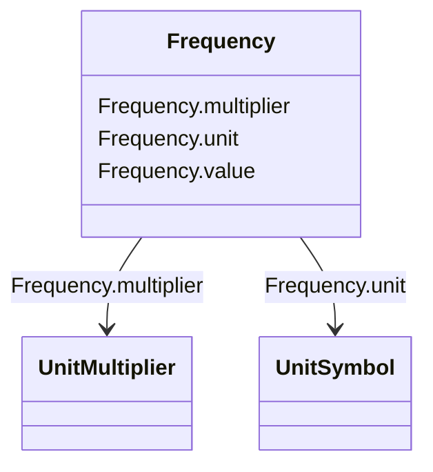

# Frequency

_Cycles per second._

**URI**: [cim:Frequency](http://iec.ch/TC57/CIM100#Frequency) 
**Type**: Class

<!-- no inheritance hierarchy -->

## Attributes

| Name | URI | Cardinality and Range | Description | Inheritance |
| ---  | --- | --- | --- | --- |
| value | [cim:Frequency.value](http://iec.ch/TC57/CIM100#Frequency.value) | 0..1    float  |  | direct |
| unit | [cim:Frequency.unit](http://iec.ch/TC57/CIM100#Frequency.unit) | 0..1    [UnitSymbol](UnitSymbol.md)  |  | direct |
| multiplier | [cim:Frequency.multiplier](http://iec.ch/TC57/CIM100#Frequency.multiplier) | 0..1    [UnitMultiplier](UnitMultiplier.md)  |  | direct |

## Usages

| used by | used in | type | used |
| ---  | --- | --- | --- |
| [GovCT2](GovCT2.md) | flim1 | range | [Frequency](Frequency.md) |
| [GovCT2](GovCT2.md) | flim2 | range | [Frequency](Frequency.md) |
| [GovCT2](GovCT2.md) | flim3 | range | [Frequency](Frequency.md) |
| [GovCT2](GovCT2.md) | flim4 | range | [Frequency](Frequency.md) |
| [GovCT2](GovCT2.md) | flim5 | range | [Frequency](Frequency.md) |
| [GovCT2](GovCT2.md) | flim6 | range | [Frequency](Frequency.md) |
| [GovCT2](GovCT2.md) | flim7 | range | [Frequency](Frequency.md) |
| [GovCT2](GovCT2.md) | flim8 | range | [Frequency](Frequency.md) |
| [GovCT2](GovCT2.md) | flim9 | range | [Frequency](Frequency.md) |
| [GovCT2](GovCT2.md) | flim10 | range | [Frequency](Frequency.md) |
| [GovGAST1](GovGAST1.md) | db1 | range | [Frequency](Frequency.md) |
| [GovGAST1](GovGAST1.md) | eps | range | [Frequency](Frequency.md) |
| [GovHydro2](GovHydro2.md) | db1 | range | [Frequency](Frequency.md) |
| [GovHydro2](GovHydro2.md) | eps | range | [Frequency](Frequency.md) |
| [GovHydro3](GovHydro3.md) | db1 | range | [Frequency](Frequency.md) |
| [GovHydro3](GovHydro3.md) | eps | range | [Frequency](Frequency.md) |
| [GovHydro4](GovHydro4.md) | db1 | range | [Frequency](Frequency.md) |
| [GovHydro4](GovHydro4.md) | eps | range | [Frequency](Frequency.md) |
| [GovHydroDD](GovHydroDD.md) | db1 | range | [Frequency](Frequency.md) |
| [GovHydroDD](GovHydroDD.md) | eps | range | [Frequency](Frequency.md) |
| [GovHydroFrancis](GovHydroFrancis.md) | db1 | range | [Frequency](Frequency.md) |
| [GovHydroPelton](GovHydroPelton.md) | db1 | range | [Frequency](Frequency.md) |
| [GovHydroPelton](GovHydroPelton.md) | db2 | range | [Frequency](Frequency.md) |
| [GovHydroPID](GovHydroPID.md) | db1 | range | [Frequency](Frequency.md) |
| [GovHydroPID](GovHydroPID.md) | eps | range | [Frequency](Frequency.md) |
| [GovHydroR](GovHydroR.md) | db1 | range | [Frequency](Frequency.md) |
| [GovHydroR](GovHydroR.md) | eps | range | [Frequency](Frequency.md) |
| [GovSteam1](GovSteam1.md) | db1 | range | [Frequency](Frequency.md) |
| [GovSteam1](GovSteam1.md) | eps | range | [Frequency](Frequency.md) |

## Identifier and Mapping Information

### Schema Source

* from schema: http://iec.ch/TC57/ns/CIM/Dynamics-EU#Package_DynamicsProfile

## Mappings

| Mapping Type | Mapped Value |
| ---  | ---  |
| self | cim:Frequency |
| native | this:Frequency |

