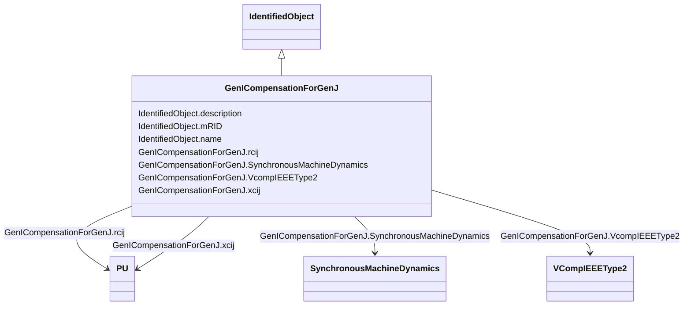

# GenICompensationForGenJ

_Resistive and reactive components of compensation for generator associated with IEEE type 2 voltage compensator for current flow out of another generator in the interconnection._

**URI**: [cim:GenICompensationForGenJ](http://iec.ch/TC57/CIM100#GenICompensationForGenJ) 
**Type**: Class

## Inheritance
* [IdentifiedObject](IdentifiedObject.md)
    * **GenICompensationForGenJ**

## Attributes

| Name | URI | Cardinality and Range | Description | Inheritance |
| ---  | --- | --- | --- | --- |
| SynchronousMachineDynamics | [cim:GenICompensationForGenJ.SynchronousMachineDynamics](http://iec.ch/TC57/CIM100#GenICompensationForGenJ.SynchronousMachineDynamics) | 1..1    [SynchronousMachineDynamics](SynchronousMachineDynamics.md)  | Standard synchronous machine out of which current flow is being compensated f... | direct |
| VcompIEEEType2 | [cim:GenICompensationForGenJ.VcompIEEEType2](http://iec.ch/TC57/CIM100#GenICompensationForGenJ.VcompIEEEType2) | 1..1    [VCompIEEEType2](VCompIEEEType2.md)  | The standard IEEE type 2 voltage compensator of this compensation | direct |
| rcij | [cim:GenICompensationForGenJ.rcij](http://iec.ch/TC57/CIM100#GenICompensationForGenJ.rcij) | 1..1    [PU](PU.md)  | Resistive component of compensation of generator associ... | direct |
| xcij | [cim:GenICompensationForGenJ.xcij](http://iec.ch/TC57/CIM100#GenICompensationForGenJ.xcij) | 1..1    [PU](PU.md)  | Reactive component of compensation of generator associa... | direct |
| description | [cim:IdentifiedObject.description](http://iec.ch/TC57/CIM100#IdentifiedObject.description) | 0..1    string  | The description is a free human readable text describing or naming the object | [IdentifiedObject](IdentifiedObject.md) |
| mRID | [cim:IdentifiedObject.mRID](http://iec.ch/TC57/CIM100#IdentifiedObject.mRID) | 1..1    string  | Master resource identifier issued by a model authority | [IdentifiedObject](IdentifiedObject.md) |
| name | [cim:IdentifiedObject.name](http://iec.ch/TC57/CIM100#IdentifiedObject.name) | 0..1    string  | The name is any free human readable and possibly non unique text naming the o... | [IdentifiedObject](IdentifiedObject.md) |

## Usages

| used by | used in | type | used |
| ---  | --- | --- | --- |
| [SynchronousMachineUserDefined](SynchronousMachineUserDefined.md) | GenICompensationForGenJ | range | [GenICompensationForGenJ](GenICompensationForGenJ.md) |
| [SynchronousMachineSimplified](SynchronousMachineSimplified.md) | GenICompensationForGenJ | range | [GenICompensationForGenJ](GenICompensationForGenJ.md) |
| [SynchronousMachineDynamics](SynchronousMachineDynamics.md) | GenICompensationForGenJ | range | [GenICompensationForGenJ](GenICompensationForGenJ.md) |
| [SynchronousMachineDetailed](SynchronousMachineDetailed.md) | GenICompensationForGenJ | range | [GenICompensationForGenJ](GenICompensationForGenJ.md) |
| [SynchronousMachineTimeConstantReactance](SynchronousMachineTimeConstantReactance.md) | GenICompensationForGenJ | range | [GenICompensationForGenJ](GenICompensationForGenJ.md) |
| [SynchronousMachineEquivalentCircuit](SynchronousMachineEquivalentCircuit.md) | GenICompensationForGenJ | range | [GenICompensationForGenJ](GenICompensationForGenJ.md) |
| [VCompIEEEType2](VCompIEEEType2.md) | GenICompensationForGenJ | range | [GenICompensationForGenJ](GenICompensationForGenJ.md) |

## Identifier and Mapping Information

### Schema Source

* from schema: http://iec.ch/TC57/ns/CIM/Dynamics-EU#Package_DynamicsProfile

## Mappings

| Mapping Type | Mapped Value |
| ---  | ---  |
| self | cim:GenICompensationForGenJ |
| native | this:GenICompensationForGenJ |

