# GovCT1

_General model for any prime mover with a PID governor, used primarily for combustion turbine and combined cycle units._

_This model can be used to represent a variety of prime movers controlled by PID governors.  It is suitable, for example, for the representation of: _

_<ul>_

_	<li>gas turbine and single shaft combined cycle turbines</li>_

_</ul>_

_<ul>_

_	<li>diesel engines with modern electronic or digital governors  </li>_

_</ul>_

_<ul>_

_	<li>steam turbines where steam is supplied from a large boiler drum or a large header whose pressure is substantially constant over the period under study</li>_

_	<li>simple hydro turbines in dam configurations where the water column length is short and water inertia effects are minimal.</li>_

_</ul>_

_Additional information on this model is available in the 2012 IEEE report, <i><u>Dynamic Models for Turbine-Governors in Power System Studies</u></i>, 3.1.2.3 pages 3-4 (GGOV1)._

**URI**: [cim:GovCT1](http://iec.ch/TC57/CIM100#GovCT1) 
**Type**: Class

```mermaid
 classDiagram
    class GovCT1
    click GovCT1 href "../GovCT1"
      TurbineGovernorDynamics <|-- GovCT1
        click TurbineGovernorDynamics href "../TurbineGovernorDynamics"
      
      GovCT1 : GovCT1.aset
        
      GovCT1 : TurbineGovernorDynamics.AsynchronousMachineDynamics
        
          GovCT1 --> AsynchronousMachineDynamics : TurbineGovernorDynamics.AsynchronousMachineDynamics
          click AsynchronousMachineDynamics href "../AsynchronousMachineDynamics"
        
      GovCT1 : GovCT1.db
        
          GovCT1 --> PU : GovCT1.db
          click PU href "../PU"
        
      GovCT1 : IdentifiedObject.description
        
      GovCT1 : GovCT1.dm
        
          GovCT1 --> PU : GovCT1.dm
          click PU href "../PU"
        
      GovCT1 : DynamicsFunctionBlock.enabled
        
      GovCT1 : GovCT1.ka
        
          GovCT1 --> PU : GovCT1.ka
          click PU href "../PU"
        
      GovCT1 : GovCT1.kdgov
        
          GovCT1 --> PU : GovCT1.kdgov
          click PU href "../PU"
        
      GovCT1 : GovCT1.kigov
        
          GovCT1 --> PU : GovCT1.kigov
          click PU href "../PU"
        
      GovCT1 : GovCT1.kiload
        
          GovCT1 --> PU : GovCT1.kiload
          click PU href "../PU"
        
      GovCT1 : GovCT1.kimw
        
          GovCT1 --> PU : GovCT1.kimw
          click PU href "../PU"
        
      GovCT1 : GovCT1.kpgov
        
          GovCT1 --> PU : GovCT1.kpgov
          click PU href "../PU"
        
      GovCT1 : GovCT1.kpload
        
          GovCT1 --> PU : GovCT1.kpload
          click PU href "../PU"
        
      GovCT1 : GovCT1.kturb
        
          GovCT1 --> PU : GovCT1.kturb
          click PU href "../PU"
        
      GovCT1 : GovCT1.ldref
        
          GovCT1 --> PU : GovCT1.ldref
          click PU href "../PU"
        
      GovCT1 : GovCT1.maxerr
        
          GovCT1 --> PU : GovCT1.maxerr
          click PU href "../PU"
        
      GovCT1 : GovCT1.minerr
        
          GovCT1 --> PU : GovCT1.minerr
          click PU href "../PU"
        
      GovCT1 : IdentifiedObject.mRID
        
      GovCT1 : GovCT1.mwbase
        
          GovCT1 --> ActivePower : GovCT1.mwbase
          click ActivePower href "../ActivePower"
        
      GovCT1 : IdentifiedObject.name
        
      GovCT1 : GovCT1.r
        
          GovCT1 --> PU : GovCT1.r
          click PU href "../PU"
        
      GovCT1 : GovCT1.rclose
        
      GovCT1 : GovCT1.rdown
        
          GovCT1 --> PU : GovCT1.rdown
          click PU href "../PU"
        
      GovCT1 : GovCT1.ropen
        
      GovCT1 : GovCT1.rselect
        
          GovCT1 --> DroopSignalFeedbackKind : GovCT1.rselect
          click DroopSignalFeedbackKind href "../DroopSignalFeedbackKind"
        
      GovCT1 : GovCT1.rup
        
          GovCT1 --> PU : GovCT1.rup
          click PU href "../PU"
        
      GovCT1 : TurbineGovernorDynamics.SynchronousMachineDynamics
        
          GovCT1 --> SynchronousMachineDynamics : TurbineGovernorDynamics.SynchronousMachineDynamics
          click SynchronousMachineDynamics href "../SynchronousMachineDynamics"
        
      GovCT1 : GovCT1.ta
        
          GovCT1 --> Seconds : GovCT1.ta
          click Seconds href "../Seconds"
        
      GovCT1 : GovCT1.tact
        
          GovCT1 --> Seconds : GovCT1.tact
          click Seconds href "../Seconds"
        
      GovCT1 : GovCT1.tb
        
          GovCT1 --> Seconds : GovCT1.tb
          click Seconds href "../Seconds"
        
      GovCT1 : GovCT1.tc
        
          GovCT1 --> Seconds : GovCT1.tc
          click Seconds href "../Seconds"
        
      GovCT1 : GovCT1.tdgov
        
          GovCT1 --> Seconds : GovCT1.tdgov
          click Seconds href "../Seconds"
        
      GovCT1 : GovCT1.teng
        
          GovCT1 --> Seconds : GovCT1.teng
          click Seconds href "../Seconds"
        
      GovCT1 : GovCT1.tfload
        
          GovCT1 --> Seconds : GovCT1.tfload
          click Seconds href "../Seconds"
        
      GovCT1 : GovCT1.tpelec
        
          GovCT1 --> Seconds : GovCT1.tpelec
          click Seconds href "../Seconds"
        
      GovCT1 : GovCT1.tsa
        
          GovCT1 --> Seconds : GovCT1.tsa
          click Seconds href "../Seconds"
        
      GovCT1 : GovCT1.tsb
        
          GovCT1 --> Seconds : GovCT1.tsb
          click Seconds href "../Seconds"
        
      GovCT1 : TurbineGovernorDynamics.TurbineLoadControllerDynamics
        
          GovCT1 --> TurbineLoadControllerDynamics : TurbineGovernorDynamics.TurbineLoadControllerDynamics
          click TurbineLoadControllerDynamics href "../TurbineLoadControllerDynamics"
        
      GovCT1 : GovCT1.vmax
        
          GovCT1 --> PU : GovCT1.vmax
          click PU href "../PU"
        
      GovCT1 : GovCT1.vmin
        
          GovCT1 --> PU : GovCT1.vmin
          click PU href "../PU"
        
      GovCT1 : GovCT1.wfnl
        
          GovCT1 --> PU : GovCT1.wfnl
          click PU href "../PU"
        
      GovCT1 : GovCT1.wfspd
        
      
```

## Inheritance
* [IdentifiedObject](IdentifiedObject.md)
    * [DynamicsFunctionBlock](DynamicsFunctionBlock.md)
        * [TurbineGovernorDynamics](TurbineGovernorDynamics.md)
            * **GovCT1**

## Attributes

| Name | URI | Cardinality and Range | Description | Inheritance |
| ---  | --- | --- | --- | --- |
| mwbase | [cim:GovCT1.mwbase](http://iec.ch/TC57/CIM100#GovCT1.mwbase) | 1    [ActivePower](ActivePower.md)  | Base for power values (<i>MWbase</i>) (&gt; 0) | direct |
| r | [cim:GovCT1.r](http://iec.ch/TC57/CIM100#GovCT1.r) | 1    [PU](PU.md)  | Permanent droop (<i>R</i>) | direct |
| rselect | [cim:GovCT1.rselect](http://iec.ch/TC57/CIM100#GovCT1.rselect) | 1    [DroopSignalFeedbackKind](DroopSignalFeedbackKind.md)  | Feedback signal for droop (<i>Rselect</i>) | direct |
| tpelec | [cim:GovCT1.tpelec](http://iec.ch/TC57/CIM100#GovCT1.tpelec) | 1    [Seconds](Seconds.md)  | Electrical power transducer time constant (<i>Tpelec</i>) (&gt; 0) | direct |
| maxerr | [cim:GovCT1.maxerr](http://iec.ch/TC57/CIM100#GovCT1.maxerr) | 1    [PU](PU.md)  | Maximum value for speed error signal (<i>maxerr</i>) (&gt; GovCT1 | direct |
| minerr | [cim:GovCT1.minerr](http://iec.ch/TC57/CIM100#GovCT1.minerr) | 1    [PU](PU.md)  | Minimum value for speed error signal (<i>minerr</i>) (&lt; GovCT1 | direct |
| kpgov | [cim:GovCT1.kpgov](http://iec.ch/TC57/CIM100#GovCT1.kpgov) | 1    [PU](PU.md)  | Governor proportional gain (<i>Kpgov</i>) | direct |
| kigov | [cim:GovCT1.kigov](http://iec.ch/TC57/CIM100#GovCT1.kigov) | 1    [PU](PU.md)  | Governor integral gain (<i>Kigov</i>) | direct |
| kdgov | [cim:GovCT1.kdgov](http://iec.ch/TC57/CIM100#GovCT1.kdgov) | 1    [PU](PU.md)  | Governor derivative gain (<i>Kdgov</i>) | direct |
| tdgov | [cim:GovCT1.tdgov](http://iec.ch/TC57/CIM100#GovCT1.tdgov) | 1    [Seconds](Seconds.md)  | Governor derivative controller time constant (<i>Tdgov</i>) (&gt;= 0) | direct |
| vmax | [cim:GovCT1.vmax](http://iec.ch/TC57/CIM100#GovCT1.vmax) | 1    [PU](PU.md)  | Maximum valve position limit (<i>Vmax</i>) (&gt; GovCT1 | direct |
| vmin | [cim:GovCT1.vmin](http://iec.ch/TC57/CIM100#GovCT1.vmin) | 1    [PU](PU.md)  | Minimum valve position limit (<i>Vmin</i>) (&lt; GovCT1 | direct |
| tact | [cim:GovCT1.tact](http://iec.ch/TC57/CIM100#GovCT1.tact) | 1    [Seconds](Seconds.md)  | Actuator time constant (<i>Tact</i>) (&gt;= 0) | direct |
| kturb | [cim:GovCT1.kturb](http://iec.ch/TC57/CIM100#GovCT1.kturb) | 1    [PU](PU.md)  | Turbine gain (<i>Kturb</i>) (&gt; 0) | direct |
| wfnl | [cim:GovCT1.wfnl](http://iec.ch/TC57/CIM100#GovCT1.wfnl) | 1    [PU](PU.md)  | No load fuel flow (<i>Wfnl</i>) | direct |
| tb | [cim:GovCT1.tb](http://iec.ch/TC57/CIM100#GovCT1.tb) | 1    [Seconds](Seconds.md)  | Turbine lag time constant (<i>Tb</i>) (&gt; 0) | direct |
| tc | [cim:GovCT1.tc](http://iec.ch/TC57/CIM100#GovCT1.tc) | 1    [Seconds](Seconds.md)  | Turbine lead time constant (<i>Tc</i>) (&gt;= 0) | direct |
| wfspd | [cim:GovCT1.wfspd](http://iec.ch/TC57/CIM100#GovCT1.wfspd) | 1    boolean  | Switch for fuel source characteristic to recognize that fuel flow, for a give... | direct |
| teng | [cim:GovCT1.teng](http://iec.ch/TC57/CIM100#GovCT1.teng) | 1    [Seconds](Seconds.md)  | Transport time delay for diesel engine used in representing diesel engines wh... | direct |
| tfload | [cim:GovCT1.tfload](http://iec.ch/TC57/CIM100#GovCT1.tfload) | 1    [Seconds](Seconds.md)  | Load-limiter time constant (<i>Tfload</i>) (&gt; 0) | direct |
| kpload | [cim:GovCT1.kpload](http://iec.ch/TC57/CIM100#GovCT1.kpload) | 1    [PU](PU.md)  | Load limiter proportional gain for PI controller (<i>Kpload</i>) | direct |
| kiload | [cim:GovCT1.kiload](http://iec.ch/TC57/CIM100#GovCT1.kiload) | 1    [PU](PU.md)  | Load limiter integral gain for PI controller (<i>Kiload</i>) | direct |
| ldref | [cim:GovCT1.ldref](http://iec.ch/TC57/CIM100#GovCT1.ldref) | 1    [PU](PU.md)  | Load limiter reference value (<i>Ldref</i>) | direct |
| dm | [cim:GovCT1.dm](http://iec.ch/TC57/CIM100#GovCT1.dm) | 1    [PU](PU.md)  | Speed sensitivity coefficient (<i>Dm</i>) | direct |
| ropen | [cim:GovCT1.ropen](http://iec.ch/TC57/CIM100#GovCT1.ropen) | 1    float  | Maximum valve opening rate (<i>Ropen</i>) | direct |
| rclose | [cim:GovCT1.rclose](http://iec.ch/TC57/CIM100#GovCT1.rclose) | 1    float  | Minimum valve closing rate (<i>Rclose</i>) | direct |
| kimw | [cim:GovCT1.kimw](http://iec.ch/TC57/CIM100#GovCT1.kimw) | 1    [PU](PU.md)  | Power controller (reset) gain (<i>Kimw</i>) | direct |
| aset | [cim:GovCT1.aset](http://iec.ch/TC57/CIM100#GovCT1.aset) | 1    float  | Acceleration limiter setpoint (<i>Aset</i>) | direct |
| ka | [cim:GovCT1.ka](http://iec.ch/TC57/CIM100#GovCT1.ka) | 1    [PU](PU.md)  | Acceleration limiter gain (<i>Ka</i>) | direct |
| ta | [cim:GovCT1.ta](http://iec.ch/TC57/CIM100#GovCT1.ta) | 1    [Seconds](Seconds.md)  | Acceleration limiter time constant (<i>Ta</i>) (&gt; 0) | direct |
| db | [cim:GovCT1.db](http://iec.ch/TC57/CIM100#GovCT1.db) | 1    [PU](PU.md)  | Speed governor deadband in PU speed (<i>db</i>) | direct |
| tsa | [cim:GovCT1.tsa](http://iec.ch/TC57/CIM100#GovCT1.tsa) | 1    [Seconds](Seconds.md)  | Temperature detection lead time constant (<i>Tsa</i>) (&gt;= 0) | direct |
| tsb | [cim:GovCT1.tsb](http://iec.ch/TC57/CIM100#GovCT1.tsb) | 1    [Seconds](Seconds.md)  | Temperature detection lag time constant (<i>Tsb</i>) (&gt;= 0) | direct |
| rup | [cim:GovCT1.rup](http://iec.ch/TC57/CIM100#GovCT1.rup) | 1    [PU](PU.md)  | Maximum rate of load limit increase (<i>Rup</i>) | direct |
| rdown | [cim:GovCT1.rdown](http://iec.ch/TC57/CIM100#GovCT1.rdown) | 1    [PU](PU.md)  | Maximum rate of load limit decrease (<i>Rdown</i>) | direct |
| SynchronousMachineDynamics | [cim:TurbineGovernorDynamics.SynchronousMachineDynamics](http://iec.ch/TC57/CIM100#TurbineGovernorDynamics.SynchronousMachineDynamics) | 0..1    [SynchronousMachineDynamics](SynchronousMachineDynamics.md)  | Synchronous machine model with which this turbine-governor model is associate... | [TurbineGovernorDynamics](TurbineGovernorDynamics.md) |
| AsynchronousMachineDynamics | [cim:TurbineGovernorDynamics.AsynchronousMachineDynamics](http://iec.ch/TC57/CIM100#TurbineGovernorDynamics.AsynchronousMachineDynamics) | 0..1    [AsynchronousMachineDynamics](AsynchronousMachineDynamics.md)  | Asynchronous machine model with which this turbine-governor model is associat... | [TurbineGovernorDynamics](TurbineGovernorDynamics.md) |
| TurbineLoadControllerDynamics | [cim:TurbineGovernorDynamics.TurbineLoadControllerDynamics](http://iec.ch/TC57/CIM100#TurbineGovernorDynamics.TurbineLoadControllerDynamics) | 0..1    [TurbineLoadControllerDynamics](TurbineLoadControllerDynamics.md)  | Turbine load controller providing input to this turbine-governor | [TurbineGovernorDynamics](TurbineGovernorDynamics.md) |
| enabled | [cim:DynamicsFunctionBlock.enabled](http://iec.ch/TC57/CIM100#DynamicsFunctionBlock.enabled) | 1    boolean  | Function block used indicator | [DynamicsFunctionBlock](DynamicsFunctionBlock.md) |
| description | [cim:IdentifiedObject.description](http://iec.ch/TC57/CIM100#IdentifiedObject.description) | 0..1    string  | The description is a free human readable text describing or naming the object | [IdentifiedObject](IdentifiedObject.md) |
| mRID | [cim:IdentifiedObject.mRID](http://iec.ch/TC57/CIM100#IdentifiedObject.mRID) | 1    string  | Master resource identifier issued by a model authority | [IdentifiedObject](IdentifiedObject.md) |
| name | [cim:IdentifiedObject.name](http://iec.ch/TC57/CIM100#IdentifiedObject.name) | 0..1    string  | The name is any free human readable and possibly non unique text naming the o... | [IdentifiedObject](IdentifiedObject.md) |

## Identifier and Mapping Information

### Schema Source

* from schema: http://iec.ch/TC57/ns/CIM/Dynamics-EU#Package_DynamicsProfile

## Mappings

| Mapping Type | Mapped Value |
| ---  | ---  |
| self | cim:GovCT1 |
| native | this:GovCT1 |

