# GovCT2

_General governor with frequency-dependent fuel flow limit.  This model is a modification of the GovCT1<b> </b>model in order to represent the frequency-dependent fuel flow limit of a specific gas turbine manufacturer._

**URI**: [cim:GovCT2](http://iec.ch/TC57/CIM100#GovCT2) 
**Type**: Class

```mermaid
 classDiagram
    class GovCT2
    click GovCT2 href "../GovCT2"
      TurbineGovernorDynamics <|-- GovCT2
        click TurbineGovernorDynamics href "../TurbineGovernorDynamics"
      
      GovCT2 : GovCT2.aset
        
      GovCT2 : TurbineGovernorDynamics.AsynchronousMachineDynamics
        
          GovCT2 --> AsynchronousMachineDynamics : TurbineGovernorDynamics.AsynchronousMachineDynamics
          click AsynchronousMachineDynamics href "../AsynchronousMachineDynamics"
        
      GovCT2 : GovCT2.db
        
          GovCT2 --> PU : GovCT2.db
          click PU href "../PU"
        
      GovCT2 : IdentifiedObject.description
        
      GovCT2 : GovCT2.dm
        
          GovCT2 --> PU : GovCT2.dm
          click PU href "../PU"
        
      GovCT2 : DynamicsFunctionBlock.enabled
        
      GovCT2 : GovCT2.flim1
        
          GovCT2 --> Frequency : GovCT2.flim1
          click Frequency href "../Frequency"
        
      GovCT2 : GovCT2.flim10
        
          GovCT2 --> Frequency : GovCT2.flim10
          click Frequency href "../Frequency"
        
      GovCT2 : GovCT2.flim2
        
          GovCT2 --> Frequency : GovCT2.flim2
          click Frequency href "../Frequency"
        
      GovCT2 : GovCT2.flim3
        
          GovCT2 --> Frequency : GovCT2.flim3
          click Frequency href "../Frequency"
        
      GovCT2 : GovCT2.flim4
        
          GovCT2 --> Frequency : GovCT2.flim4
          click Frequency href "../Frequency"
        
      GovCT2 : GovCT2.flim5
        
          GovCT2 --> Frequency : GovCT2.flim5
          click Frequency href "../Frequency"
        
      GovCT2 : GovCT2.flim6
        
          GovCT2 --> Frequency : GovCT2.flim6
          click Frequency href "../Frequency"
        
      GovCT2 : GovCT2.flim7
        
          GovCT2 --> Frequency : GovCT2.flim7
          click Frequency href "../Frequency"
        
      GovCT2 : GovCT2.flim8
        
          GovCT2 --> Frequency : GovCT2.flim8
          click Frequency href "../Frequency"
        
      GovCT2 : GovCT2.flim9
        
          GovCT2 --> Frequency : GovCT2.flim9
          click Frequency href "../Frequency"
        
      GovCT2 : GovCT2.ka
        
          GovCT2 --> PU : GovCT2.ka
          click PU href "../PU"
        
      GovCT2 : GovCT2.kdgov
        
          GovCT2 --> PU : GovCT2.kdgov
          click PU href "../PU"
        
      GovCT2 : GovCT2.kigov
        
          GovCT2 --> PU : GovCT2.kigov
          click PU href "../PU"
        
      GovCT2 : GovCT2.kiload
        
          GovCT2 --> PU : GovCT2.kiload
          click PU href "../PU"
        
      GovCT2 : GovCT2.kimw
        
          GovCT2 --> PU : GovCT2.kimw
          click PU href "../PU"
        
      GovCT2 : GovCT2.kpgov
        
          GovCT2 --> PU : GovCT2.kpgov
          click PU href "../PU"
        
      GovCT2 : GovCT2.kpload
        
          GovCT2 --> PU : GovCT2.kpload
          click PU href "../PU"
        
      GovCT2 : GovCT2.kturb
        
          GovCT2 --> PU : GovCT2.kturb
          click PU href "../PU"
        
      GovCT2 : GovCT2.ldref
        
          GovCT2 --> PU : GovCT2.ldref
          click PU href "../PU"
        
      GovCT2 : GovCT2.maxerr
        
          GovCT2 --> PU : GovCT2.maxerr
          click PU href "../PU"
        
      GovCT2 : GovCT2.minerr
        
          GovCT2 --> PU : GovCT2.minerr
          click PU href "../PU"
        
      GovCT2 : IdentifiedObject.mRID
        
      GovCT2 : GovCT2.mwbase
        
          GovCT2 --> ActivePower : GovCT2.mwbase
          click ActivePower href "../ActivePower"
        
      GovCT2 : IdentifiedObject.name
        
      GovCT2 : GovCT2.plim1
        
          GovCT2 --> PU : GovCT2.plim1
          click PU href "../PU"
        
      GovCT2 : GovCT2.plim10
        
          GovCT2 --> PU : GovCT2.plim10
          click PU href "../PU"
        
      GovCT2 : GovCT2.plim2
        
          GovCT2 --> PU : GovCT2.plim2
          click PU href "../PU"
        
      GovCT2 : GovCT2.plim3
        
          GovCT2 --> PU : GovCT2.plim3
          click PU href "../PU"
        
      GovCT2 : GovCT2.plim4
        
          GovCT2 --> PU : GovCT2.plim4
          click PU href "../PU"
        
      GovCT2 : GovCT2.plim5
        
          GovCT2 --> PU : GovCT2.plim5
          click PU href "../PU"
        
      GovCT2 : GovCT2.plim6
        
          GovCT2 --> PU : GovCT2.plim6
          click PU href "../PU"
        
      GovCT2 : GovCT2.plim7
        
          GovCT2 --> PU : GovCT2.plim7
          click PU href "../PU"
        
      GovCT2 : GovCT2.plim8
        
          GovCT2 --> PU : GovCT2.plim8
          click PU href "../PU"
        
      GovCT2 : GovCT2.plim9
        
          GovCT2 --> PU : GovCT2.plim9
          click PU href "../PU"
        
      GovCT2 : GovCT2.prate
        
          GovCT2 --> PU : GovCT2.prate
          click PU href "../PU"
        
      GovCT2 : GovCT2.r
        
          GovCT2 --> PU : GovCT2.r
          click PU href "../PU"
        
      GovCT2 : GovCT2.rclose
        
      GovCT2 : GovCT2.rdown
        
          GovCT2 --> PU : GovCT2.rdown
          click PU href "../PU"
        
      GovCT2 : GovCT2.ropen
        
      GovCT2 : GovCT2.rselect
        
          GovCT2 --> DroopSignalFeedbackKind : GovCT2.rselect
          click DroopSignalFeedbackKind href "../DroopSignalFeedbackKind"
        
      GovCT2 : GovCT2.rup
        
          GovCT2 --> PU : GovCT2.rup
          click PU href "../PU"
        
      GovCT2 : TurbineGovernorDynamics.SynchronousMachineDynamics
        
          GovCT2 --> SynchronousMachineDynamics : TurbineGovernorDynamics.SynchronousMachineDynamics
          click SynchronousMachineDynamics href "../SynchronousMachineDynamics"
        
      GovCT2 : GovCT2.ta
        
          GovCT2 --> Seconds : GovCT2.ta
          click Seconds href "../Seconds"
        
      GovCT2 : GovCT2.tact
        
          GovCT2 --> Seconds : GovCT2.tact
          click Seconds href "../Seconds"
        
      GovCT2 : GovCT2.tb
        
          GovCT2 --> Seconds : GovCT2.tb
          click Seconds href "../Seconds"
        
      GovCT2 : GovCT2.tc
        
          GovCT2 --> Seconds : GovCT2.tc
          click Seconds href "../Seconds"
        
      GovCT2 : GovCT2.tdgov
        
          GovCT2 --> Seconds : GovCT2.tdgov
          click Seconds href "../Seconds"
        
      GovCT2 : GovCT2.teng
        
          GovCT2 --> Seconds : GovCT2.teng
          click Seconds href "../Seconds"
        
      GovCT2 : GovCT2.tfload
        
          GovCT2 --> Seconds : GovCT2.tfload
          click Seconds href "../Seconds"
        
      GovCT2 : GovCT2.tpelec
        
          GovCT2 --> Seconds : GovCT2.tpelec
          click Seconds href "../Seconds"
        
      GovCT2 : GovCT2.tsa
        
          GovCT2 --> Seconds : GovCT2.tsa
          click Seconds href "../Seconds"
        
      GovCT2 : GovCT2.tsb
        
          GovCT2 --> Seconds : GovCT2.tsb
          click Seconds href "../Seconds"
        
      GovCT2 : TurbineGovernorDynamics.TurbineLoadControllerDynamics
        
          GovCT2 --> TurbineLoadControllerDynamics : TurbineGovernorDynamics.TurbineLoadControllerDynamics
          click TurbineLoadControllerDynamics href "../TurbineLoadControllerDynamics"
        
      GovCT2 : GovCT2.vmax
        
          GovCT2 --> PU : GovCT2.vmax
          click PU href "../PU"
        
      GovCT2 : GovCT2.vmin
        
          GovCT2 --> PU : GovCT2.vmin
          click PU href "../PU"
        
      GovCT2 : GovCT2.wfnl
        
          GovCT2 --> PU : GovCT2.wfnl
          click PU href "../PU"
        
      GovCT2 : GovCT2.wfspd
        
      
```

## Inheritance
* [IdentifiedObject](IdentifiedObject.md)
    * [DynamicsFunctionBlock](DynamicsFunctionBlock.md)
        * [TurbineGovernorDynamics](TurbineGovernorDynamics.md)
            * **GovCT2**

## Attributes

| Name | URI | Cardinality and Range | Description | Inheritance |
| ---  | --- | --- | --- | --- |
| mwbase | [cim:GovCT2.mwbase](http://iec.ch/TC57/CIM100#GovCT2.mwbase) | 1    [ActivePower](ActivePower.md)  | Base for power values (<i>MWbase</i>) (&gt; 0) | direct |
| r | [cim:GovCT2.r](http://iec.ch/TC57/CIM100#GovCT2.r) | 1    [PU](PU.md)  | Permanent droop (<i>R</i>) | direct |
| rselect | [cim:GovCT2.rselect](http://iec.ch/TC57/CIM100#GovCT2.rselect) | 1    [DroopSignalFeedbackKind](DroopSignalFeedbackKind.md)  | Feedback signal for droop (<i>Rselect</i>) | direct |
| tpelec | [cim:GovCT2.tpelec](http://iec.ch/TC57/CIM100#GovCT2.tpelec) | 1    [Seconds](Seconds.md)  | Electrical power transducer time constant (<i>Tpelec</i>) (&gt;= 0) | direct |
| maxerr | [cim:GovCT2.maxerr](http://iec.ch/TC57/CIM100#GovCT2.maxerr) | 1    [PU](PU.md)  | Maximum value for speed error signal (<i>Maxerr</i>) (&gt; GovCT2 | direct |
| minerr | [cim:GovCT2.minerr](http://iec.ch/TC57/CIM100#GovCT2.minerr) | 1    [PU](PU.md)  | Minimum value for speed error signal (<i>Minerr</i>) (&lt; GovCT2 | direct |
| kpgov | [cim:GovCT2.kpgov](http://iec.ch/TC57/CIM100#GovCT2.kpgov) | 1    [PU](PU.md)  | Governor proportional gain (<i>Kpgov</i>) | direct |
| kigov | [cim:GovCT2.kigov](http://iec.ch/TC57/CIM100#GovCT2.kigov) | 1    [PU](PU.md)  | Governor integral gain (<i>Kigov</i>) | direct |
| kdgov | [cim:GovCT2.kdgov](http://iec.ch/TC57/CIM100#GovCT2.kdgov) | 1    [PU](PU.md)  | Governor derivative gain (<i>Kdgov</i>) | direct |
| tdgov | [cim:GovCT2.tdgov](http://iec.ch/TC57/CIM100#GovCT2.tdgov) | 1    [Seconds](Seconds.md)  | Governor derivative controller time constant (<i>Tdgov</i>) (&gt;= 0) | direct |
| vmax | [cim:GovCT2.vmax](http://iec.ch/TC57/CIM100#GovCT2.vmax) | 1    [PU](PU.md)  | Maximum valve position limit (<i>Vmax</i>) (&gt; GovCT2 | direct |
| vmin | [cim:GovCT2.vmin](http://iec.ch/TC57/CIM100#GovCT2.vmin) | 1    [PU](PU.md)  | Minimum valve position limit (<i>Vmin</i>) (&lt; GovCT2 | direct |
| tact | [cim:GovCT2.tact](http://iec.ch/TC57/CIM100#GovCT2.tact) | 1    [Seconds](Seconds.md)  | Actuator time constant (<i>Tact</i>) (&gt;= 0) | direct |
| kturb | [cim:GovCT2.kturb](http://iec.ch/TC57/CIM100#GovCT2.kturb) | 1    [PU](PU.md)  | Turbine gain (<i>Kturb</i>) | direct |
| wfnl | [cim:GovCT2.wfnl](http://iec.ch/TC57/CIM100#GovCT2.wfnl) | 1    [PU](PU.md)  | No load fuel flow (<i>Wfnl</i>) | direct |
| tb | [cim:GovCT2.tb](http://iec.ch/TC57/CIM100#GovCT2.tb) | 1    [Seconds](Seconds.md)  | Turbine lag time constant (<i>Tb</i>) (&gt;= 0) | direct |
| tc | [cim:GovCT2.tc](http://iec.ch/TC57/CIM100#GovCT2.tc) | 1    [Seconds](Seconds.md)  | Turbine lead time constant (<i>Tc</i>) (&gt;= 0) | direct |
| wfspd | [cim:GovCT2.wfspd](http://iec.ch/TC57/CIM100#GovCT2.wfspd) | 1    boolean  | Switch for fuel source characteristic to recognize that fuel flow, for a give... | direct |
| teng | [cim:GovCT2.teng](http://iec.ch/TC57/CIM100#GovCT2.teng) | 1    [Seconds](Seconds.md)  | Transport time delay for diesel engine used in representing diesel engines wh... | direct |
| tfload | [cim:GovCT2.tfload](http://iec.ch/TC57/CIM100#GovCT2.tfload) | 1    [Seconds](Seconds.md)  | Load limiter time constant (<i>Tfload</i>) (&gt;= 0) | direct |
| kpload | [cim:GovCT2.kpload](http://iec.ch/TC57/CIM100#GovCT2.kpload) | 1    [PU](PU.md)  | Load limiter proportional gain for PI controller (<i>Kpload</i>) | direct |
| kiload | [cim:GovCT2.kiload](http://iec.ch/TC57/CIM100#GovCT2.kiload) | 1    [PU](PU.md)  | Load limiter integral gain for PI controller (<i>Kiload</i>) | direct |
| ldref | [cim:GovCT2.ldref](http://iec.ch/TC57/CIM100#GovCT2.ldref) | 1    [PU](PU.md)  | Load limiter reference value (<i>Ldref</i>) | direct |
| dm | [cim:GovCT2.dm](http://iec.ch/TC57/CIM100#GovCT2.dm) | 1    [PU](PU.md)  | Speed sensitivity coefficient (<i>Dm</i>) | direct |
| ropen | [cim:GovCT2.ropen](http://iec.ch/TC57/CIM100#GovCT2.ropen) | 1    float  | Maximum valve opening rate (<i>Ropen</i>) | direct |
| rclose | [cim:GovCT2.rclose](http://iec.ch/TC57/CIM100#GovCT2.rclose) | 1    float  | Minimum valve closing rate (<i>Rclose</i>) | direct |
| kimw | [cim:GovCT2.kimw](http://iec.ch/TC57/CIM100#GovCT2.kimw) | 1    [PU](PU.md)  | Power controller (reset) gain (<i>Kimw</i>) | direct |
| aset | [cim:GovCT2.aset](http://iec.ch/TC57/CIM100#GovCT2.aset) | 1    float  | Acceleration limiter setpoint (<i>Aset</i>) | direct |
| ka | [cim:GovCT2.ka](http://iec.ch/TC57/CIM100#GovCT2.ka) | 1    [PU](PU.md)  | Acceleration limiter gain (<i>Ka</i>) | direct |
| ta | [cim:GovCT2.ta](http://iec.ch/TC57/CIM100#GovCT2.ta) | 1    [Seconds](Seconds.md)  | Acceleration limiter time constant (<i>Ta</i>) (&gt;= 0) | direct |
| db | [cim:GovCT2.db](http://iec.ch/TC57/CIM100#GovCT2.db) | 1    [PU](PU.md)  | Speed governor deadband in PU speed (<i>db</i>) | direct |
| tsa | [cim:GovCT2.tsa](http://iec.ch/TC57/CIM100#GovCT2.tsa) | 1    [Seconds](Seconds.md)  | Temperature detection lead time constant (<i>Tsa</i>) (&gt;= 0) | direct |
| tsb | [cim:GovCT2.tsb](http://iec.ch/TC57/CIM100#GovCT2.tsb) | 1    [Seconds](Seconds.md)  | Temperature detection lag time constant (<i>Tsb</i>) (&gt;= 0) | direct |
| rup | [cim:GovCT2.rup](http://iec.ch/TC57/CIM100#GovCT2.rup) | 1    [PU](PU.md)  | Maximum rate of load limit increase (<i>Rup</i>) | direct |
| rdown | [cim:GovCT2.rdown](http://iec.ch/TC57/CIM100#GovCT2.rdown) | 1    [PU](PU.md)  | Maximum rate of load limit decrease (<i>Rdown</i>) | direct |
| prate | [cim:GovCT2.prate](http://iec.ch/TC57/CIM100#GovCT2.prate) | 1    [PU](PU.md)  | Ramp rate for frequency-dependent power limit (<i>Prate</i>) | direct |
| flim1 | [cim:GovCT2.flim1](http://iec.ch/TC57/CIM100#GovCT2.flim1) | 1    [Frequency](Frequency.md)  | Frequency threshold 1 (<i>Flim1</i>) | direct |
| plim1 | [cim:GovCT2.plim1](http://iec.ch/TC57/CIM100#GovCT2.plim1) | 1    [PU](PU.md)  | Power limit 1 (<i>Plim1</i>) | direct |
| flim2 | [cim:GovCT2.flim2](http://iec.ch/TC57/CIM100#GovCT2.flim2) | 1    [Frequency](Frequency.md)  | Frequency threshold 2 (<i>Flim2</i>) | direct |
| plim2 | [cim:GovCT2.plim2](http://iec.ch/TC57/CIM100#GovCT2.plim2) | 1    [PU](PU.md)  | Power limit 2 (Plim2) | direct |
| flim3 | [cim:GovCT2.flim3](http://iec.ch/TC57/CIM100#GovCT2.flim3) | 1    [Frequency](Frequency.md)  | Frequency threshold 3 (<i>Flim3</i>) | direct |
| plim3 | [cim:GovCT2.plim3](http://iec.ch/TC57/CIM100#GovCT2.plim3) | 1    [PU](PU.md)  | Power limit 3 (<i>Plim3</i>) | direct |
| flim4 | [cim:GovCT2.flim4](http://iec.ch/TC57/CIM100#GovCT2.flim4) | 1    [Frequency](Frequency.md)  | Frequency threshold 4 (<i>Flim4</i>) | direct |
| plim4 | [cim:GovCT2.plim4](http://iec.ch/TC57/CIM100#GovCT2.plim4) | 1    [PU](PU.md)  | Power limit 4 (<i>Plim4</i>) | direct |
| flim5 | [cim:GovCT2.flim5](http://iec.ch/TC57/CIM100#GovCT2.flim5) | 1    [Frequency](Frequency.md)  | Frequency threshold 5 (<i>Flim5</i>) | direct |
| plim5 | [cim:GovCT2.plim5](http://iec.ch/TC57/CIM100#GovCT2.plim5) | 1    [PU](PU.md)  | Power limit 5 (<i>Plim5</i>) | direct |
| flim6 | [cim:GovCT2.flim6](http://iec.ch/TC57/CIM100#GovCT2.flim6) | 1    [Frequency](Frequency.md)  | Frequency threshold 6 (<i>Flim6</i>) | direct |
| plim6 | [cim:GovCT2.plim6](http://iec.ch/TC57/CIM100#GovCT2.plim6) | 1    [PU](PU.md)  | Power limit 6 (<i>Plim6</i>) | direct |
| flim7 | [cim:GovCT2.flim7](http://iec.ch/TC57/CIM100#GovCT2.flim7) | 1    [Frequency](Frequency.md)  | Frequency threshold 7 (<i>Flim7</i>) | direct |
| plim7 | [cim:GovCT2.plim7](http://iec.ch/TC57/CIM100#GovCT2.plim7) | 1    [PU](PU.md)  | Power limit 7 (<i>Plim7</i>) | direct |
| flim8 | [cim:GovCT2.flim8](http://iec.ch/TC57/CIM100#GovCT2.flim8) | 1    [Frequency](Frequency.md)  | Frequency threshold 8 (<i>Flim8</i>) | direct |
| plim8 | [cim:GovCT2.plim8](http://iec.ch/TC57/CIM100#GovCT2.plim8) | 1    [PU](PU.md)  | Power limit 8 (<i>Plim8</i>) | direct |
| flim9 | [cim:GovCT2.flim9](http://iec.ch/TC57/CIM100#GovCT2.flim9) | 1    [Frequency](Frequency.md)  | Frequency threshold 9 (<i>Flim9</i>) | direct |
| plim9 | [cim:GovCT2.plim9](http://iec.ch/TC57/CIM100#GovCT2.plim9) | 1    [PU](PU.md)  | Power Limit 9 (<i>Plim9</i>) | direct |
| flim10 | [cim:GovCT2.flim10](http://iec.ch/TC57/CIM100#GovCT2.flim10) | 1    [Frequency](Frequency.md)  | Frequency threshold 10 (<i>Flim10</i>) | direct |
| plim10 | [cim:GovCT2.plim10](http://iec.ch/TC57/CIM100#GovCT2.plim10) | 1    [PU](PU.md)  | Power limit 10 (<i>Plim10</i>) | direct |
| SynchronousMachineDynamics | [cim:TurbineGovernorDynamics.SynchronousMachineDynamics](http://iec.ch/TC57/CIM100#TurbineGovernorDynamics.SynchronousMachineDynamics) | 0..1    [SynchronousMachineDynamics](SynchronousMachineDynamics.md)  | Synchronous machine model with which this turbine-governor model is associate... | [TurbineGovernorDynamics](TurbineGovernorDynamics.md) |
| AsynchronousMachineDynamics | [cim:TurbineGovernorDynamics.AsynchronousMachineDynamics](http://iec.ch/TC57/CIM100#TurbineGovernorDynamics.AsynchronousMachineDynamics) | 0..1    [AsynchronousMachineDynamics](AsynchronousMachineDynamics.md)  | Asynchronous machine model with which this turbine-governor model is associat... | [TurbineGovernorDynamics](TurbineGovernorDynamics.md) |
| TurbineLoadControllerDynamics | [cim:TurbineGovernorDynamics.TurbineLoadControllerDynamics](http://iec.ch/TC57/CIM100#TurbineGovernorDynamics.TurbineLoadControllerDynamics) | 0..1    [TurbineLoadControllerDynamics](TurbineLoadControllerDynamics.md)  | Turbine load controller providing input to this turbine-governor | [TurbineGovernorDynamics](TurbineGovernorDynamics.md) |
| enabled | [cim:DynamicsFunctionBlock.enabled](http://iec.ch/TC57/CIM100#DynamicsFunctionBlock.enabled) | 1    boolean  | Function block used indicator | [DynamicsFunctionBlock](DynamicsFunctionBlock.md) |
| description | [cim:IdentifiedObject.description](http://iec.ch/TC57/CIM100#IdentifiedObject.description) | 0..1    string  | The description is a free human readable text describing or naming the object | [IdentifiedObject](IdentifiedObject.md) |
| mRID | [cim:IdentifiedObject.mRID](http://iec.ch/TC57/CIM100#IdentifiedObject.mRID) | 1    string  | Master resource identifier issued by a model authority | [IdentifiedObject](IdentifiedObject.md) |
| name | [cim:IdentifiedObject.name](http://iec.ch/TC57/CIM100#IdentifiedObject.name) | 0..1    string  | The name is any free human readable and possibly non unique text naming the o... | [IdentifiedObject](IdentifiedObject.md) |

## Identifier and Mapping Information

### Schema Source

* from schema: http://iec.ch/TC57/ns/CIM/Dynamics-EU#Package_DynamicsProfile

## Mappings

| Mapping Type | Mapped Value |
| ---  | ---  |
| self | cim:GovCT2 |
| native | this:GovCT2 |

