# GovGAST1

_Modified single shaft gas turbine._

**URI**: [cim:GovGAST1](http://iec.ch/TC57/CIM100#GovGAST1) 
**Type**: Class

```mermaid
 classDiagram
    class GovGAST1
      TurbineGovernorDynamics <|-- GovGAST1
      
      GovGAST1 : GovGAST1.a
        
      GovGAST1 : TurbineGovernorDynamics.AsynchronousMachineDynamics
        
          GovGAST1 --> AsynchronousMachineDynamics : TurbineGovernorDynamics.AsynchronousMachineDynamics
        
      GovGAST1 : GovGAST1.b
        
      GovGAST1 : GovGAST1.db1
        
          GovGAST1 --> Frequency : GovGAST1.db1
        
      GovGAST1 : GovGAST1.db2
        
          GovGAST1 --> ActivePower : GovGAST1.db2
        
      GovGAST1 : IdentifiedObject.description
        
      GovGAST1 : DynamicsFunctionBlock.enabled
        
      GovGAST1 : GovGAST1.eps
        
          GovGAST1 --> Frequency : GovGAST1.eps
        
      GovGAST1 : GovGAST1.fidle
        
          GovGAST1 --> PU : GovGAST1.fidle
        
      GovGAST1 : GovGAST1.gv1
        
          GovGAST1 --> PU : GovGAST1.gv1
        
      GovGAST1 : GovGAST1.gv2
        
          GovGAST1 --> PU : GovGAST1.gv2
        
      GovGAST1 : GovGAST1.gv3
        
          GovGAST1 --> PU : GovGAST1.gv3
        
      GovGAST1 : GovGAST1.gv4
        
          GovGAST1 --> PU : GovGAST1.gv4
        
      GovGAST1 : GovGAST1.gv5
        
          GovGAST1 --> PU : GovGAST1.gv5
        
      GovGAST1 : GovGAST1.gv6
        
          GovGAST1 --> PU : GovGAST1.gv6
        
      GovGAST1 : GovGAST1.ka
        
          GovGAST1 --> PU : GovGAST1.ka
        
      GovGAST1 : GovGAST1.kt
        
          GovGAST1 --> PU : GovGAST1.kt
        
      GovGAST1 : GovGAST1.lmax
        
          GovGAST1 --> PU : GovGAST1.lmax
        
      GovGAST1 : GovGAST1.loadinc
        
          GovGAST1 --> PU : GovGAST1.loadinc
        
      GovGAST1 : GovGAST1.ltrate
        
      GovGAST1 : IdentifiedObject.mRID
        
      GovGAST1 : GovGAST1.mwbase
        
          GovGAST1 --> ActivePower : GovGAST1.mwbase
        
      GovGAST1 : IdentifiedObject.name
        
      GovGAST1 : GovGAST1.pgv1
        
          GovGAST1 --> PU : GovGAST1.pgv1
        
      GovGAST1 : GovGAST1.pgv2
        
          GovGAST1 --> PU : GovGAST1.pgv2
        
      GovGAST1 : GovGAST1.pgv3
        
          GovGAST1 --> PU : GovGAST1.pgv3
        
      GovGAST1 : GovGAST1.pgv4
        
          GovGAST1 --> PU : GovGAST1.pgv4
        
      GovGAST1 : GovGAST1.pgv5
        
          GovGAST1 --> PU : GovGAST1.pgv5
        
      GovGAST1 : GovGAST1.pgv6
        
          GovGAST1 --> PU : GovGAST1.pgv6
        
      GovGAST1 : GovGAST1.r
        
          GovGAST1 --> PU : GovGAST1.r
        
      GovGAST1 : GovGAST1.rmax
        
      GovGAST1 : TurbineGovernorDynamics.SynchronousMachineDynamics
        
          GovGAST1 --> SynchronousMachineDynamics : TurbineGovernorDynamics.SynchronousMachineDynamics
        
      GovGAST1 : GovGAST1.t1
        
          GovGAST1 --> Seconds : GovGAST1.t1
        
      GovGAST1 : GovGAST1.t2
        
          GovGAST1 --> Seconds : GovGAST1.t2
        
      GovGAST1 : GovGAST1.t3
        
          GovGAST1 --> Seconds : GovGAST1.t3
        
      GovGAST1 : GovGAST1.t4
        
          GovGAST1 --> Seconds : GovGAST1.t4
        
      GovGAST1 : GovGAST1.t5
        
          GovGAST1 --> Seconds : GovGAST1.t5
        
      GovGAST1 : GovGAST1.tltr
        
          GovGAST1 --> Seconds : GovGAST1.tltr
        
      GovGAST1 : TurbineGovernorDynamics.TurbineLoadControllerDynamics
        
          GovGAST1 --> TurbineLoadControllerDynamics : TurbineGovernorDynamics.TurbineLoadControllerDynamics
        
      GovGAST1 : GovGAST1.vmax
        
          GovGAST1 --> PU : GovGAST1.vmax
        
      GovGAST1 : GovGAST1.vmin
        
          GovGAST1 --> PU : GovGAST1.vmin
        
      
```

## Inheritance
* [IdentifiedObject](IdentifiedObject.md)
    * [DynamicsFunctionBlock](DynamicsFunctionBlock.md)
        * [TurbineGovernorDynamics](TurbineGovernorDynamics.md)
            * **GovGAST1**

## Attributes

| Name | URI | Cardinality and Range | Description | Inheritance |
| ---  | --- | --- | --- | --- |
| mwbase | [cim:GovGAST1.mwbase](http://iec.ch/TC57/CIM100#GovGAST1.mwbase) | 1..1    [ActivePower](ActivePower.md)  | Base for power values (<i>MWbase</i>) (&gt; 0) | direct |
| r | [cim:GovGAST1.r](http://iec.ch/TC57/CIM100#GovGAST1.r) | 1..1    [PU](PU.md)  | Permanent droop (<i>R</i>) (&gt;0) | direct |
| t1 | [cim:GovGAST1.t1](http://iec.ch/TC57/CIM100#GovGAST1.t1) | 1..1    [Seconds](Seconds.md)  | Governor mechanism time constant (<i>T1</i>) (&gt;= 0) | direct |
| t2 | [cim:GovGAST1.t2](http://iec.ch/TC57/CIM100#GovGAST1.t2) | 1..1    [Seconds](Seconds.md)  | Turbine power time constant (<i>T2</i>) (&gt;= 0) | direct |
| t3 | [cim:GovGAST1.t3](http://iec.ch/TC57/CIM100#GovGAST1.t3) | 1..1    [Seconds](Seconds.md)  | Turbine exhaust temperature time constant (<i>T3</i>) (&gt;= 0) | direct |
| lmax | [cim:GovGAST1.lmax](http://iec.ch/TC57/CIM100#GovGAST1.lmax) | 1..1    [PU](PU.md)  | Ambient temperature load limit (<i>Lmax</i>) | direct |
| kt | [cim:GovGAST1.kt](http://iec.ch/TC57/CIM100#GovGAST1.kt) | 1..1    [PU](PU.md)  | Temperature limiter gain (<i>Kt</i>) | direct |
| vmax | [cim:GovGAST1.vmax](http://iec.ch/TC57/CIM100#GovGAST1.vmax) | 1..1    [PU](PU.md)  | Maximum turbine power, PU of MWbase (<i>Vmax</i>) (&gt; GovGAST1 | direct |
| vmin | [cim:GovGAST1.vmin](http://iec.ch/TC57/CIM100#GovGAST1.vmin) | 1..1    [PU](PU.md)  | Minimum turbine power, PU of MWbase (<i>Vmin</i>) (&lt; GovGAST1 | direct |
| fidle | [cim:GovGAST1.fidle](http://iec.ch/TC57/CIM100#GovGAST1.fidle) | 1..1    [PU](PU.md)  | Fuel flow at zero power output (<i>Fidle</i>) | direct |
| rmax | [cim:GovGAST1.rmax](http://iec.ch/TC57/CIM100#GovGAST1.rmax) | 1..1    float  | Maximum fuel valve opening rate (<i>Rmax</i>) | direct |
| loadinc | [cim:GovGAST1.loadinc](http://iec.ch/TC57/CIM100#GovGAST1.loadinc) | 1..1    [PU](PU.md)  | Valve position change allowed at fast rate (<i>Loadinc</i>) | direct |
| tltr | [cim:GovGAST1.tltr](http://iec.ch/TC57/CIM100#GovGAST1.tltr) | 1..1    [Seconds](Seconds.md)  | Valve position averaging time constant (<i>Tltr</i>) (&gt;= 0) | direct |
| ltrate | [cim:GovGAST1.ltrate](http://iec.ch/TC57/CIM100#GovGAST1.ltrate) | 1..1    float  | Maximum long term fuel valve opening rate (<i>Ltrate</i>) | direct |
| a | [cim:GovGAST1.a](http://iec.ch/TC57/CIM100#GovGAST1.a) | 1..1    float  | Turbine power time constant numerator scale factor (<i>a</i>) | direct |
| b | [cim:GovGAST1.b](http://iec.ch/TC57/CIM100#GovGAST1.b) | 1..1    float  | Turbine power time constant denominator scale factor (<i>b</i>) (&gt;0) | direct |
| db1 | [cim:GovGAST1.db1](http://iec.ch/TC57/CIM100#GovGAST1.db1) | 1..1    [Frequency](Frequency.md)  | Intentional dead-band width (<i>db1</i>) | direct |
| eps | [cim:GovGAST1.eps](http://iec.ch/TC57/CIM100#GovGAST1.eps) | 1..1    [Frequency](Frequency.md)  | Intentional db hysteresis (<i>eps</i>) | direct |
| db2 | [cim:GovGAST1.db2](http://iec.ch/TC57/CIM100#GovGAST1.db2) | 1..1    [ActivePower](ActivePower.md)  | Unintentional dead-band (<i>db2</i>) | direct |
| gv1 | [cim:GovGAST1.gv1](http://iec.ch/TC57/CIM100#GovGAST1.gv1) | 1..1    [PU](PU.md)  | Nonlinear gain point 1, PU gv (<i>Gv1</i>) | direct |
| pgv1 | [cim:GovGAST1.pgv1](http://iec.ch/TC57/CIM100#GovGAST1.pgv1) | 1..1    [PU](PU.md)  | Nonlinear gain point 1, PU power (<i>Pgv1</i>) | direct |
| gv2 | [cim:GovGAST1.gv2](http://iec.ch/TC57/CIM100#GovGAST1.gv2) | 1..1    [PU](PU.md)  | Nonlinear gain point 2,PU gv (<i>Gv2</i>) | direct |
| pgv2 | [cim:GovGAST1.pgv2](http://iec.ch/TC57/CIM100#GovGAST1.pgv2) | 1..1    [PU](PU.md)  | Nonlinear gain point 2, PU power (<i>Pgv2</i>) | direct |
| gv3 | [cim:GovGAST1.gv3](http://iec.ch/TC57/CIM100#GovGAST1.gv3) | 1..1    [PU](PU.md)  | Nonlinear gain point 3, PU gv (<i>Gv3</i>) | direct |
| pgv3 | [cim:GovGAST1.pgv3](http://iec.ch/TC57/CIM100#GovGAST1.pgv3) | 1..1    [PU](PU.md)  | Nonlinear gain point 3, PU power (<i>Pgv3</i>) | direct |
| gv4 | [cim:GovGAST1.gv4](http://iec.ch/TC57/CIM100#GovGAST1.gv4) | 1..1    [PU](PU.md)  | Nonlinear gain point 4, PU gv (<i>Gv4</i>) | direct |
| pgv4 | [cim:GovGAST1.pgv4](http://iec.ch/TC57/CIM100#GovGAST1.pgv4) | 1..1    [PU](PU.md)  | Nonlinear gain point 4, PU power (<i>Pgv4</i>) | direct |
| gv5 | [cim:GovGAST1.gv5](http://iec.ch/TC57/CIM100#GovGAST1.gv5) | 1..1    [PU](PU.md)  | Nonlinear gain point 5, PU gv (<i>Gv5</i>) | direct |
| pgv5 | [cim:GovGAST1.pgv5](http://iec.ch/TC57/CIM100#GovGAST1.pgv5) | 1..1    [PU](PU.md)  | Nonlinear gain point 5, PU power (<i>Pgv5</i>) | direct |
| gv6 | [cim:GovGAST1.gv6](http://iec.ch/TC57/CIM100#GovGAST1.gv6) | 1..1    [PU](PU.md)  | Nonlinear gain point 6, PU gv (<i>Gv6</i>) | direct |
| pgv6 | [cim:GovGAST1.pgv6](http://iec.ch/TC57/CIM100#GovGAST1.pgv6) | 1..1    [PU](PU.md)  | Nonlinear gain point 6, PU power (<i>Pgv6</i>) | direct |
| ka | [cim:GovGAST1.ka](http://iec.ch/TC57/CIM100#GovGAST1.ka) | 1..1    [PU](PU.md)  | Governor gain (<i>Ka</i>) | direct |
| t4 | [cim:GovGAST1.t4](http://iec.ch/TC57/CIM100#GovGAST1.t4) | 1..1    [Seconds](Seconds.md)  | Governor lead time constant (<i>T4</i>) (&gt;= 0) | direct |
| t5 | [cim:GovGAST1.t5](http://iec.ch/TC57/CIM100#GovGAST1.t5) | 1..1    [Seconds](Seconds.md)  | Governor lag time constant (<i>T5</i>) (&gt;= 0) | direct |
| SynchronousMachineDynamics | [cim:TurbineGovernorDynamics.SynchronousMachineDynamics](http://iec.ch/TC57/CIM100#TurbineGovernorDynamics.SynchronousMachineDynamics) | 0..1    [SynchronousMachineDynamics](SynchronousMachineDynamics.md)  | Synchronous machine model with which this turbine-governor model is associate... | [TurbineGovernorDynamics](TurbineGovernorDynamics.md) |
| AsynchronousMachineDynamics | [cim:TurbineGovernorDynamics.AsynchronousMachineDynamics](http://iec.ch/TC57/CIM100#TurbineGovernorDynamics.AsynchronousMachineDynamics) | 0..1    [AsynchronousMachineDynamics](AsynchronousMachineDynamics.md)  | Asynchronous machine model with which this turbine-governor model is associat... | [TurbineGovernorDynamics](TurbineGovernorDynamics.md) |
| TurbineLoadControllerDynamics | [cim:TurbineGovernorDynamics.TurbineLoadControllerDynamics](http://iec.ch/TC57/CIM100#TurbineGovernorDynamics.TurbineLoadControllerDynamics) | 0..1    [TurbineLoadControllerDynamics](TurbineLoadControllerDynamics.md)  | Turbine load controller providing input to this turbine-governor | [TurbineGovernorDynamics](TurbineGovernorDynamics.md) |
| enabled | [cim:DynamicsFunctionBlock.enabled](http://iec.ch/TC57/CIM100#DynamicsFunctionBlock.enabled) | 1..1    boolean  | Function block used indicator | [DynamicsFunctionBlock](DynamicsFunctionBlock.md) |
| description | [cim:IdentifiedObject.description](http://iec.ch/TC57/CIM100#IdentifiedObject.description) | 0..1    string  | The description is a free human readable text describing or naming the object | [IdentifiedObject](IdentifiedObject.md) |
| mRID | [cim:IdentifiedObject.mRID](http://iec.ch/TC57/CIM100#IdentifiedObject.mRID) | 1..1    string  | Master resource identifier issued by a model authority | [IdentifiedObject](IdentifiedObject.md) |
| name | [cim:IdentifiedObject.name](http://iec.ch/TC57/CIM100#IdentifiedObject.name) | 0..1    string  | The name is any free human readable and possibly non unique text naming the o... | [IdentifiedObject](IdentifiedObject.md) |

## Identifier and Mapping Information

### Schema Source

* from schema: http://iec.ch/TC57/ns/CIM/Dynamics-EU#Package_DynamicsProfile

## Mappings

| Mapping Type | Mapped Value |
| ---  | ---  |
| self | cim:GovGAST1 |
| native | this:GovGAST1 |

