# GovGAST2

_Gas turbine._

**URI**: [cim:GovGAST2](http://iec.ch/TC57/CIM100#GovGAST2) 
**Type**: Class

```mermaid
 classDiagram
    class GovGAST2
    click GovGAST2 href "../GovGAST2"
      TurbineGovernorDynamics <|-- GovGAST2
        click TurbineGovernorDynamics href "../TurbineGovernorDynamics"
      
      GovGAST2 : GovGAST2.a
        
      GovGAST2 : GovGAST2.af1
        
          GovGAST2 --> PU : GovGAST2.af1
          click PU href "../PU"
        
      GovGAST2 : GovGAST2.af2
        
          GovGAST2 --> PU : GovGAST2.af2
          click PU href "../PU"
        
      GovGAST2 : TurbineGovernorDynamics.AsynchronousMachineDynamics
        
          GovGAST2 --> AsynchronousMachineDynamics : TurbineGovernorDynamics.AsynchronousMachineDynamics
          click AsynchronousMachineDynamics href "../AsynchronousMachineDynamics"
        
      GovGAST2 : GovGAST2.b
        
      GovGAST2 : GovGAST2.bf1
        
          GovGAST2 --> PU : GovGAST2.bf1
          click PU href "../PU"
        
      GovGAST2 : GovGAST2.bf2
        
          GovGAST2 --> PU : GovGAST2.bf2
          click PU href "../PU"
        
      GovGAST2 : GovGAST2.c
        
      GovGAST2 : GovGAST2.cf2
        
          GovGAST2 --> PU : GovGAST2.cf2
          click PU href "../PU"
        
      GovGAST2 : IdentifiedObject.description
        
      GovGAST2 : GovGAST2.ecr
        
          GovGAST2 --> Seconds : GovGAST2.ecr
          click Seconds href "../Seconds"
        
      GovGAST2 : DynamicsFunctionBlock.enabled
        
      GovGAST2 : GovGAST2.etd
        
          GovGAST2 --> Seconds : GovGAST2.etd
          click Seconds href "../Seconds"
        
      GovGAST2 : GovGAST2.k3
        
          GovGAST2 --> PU : GovGAST2.k3
          click PU href "../PU"
        
      GovGAST2 : GovGAST2.k4
        
          GovGAST2 --> PU : GovGAST2.k4
          click PU href "../PU"
        
      GovGAST2 : GovGAST2.k5
        
          GovGAST2 --> PU : GovGAST2.k5
          click PU href "../PU"
        
      GovGAST2 : GovGAST2.k6
        
          GovGAST2 --> PU : GovGAST2.k6
          click PU href "../PU"
        
      GovGAST2 : GovGAST2.kf
        
          GovGAST2 --> PU : GovGAST2.kf
          click PU href "../PU"
        
      GovGAST2 : IdentifiedObject.mRID
        
      GovGAST2 : GovGAST2.mwbase
        
          GovGAST2 --> ActivePower : GovGAST2.mwbase
          click ActivePower href "../ActivePower"
        
      GovGAST2 : IdentifiedObject.name
        
      GovGAST2 : TurbineGovernorDynamics.SynchronousMachineDynamics
        
          GovGAST2 --> SynchronousMachineDynamics : TurbineGovernorDynamics.SynchronousMachineDynamics
          click SynchronousMachineDynamics href "../SynchronousMachineDynamics"
        
      GovGAST2 : GovGAST2.t
        
          GovGAST2 --> Seconds : GovGAST2.t
          click Seconds href "../Seconds"
        
      GovGAST2 : GovGAST2.t3
        
          GovGAST2 --> Seconds : GovGAST2.t3
          click Seconds href "../Seconds"
        
      GovGAST2 : GovGAST2.t4
        
          GovGAST2 --> Seconds : GovGAST2.t4
          click Seconds href "../Seconds"
        
      GovGAST2 : GovGAST2.t5
        
          GovGAST2 --> Seconds : GovGAST2.t5
          click Seconds href "../Seconds"
        
      GovGAST2 : GovGAST2.tc
        
          GovGAST2 --> Temperature : GovGAST2.tc
          click Temperature href "../Temperature"
        
      GovGAST2 : GovGAST2.tcd
        
          GovGAST2 --> Seconds : GovGAST2.tcd
          click Seconds href "../Seconds"
        
      GovGAST2 : GovGAST2.tf
        
          GovGAST2 --> Seconds : GovGAST2.tf
          click Seconds href "../Seconds"
        
      GovGAST2 : GovGAST2.tmax
        
          GovGAST2 --> PU : GovGAST2.tmax
          click PU href "../PU"
        
      GovGAST2 : GovGAST2.tmin
        
          GovGAST2 --> PU : GovGAST2.tmin
          click PU href "../PU"
        
      GovGAST2 : GovGAST2.tr
        
          GovGAST2 --> Temperature : GovGAST2.tr
          click Temperature href "../Temperature"
        
      GovGAST2 : GovGAST2.trate
        
          GovGAST2 --> ActivePower : GovGAST2.trate
          click ActivePower href "../ActivePower"
        
      GovGAST2 : GovGAST2.tt
        
          GovGAST2 --> Seconds : GovGAST2.tt
          click Seconds href "../Seconds"
        
      GovGAST2 : TurbineGovernorDynamics.TurbineLoadControllerDynamics
        
          GovGAST2 --> TurbineLoadControllerDynamics : TurbineGovernorDynamics.TurbineLoadControllerDynamics
          click TurbineLoadControllerDynamics href "../TurbineLoadControllerDynamics"
        
      GovGAST2 : GovGAST2.w
        
          GovGAST2 --> PU : GovGAST2.w
          click PU href "../PU"
        
      GovGAST2 : GovGAST2.x
        
          GovGAST2 --> Seconds : GovGAST2.x
          click Seconds href "../Seconds"
        
      GovGAST2 : GovGAST2.y
        
          GovGAST2 --> Seconds : GovGAST2.y
          click Seconds href "../Seconds"
        
      GovGAST2 : GovGAST2.z
        
      
```

## Inheritance
* [IdentifiedObject](IdentifiedObject.md)
    * [DynamicsFunctionBlock](DynamicsFunctionBlock.md)
        * [TurbineGovernorDynamics](TurbineGovernorDynamics.md)
            * **GovGAST2**

## Attributes

| Name | URI | Cardinality and Range | Description | Inheritance |
| ---  | --- | --- | --- | --- |
| mwbase | [cim:GovGAST2.mwbase](http://iec.ch/TC57/CIM100#GovGAST2.mwbase) | 1    [ActivePower](ActivePower.md)  | Base for power values (<i>MWbase</i>) (&gt; 0) | direct |
| w | [cim:GovGAST2.w](http://iec.ch/TC57/CIM100#GovGAST2.w) | 1    [PU](PU.md)  | Governor gain (1/droop) on turbine rating (<i>W</i>) | direct |
| x | [cim:GovGAST2.x](http://iec.ch/TC57/CIM100#GovGAST2.x) | 1    [Seconds](Seconds.md)  | Governor lead time constant (<i>X</i>) (&gt;= 0) | direct |
| y | [cim:GovGAST2.y](http://iec.ch/TC57/CIM100#GovGAST2.y) | 1    [Seconds](Seconds.md)  | Governor lag time constant (<i>Y</i>) (&gt; 0) | direct |
| z | [cim:GovGAST2.z](http://iec.ch/TC57/CIM100#GovGAST2.z) | 1    integer  | Governor mode (<i>Z</i>) | direct |
| etd | [cim:GovGAST2.etd](http://iec.ch/TC57/CIM100#GovGAST2.etd) | 1    [Seconds](Seconds.md)  | Turbine and exhaust delay (<i>Etd</i>) (&gt;= 0) | direct |
| tcd | [cim:GovGAST2.tcd](http://iec.ch/TC57/CIM100#GovGAST2.tcd) | 1    [Seconds](Seconds.md)  | Compressor discharge time constant (<i>Tcd</i>) (&gt;= 0) | direct |
| trate | [cim:GovGAST2.trate](http://iec.ch/TC57/CIM100#GovGAST2.trate) | 1    [ActivePower](ActivePower.md)  | Turbine rating (<i>Trate</i>) | direct |
| t | [cim:GovGAST2.t](http://iec.ch/TC57/CIM100#GovGAST2.t) | 1    [Seconds](Seconds.md)  | Fuel control time constant (<i>T</i>) (&gt;= 0) | direct |
| tmax | [cim:GovGAST2.tmax](http://iec.ch/TC57/CIM100#GovGAST2.tmax) | 1    [PU](PU.md)  | Maximum turbine limit (<i>Tmax</i>) (&gt; GovGAST2 | direct |
| tmin | [cim:GovGAST2.tmin](http://iec.ch/TC57/CIM100#GovGAST2.tmin) | 1    [PU](PU.md)  | Minimum turbine limit (<i>Tmin</i>) (&lt; GovGAST2 | direct |
| ecr | [cim:GovGAST2.ecr](http://iec.ch/TC57/CIM100#GovGAST2.ecr) | 1    [Seconds](Seconds.md)  | Combustion reaction time delay (<i>Ecr</i>) (&gt;= 0) | direct |
| k3 | [cim:GovGAST2.k3](http://iec.ch/TC57/CIM100#GovGAST2.k3) | 1    [PU](PU.md)  | Ratio of fuel adjustment (<i>K3</i>) | direct |
| a | [cim:GovGAST2.a](http://iec.ch/TC57/CIM100#GovGAST2.a) | 1    float  | Valve positioner (<i>A</i>) | direct |
| b | [cim:GovGAST2.b](http://iec.ch/TC57/CIM100#GovGAST2.b) | 1    float  | Valve positioner (<i>B</i>) | direct |
| c | [cim:GovGAST2.c](http://iec.ch/TC57/CIM100#GovGAST2.c) | 1    float  | Valve positioner (<i>C</i>) | direct |
| tf | [cim:GovGAST2.tf](http://iec.ch/TC57/CIM100#GovGAST2.tf) | 1    [Seconds](Seconds.md)  | Fuel system time constant (<i>Tf</i>) (&gt;= 0) | direct |
| kf | [cim:GovGAST2.kf](http://iec.ch/TC57/CIM100#GovGAST2.kf) | 1    [PU](PU.md)  | Fuel system feedback (<i>Kf</i>) | direct |
| k5 | [cim:GovGAST2.k5](http://iec.ch/TC57/CIM100#GovGAST2.k5) | 1    [PU](PU.md)  | Gain of radiation shield (<i>K5</i>) | direct |
| k4 | [cim:GovGAST2.k4](http://iec.ch/TC57/CIM100#GovGAST2.k4) | 1    [PU](PU.md)  | Gain of radiation shield (<i>K4</i>) | direct |
| t3 | [cim:GovGAST2.t3](http://iec.ch/TC57/CIM100#GovGAST2.t3) | 1    [Seconds](Seconds.md)  | Radiation shield time constant (<i>T3</i>) (&gt;= 0) | direct |
| t4 | [cim:GovGAST2.t4](http://iec.ch/TC57/CIM100#GovGAST2.t4) | 1    [Seconds](Seconds.md)  | Thermocouple time constant (<i>T4</i>) (&gt;= 0) | direct |
| tt | [cim:GovGAST2.tt](http://iec.ch/TC57/CIM100#GovGAST2.tt) | 1    [Seconds](Seconds.md)  | Temperature controller integration rate (<i>Tt</i>) (&gt;= 0) | direct |
| t5 | [cim:GovGAST2.t5](http://iec.ch/TC57/CIM100#GovGAST2.t5) | 1    [Seconds](Seconds.md)  | Temperature control time constant (<i>T5</i>) (&gt;= 0) | direct |
| af1 | [cim:GovGAST2.af1](http://iec.ch/TC57/CIM100#GovGAST2.af1) | 1    [PU](PU.md)  | Exhaust temperature parameter (<i>Af1</i>) | direct |
| bf1 | [cim:GovGAST2.bf1](http://iec.ch/TC57/CIM100#GovGAST2.bf1) | 1    [PU](PU.md)  | (<i>Bf1</i>) | direct |
| af2 | [cim:GovGAST2.af2](http://iec.ch/TC57/CIM100#GovGAST2.af2) | 1    [PU](PU.md)  | Coefficient equal to 0,5(1-speed) (<i>Af2</i>) | direct |
| bf2 | [cim:GovGAST2.bf2](http://iec.ch/TC57/CIM100#GovGAST2.bf2) | 1    [PU](PU.md)  | Turbine torque coefficient Khhv (depends on heating value of fuel ... | direct |
| cf2 | [cim:GovGAST2.cf2](http://iec.ch/TC57/CIM100#GovGAST2.cf2) | 1    [PU](PU.md)  | Coefficient defining fuel flow where power output is 0% (<i>Cf2</i>) | direct |
| tr | [cim:GovGAST2.tr](http://iec.ch/TC57/CIM100#GovGAST2.tr) | 1    [Temperature](Temperature.md)  | Rated temperature (<i>Tr</i>) | direct |
| k6 | [cim:GovGAST2.k6](http://iec.ch/TC57/CIM100#GovGAST2.k6) | 1    [PU](PU.md)  | Minimum fuel flow (<i>K6</i>) | direct |
| tc | [cim:GovGAST2.tc](http://iec.ch/TC57/CIM100#GovGAST2.tc) | 1    [Temperature](Temperature.md)  | Temperature control (<i>Tc</i>) | direct |
| SynchronousMachineDynamics | [cim:TurbineGovernorDynamics.SynchronousMachineDynamics](http://iec.ch/TC57/CIM100#TurbineGovernorDynamics.SynchronousMachineDynamics) | 0..1    [SynchronousMachineDynamics](SynchronousMachineDynamics.md)  | Synchronous machine model with which this turbine-governor model is associate... | [TurbineGovernorDynamics](TurbineGovernorDynamics.md) |
| AsynchronousMachineDynamics | [cim:TurbineGovernorDynamics.AsynchronousMachineDynamics](http://iec.ch/TC57/CIM100#TurbineGovernorDynamics.AsynchronousMachineDynamics) | 0..1    [AsynchronousMachineDynamics](AsynchronousMachineDynamics.md)  | Asynchronous machine model with which this turbine-governor model is associat... | [TurbineGovernorDynamics](TurbineGovernorDynamics.md) |
| TurbineLoadControllerDynamics | [cim:TurbineGovernorDynamics.TurbineLoadControllerDynamics](http://iec.ch/TC57/CIM100#TurbineGovernorDynamics.TurbineLoadControllerDynamics) | 0..1    [TurbineLoadControllerDynamics](TurbineLoadControllerDynamics.md)  | Turbine load controller providing input to this turbine-governor | [TurbineGovernorDynamics](TurbineGovernorDynamics.md) |
| enabled | [cim:DynamicsFunctionBlock.enabled](http://iec.ch/TC57/CIM100#DynamicsFunctionBlock.enabled) | 1    boolean  | Function block used indicator | [DynamicsFunctionBlock](DynamicsFunctionBlock.md) |
| description | [cim:IdentifiedObject.description](http://iec.ch/TC57/CIM100#IdentifiedObject.description) | 0..1    string  | The description is a free human readable text describing or naming the object | [IdentifiedObject](IdentifiedObject.md) |
| mRID | [cim:IdentifiedObject.mRID](http://iec.ch/TC57/CIM100#IdentifiedObject.mRID) | 1    string  | Master resource identifier issued by a model authority | [IdentifiedObject](IdentifiedObject.md) |
| name | [cim:IdentifiedObject.name](http://iec.ch/TC57/CIM100#IdentifiedObject.name) | 0..1    string  | The name is any free human readable and possibly non unique text naming the o... | [IdentifiedObject](IdentifiedObject.md) |

## Identifier and Mapping Information

### Schema Source

* from schema: http://iec.ch/TC57/ns/CIM/Dynamics-EU#Package_DynamicsProfile

## Mappings

| Mapping Type | Mapped Value |
| ---  | ---  |
| self | cim:GovGAST2 |
| native | this:GovGAST2 |

