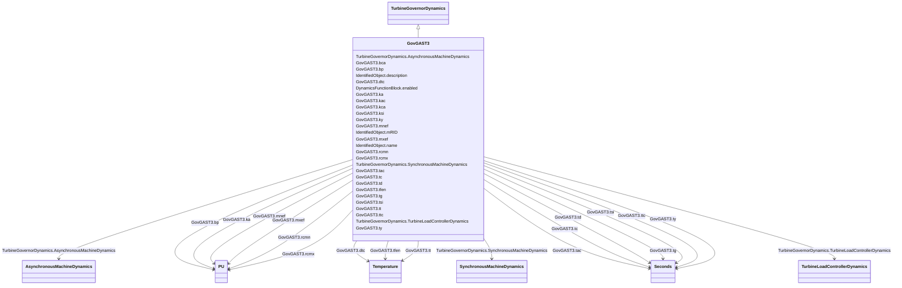

# GovGAST3

_Generic turbogas with acceleration and temperature controller._

**URI**: [cim:GovGAST3](http://iec.ch/TC57/CIM100#GovGAST3) 
**Type**: Class

## Inheritance
* [IdentifiedObject](IdentifiedObject.md)
    * [DynamicsFunctionBlock](DynamicsFunctionBlock.md)
        * [TurbineGovernorDynamics](TurbineGovernorDynamics.md)
            * **GovGAST3**

## Attributes

| Name | URI | Cardinality and Range | Description | Inheritance |
| ---  | --- | --- | --- | --- |
| bp | [cim:GovGAST3.bp](http://iec.ch/TC57/CIM100#GovGAST3.bp) | 1..1    [PU](PU.md)  | Droop (<i>bp</i>) | direct |
| tg | [cim:GovGAST3.tg](http://iec.ch/TC57/CIM100#GovGAST3.tg) | 1..1    [Seconds](Seconds.md)  | Time constant of speed governor (<i>Tg</i>) (&gt;= 0) | direct |
| rcmx | [cim:GovGAST3.rcmx](http://iec.ch/TC57/CIM100#GovGAST3.rcmx) | 1..1    [PU](PU.md)  | Maximum fuel flow (<i>RCMX</i>) | direct |
| rcmn | [cim:GovGAST3.rcmn](http://iec.ch/TC57/CIM100#GovGAST3.rcmn) | 1..1    [PU](PU.md)  | Minimum fuel flow (<i>RCMN</i>) | direct |
| ky | [cim:GovGAST3.ky](http://iec.ch/TC57/CIM100#GovGAST3.ky) | 1..1    float  | Coefficient of transfer function of fuel valve positioner (<i>Ky</i>) | direct |
| ty | [cim:GovGAST3.ty](http://iec.ch/TC57/CIM100#GovGAST3.ty) | 1..1    [Seconds](Seconds.md)  | Time constant of fuel valve positioner (<i>Ty</i>) (&gt;= 0) | direct |
| tac | [cim:GovGAST3.tac](http://iec.ch/TC57/CIM100#GovGAST3.tac) | 1..1    [Seconds](Seconds.md)  | Fuel control time constant (<i>Tac</i>) (&gt;= 0) | direct |
| kac | [cim:GovGAST3.kac](http://iec.ch/TC57/CIM100#GovGAST3.kac) | 1..1    float  | Fuel system feedback (<i>K</i><i>AC</i>) | direct |
| tc | [cim:GovGAST3.tc](http://iec.ch/TC57/CIM100#GovGAST3.tc) | 1..1    [Seconds](Seconds.md)  | Compressor discharge volume time constant (<i>Tc</i>) (&gt;= 0) | direct |
| bca | [cim:GovGAST3.bca](http://iec.ch/TC57/CIM100#GovGAST3.bca) | 1..1    float  | Acceleration limit set-point (<i>Bca</i>) | direct |
| kca | [cim:GovGAST3.kca](http://iec.ch/TC57/CIM100#GovGAST3.kca) | 1..1    float  | Acceleration control integral gain (<i>Kca</i>) | direct |
| dtc | [cim:GovGAST3.dtc](http://iec.ch/TC57/CIM100#GovGAST3.dtc) | 1..1    [Temperature](Temperature.md)  | Exhaust temperature variation due to fuel flow increasing from 0 to 1 PU (<i>... | direct |
| ka | [cim:GovGAST3.ka](http://iec.ch/TC57/CIM100#GovGAST3.ka) | 1..1    [PU](PU.md)  | Minimum fuel flow (<i>Ka</i>) | direct |
| tsi | [cim:GovGAST3.tsi](http://iec.ch/TC57/CIM100#GovGAST3.tsi) | 1..1    [Seconds](Seconds.md)  | Time constant of radiation shield (<i>Tsi</i>) (&gt;= 0) | direct |
| ksi | [cim:GovGAST3.ksi](http://iec.ch/TC57/CIM100#GovGAST3.ksi) | 1..1    float  | Gain of radiation shield (<i>Ksi</i>) | direct |
| ttc | [cim:GovGAST3.ttc](http://iec.ch/TC57/CIM100#GovGAST3.ttc) | 1..1    [Seconds](Seconds.md)  | Time constant of thermocouple (<i>Ttc</i>) (&gt;= 0) | direct |
| tfen | [cim:GovGAST3.tfen](http://iec.ch/TC57/CIM100#GovGAST3.tfen) | 1..1    [Temperature](Temperature.md)  | Turbine rated exhaust temperature correspondent to Pm=1 PU (<i>Tfen</i>) | direct |
| td | [cim:GovGAST3.td](http://iec.ch/TC57/CIM100#GovGAST3.td) | 1..1    [Seconds](Seconds.md)  | Temperature controller derivative gain (<i>Td</i>) (&gt;= 0) | direct |
| tt | [cim:GovGAST3.tt](http://iec.ch/TC57/CIM100#GovGAST3.tt) | 1..1    [Temperature](Temperature.md)  | Temperature controller integration rate (<i>Tt</i>) | direct |
| mxef | [cim:GovGAST3.mxef](http://iec.ch/TC57/CIM100#GovGAST3.mxef) | 1..1    [PU](PU.md)  | Fuel flow maximum positive error value (<i>MXef</i>) | direct |
| mnef | [cim:GovGAST3.mnef](http://iec.ch/TC57/CIM100#GovGAST3.mnef) | 1..1    [PU](PU.md)  | Fuel flow maximum negative error value (<i>MNef</i>) | direct |
| SynchronousMachineDynamics | [cim:TurbineGovernorDynamics.SynchronousMachineDynamics](http://iec.ch/TC57/CIM100#TurbineGovernorDynamics.SynchronousMachineDynamics) | 0..1    [SynchronousMachineDynamics](SynchronousMachineDynamics.md)  | Synchronous machine model with which this turbine-governor model is associate... | [TurbineGovernorDynamics](TurbineGovernorDynamics.md) |
| AsynchronousMachineDynamics | [cim:TurbineGovernorDynamics.AsynchronousMachineDynamics](http://iec.ch/TC57/CIM100#TurbineGovernorDynamics.AsynchronousMachineDynamics) | 0..1    [AsynchronousMachineDynamics](AsynchronousMachineDynamics.md)  | Asynchronous machine model with which this turbine-governor model is associat... | [TurbineGovernorDynamics](TurbineGovernorDynamics.md) |
| TurbineLoadControllerDynamics | [cim:TurbineGovernorDynamics.TurbineLoadControllerDynamics](http://iec.ch/TC57/CIM100#TurbineGovernorDynamics.TurbineLoadControllerDynamics) | 0..1    [TurbineLoadControllerDynamics](TurbineLoadControllerDynamics.md)  | Turbine load controller providing input to this turbine-governor | [TurbineGovernorDynamics](TurbineGovernorDynamics.md) |
| enabled | [cim:DynamicsFunctionBlock.enabled](http://iec.ch/TC57/CIM100#DynamicsFunctionBlock.enabled) | 1..1    boolean  | Function block used indicator | [DynamicsFunctionBlock](DynamicsFunctionBlock.md) |
| description | [cim:IdentifiedObject.description](http://iec.ch/TC57/CIM100#IdentifiedObject.description) | 0..1    string  | The description is a free human readable text describing or naming the object | [IdentifiedObject](IdentifiedObject.md) |
| mRID | [cim:IdentifiedObject.mRID](http://iec.ch/TC57/CIM100#IdentifiedObject.mRID) | 1..1    string  | Master resource identifier issued by a model authority | [IdentifiedObject](IdentifiedObject.md) |
| name | [cim:IdentifiedObject.name](http://iec.ch/TC57/CIM100#IdentifiedObject.name) | 0..1    string  | The name is any free human readable and possibly non unique text naming the o... | [IdentifiedObject](IdentifiedObject.md) |

## Identifier and Mapping Information

### Schema Source

* from schema: http://iec.ch/TC57/ns/CIM/Dynamics-EU#Package_DynamicsProfile

## Mappings

| Mapping Type | Mapped Value |
| ---  | ---  |
| self | cim:GovGAST3 |
| native | this:GovGAST3 |

