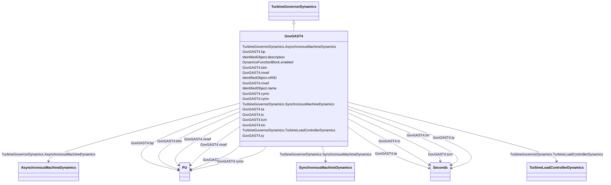

# GovGAST4

_Generic turbogas._

**URI**: [cim:GovGAST4](http://iec.ch/TC57/CIM100#GovGAST4) 
**Type**: Class

## Inheritance
* [IdentifiedObject](IdentifiedObject.md)
    * [DynamicsFunctionBlock](DynamicsFunctionBlock.md)
        * [TurbineGovernorDynamics](TurbineGovernorDynamics.md)
            * **GovGAST4**

## Attributes

| Name | URI | Cardinality and Range | Description | Inheritance |
| ---  | --- | --- | --- | --- |
| bp | [cim:GovGAST4.bp](http://iec.ch/TC57/CIM100#GovGAST4.bp) | 1..1    [PU](PU.md)  | Droop (<i>b</i><i>p</i>) | direct |
| ty | [cim:GovGAST4.ty](http://iec.ch/TC57/CIM100#GovGAST4.ty) | 1..1    [Seconds](Seconds.md)  | Time constant of fuel valve positioner (<i>Ty</i>) (&gt;= 0) | direct |
| ta | [cim:GovGAST4.ta](http://iec.ch/TC57/CIM100#GovGAST4.ta) | 1..1    [Seconds](Seconds.md)  | Maximum gate opening velocity (<i>TA</i>) (&gt;= 0) | direct |
| tc | [cim:GovGAST4.tc](http://iec.ch/TC57/CIM100#GovGAST4.tc) | 1..1    [Seconds](Seconds.md)  | Maximum gate closing velocity (<i>TC</i>) (&gt;= 0) | direct |
| tcm | [cim:GovGAST4.tcm](http://iec.ch/TC57/CIM100#GovGAST4.tcm) | 1..1    [Seconds](Seconds.md)  | Fuel control time constant (<i>Tcm</i>) (&gt;= 0) | direct |
| ktm | [cim:GovGAST4.ktm](http://iec.ch/TC57/CIM100#GovGAST4.ktm) | 1..1    [PU](PU.md)  | Compressor gain (<i>Ktm</i>) | direct |
| tm | [cim:GovGAST4.tm](http://iec.ch/TC57/CIM100#GovGAST4.tm) | 1..1    [Seconds](Seconds.md)  | Compressor discharge volume time constant (<i>Tm</i>) (&gt;= 0) | direct |
| rymx | [cim:GovGAST4.rymx](http://iec.ch/TC57/CIM100#GovGAST4.rymx) | 1..1    [PU](PU.md)  | Maximum valve opening (<i>RYMX</i>) | direct |
| rymn | [cim:GovGAST4.rymn](http://iec.ch/TC57/CIM100#GovGAST4.rymn) | 1..1    [PU](PU.md)  | Minimum valve opening (<i>RYMN</i>) | direct |
| mxef | [cim:GovGAST4.mxef](http://iec.ch/TC57/CIM100#GovGAST4.mxef) | 1..1    [PU](PU.md)  | Fuel flow maximum positive error value (<i>MXef</i>) | direct |
| mnef | [cim:GovGAST4.mnef](http://iec.ch/TC57/CIM100#GovGAST4.mnef) | 1..1    [PU](PU.md)  | Fuel flow maximum negative error value (<i>MNef</i>) | direct |
| SynchronousMachineDynamics | [cim:TurbineGovernorDynamics.SynchronousMachineDynamics](http://iec.ch/TC57/CIM100#TurbineGovernorDynamics.SynchronousMachineDynamics) | 0..1    [SynchronousMachineDynamics](SynchronousMachineDynamics.md)  | Synchronous machine model with which this turbine-governor model is associate... | [TurbineGovernorDynamics](TurbineGovernorDynamics.md) |
| AsynchronousMachineDynamics | [cim:TurbineGovernorDynamics.AsynchronousMachineDynamics](http://iec.ch/TC57/CIM100#TurbineGovernorDynamics.AsynchronousMachineDynamics) | 0..1    [AsynchronousMachineDynamics](AsynchronousMachineDynamics.md)  | Asynchronous machine model with which this turbine-governor model is associat... | [TurbineGovernorDynamics](TurbineGovernorDynamics.md) |
| TurbineLoadControllerDynamics | [cim:TurbineGovernorDynamics.TurbineLoadControllerDynamics](http://iec.ch/TC57/CIM100#TurbineGovernorDynamics.TurbineLoadControllerDynamics) | 0..1    [TurbineLoadControllerDynamics](TurbineLoadControllerDynamics.md)  | Turbine load controller providing input to this turbine-governor | [TurbineGovernorDynamics](TurbineGovernorDynamics.md) |
| enabled | [cim:DynamicsFunctionBlock.enabled](http://iec.ch/TC57/CIM100#DynamicsFunctionBlock.enabled) | 1..1    boolean  | Function block used indicator | [DynamicsFunctionBlock](DynamicsFunctionBlock.md) |
| description | [cim:IdentifiedObject.description](http://iec.ch/TC57/CIM100#IdentifiedObject.description) | 0..1    string  | The description is a free human readable text describing or naming the object | [IdentifiedObject](IdentifiedObject.md) |
| mRID | [cim:IdentifiedObject.mRID](http://iec.ch/TC57/CIM100#IdentifiedObject.mRID) | 1..1    string  | Master resource identifier issued by a model authority | [IdentifiedObject](IdentifiedObject.md) |
| name | [cim:IdentifiedObject.name](http://iec.ch/TC57/CIM100#IdentifiedObject.name) | 0..1    string  | The name is any free human readable and possibly non unique text naming the o... | [IdentifiedObject](IdentifiedObject.md) |

## Identifier and Mapping Information

### Schema Source

* from schema: http://iec.ch/TC57/ns/CIM/Dynamics-EU#Package_DynamicsProfile

## Mappings

| Mapping Type | Mapped Value |
| ---  | ---  |
| self | cim:GovGAST4 |
| native | this:GovGAST4 |

